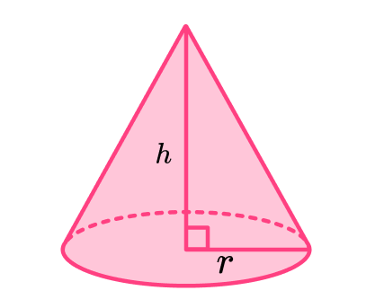
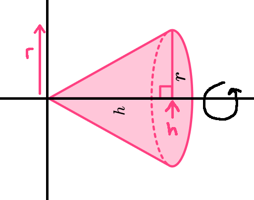
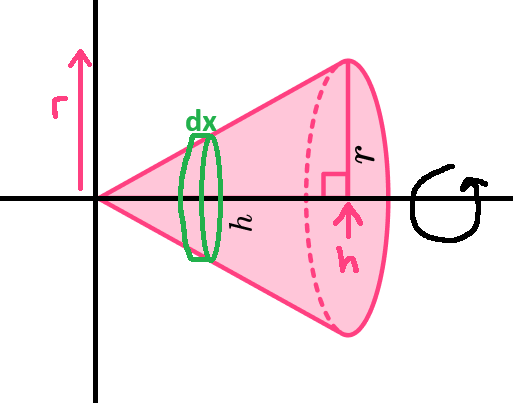

<div align='center'>
    <h1> Volume of a Cone </h1>
</div>

The formula for the volume of a cone is

```math
V = \frac{1}{3} \pi r^2 h
```

<div align='center'> 
     
</div> 

Although this formula is often memorized, it is not immediately intuitive. Instead, it can be derived using integration by viewing the cone as the sum of many infinitely thin circular discs. To begin this proof, it is helpful to change the perspective of the cone.

1. Visualize the cone rotated so that the radius lies along the $y$-axis and the height along the $x$-axis.

2. The three-dimensional cone is then formed by rotating the graph about the $x$-axis.

<div align='center'> 
     
</div>

The side of the cone is represented by the straight line joining the points $(0, 0)$ and $(h, r)$. Therefore, its gradient is

```math
m = \frac{\Delta y}{\Delta x} = \frac{r - 0}{h - 0} = \frac{r}{h}
```

Because the line passes through the origin, its equation is

```math
y = \frac{r}{h}x
```

Before deriving the volume of a cone, it is useful to understand the general principle behind integration. Integration always follows the same idea, define an infinitesimal quantity whose sum represents the total quantity being measured, then integrate over an interval to cover the total.

- **Distance** - $ds = v \ dt$
- **Area** - $dA = f(x) \ dx$
- **Volume** - $dV = A(x) \ dx$

Although each expression represents a different quantity, they all share the same mathemtical structure. Define an infinitesimal quantity and integrate it to recover the total. This principle is what allows integration to be applied across many areas of mathematics and physics. Instead of approximating the solid with many thin rectangles, we approximate it with many thin discs. As the thickness of each disc approaches zero, the approximation becomes exact, and the definite integral gives the precise volume of the cone.

<div align='center'>
    
</div>

At every position $x$, the graph has height $y$. Rotating this point around the $x$-axis forms a circle whose radius is exactly $y$. Therefore, the cross-sectional area of the cone at position $x$ is

```math
A(x) = \pi y^2
```
Notice that this replaces the function $f(x)$ from ordinary integration of a two-dimensional area from $f(x) \ dx$. Rather than representing the height of a rectangle, $A(x)$ now represents the cross-sectional area of the cone. Each disc has infinitesimal thickness $dx$, so its differential volume is

```math
dV = A(x) \ dx = \pi y^2 \ dx
```

The units verify that this represent a volume.

```math
(m^2)(m) = m^3
```

Thus,

- $\pi y^2$ represents the cross-sectional area of the cone at position $x$

- $dx$ represents the infinitesimal thickness of the disc

- Their product $dV = \pi y^2 \ dx$ represents the differential volume of one thin disc.

Notice that this follows exactly the same pattern as finding area. For area,

```math
dA = f(x) \ dx
```

Whereas for volume

```math
dV = A(x) \ dx
```

Both expressions define a differential quantity. Integration then sums these differential quantities to recover the total quantity. The only difference is the interpretation of the integrand. For area, $f(x)$ represents the height of a rectangle, whereas for volume, $A(x)$ represents the cross-sectional area of the solid.

When finally integrating the volume, the cone extends from

```math
x = 0
```

to 

```math
x = h
```

Because

```math
dV = \pi y^2 \ dx
```

represents the volume element of a thin disc, integrating $dV$ from $x=0$ to $x=h$ sums the volume of every disc that forms the cone. Therefore,

```math
V = \int^h_0 dV
```

Substituting the expression for $dV$,

```math
V = \int^h_0 \pi y^2 \ dx
```

Finally, substitute the equation of the line because we're integrating in terms of $x$,

```math
y = \frac{r}{h}x
```

giving,

```math
V = \int^h_0 \pi \left( \frac{r}{h}x \right)^2 \ dx
```

Factor out the constants,

```math
\begin{aligned}
V &= \frac{\pi r^2}{h^2} \int_0^h x^2\,dx \\
  &= \frac{\pi r^2}{h^2} \left[ \frac{1}{3}x^3 \right]_0^h \\
  &= \frac{\pi r^2}{h^2} \left( \frac{1}{3}h^3 - 0\right) \\
  &= \frac{1}{3}\pi r^2h. \end{aligned}
```

Therefore,

```math
V = \frac{1}{3} \pi r^2 h
```