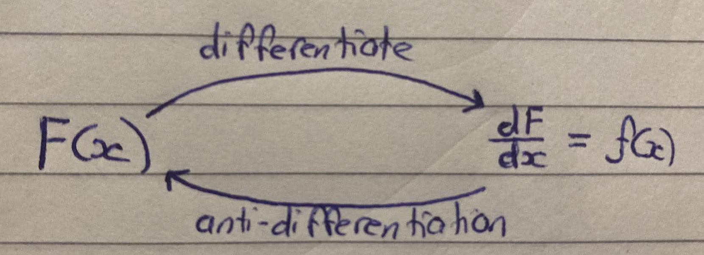

<div align='center'>
    <h1> Fundamental Theorem of Calculus </h1>
</div>

The Fundamental Theorem of Calculus is one of the most important and beautiful results in all of mathematics. It reveals the profound connection between differentiation and integration, showing that these two seemingly different operations are actually inverse processes of each other.

Differentiation focuses on instantaneous rates of change. It answers questions about how a function is changing at any particular point. Integration, by contrast, deals with accumulation. It allows us to calculate the total net change or the total area under a curve over an interval. For centuries, these ideas developed somewhat separately until the Fundamental Theorem demonstrated their deep unity.


<div align='center'>
    <h1> Theorem Part One </h1>
</div>

The first part asserts that if a function $f$ is continuous on an interval containing $a$ and we define,

```math
F(x) = \int^x_a f(t) \ dt
```

then $F$ is differentiable and its derivative is 

```math
F'(x) = f(x)
```

The result shows that the accumulation function $F(x)$, which measures the net area under the curve of $f(t)$ from a fixed lower limit $a$ to the variable upper limit $x$, has a derivative precisely equal to the original function $f(x)$. In other words, differentiation undoes the process of integration.

<div align='center'>
    
</div>

<div align='center'>
    <h1> Theorem Part Two </h1>
</div>

The second part of the theorem provides the practical method for evaluating definite integrals. If $F(x)$ is any antiderivative of $f(x)$, then

```math
\int^b_a f(x) \ dx = F(b) - F(a)
```

This evaluation theorem transforms the often difficult task of computing areas via limits of Riemann sums into a straightforward process of finding an antiderivative and evaluating it at the endpoints.

Together, these two parts unify the seemingly separate branches of calculus. They reveal that integration and differentiation are not merely related but are inverse operations, thereby providing the theoretical foundation for much of the power and applicability of calculus in physics, engineering, economics, ...

<div align='center'>
    <h1> Notation Explanation </h1>
</div>

It is important to distinguish between two forms of integration. An **indefinite intergal**,

```math
\int f(x) \ dx
```

produces a family of antiderivatives,

```math
F(x) + C
```

Where $C$ is an arbitrary constant. This is a family of antiderivatives, because they can all be different functions by having a different constant. In constrast, a **definite integral**

```math
\int^b_a f(x) \ dx
```

**produces a single numerical value** representing the accumulated change of the function between two specified limits. The lower limit $a$ and the upper limit $b$ are fixed before the calculation begins, meaning that the integral evaluates to one particular number.

When integrating,

```math
\int^x_a 2t \ dt
```

- For **general antiderivatives**, write $F(x) = x^2 + C$. This represents the entire family of functions who derivative is $2x$.

- For **the specific area function**, write $F(x) = \int^x_a 2t \ dt = x^2 - a^2$, or explicitly $F(x) = [t^2]^x_a = x^2 - a^2$. This represents one particular member of that family for each value of $a$.

Within the definite integral, the variable $x$ serves only as the variable of integration. It represents the value that continuously moves from the lower limit to the upper limit while the accumulation is performed. Once the integration is complete, this variable has no further meaning and disappears from the final answer. For this reason, the variable of integration is often called a dummy variable, since any symbol may be used without affecting the value of the integral. For example,

```math
\int^3_0 x^2 \ dx = \int^3_0 t^2 \ dt = \int^3_0 u^2 \ du
```

Each expression evaluates to exactly the same numerical value because only the interval of integration and the function itself is important. The choice of letter is purely notational.

The Fundamental Theorem begins by asking a different question from the one considered above. Instead of calculating the accumulated value between two fixed limits, suppose the upper limit is allowed to vary. Rathern than asking,

- What is the accumulated value from $a$ to $b$?

We instead ask,

- How the accumulated value changes as the endpoint changes?

To answer this question, a new function is defined.

```math
F(x) = \int^x_a f(t) \ dt
```

In this notation, the symbol $x$ now appears in a completely different role from the previous used. Inside the integral, the variable is written as $t$ instead of $x$. For the specific function,

```math
f(t) = 2t
```

This becomes,

```math
\begin{aligned}
\int 2t \ dt &= t^2 + C \\
F(x) &= [t^2]^x_a = x^2 - a^2 \\
\end{aligned}
```

This change is not mathematically significant, since $t$ is merely another dummy variable. The notation changes only because the symbol $x$ has been assigned a new purpose. Rather than representing the variable being integrated, $x$ now specifies the **upper limit of integration**. In other words, $t$ moves continuously from $a$ to $x$, while $x$ itself remains outside the integral as the input of the newly defined function.

Therefore,

```math
F(x) = \int^x_a f(t) \ dt
```

**defines a function**. It takes an input $x$ and outputs the accumulated area to up to that point from $a$. The second expression,

```math
\int^b_a f(x) \ dx = F(b) - F(a)
```

is an **evaluation rule** for a fixed interval. They are closely related but serve slightly different purposes, so separating them makes the logic easier to follow. If the same symbol were used for both purposes,

```math
\int^x_a f(x) \ dx
```

it would become unclear whether $x$ referred to the moving integration variable or the endpoint of the interval. Replacing the integration variable with $t$ removes this ambiguity. Unlike the definite integral introduced earlier, the upper limit is no longer fixed. Instead, it changes according to the input of the function. For example,

```math
F(2) = \int^2_a f(t) \ dt
```

Whereas,

```math
F(5) = \int^5_a f(t) \ dt
```

Each input produces a different accumulated value. Consequently, the integral no longer represents a single number. Instead, it defines a function that assigns an accumulated value to every possible endpoint $x$. When $a$ remains unknown, then no numerical value can be calculated. The expression

```math
F(3) = \int^3_a f(t) \ dt
```

cannot be evaluated until the value of $a$ is known. However, the purpose of the theorem is not to compute numerical answers. Instead, it seeks to establish a relationship that holds for **every possible fixed value of $a$**. The lower limit acts as a constant parameter rather than an unknown quantity to be solved.

Let,

```math
f(t) = 2t
```

If the lower limit was chosen as $a = 0$, then

```math
F(x) = \int^x_0 2t \ dt = [t^2]^x_0 = x^2
```

In instead $a = 5$, then

```math
F(x) = \int^x_5 2t \ dt = [t^2]^x_5 = x^2 - 25
```

These are different functions because they product different outputs for the same input. The first accumulates area starting from $0$ upto the varying upper limit $x$, whereas the second accumulates area from $5$ upto $x$. Although the two functions are not the same, they differ only by a constant. Consequently, their derivatives are identical.

```math
\frac{d}{dx}(x^2) = 2x
```

and

```math
\frac{d}{dx}(x^2 - 25) = 2x
```

This observation reveals an important property of the accumulation function. Changing the starting point of the accumulation merely shifts the resulting function vertically by a constant amount. Since differentiation removes constant terms, the derivative remains unchanged regardless of which fixed lower limit was origincally selected.

**The first part** of the Fundamental Theorem of Calculus states precisely this result,

```math
\frac{d}{dx}\left( \int^x_a f(t) \ dt \right) = f(x)
```

It must be understood that this notation is performing the differentiation of the function defined by the integral. More precisely,

```math
F(x) = \int^x_a f(t)\ dt
```

The theorem then simply states that the derivative of this function is,

```math
F'(x) = f(x)
```

The integral itself defines a function. The derivative is therefore taken with respect to the function represented by the integral. The theorem states that the rate at which accumulated change increases is exactly equal to the value of the original function at the current endpoint.

**The second part** of the theorem appears in a different form,

```math
\int^b_a f(x) \ dx = F(b) - F(a)
```

These two expressions describe the same underlying idea. The symbol $F$ now represents an antiderivative of $f$. Since the accumulation function defined earlier has derivative $f(x)$, it is itself an antiderivative. Furthermore, any two antiderivatives of the same function differ only by a constant, and this constant disappears when the values at two endpoints are subtracted.

The notation $F(b) - F(a)$ therefore does not define a new function. Instead, it evaluates the antiderivative at two fixed inputs and subtracts the results. This subtraction gives precisely the accumulated change between the endpoints $a$ and $b$, allowing every definite integral to be calculated without directly performing the accumulation.