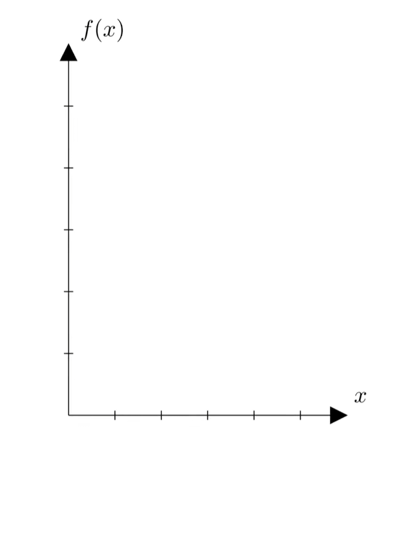

<div align='center'>
    <h1> Integrals </h1>
</div>

Outside of calculus, the word **integration** refers broadly to the process of combining parts into a whole. In simple terms, it describes the act of assembling many small contributions into a single unified quantity. You could integrate information, integrate systems or integrate components in engineering. In each case, the meaning is conceptually the same, **a collection of small parts is combined to produce a single overall object**.

- **Integral** - The **result** of accumulation. For a definite integral, it is the numerical value, e.g. the accumulated area.

- **Integration** - The **process** of finding an integral, either by evaluating a definite integral or by finding an antiderivative.

This interpretation carries directly into mathematics when the goal is to measure quantities that emerge from continuous variation. In particular, the problem of **area under a curve** can be understood as a form of integration in this general sense, the **total area is constructured from infinitely many infinitesimal contributions**.

To formalise this idea, consider a function $f(x)$ defined on an interval $[a, b]$. The quantity we wish to define is the area under the curve $y = f(x)$. Since this region is not composed of simple geometric shapes, it is approximated using shapes whose areas are known exactly, rectangles. The interval is divided into subintervals of equal width

```math
\Delta x = \frac{b - a}{n}
```

On each subinterval, a sample point $x^*_i$ is chosen, producing a rectangle of height $f(x^*_i)$ and width $\Delta x$. The area of this rectangle is $f(x^*_i) \Delta x$, where \(x_i^*\) is a sample point in the \(i\)-th subinterval, it's the $x$-coordinate associated with the $i$-th interval. This the asterisk means that the same point on each subinterval is the same because you could choose,

1. The left endpoint underestimates the area.
2. The right endpoint overestimate the area.
3. Midpoints are often closer.

However, the remarkable fact is that although these choices give different finite sums, they all converge to the same limit for continuous functions. Summing over all subintervals produces a finite approximation.

```math
S_n = \sum_{i=1}^n f(x_i^*) \Delta x
```

This process does not yet define the integral, it defines a sequence of approximations.

```math
S_1, S_2, S_3, ... 
```

<div align='center'>
    
</div>

Each term refines the previous one by using more, thinner rectangles. The idea of integration is then expressed through a limiting process. If these approximations approach a stable value as $n$ increases without bound, **that value is defined to be the integral**. Thus, integration means **take increasingly finer finite approximations to the area, and define the integral to be the number those approximations approach.**

```math
\int_a^b f(x) dx = \lim_{n \to \infty} S_n
```

In this sense, integration is the process of replacing a complicated geometric quantity with a limit of increasingly refined finite sums. The integral is not one infinite sum, but rather the limiting value of an infinite sequence of finite approximations, much in the same way that constants such as $e$ are defined through limits like,

```math
e = \lim_{n \to \infty} \left( 1 + \frac{1}{n} \right)^n
```

<div align='center'>
    <h1> Geometric Construction to Analytical Structure </h1>
</div>

Once the integral is defined in terms of Riemann sums, it becomes a precise mathematical object independent of any computational technique. At this stage, the integral is fundamentally geometric, it represents accumulated area constructured from arbitrarily fine partitions of an interval. No reference has yet been made to derivatives.

Separately, differentiation is introduced as a measure of instantaneous change. The derivative is defined through the limit of a difference quotient,

```math
f'(x) = \lim_{h \to 0} \frac{f(x + h) - f(x)}{h}
```

which captures the behaviour of a function at a point rather than the accumulation of values across an interval. These two processes

1. Accumulation 
2. Rate of change 

emerge from entirely different constructions and therefore have no immediate reason to expect any relationship between them. The connection between these ideas is established only after both have been defined independently. **The Fundamental Theorem of Calculus** states that if a function $f$ is continuous on $[a, b]$ and $F$ is any function satisfying $F'(x) = f(x)$, then

```math
\int^b_a f(x)dx = F(b) - F(a)
```

**This result is not a definition, it is a theorem linking two independently constructued objects**. The limit of Riemann sums on one side and the evaluation of antiderivatives on the other side. Its significance lies in the fact that it translates a limiting process involving many geometric pieces into a boundary evaluation of a derivative-based object.

The presence of Riemann sums in the definition is often contrasted with their absence in routine computation. This contrast is resolved by distinguishing between what is an integral *is* and how it is *computed*. The Riemann sum defines the integral by specifying it as a limiting accumulation of finite contributions. However evaluating this limit directly is rarely practical because it requires an explicit manipulation of sequences such as,

```math
S_n = \sum_{i=1}^n f(x_i^*) \Delta x.
```

followed by algebraic simplification and passage to the limit $n \to \infty$. Even for simple functions, this process can involve substantial computation. There are the definitions (limit of difference quotient, limit of Riemann sum) and then there are practical methods that are much faster. Not every continuous function has an antiderivative describable in terms of elementary functions. The Riemann sum is the definition of an antiderivative in those cases, there are also other kinds of integration that aren't described in terms of the Riemann sum.

The Fundamental Theorem of Calculus replaces this limiting procedure with a structurally simpler operation, if an antiderivative $F$ of $f$ is known, the value of the integral is determined entirely by evaluating $F$ at the endpoints. In this way, the theorem does not redefine the integral, but provides a method of computation that avoids direct engagement with the limiting construction that defines it.

**This separation explains why Riemann sums appear frequently in definitions and theoretical discussions, while antiderivatives dominate practical evaluation**. The Riemann sum establishes the meaning of integration as accumulation, while the Fundamental Theorem reveals that, under appropriate conditions, this accumulation can be expressed in terms of boundary values of a derivative-related function.

<div align='center'>
    <h1> Area Representation  </h1>
</div>

The concept of integration is not fundamentally about computing areas. Area is simply the first geometric application through which the subject is introduced. More generally, integration describes the accumulation of many infinitesimal contributions into a single total quantity. The quantity being accumulated depends entirely on the meaning of the function being integrated. This interpretation becomes particularly clear when considering physical units.

Suppose a graph represents velocity as a function of time. The vertical axis has units of $\frac{m}{s}$, while the horizontal axis has units of $s$. Each rectangle in a Riemann sum has area,

```math
(\text{height})(\text{width}) = \frac{m}{s}s = m
```

The numerical value of a rectangle approximates how far an object travels during that short interval of time. Summing the areas of all rectangles therefore approximates total distance travelled over the interval. As the rectangle becomes thinner, this approximation converges to the exact accumulated distance. Thus, integration naturally combines countless infinitesimal changes in position into a single total displacement.

Suppose the velocity of an object is

```math
v(x) = 2x
```

Each infinitesimal contribution to displacement is

```math
v(x) dx
```

Accumulating these contributions from $a$ to $b$ gives

```math
\int^b_a 2x dx
```

According to the Fundamental Theorem of Calculus

```math
\int^b_a 2x dx = F(b) - F(a) = [x^2]^b_a = b^2 - a^2
```

Notice what has happened. The left-hand side expresses displacement as the accumulation of infinitely many infinitesimal pieces of distance. The right-hand side computes precisely the same quantity without ever constructing those pieces explicitly. The theorem therefore does not redefine the integral, it reveals that the accumulated quantity defined through Riemann sums is exactly equal to the change in an antiderivative evaluated at the endpoints.

The same principle applies regardless of the physical quantity involved. Integrating,

- Acceleration $\left( \frac{m}{s^2} \right)$ with respect to time $s$ produces velocity $\left( \frac{m}{s} \right)$

- Power $\left( \frac{J}{s} \right)$ with respect to time produces energy ($J$)

- Density $\left( \frac{kg}{m^3} \right)$ with respect to volume $\left( m^3 \right)$ produces mass $(kg)$.

In every case, integration accumulates a quantity measured "per unit" of the independent variable into the corresponding total quantity. Area under a curve is therefore not the defining intuition behind integration, but rather one particular instance of a much broader principle of accumulation.

<div align='center'>
    <h1> Limits of the Fundamental Theorem of Calculus </h1>
</div>

A distinction must me made between a **definition** and a **theorem**. 

A definition establishes the meaning of a mathematical object. It is not proved, rather, it specifies precisely what is meant by a concept. Essentially, a definition creates a new mathematical entity "out of nothing". The definite integral, is defined as the limit of a sequence of Riemann sums.

A theorem, by contrast, is not a definition but a mathematical statement that has been proved using definitions, axioms and previously established results. A theorem therefore describes a property of an already-defined object rather than giving the object its meaning. Unlike a definition, every theorem is accompained by a collection of hypotheses that specify the circumstances under which the theorem is valid. The logic structure of every theorem is therefore, if the hypotheses are satisfied, then the stated conclusion follows. In essence, a theorem states some relation between previously defined mathematical entities.

The Fundamental Theorem of Calculus is precisely such a theorem. It does not define the definite integral, instead, it proves that the definite integral, already defined through the limit of Riemann sums, may be computed by evaluating an antiderivative at the endpoints of the interval, provided its hypotheses are satisfied.

One of the most important hypotheses is that the function being integrated must be continuous on the interval of integration. This requirement is not an arbitrary restriction but one of the assumptions under which the theorem has been proved. Consequently, before applying the Fundamental Theorem, it is necessary to verify that its hypotheses hold. The importance of this distinction becomes apparent when considering functions with discontinuities. Consider the function,

```math
f(x) = \frac{1}{x^2}
```

Although an antiderivative exits,

```math
F(x) = - \frac{1}{x}
```

The function itself is undefined at $x = 0$. Therefore, it is not continuous on any interval containing $0$, such as $[-1, 1]$. Since one of the hypotheses of the Fundamental Theorem is violated, the theorem cannot be applied to evaluate,

```math
\int^1_{-1} \frac{1}{x^2}dx
```

by computing

```math
\left[ - \frac{1}{x} \right]^1_{-1}
```

The issue is not that the theorem produces an incorrect result, rather, the theorem makes no claim in this situation because its assumptions have not been satisfied. Instead, the integral must be analysed using the definition appropriate for an improper integral, in which the interval is separated at the point of discontinuity and each portion is evaluated through its own limiting process.

This illustrates why the Riemann definition of the definite integral is logically primary. The integral itself is defined independently of antiderivatives and independently of the Fundamental Theorem of Calculus. **The theorem provides a remarkably efficient method for evaluating the integral when its hypotheses are satisfied, but it does not replace the definition**. Whenever those hypotheses fail, you return not to a different notion of integration, but to the original definition from which the theorem was proved.