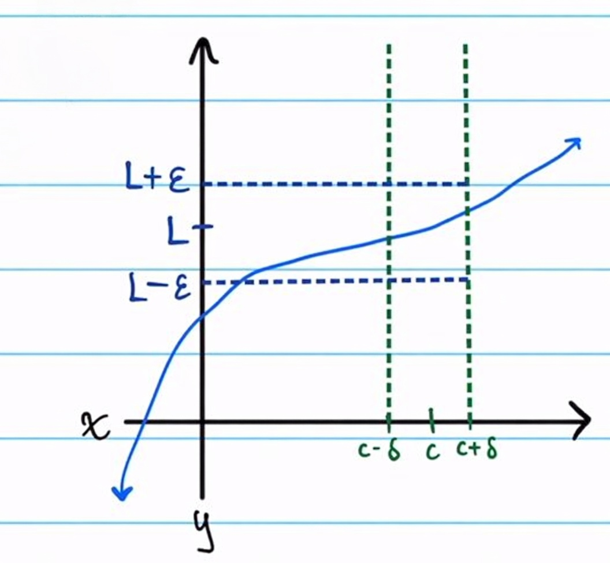
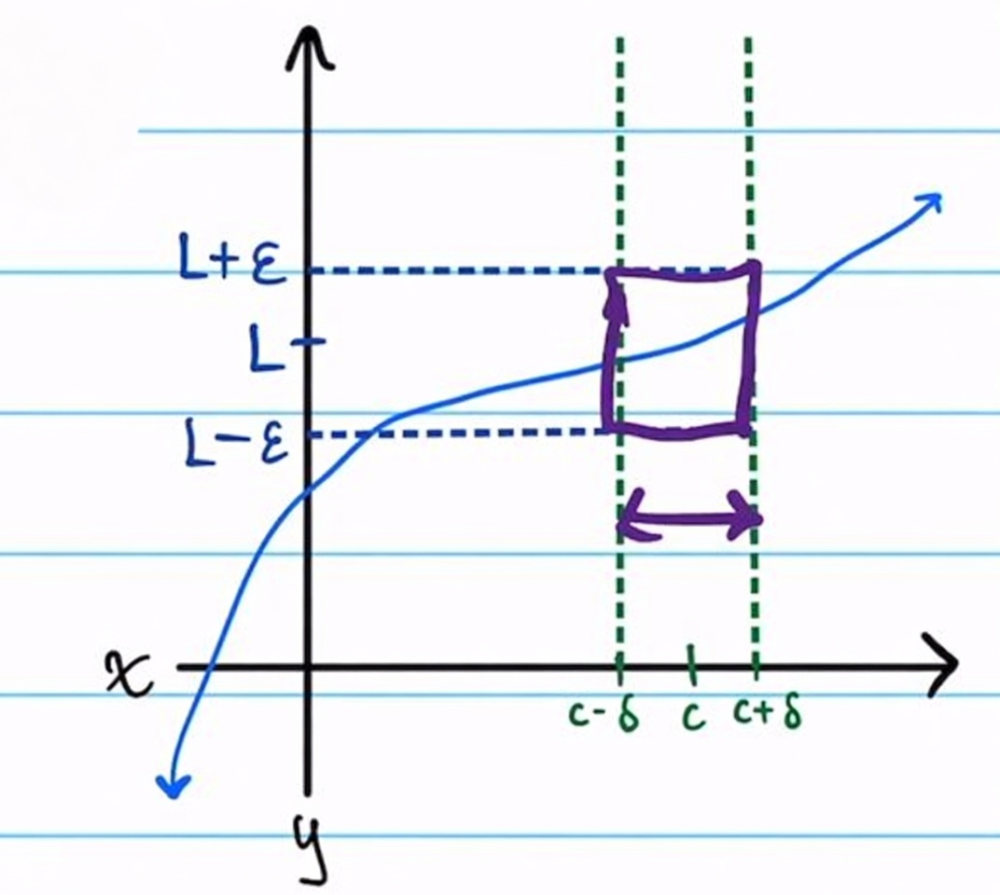
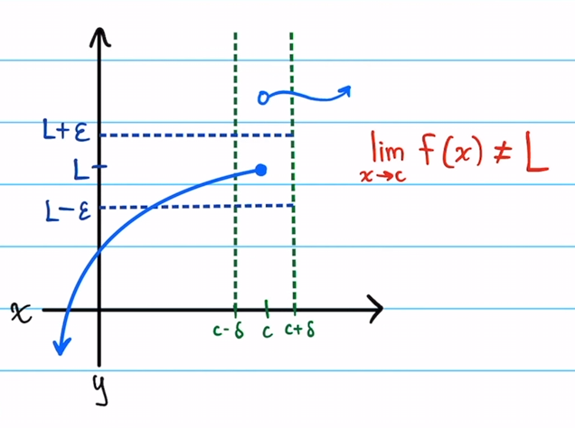
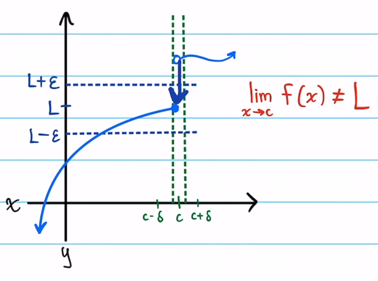
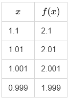
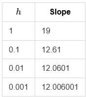
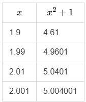

<div align='center'>
    <h1> Limits </h1>
</div>

Limits, however, are not primarily concerned with equality at a point. Instead, **they describe how quantities behave as they move arbitrarily close to a point**. Limits are not the process of approaching (verb), they're the result of the approach (noun). Limits introduce a distinction between exact function values and nearby convergence behaviour.

One of the most common conceptual difficulties is the interpretation of the notation.

```math
\lim_{x \rightarrow a } f(x) = L
```

as though it automatically means

```math
f(a) = L
```

These are fundamentally different statements.

A limit describes the behaviour of function values near a point, while $f(a)$ describes the actual value of the function at the point itself. Only when the function is continuous at a do these coincide.

Therefore, if the limit exists and the function is continuous at $a$, then

```math
\lim_{x->a} f(x) = f(a)
```

even though these are fundamentally different statements. The limit describes **convergence behaviour near a point**, while the function describes the actual value at the point itself. The entire conceptual structure of limits depends on separating these ideas clearly.

A limit **is** an exact number. When,

```math
\lim_{h \rightarrow 0} g(h) = L
```

exists. $L$ is a specific **exact real number**. It's not approaching anything, the convergence is how you define or computed the value, but the value itself is just a number.

The expression

```math
\lim_{x \rightarrow a} f(x) = L
```

should therefore be interpreted not as a statement of directly equality at a point, but a precise statement about convergence. Calculus is therefore not built on approximation alone, but on the rigorous study of behaviour under approach.

<div align='center'>
    <h1> Formal Definition </h1>
</div>

Here we will construct a formal definition to prove,

```math
\lim_{x \rightarrow c} f(x) = L
```

This should be interpreted as "As $x$ gets arbitrarily close to $c$, $f(x)$ gets arbitrarily close to $L$". Note that nothing we're saying here within this definition involves the actual value of the function $f(x)$ at point $c$. We do not care what $f(c)$ is, it might not even exist. Here, we're trying to define what $f(x)$ means to approach something as $x$ approaches $c$.

Let $f: A \to \mathbb{R}$ and let $c$ be a limit point of $A$. Then we say

```math
\lim_{x \to c} f(x) = L
```

If for all $\varepsilon > 0$, there exists some $\delta > 0$ such that for every $x \in A$ for which

```math
0 < |x - c| < \delta
```

we have

```math
|f(x) - L| < \varepsilon
```

In this case, we also say,

```math
\lim_{x \rightarrow c} f(x)
```

**converges** to $L$.

Equivalently,

```math
\forall \varepsilon > 0,\ 
\exists \delta > 0
\ \text{such that}\
0 < |x-c| < \delta
\Rightarrow
|f(x)-L| < \varepsilon
```

Where, 

- $\forall$ means "For all"
- $\exists$ means "Exists"
- $\epsilon$ is the distance away in the $y$ axis from the limit $L$.
- $c$ is the value being approached
- $x$ is a value on the $x$ axis, but |x - c| is the distance from $c$.
- $\delta$ is the distance away from $c$ 

This means, for every tolerance $\epsilon$, I can find some neighbourhood around $c$ where the function properly behaves. The keyword here "exists", implies only requiring one $\delta$ to satisfy the definition. It does not mean every possible $\delta$ works, not that larger $\delta$s must work.

It's similar to saying "There exists a shoe that fits you". You cannot refute that by bringing me a shoe that does not fit, the statement was never "every shoe fits". Simiarly, you cannot choose a large $\delta$ that makes the definition untrue.

**This formalizes the idea that $x$ gets arbitrarily close to $c$, the function values are forced arbitrarily close to $L$**. The entire intuitive meaning is that when $x$ is sufficiently close to $c$, $f(x)$ is forced to be close to $L$. A limit is not about reaching $c$ or evaluating $f(c)$, it is about controlling nearby behaviour.

1. We think of $\varepsilon$ as a sort of tolerance. An allowed distance from the limit.
2. We think of $\delta$ as a closeness to the limit point $c$.

<div align='center'>
    
</div>

In the following example, we can choose a value $x$ that satisfies $0 < |x - c| < \delta$. This will result in $f(x)$ being within the range $L - \varepsilon < f(x) < L + \varepsilon$ and therefore $| f(x) - L| < \varepsilon$

<div align='center'>
    
</div>

Keep in mind $\varepsilon$ is configurable and therefore can be made larger or smaller in order to satisfy the criteria. Here, we're trying to make $\varepsilon$ smaller and smaller to show the converging behaviour, this will resolved in a smaller $x$ value and therefore a reduced $\delta$ value.

Keep in mind, their does not not have to be a single $\delta$, but rather, a $\delta$ for each $\varepsilon > 0$.

To show the limit of a function does **not** equal $L$, we must prove the negation of the defintion. That is,

There exists $\varepsilon > 0$, such that for every $\delta > 0$ there exists some $x \in A$ with $0 < |x - c| < \delta$, such that $|f(x) - L| \geq \varepsilon.$

This has some slight modifications from the original definition,

1. **For all** $\varepsilon > 0$ has changed into **there exists** $\varepsilon > 0$.
2. **There exists** $\delta$ becomes **for every** $\delta$.
3. **For every** $x$ becomes **there exists** $x$.
4. |$f(x) - L| < \varepsilon$ becomes $|f(x) - L| \geq \varepsilon$

This is interpreted as choosing an $x$ value which satisfies $|f(x) - L| \geq \varepsilon$. 

In the following example, $\varepsilon$ satisfies this criteria.

<div align='center'>
    
</div>

However, if we widen $\varepsilon$. We can now choose an $x$ value where $|f(x) - L| \geq \varepsilon$. As we only need to choose some $\varepsilon$ where the definition fails for it to completely fail.

<div align='center'>
    
</div>

#### Proof Example

Let $f(x) = 4x + 1$. Prove

```math
\lim_{x \rightarrow 3} f(x) = 13
```

In the actual limit definition, **we get to choose** $\delta$ after $\varepsilon$ is given. We control $|c - x|$ by picking a sufficiently small $\delta$ to guarantee that every $x$ in that punctured interval satisfies $|f(x) -L| < \varepsilon$.

Essentially, in the $\epsilon \ \delta$ definition, the challenger gives you any $\varepsilon > 0$ such that,

- If $x$ is within $\delta$ of $c$, which is to say $|x - c| < \delta$
- Then $f(x)$ is within $\varepsilon$ of $L$, which is to say $|f(x) - L| < \varepsilon$

Since you get to pick $\delta$, you're in control of how close $x$ must be to $c$. By choosing a small enough $\delta$, you can force $x$ to be very close to $c$, which in turn forces $f(x)$ to be close to $L$.

To help find a $\delta$, it can be helpful to assume $|f(x) - L| < \varepsilon$ is already true and unwind this to find a suitable $\delta$ by solving for $|x - c|$.

We have

```math
\begin{aligned}
|f(x)-L| &< \varepsilon \\
|4x+1-13| &< \varepsilon \\
|4x-12| &< \varepsilon \\
4|x-3| &< \varepsilon \\
|x-3| &< \frac{\varepsilon}{4}
\end{aligned}
```

So let $\delta = \frac{\varepsilon}{4}$. Keep in mind here our limit is $3$ and therefore we intentionally structued this to become $|x - 3|$ to fulfill $|x - c|$, where $c$ is the value being approached. This is interpreted as only considering $x$ values that are within $\frac{\varepsilon}{4}$ distance from $3$.

That is to say,

```math
0 < |x - c| < \delta \\
0 < |x - 3| < \frac{\varepsilon}{4}
```

Now we can continue the proof.

Proof that 

```math
\lim_{x \rightarrow 3} 4x + 1 = 13
```

Let $\varepsilon > 0$. Set $\delta = \frac{\varepsilon}{4}$

Then for all $x$ satisfying $0 < |x - 3| < \delta$, we have

```math
\begin{align*}
|f(x) - L| &= |4x + 1 - 13| \\
&= |4x - 12| \\
&= 4|x - 3| \\
&< 4\delta && \text{(since } |x-3| < \delta\text{)} \\
&= 4 \cdot \frac{\varepsilon}{4} \\
&= \varepsilon.
\end{align*}
```

Also read as,

```math
|f(x) - L| = 4|x - 3| < 4\delta = 4 \cdot \frac{\varepsilon}{4} = \varepsilon
```

Therefore, $|f(x) - L| < \varepsilon$ and so 

```math
\lim_{x \rightarrow 3} 4x + 1 = 13
```

This means the following,

For any given $\epsilon > 0$, we have successfully found a $\delta$ with the property that as long as $x$ is within $\delta$ of $3$, the function value $f(x)$ is guaranteed to be within $\varepsilon$ of $13$.

In other words, we can make $f(x)$ as close to $13$ as we want (Within any $\varepsilon$) by restricting $x$ to be sufficiently close to $3$. This is exactly what the $\epsilon \ \delta$ definition of limit requires. Therefore, the limit is proven.

<div align='center'>
    <h1> Convergence </h1>
</div>

A limit describes the value that a function’s outputs converge toward as the inputs converge toward a particular point. **The limit is the thing being approached, not the thing doing the approaching**. This means that the focus is not on what occurs exactly at the point of interest, but rather on the behaviour surrounding it. To understand this distinction, consider the sequence

```math
0.9, 0.99, 0.999, 0.9999, ...
```

None of these numbers are equal to $1$. Every finite term remains strictly less than $1$. Nevertheless, the sequence clearly trends toward a single value. Mathematics expresses this by writing,

```math
\lim_{n \to \infty} 0.\underbrace{9\dots9}_{n \text{ digits }} = 1
```

alternatively, 

```math
\lim_{n \to \infty} \left(1 - 10^{-n}\right) = 1
```

This statement does not claim that one of the finite terms eventually becomes equal to $1$. Rather, it states that the sequence made arbitrarily close to $1$ by continuing the process indefinitely. The important insight here is that limits are determined by nearby behaviour, not by whether the value is eventually attained. They're concerned with the existence of a unique target value toward which behaviours converges.

This idea initially appears strange because ordinary intuition often associates mathematical exactness with direct equality at a point. However, limits define exact mathematical objects through convergence itself.

The limit is not merely an approximation. It is an exact value uniquely determined by the behaviour of the sequence or function under refinement.

Importantly, a limit does not mean "the value is never reached", rather it means **"the definition of the limit does not require the value to be reached"**. For e

A similar idea appears in the expression

```math
\lim_{x \rightarrow \infty} \frac{1}{x} = 0
```

For every finite value of $x$,

```math
\frac{1}{x} > 0
```

The expression never becomes exactly equal to zero. Yet its values become arbitrarily small as $x$ grows larger. **The limit therefore states that the outputs converge toward zero, not that the expression literally becomes zero during the process**.

This distinction between "becoming equal" and "converging toward" is one of the most important conceptual transitions in calculus.

<div align='center'>
    <h1> Function Values Versus Limit Values </h1>
</div>

One of the clearest demonstrations that limits are distinct from ordinary evaluation comes from functions that possess limits at points where the functions themselves are undefined. 

Consider the function

```math
f(x) = \frac{x^2 - 1}{x - 1}
```

Factoring the numerator yields,

```math
f(x) = \frac{(x - 1)(x + 1)}{x - 1}
```

For every value $x \neq 1$, this simplifies to,

```math
f(x) = x + 1
```

Examining values near $x = 1$ shows the behaviour and convergence pattern clearly.

<div align='center'>
    
</div>

The outputs approach $2$ from both sides. Consequently,

```math
\lim_{x \rightarrow 1} \frac{x^2 - 1}{x - 1} = 2
```

However, substituting $x = 1$ directly into the original function produces

```math
f(x) = \frac{0}{0}
```

which is undefined. The limit exists even though the function value itself does not. This demonstrates that limits depend on nearby behaviour rather than the value at the point itself. **A limit is therefore a statement about convergence, not direct substitution**.

<div align='center'>
    <h1> Derivative as a Limiting Process </h1>
</div>

The derivative is one of the most important applications of limits. Conceptually, the derivative is intended to measure instantaneous rate of change. At first this idea appears contradictory because an ordinary slope requires two distinct points. A single point alone cannot produce rise over run because there is no interval over which to measure change.

Calculus resolves this difficulty by examining the slopes between nearby points and then studying the limiting behaviour of those slopes as the interval between the points shrink indefinitely.

**The key idea is that the existence of a limit depends on nearby convergence behaviour, not on whether the limiting value is directly attained**. It only needs to describe a unique value all sufficiently close inputs force the expression toward. That number is then taken as the derivative because it is fully determined by the local behaviour of the function, even though the defining expression itself never needs to be evaluated at the limiting case. 

Because the limit is not meant to describe a value the expression eventually attains, it is meant to describe the value the expression is forced toward by its surrounding behaviour. If every sufficiently close evaluation produces values arbitrarily close to one unique number, then mathematically there is no ambiguity left about what the expression is approaching, even if the expression is undefined at the limiting point itself. 

Calculus treats the derivative as exact because the convergence of nearby secant slopes uniquely determines one value from the local behaviour of the function. The derivative is therefore not an approximation to a slope. The derivative is the exact number uniquely determined by the limiting behaviour of nearby secant slopes. It is the exact number forced by the limiting behaviour.

Calculus defines the derivative as the limit because the nearby secant slopes can converge toward one unique value as the interval width approaches zero.

The derivative is therefore defined by,

```math
f'(x) = \lim_{h \rightarrow 0} \frac{f(x + h) - f(x)}{h}
```

The expression

```math
\frac{f(x + h) - f(x)}{h}
```

is called the difference quotient. It represents the slope of a secant line between two nearby points on the curve.

1. One point at $x$
2. Another point at $x + h$

For every finite nonzero value of $h$, this quantity is an ordinary average slope over a finite interval. **It is not yet the derivative**.

To illustrate this, consider the function

```math
f(x) = x^3
```

Substituting into the difference quotient gives

```math
\frac{(x + h)^3 - x^3}{h}
```

Expanding the numerator produces

```math
\frac{x^3 + 3x^2h + 3xh^2 + h^3 -x^3}{h}
```

which simplifies to

```math
3x^2 + 3xh + h^2
```

This expression is exact for every nonzero value of $h$. Nothing has been discarded or approximated. Now consider the specific point at $x = 2$. The nearby secant slopes become,

```math
12 + 6h + h^2
```

Evaluating this expression for progressively smaller values of $h$ gives

<div align='center'>
    
</div>

Several important observations emerge,

1. No finite interval slope equals exactly $12$
2. Every finite secant slope differs slightly from $12$
3. As the interval width shrinks, the slopes conerge toward one unique value

This limiting behaviour is expressed by

```math
\lim_{h \rightarrow 0} 12 + 6h + h^2 = 12
```

The derivative is therefore not merely a statement that the nearby slopes "become close" to $12$. Rather, calculus defines the derivative itself to be **this exact limiting value**.

Thus,

```math
f'(2) = 12
```

means that the **nearby secant slopes converge uniquely toward $12$ as the interval width approaches $0$**. This is an extremely important conceptual distinction. A derivative is not defined by a single finite interval, nor is it obtained from a literal secant slope. Instead, it is defined through a limit relationship involving infinitely shrinking nearby intervals.

Consequently, the derivative may be described precisely as "A derivative at a point is the exact limiting value of nearby secant slopes as the interval width approaches $0$".

The derivative therefore originates from convergence behaviour. It is not itself a secant slope over a finite interval. **It is the unique value that nearby secant slopes converge toward as the interval width approaches zero**.

Understanding why the derivative removes certain terms becomes clearer when considering different limits. Suppose the expression

```math
12 + 6h + h^2
```

is examined under two separate limiting processes. When

```math
h \rightarrow 0
```

the terms involving $h$ converge toward $0$, producing $12$. However, when

```math
h \rightarrow 2
```

the same terms converge toward

```math
6(2) + (2)^2 = 16
```

giving the limit $28$. Calculus asks "As $h$ gets arbitrarily close to 0, do these values settle toward one number?" This is the derivative and also the limit.

This demonstrates that terms do not vanish inherently. Their behaviour depends entirely on the value toward which the variable is approaching. The derivative specifically studies behaviour as intervals collapse toward $0$, which is why the additional terms disappear in the limiting result.

Not every function possesses a derivative everywhere. Consider

```math
f(x) = \frac{1}{x - 10}
```

At $x = 10$, the function is undefined because division by $0$ occurs. Since the function itself fails to exist there, a derivative cannot exist there either. Its derivative is

```math
f'(x) = -\frac{1}{(x - 10)^2}
```

Substituting $x = 10$ again produces division by $0$. The derivative therefore also fails to exist at that point. A derivative exists only when nearby slopes converge toward a stable value.

<div align='center'>
    <h1> Limit Behaviour by Observation </h1>
</div>

This process involves,

1. What happens to the base.
2. What happens to the exponent.
3. Which parts of the expression dominate the long-term behaviour.

Understanding these patterns develops intuition for limits and convergence.

#### Expressions That Shrink Toward Zero

Consider,

```math
\left(\frac{1}{n}\right)^5
```

As $n \to \infty$ the quantity $\frac{1}{n}$ becomes smaller and smaller. Consequently,

```math
\left( \frac{1}{n} \right)^5 \to 0
```

This leads to an important general pattern.

```math
\begin{aligned}
\frac{1}{n^k} &\to 0 \\
\frac{1}{n} &\to 0 \\
\frac{1}{n^{100}} &\to 0
\end{aligned}
```

The larger the power in the denominator, the faster the expression shrinks.

#### Expressions That Grow Without Bound

Now consider

```math
n^5
```

As $n \to \infty$, the expression grows larger without bound. Therefore $n^5 \to \infty$. Likewise, $2^n$ also grows rapidly toward infinity because repeated multiplication by a number greater than $1$ causes exponential growth.

This leads to an important general pettern.

```math
\begin{aligned}
n^k &\to \infty \\
2^n &\to \infty \\
10^n &\to \infty
\end{aligned}
```

Exponential growth generally dominates polynomial growth for very large $n$.

#### Expressions of the Form $(1 + small)^{large}$

The most subtle and important limits often involve expressions where the base approaches $1$, while the exponent becomes very large.

Consider,

```math
\left( 1 + \frac{1}{n} \right)^n
```

The base,

```math
1 + \frac{1}{n} \to 1
```

The exponent,

```math
n \to \infty
```

At first glance, this appears to become $1^\infty$. However, this is called an indeterminate form. Indeterminate does not mean undefined. Instead it means that the limit cannot be determined simply by observing the separate pieces individually.

In this case the balance between the base approaching $1$ and the exponent growing infinitely large creates the famous constant $e \approx 2.71828$.

Thus,

```math
\lim_{n \to \infty} \left( 1 + \frac{1}{n} \right)^n = e
```

#### When the Exponent Grows Faster

Examining,

```math
\left(1 + \frac{1}{n} \right)^{n^3}
```

Again,

- The base approaches $1$
- But now the exponent grows faster.

We can rewrite this as,

```math
\left( 1 + \frac{1}{n} \right)^{n^3} = \left( \left(1 + \frac{1}{n} \right)^n \right)^{n^{2}}
```

Because,

```math
\left(1 + \frac{1}{n} \right)^n \to e
```

the expression behaves approximately as

```math
e^{n^2}
```

which grows rapidly to $\infty$. Therefore,

```math
\left( 1 + \frac{1}{n} \right)^{n^3} \to \infty
```

This illustrates a crucial principle in limit analysis. **The long-term behaviour depends on which competing effect dominates the expression**.

#### Converging to a Finite Number

Not all limits approach $0$ or $\infty$. Many limits stabilize toward a finite number.

For example,

```math
\lim_{n \to \infty} \frac{2n + 1}{n}
```

Both numerator and denominator grow infinitely large. However, their growth rates are very similar.

Rewrite the expression as,

```math
\frac{2n + 1}{n} = \frac{2n}{n} + \frac{1}{n} = 2 + \frac{1}{n} 
```

Now we can observe that we have a constant $2$, while $\frac{1}{n} \to 0$. Therefore,

```math
\lim_{n \to \infty} = \frac{2n + 1}{n} = 2
```

#### Convergence at a Specific Point

```math
\lim_{x \to 2} x^2 + 1
```

As $x \to 2$ the function becomes closer and closer to $2^2 + 1 = 5$. Therefore,

```math
\lim_{x \to 2} x^2 + 1 = 5
```

In this example, the function itself is continuous, so the limit equals the actual function value. **Plugging in the value is not the definition of a limit, it is only a shortcut that works in certain cases**.

<div align='center'>
    
</div>

The outputs stabilized toward $5$ from both sides. This is what the limit describes.

A limit can exist even if the function is undefined at that point. Consider,

```math
\lim_{x \to 1} \frac{x^2 - 1}{x - 1}
```

By factoring it,

```math
\frac{(x - 1)(x + 1)}{x - 1}
```

For $x \neq 1$, this simplifies to $x + 1$. So near $x = 1$ the expression behaves like $x + 1$. Therefore,

```math
\lim_{x \to 1} \frac{x^2 - 1}{x - 1} = 2
```

A limit depends on nearby behaviour, not necessarily the value at the point itself.