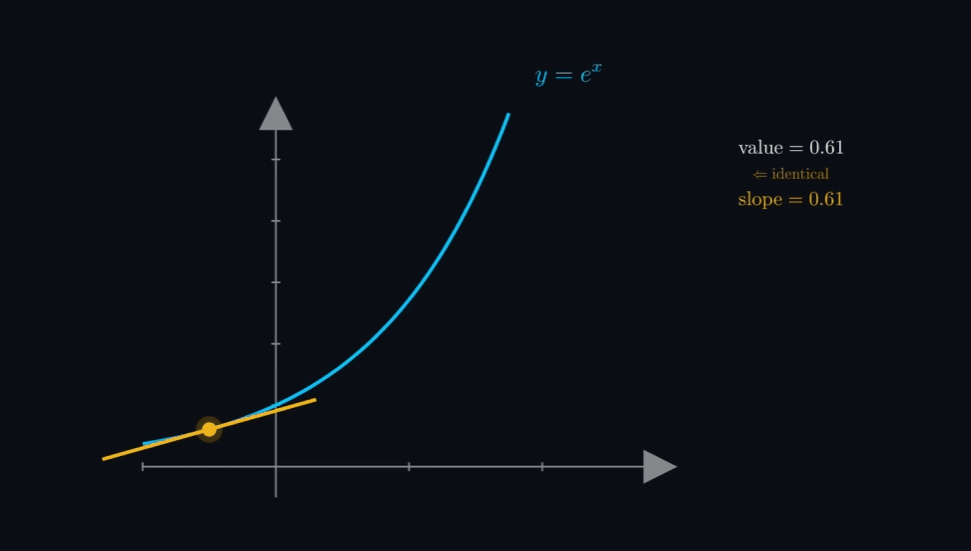

<div align='center'>
    <h1> Eulers Constant <h1>
</div>

Euler's number,

```math
e \approx 2.718281828…
```

is one of the most important constants in mathematics. It appears significantly through different areas of mathematics.  Unlike constants such as $\pi$, which emerge naturally from geometry and circles, the constant $e$ emerges **from growth, change and accumulation**. It is the natural constant of continuous processes. Because it is a natural growth rate, it shows up in anything that has growth.

The importance of $e$ comes from a remarkable property, functions involving $e$ reproduce themselves under differentiation. This single property causes $e$ to **appear whenever systems change proportionally to their current state**.

The central importance of $e$ comes from one remarkable property,

```math
\frac{d}{dx} e^x = e^x
```

<div align='center'>
    
</div>

The exponential function reproduces itself under differentiation. This behaviour causes $e$ to arise naturally **whenever change is proportional to the quantity currently present**.

$e$ isn't just a number, **it's a behaviour**. Whenever changes depends on the current state, $e$ is going to be in the answer.

<div align='center'>
    <h1> The Origin of Euler's Number <h1>
</div>


Euler's number arises naturally from repeated compounding.

Suppose $\$1$ earns $100\%$ annual interest. If interest is compounded once per year,

```math
1(1 + 1) = 2
```

After 1 year there are $\$2$. If compounded 2 times yearly.

```math
\left(1 + \frac{1}{2} \right)^2 = 2.25
```

If compounded 4 times annually.

```math
\left(1 + \frac{1}{4} \right)^4 = 2.44140625
```

As compounding becomes increasingly frequent,

```math
\left(1 + \frac{1}{n} \right)^n
```

The value approaches a limiting constant,

```math
e = \lim_{n \to \infty} \left(1 + \frac{1}{n}\right)^n
```

This defines continuous compounding. Rather than growth occurring in separate intervals such as yearly, monthly or daily, growth now occurs continuously at every instant. Thus $e$ becomes that natural base for describing continuous growth.

<div align='center'>
    <h1> Proportional Growth <h1>
</div>

The phrase "Growth becomes proportional to current size" describes systems where the rate of change at any instant is directly proportional to the current value. This is modeled by the differential equation,

```math
\frac{dy}{dx} = ky \Rightarrow Ae^{kt}
```

Here, $\frac{dy}{dx}$ denotes the derivative with respect to $x$. The notation $\frac{d}{dx}$ is the operator form ("The derivative with respect to $x$ of...), while $\frac{dy}{dx}$ explicitly shows the dependent variable $y$ changing with independent variable $x$. Both are interchangeable in this context.

Continuous growth compounds constantly. Many natural systems behave approximately this way,

- **Population growth** - A bacteria colony of size $y$ at time $t$ grows such that the number of new bacteria per unit time is proportional to the current population. This means, a larger population results in more reproduction, resulting in even faster growth. 

Here $x = t$ (time), $k > 0$ is the growth constant with units $\text{time}^{-1}$. If $k = 0.1 \text{ hour}^{-1}$, the population increases by about $10\%$ per hour continuously. The decimal growth rate $0.1$ is equal to the percentage growth rate $10\%$. $10\% = \frac{10}{100} = 0.1$

The key distinction is, $0.1y$ means $10\%$ of $y$, not $y$ plus $10\%$. So in,

```math
\frac{dy}{dt} = ky
```

the term $ky$ represents the **increase per unit time**, not the new total population. 

If,

```math
k = 0.1
```

then,

```math
\frac{dy}{dt} = 0.1y
```

Then this means that the population is increasing at a rate equal to $10\%$ of its current size per hour.

- **Radioactive decay** - Atoms decay proportionally to the number remaining, $k < 0$.

- **Compound interest** - Money grows proportionally to the current balance when compounded continuously. 

- **Cooling (Newton's law)** - Rate of temperature change proportional to difference from ambient temperature.

All exponential functions grow rapdily,

```math
2^x, 10^x, 100^x, ...
```

all grow faster than

```math
e^x
```

So the importance of $e$ is not merely that it grows quickly, rather, its importance comes from how it behaves under calculus. Any exponential can actually be rewritten in terms of $e$.

```math
a^x = e^{x \ln a}
```

Thus $e$ is the underlying universal exponential base.

To prove $a^x =e^{x \ln a}$

Let,

```math
\begin{aligned}
a^x &= y \\
\ln(a^x) &= \ln(y) \\
x\ln(a) &= \ln(y) \\
e^{x\ln(a)} &= e^{\ln(y)} \\
&= y \\
&= a^x \\
\therefore  \ \ \ e^{x\ln(a)} &= a^x
\end{aligned}
```

<div align='center'>
    <h1> Solving the Differential Equation </h1>
</div>