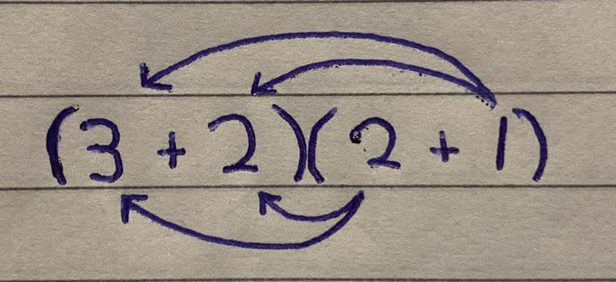

<div align='center'>
    <h1> Expanding Brackets </h1>
</div>

Expanding brackets is a foundational technique in algebra that allows us to transform expressions from a compact, factored form into a sum of simplers terms. It is crucial to understand what is truly happening as to avoid memorization techniques that do not scale when the mathematics becomes more complex. These expansion rules apply for any single bracket to more complicated expressions involving multiple expansions required.

```math
\begin{aligned}
3\left(x + 5\right) = ... \\
\left(a + 5\right)\left(b + c\right) = ... \\
\left(a + b\right)\left(c + d\right)\left(e + f\right) = ...\\
\end{aligned}
```

It's important to reflect on the basic rules of multiplication and what can be occurring when broken down into further components. So let's begin by performing a basic mathematical multiplication,

```math
5 \times 3 = 15
```

We visualize this as the sum of $5$, $3$ times.

<div align='center'>
    
</div>

However, every number can be broken down into the summation of smaller numbers. For example the number $5$ can be broken down into,

```math
4 + 1 = 5 \\
3 + 2 = 5 \\
2 + 3 = 5 \\
1 + 4 = 5 \\
```

In this example, it will be replaced with $3 + 2$. Therefore,

```math
(3 + 2) \times 3 = 15
```

This can be visually interpreted as follows.

<div align='center'>
    
</div>

This means that the $3$ needs to multiply each individual number that is used to sum to $5$. Hence,

```math
\begin{aligned}
\left(3 + 2\right)\times 3 &= 3\times 3 + 3\times 2 \\
                          &= 9 + 6 \\
                          &= 15
\end{aligned}
```

Now, to make it more complex we can break down the $3$ into components aswell. Here, I will break $3$ down to $2 + 1$.

```math
(3 + 2)(2 + 1) = 15
```

To identify the correct multiplication process we need to conceptually identify what is occurring. Previously we have identified that the $3$ needs to multiply each component of $5$ to correctly scale up each component to reach the correct result. Now the $3$ has been broken down, the same thing needs to occur. That is, each component of the $3$ needs to multiply each component of the $5$.

<div align='center'>
    
</div>

```math
\begin{aligned}
\left(3 + 2\right)\left(2 + 1\right) &= 2\times 2 + 2\times 3 + 1\times 2 + 1\times 3 \\
                                     &= 4 + 6 + 2 + 3 \\
                                     &= 10 + 5 \\
                                     &= 15
\end{aligned}
```

Visually this is interpreted as,

<div align='center'>
    
</div>

Given that behaviour, it is therefore possible to rearrangement it into different expressions.

```math
\begin{aligned}
2\left(3 + 2\right) + 1\left(3 + 2\right) &= 2\times 3 + 2\times 2 + 1\times 3 + 1\times 2 \\
                                          &= 6 + 4 + 3 + 2 \\
                                          &= 10 + 5 \\
                                          &= 15
\end{aligned}
```

This type of approach and understanding allows to understand more complex expressions with additional multiplication. Suppose we have,

```math
5 \times 3 \times 8
```

Intuitively, it is natural to perform multiple smaller multiplcations.

```math
\begin{aligned}
5\times 3\times 2 &= 15\times 8 \\
                  &= 120
\end{aligned}
```

If the following were to be broken down into sums to perform bracket expanding,

```math
(3 + 2)(2 + 1)(4 + 4)
```

We do the same conceptual operations,

1. Perform $15 \times 3$
2. Multiply the result of step 1 by the third multiple $(4 + 4)$

Therefore,

```math
\begin{aligned}
\left(3 + 2\right)\left(2 + 1\right) &= 3\times 2 + 3\times 1 + 2\times 2 + 2\times 1 \\
                                     &= 6 + 3 + 4 + 2
\end{aligned}
```

Now, in this example the result can be condensed to $15$ to perform $15(4 + 4)$, however it is frequent in mathematics where some constants are unknown and often represented as variables, commonly $x$. Therefore, it still needs to be understood that the bracket expansion needs to perform multiplication on each term in the bracket.

```math
\begin{aligned}
\left(6 + 3 + 4 + 2\right)\left(4 + 4\right) &= 4\times 6 + 4\times 3 + 4\times 4 + 4\times 2 + \cdots \\
                                            &= 24 + 12 + 16 + 8 + \cdots \\
                                            &= 40 + 20 + \cdots \\
                                            &= 60 + 60 \\
                                            &= 120
\end{aligned}
```
