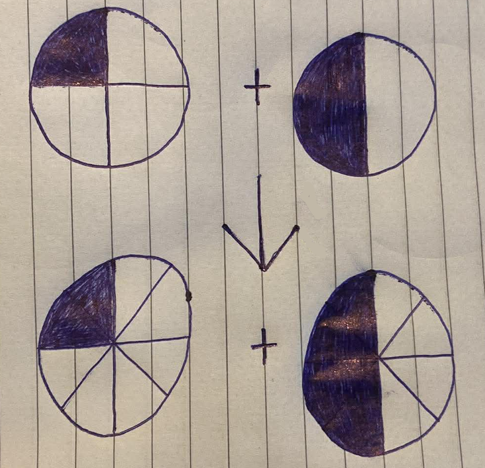
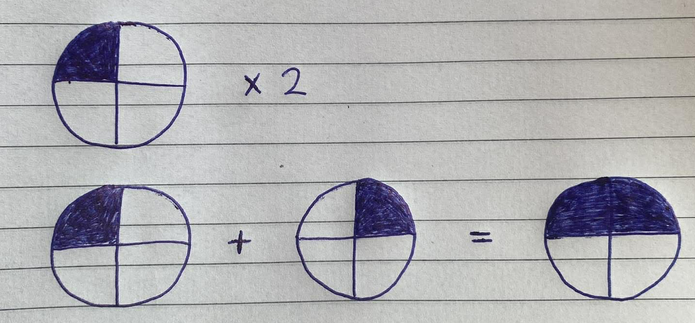
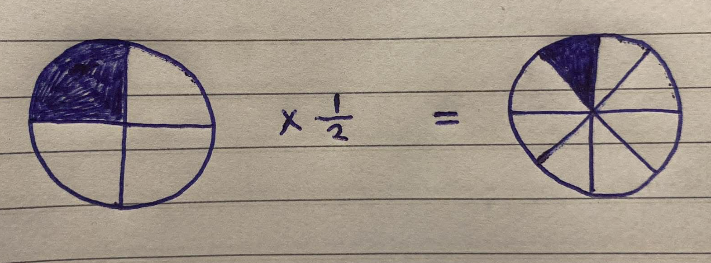
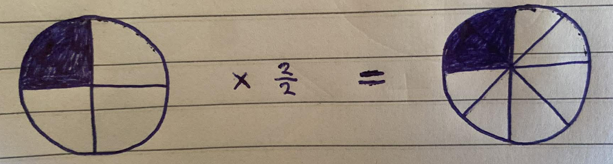

<div align='center'>
    <h1> Fractions </h1>
</div>

Fractions are among the most fundamental constructs in mathematics, providing a precise way to represent parts of a whole, relationships between quantities, and numerical value that lie between integers. At their most basic level, a fraction is written in the form

```math
\frac{a}{b}
```

Where,

- $a$ is called the numerator
- $b$ is the demonator, with $b \neq 0$

This notation expresses the idea of dividing $a$ into $b$ equal parts or more generally, the ratio of $a$ to $b$. A fraction can be interpreted in multiple, closely related ways. First, it represents division.

```math
\frac{a}{b} = a ÷ b
```

Second, it represents a ratio or comparison between two quantities. For example, $\frac{1}{3}$ may describe "1 unit for every 3 units". These interpretations are not separate, rather, they are different perspectives on the same mathematical object. This dual nature allows fractions to function both as values and as relational descriptions, making them essential in contexts ranging from measurement to algebra.

<div align='center'>
    <h1> Adding Fractions </h1>
</div>

Adding fractions **requires that the parts being combined are of the same size**. When two fractions share a common denominator, addition is straightforward. The numerators are added while the denominator remains unchanged, since the unit size is already consistent.

```math
\frac{1}{4} + \frac{1}{4} = \frac{2}{4}
```

<div align='center'>
    
</div>

However, when denominators differ, **the fractions first must be rewritten as equivalent fractions with a common denominator**. Typically, found using the lowest common multiple. This process rescales the fractions without changing their value, ensuring each represents **the same-sized parts**. Once a common denominator is established, the numerators can be combined.

```math
\frac{a}{b} + \frac{c}{d} = \frac{da}{bd} + \frac{cb}{db}
```

By looking at the fractions,

```math
\frac{1}{4} + \frac{1}{2}
```

We cannot immediately add them. This is because the denominator is not the same and thus the "pieces" are not the same size. To add fractions we need to make the "pieces" the same size, this is done by making the denominator the same size. 

The easiest way to find a common multiple of the denominators is to multiply them. Therefore, the denominator is $4 \times 2 = 8$. The numerator needs to be scaled proportionally with the denominator as to keep the fraction value the same. This would be effectively multiplying by $1$.

```math
\frac{1}{4} + \frac{1}{2} = \frac{1 \cdot 2}{4 \cdot 2} + \frac{1 \cdot 4}{2 \cdot 4} = \frac{2}{8} + \frac{4}{8} = \frac{6}{8}
```

<div align='center'>
    
</div>

<div align='center'>
    <h1> Subtracting Fractions </h1>
</div>

Subtraction rules apply identically to addition. That is, the subtraction operation can only occur when the denominator is the same. Once the denominator is identical, simply subtract one numerator from the other.

<div align='center'>
    <h1> Multiplying Fractions </h1>
</div>


Multiplication of fractions represents scaling one quantity by another and is defined **by multiplying numerators together and denominators together**, reflecting how portions of portions combine. Given two fractions,

```math
\frac{a}{b} \times \frac{c}{d} = \frac{ac}{bd}
```

This is effectively partitioning the original whole into smaller equal parts. Unlike addition, no common denominator is required because multiplication operates on the entire quantity rather than combining like parts. This process is consistent with the interpretation of fractions as ratios, where multiplication corresponds to combining ratios multiplicatively.

##### Scaling Up

Multiplying by $\frac{2}{1}$ represents an enlargement of a quantity, where the original value is increased proportionally. Since $\frac{2}{1} = 2$, this operation effectively duplicates the entire quantity, producing two identical copies of the original. No partitioning is required.

```math
\frac{1}{4} \times 2 = \frac{1}{4} \times \frac{2}{1} = \frac{2}{4}
```

<div align='center'>
    
</div>

#### Scaling Down

Multiplying by $\frac{1}{2}$ represents a reduction of a quantity, where the original value is decreased by taking a fraction of it. This operation can be interpreted as **doubling the number of "parts" but keeping the same number of parts**, which effectively decreases the fraction value.

```math
\frac{1}{4} \times \frac{1}{2} = \frac{1}{8}
```

<div align='center'>
    
</div>

#### Multiple Scaling

When you multiply by $\frac{2}{2}$ you are doing two things are the **same time**,

1. Doubling the numerator, which now **doubles the amount of parts you have**.
2. Doubling the denominator, which **splits it into twice as many smaller parts**.

<div align='center'>
    
</div>

<div align='center'>
    <h1> Dividing Fractions </h1>
</div>

Divison is defined as the inverse operation of multiplication. For numbers $a$, $b$ and $c$ with $b \neq 0$.

```math
a \ \div b = c \ \ \ \text{if and only if} \ \ \ a = b \cdot c
```

Equivalently, division can be defined in terms of multiplication by a recriprocal.

```math
a \ \div b = a \cdot \frac{1}{b}, \ \ \ b \neq 0
```

This definition ensures that division "undoes" multiplication and is well-defined for all nonzero divisions. Using the definition, is how fractions will be explained when division is performed.

To illustrate I will use the following example,

```math
\frac{2}{3} \div \frac{1}{4} = \frac{2}{3} \times \frac{4}{1} = \frac{2 \times 4}{3 \times 1} = \frac{8}{3}
```

To completely explain why this occurs, I will reformat this to the other representation, without the $\div$ symbol.

```math
\frac{\frac{2}{3}}{\frac{1}{4}}
```

This expressions are equivalent. However, the denominator is $\frac{1}{4}$. To make this denominator $1$, I will multiply it by its recriprical. However, like always, we cannot blindly alter values, we must multiply it by $1$. Therefore,

```math
\frac{\frac{2}{3}}{\frac{1}{4}} \times \frac{\frac{4}{1}}{\frac{4}{1}} = \frac{\frac{2 \times 4}{3 \times 1}}{\frac{1 \times 4}{4 \times 1}} = \frac{\frac{2 \times 4}{3 \times 1}}{\frac{4}{4}} = \frac{\frac{2 \times 4}{3 \times 1}}{1} = \frac{2 \times 4}{3 \times 1}
```


