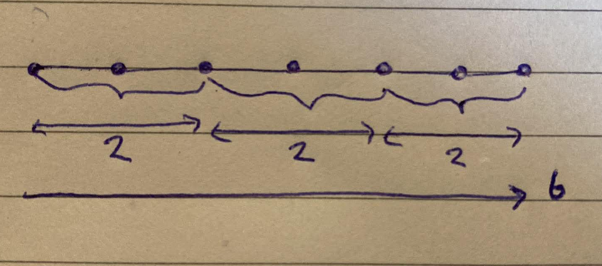
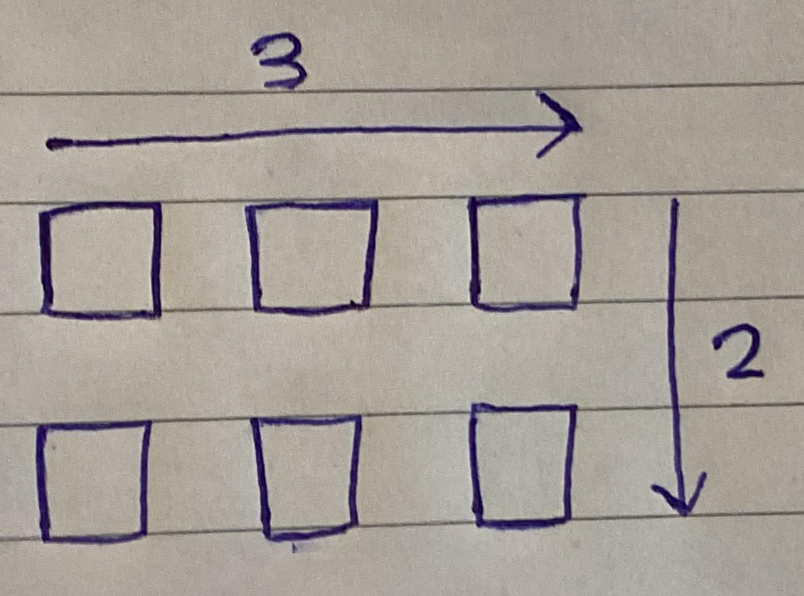
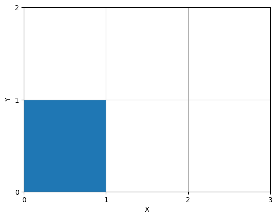

    <h1> Area Visualized </h1>

Multiplication is a core mathematical operation that most learners first encounter as repeated addition. The example \(2 \times 3\) is typically understood this way. Adding 2 three times \((2 + 2 + 2)\) or adding 3 twice \((3 + 3\)). This scalar interpretation is clear and intuitive when counting discrete objects. Below is a visualized method for this operation being performed.

    

However, when the same operation is applied in two dimensional space such as 2 groups of 3 we create a different visualization. The same principles are applied. This shift from a simple number to a measure of two-dimensional space can feel less immediate, yet it rests on the same fundamental principles of multiplication.

    

Consider a rectangle that is \( 2 \) units high and \( 3 \) units wide. When we calculate the area, we multiple these lengths, \( 2 \times 3 = 6\), the result is no longer \( "6" \). It becomes \( 6 \) square units, written as \( 6 \ units^2 \). The power of \( 2 \) indicates that the unit has been squared, each side contributes one dimension of length and their product measures area.

Now, previously we could visualize a one multiplication and even a two dimensional multiplication using standard boxes as examples. Now, with area the units is \( 6 \ units^2 \). To see what the \( 6 \ units^2 \) actually means, picture the rectangle divided into a smaller grid of \( 1 \times 1 \) squares. Each small square has an area of \( 1 \ unit^2 \). In a 2-by-3 rectangle, there are 2 rows with 3 squares in each row, giving a total of 6 unit squares. Counting them directly shows that the area is exactly \( 6 \times 1 \ unit^2 \), which is written more concisely as \( 6 \ units^2 \).

The notation \( 6 \ units^2 \) is **therefore equivalent to saying** "6 copies of a single \( 1 \times 1\) square unit", i.e. \( 6 \times 1 \ unit^2 \) . The superscript serves as a reminder that the measurement describes a two-dimensional quantity rather than a length or a count.

    

The \( length \times width \) formula works perfectly and intuitively for rectangles, but it does not generalize directly to all shapes and circles. The rectangle is a special, straightforward one because the shape is made of perfectly aligned rows and columns of unit squares.

However, the deeper principles does generalize. **Area is always fundamentally about how many unit squares fit inside the shape**. For non-rectangular shapes, we use more advanced techniques to find that total, but the underlying idea remains the same.
