<div align='center'>
    <h1> Triangle Definition </h1>
</div>

A triangle is a shape which has

1. 3 Sides
2. 3 Angles
3. 3 Corners / Verticies

It is one of the simplest shapes in geometry.

<div align='center'>
    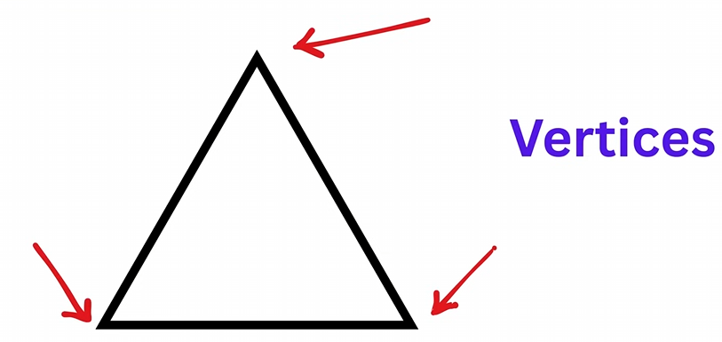
</div>

Inside every triangle there are three angles.

<div align='center'>
    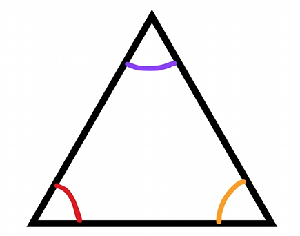
</div>

A property about the angles in a triangle is that they always sum to $180^\circ$. This works for **every triangle**.

<div align='center'>
    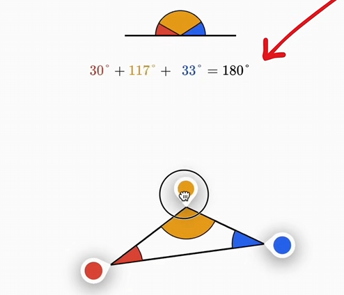
</div>

<div align='center'>
    <h1> Types of Triangles </h1>
</div>

Triangles can be grouped in two ways, by side or by angle.

#### Categorization by Side

- If a triangle has **three equal length sides**, it is called an **equilateral triangle**. An equilateral triangle has all equal angles.

<div align='center'>
    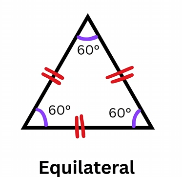
</div>

An equillateral triangle has additional properties. The height, median and angle bisector are all the same line. Additionally, if the equilateral triangle has side length $s$, then the area of the triangle is $A = \frac{\sqrt{3}}{4}s^2$

<div align='center'>
    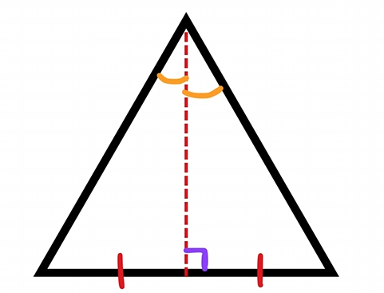
</div>

- If a triangle has **two equal length sides**, it is called an **isoceles triangle**. The angles opposite these sides are equal.

<div align='center'>
    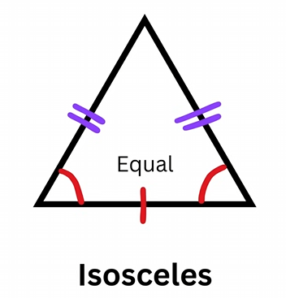
</div>

- If a triangle has **all different lengths**, it scalled a **scalene triangle**. All angles in this triangle are different.

<div align='center'>
    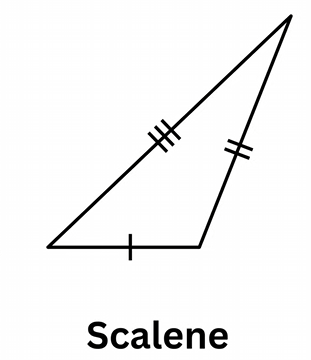
</div>

#### Categorization by Angle

- If all three angles are **less than** $90^\circ$, it is called an **acute triangle**.

<div align='center'>
    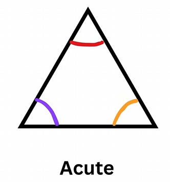
</div>

- If one angle is exactly $90^\circ$, it is called a **right angle triangle**.

<div align='center'>
    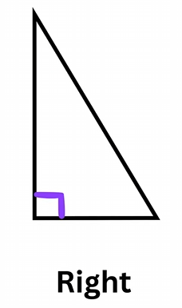
</div>

- If one angle is more than $90^\circ$, it is called an **obtuse triangle**.

<div align='center'>
    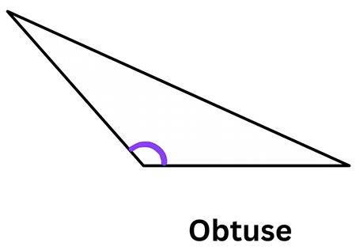
</div>

<div align='center'>
    <h1> Theorems </h1>
</div>

#### Exterior Angle Theorem

<div align='center'>
    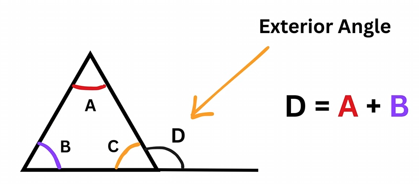
</div>

#### Triangle Inequality Theorem

No random three lines can make a triangle. In any triangle, the sum of the lengths of any two sides must be greater than the length of the third side.

For a triangle with side lengths $a,b$ and $c$,

<div align='center'>
    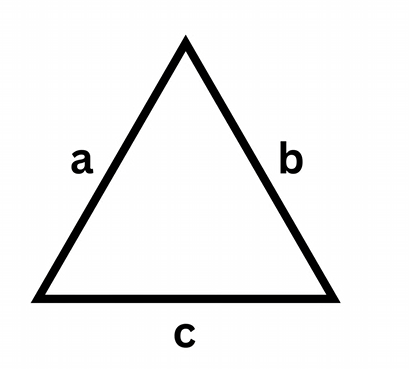
</div>

```math
a + b > c \\
a + c > b \\
b + c > a \\
```

<div align='center'>
    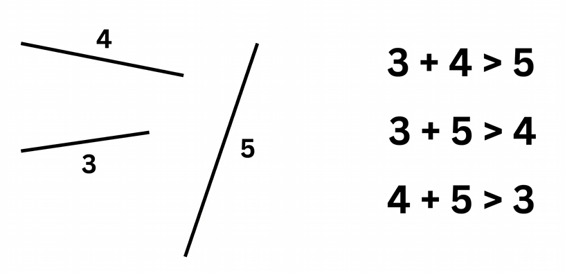
</div>

####  Pythagoras Theorem

The pythagoras theorem is applied to a **right angle triangle**. It states, $$a^2 + b^2 = c^2$$

Where $c$ is the hypotenuse of a triangle.

<div align='center'>
    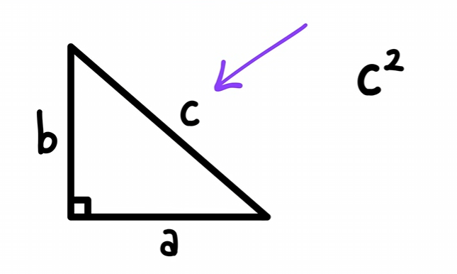
</div>

#### Median Theorem or Midpoint Theorem

A median is a line drawn from any corner of the triangle to the middle of the opposite side.

<div align='center'>
    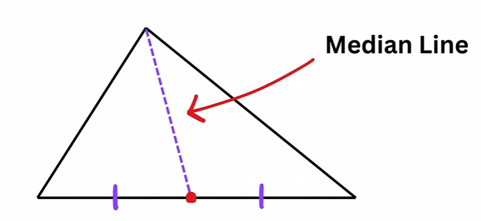
</div>

Each median splits the triangle into two equal parts.

<div align='center'>
    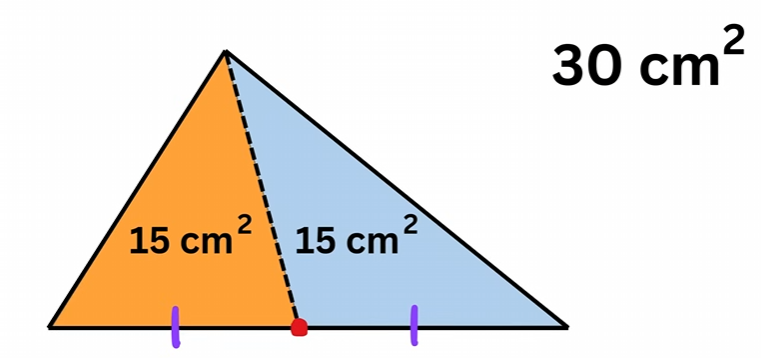
</div>

<div align='center'>
    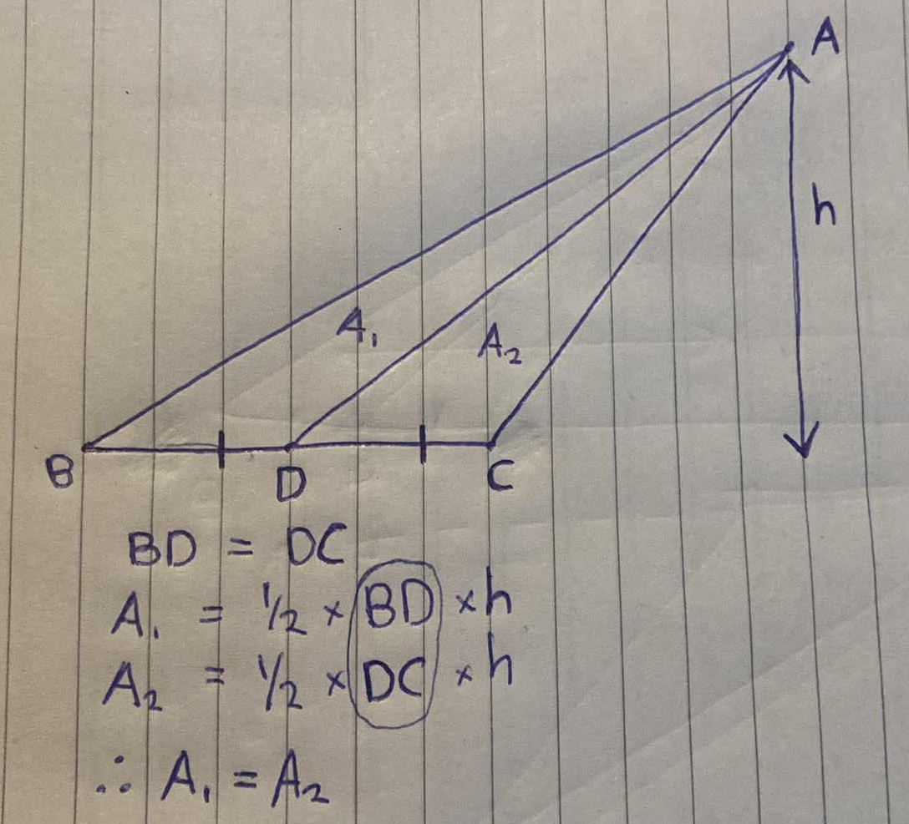
</div>

#### Centroid Theorem

The three medians of a triangle intersect at a single point called the centroid. This point divides each median in a ratio of $2:1$, measured from the vertex.

<div align='center'>
    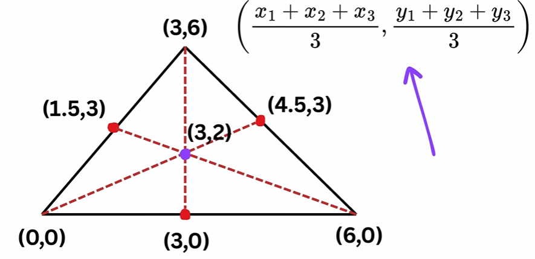
</div>

<div align='center'>
    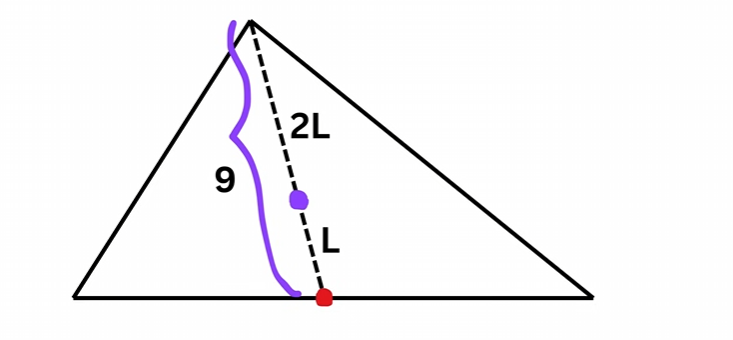
</div>

#### Angle Bisector Theorem

The bisector is a line that divides a line segment or an angle into two equivalent parts.

<div align='center'>
    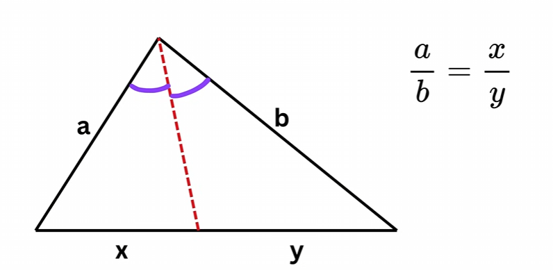
</div>

The proof for this method involves using Thales Theorem.

<div align='center'>
    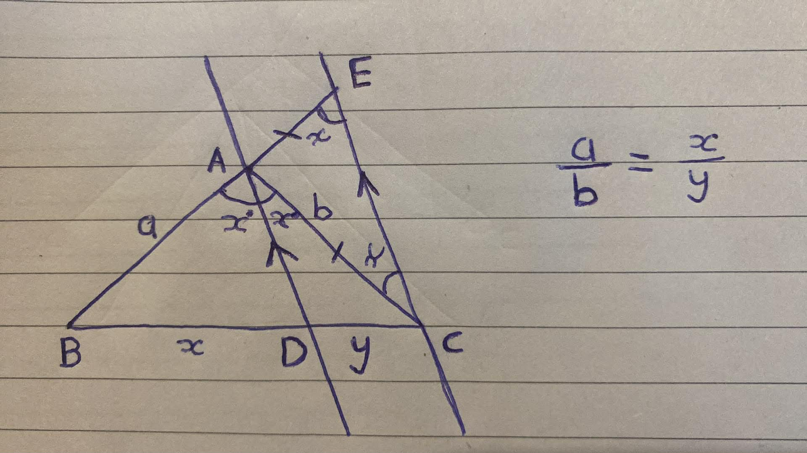
</div>

1. Draw a line that is parallel to $AD$, from above this will be $CE$.
2. By Thales Theorem, we have $\triangle EBC$ having a parallel line $AD$ run through it with $AD$ being parallel with $EC$. Therefore, this creates the relationship.

$$\frac{BD}{DC} = \frac{BA}{AE}$$

We can label

1. $BD = x$
2. $DC = y$
3. $BA = a$

Creating,

$$\frac{x}{y} = \frac{a}{AE}$$

Therefore, our goal is to prove $AE = b$.

3. Because $AD$ is paralle is $EC$, the traversal $AC$ can use the alternate angle on a parallel line theorem. Therefore, angle $x$ is equal for $\angle ACE$.

4. Due to parallel line properties (Corresponding angles), $\angle BAD$ is equal to $\angle BEC$.

5. Because $\angle ACE = \angle AEC$ we can determine that this is an isoceles triangle and therefore $\overline{AC} = \overline{AE}$.

6. We can now determine $\overline{AB} = b$

Therefore,

$$\frac{x}{y} = \frac{a}{b}$$

#### Midsegment Theorem

This theorem states that if we draw a line connecting the midpoints of two opposide sides with a line called the midsegment. It has two special properties,

1. It is parallel to the third side of the triangle.
2. It is half the length of the third side of the triangle.

<div align='center'>
    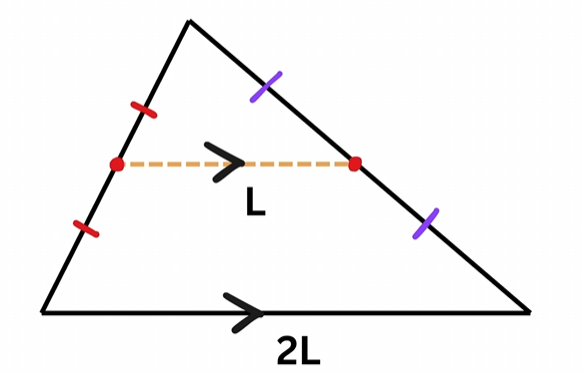
</div>

<div align='center'>
    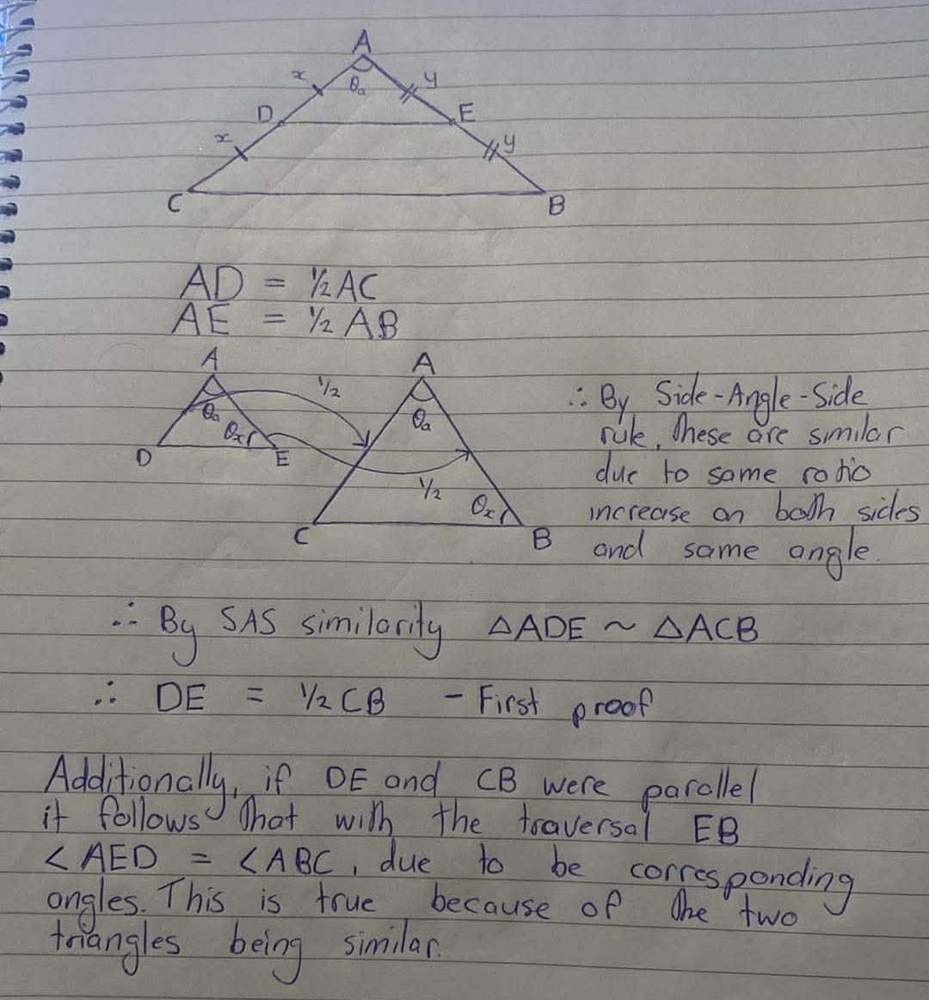
</div>


#### Circumcenter Theorem

The circumcenter is the point of intersection between the three perpendicular bisectors of the triangle's sides, and is a triangle center. The perpendicular bisectors of the three sides of a triangle pass through the triangle's circumcenter.

The circumcenter is also the midpoint of the circle, if a circle is drawn around the triangle.

<div align='center'>
    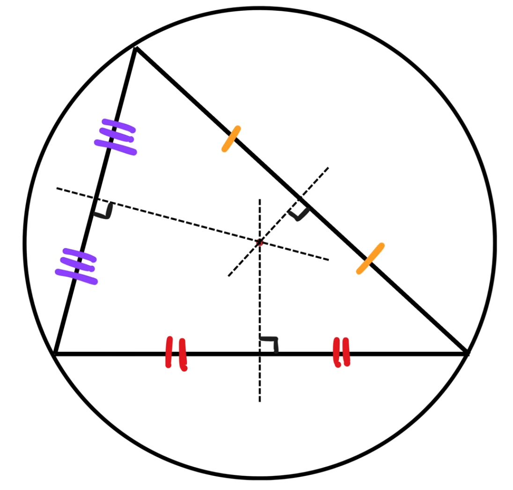
</div>

#### Incenter Theorem

The incenter of a triangle is the point of intersection of all the three interior angle bisectors of the triangle. This point is equidistant from the sides of a triangle, as the central axis’s junction point is the center point of the triangle’s inscribed circle. 

<div align='center'>
    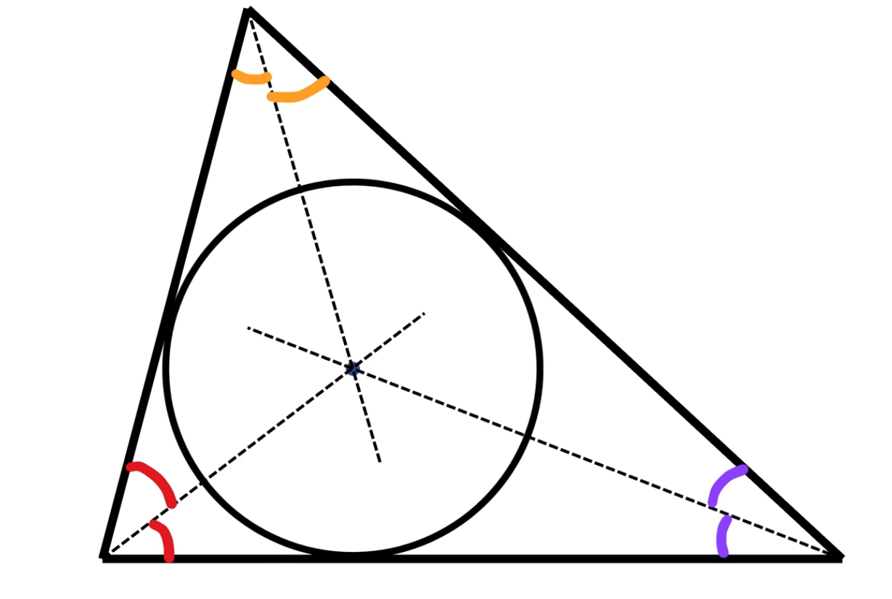
</div>

#### Orthocenter Theorem

The Orthocenter Theorem states that in any triangle, the three altitudes (lines drawn from each vertex perpendicular to the opposite side) are concurrent, meaning they intersect at a single point called the orthocenter; this point lies inside the triangle if it is acute, at the right-angle vertex if the triangle is right-angled, and outside the triangle if it is obtuse, and its existence guarantees that finding the intersection of any two altitudes determines the third automatically.

<div align='center'>
    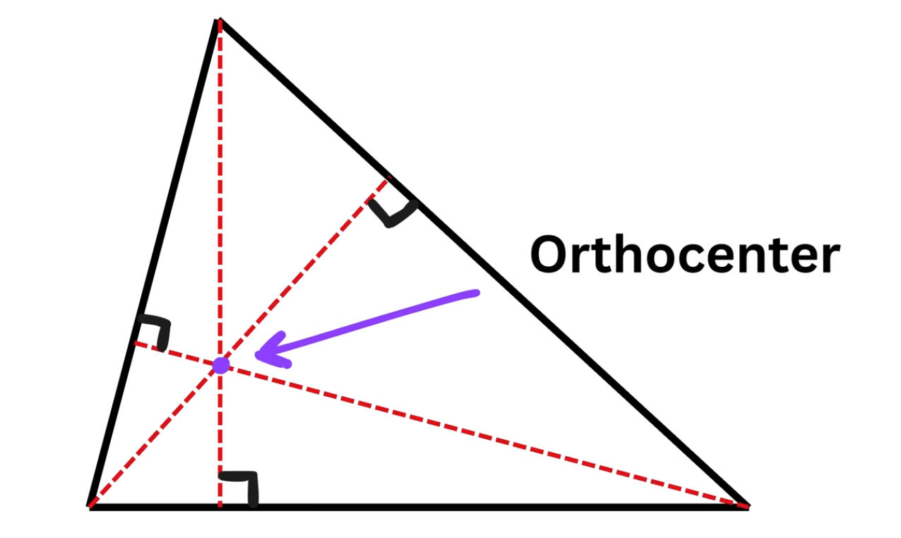
</div>

#### Triangle Proportionality Theorem

If a line is drawn parallel to one side of a triangle and intersects the other two sides, then it divides those two sides in the same ratio.

<div align='center'>
    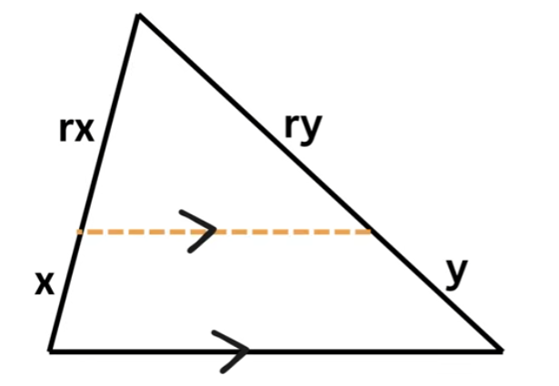
</div>

Take the following as an example. We know that $4$ is $r$ times larger than $2$. This calculated as $r=\frac{4}{2}$. 

From here, we can split the right side of the triangle into two components, $2y$ and $y$. Therefore, 

```math
\begin{aligned}
2y + y &= 9 \\
3y &= 9 \\
y &= 3
\end{aligned}
```

We can now calculate the longer side being $2 * 3 = 6$ and the shorter side being $3$. These sum to $9$.


<div align='center'>
    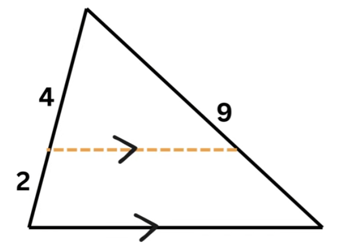
</div>


<div align='center'>
    <h1> Perimiter </h1>
</div>

Angle bisector refers to a line that splits an angle into two equal angles.

<div align='center'>
    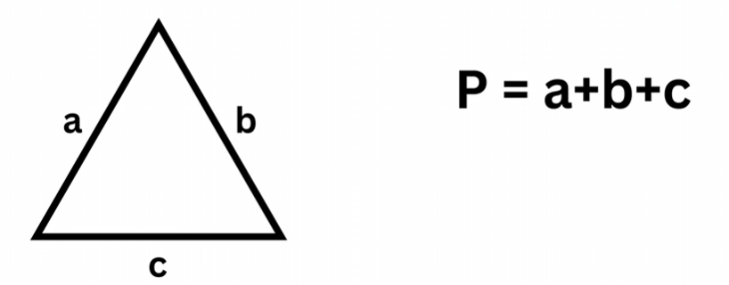
</div>

If a triangle has three sides with length $4$, $5$ and $6$, the perimiter is $4 + 5 + 6 = 15$.

<div align='center'>
    <h1> Base and Height </h1>
</div>

Every triangle has a base, which is nothing but any side you would like to pick and a height for that base. The height is a straight line from the base to the opposite corner, hitting it at a $90^\circ$ angle. Later on, this height helps us find the area.

<div align='center'>
    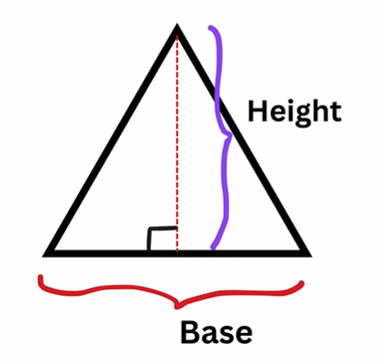
</div>

For an isoceles triangle, the height will intersect the center of the base.

<div align='center'>
    <h1> Area of a Triangle </h1>
</div>

<div align='center'>
    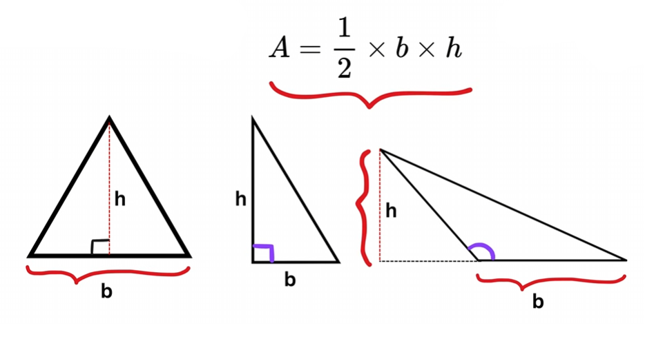
</div>

This is true for any triangle type. Given a triangle with base $b$ and height $h$

<div align='center'>
    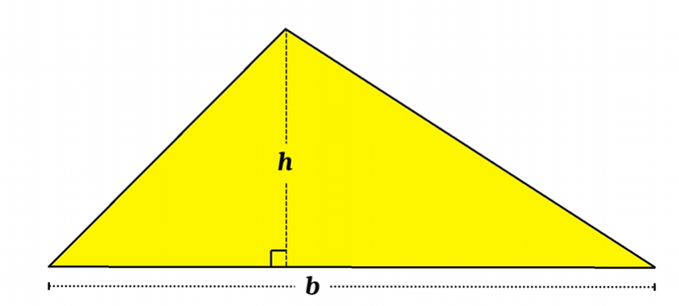
</div>

1. Begin the proof by extending the lengths outwards to create a rectangle.

<div align='center'>
    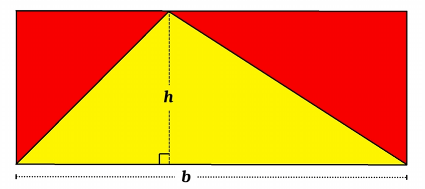
</div>

2. Now, we can cut this to create two rectangles.

<div align='center'>
    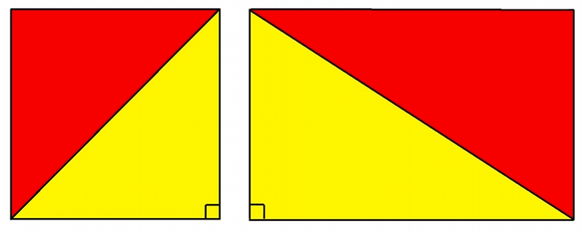
</div>

<div align='center'>
    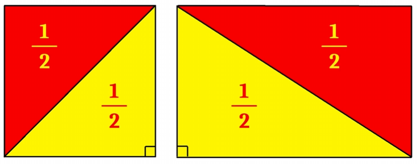
</div>

3. From here we can separate this into two areas $A_1$ and $A_2$.

<div align='center'>
    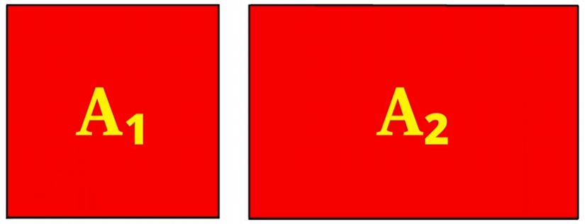
</div>

4. This means our goal is to calculate $\frac{1}{2}A_1$ + $\frac{1}{2}A_2$. This is equal to $\frac{1}{2}(A_1 + A_2)$

<div align='center'>
    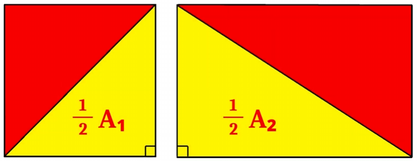
</div>

5. We know $A_1 + A_2$ is equal to the total area $b * h$. Hence, the total area of the triangle will always be $\frac{1}{2}bh$.

<div align='center'>
    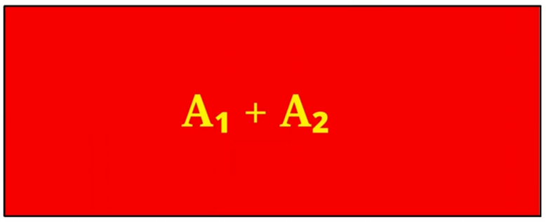
</div>

<div align='center'>
    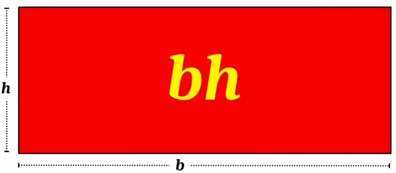
</div>

<div align='center'>
    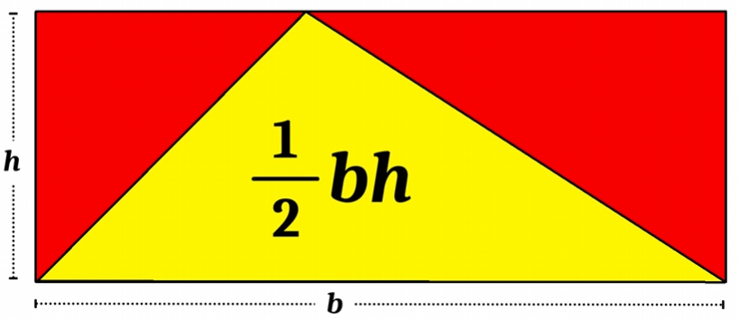
</div>

For an obtuse triangle, we solve this by creating a right angle triangle and subtract the smaller triangle from the larger triangle.

<div align='center'>
    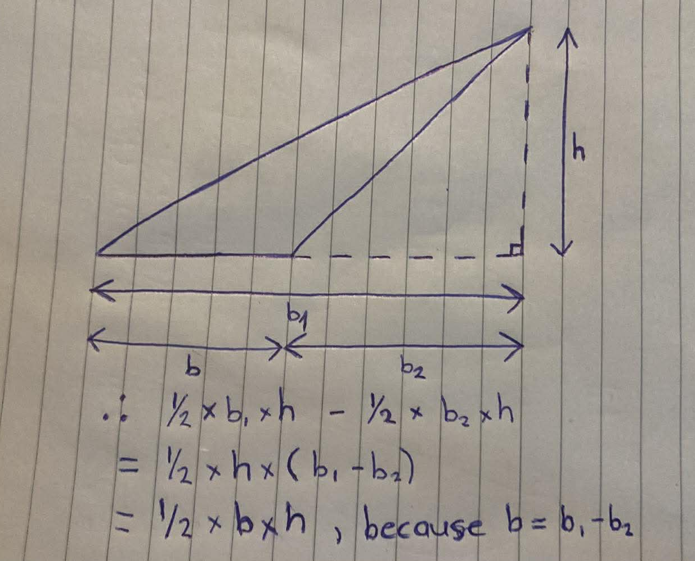
</div>

<div align='center'>
    <h1> Similar Triangles </h1>
</div>

Two triangles are similar if and only if their corresponding angles are equal. By the Angle-Angle similarity criterion, it is sufficient to show that just two pairs of angle match, the third must also match, since angles in any triangle always sum to $180^\circ$.

<div align='center'>
    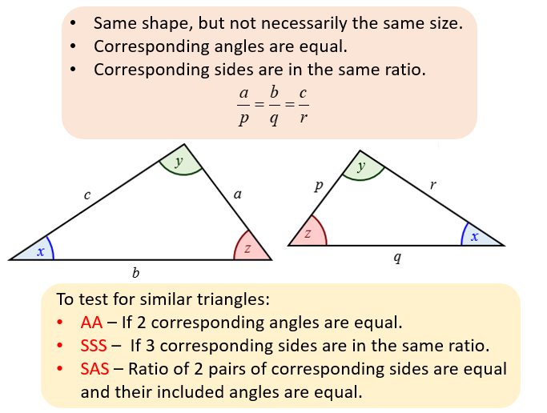
</div>

Because the angles are identical, similar triangles are essentially the same shape at different sizes. The ratio between any corresponding pair of sides is always the same constant, called the scale factor, denoted $r$ below.

This means that every side of the larger triangle is exactly $r$ times the corresponding side of the smaller one. In other words,

```math
\frac{ra}{a} = \frac{r\cancel{a}}{\cancel{a}} = r
```

```math
\frac{rb}{b} = \frac{r\cancel{b}}{\cancel{b}} = r
```

```math
\frac{rc}{c} = \frac{r\cancel{c}}{\cancel{c}} = r
```

```math
\therefore \frac{ra}{a} = \frac{rb}{b} = \frac{rc}{c} 
```

**This is not limited to the same side**. While it can be rearranged, we can also compare two different sides.

```math
\frac{b}{a} = \frac{rb}{ra} = \frac{\cancel{r}b}{\cancel{r}a} = \frac{b}{a} 
```


<div align='center'>
    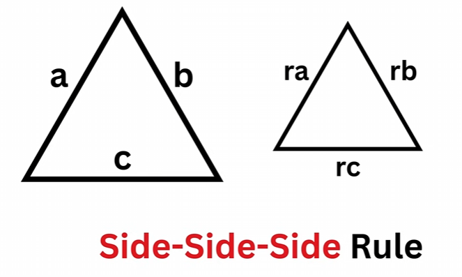
</div>

<div align='center'>
    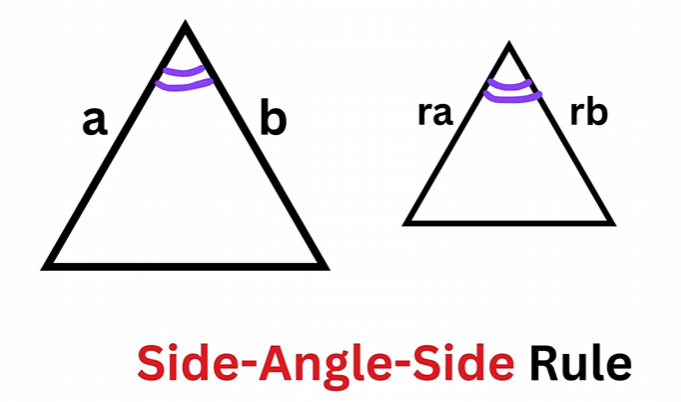
</div>

Any line drawn parallel to one side of a triangle creates a smaller triangle that is similar to the original. All angles are preserved and the sides are in proportion. This is the Basic Proportionality Theorem (or Thales' theorem).

<div align='center'>
    
</div>

Additionally,

```math
\frac{AD}{AB} = \frac{AE}{AC}
```

<div align='center'>
    <h1> Congruence of Triangles </h1>
</div>

Triangle congruence means that two triangles are **exactly the same shape and the same size**. In other words, one triangle can be moved (translated, rotated, or reflected) so that it lies perfectly on top of the other. Triangles can be congruent in different ways.

##### 1 - Side-Side-Side Congruence

Side-Side-Side congruence, also called SSS congruence is when **all three sides are equal**.

<div align='center'>
    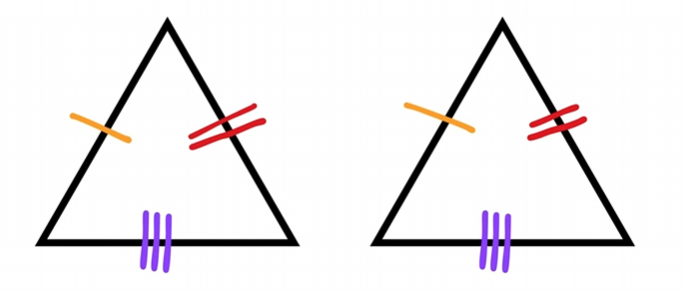
</div>

##### 2. Side-Angle-Side Congruence

Side-Angle-Side congruence, also called SAS congruence is when **two sides and the angle between them are the same**.

<div align='center'>
    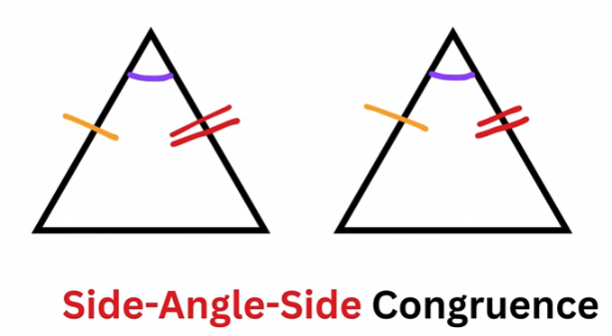
</div>

#### 3. Angle-Side-Angle Congruence

Angle-Side-Angle congruence, also called ASA congruence is when **two angles and the side between them are the same**.

<div align='center'>
    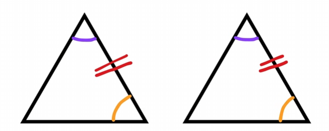
</div>

#### 4. Angle-Angle-Side Congruence

Angle-Angle-Side congruence, also called AAS congruence is when **two angles and a side that is not between them are the same**.

<div align='center'>
    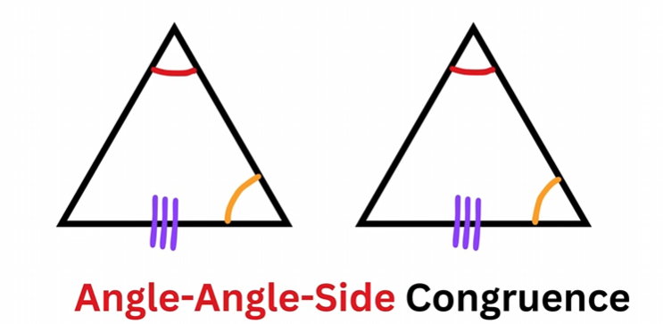
</div>

#### 5. Right-Hypotenuse-Side Congruence

If two **right triangles have the same length hypotenuse and one leg**, it is called a Right-Hypotenuse-Side congruence.

<div align='center'>
    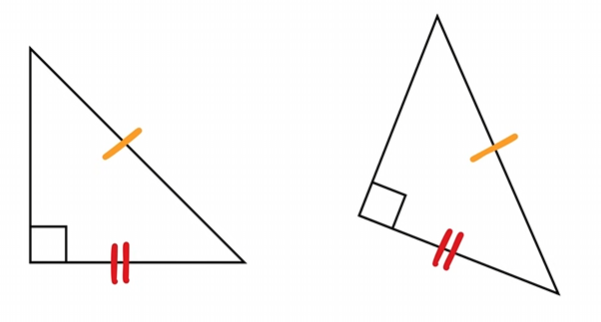
</div>

<div align='center'>
    <h1> Heron's Formula </h1>
</div>

Heron’s Formula is a way to find the area of a triangle using only the lengths of its three sides, no angles or heights needed.

Instead of dropping a height (which can be messy), Heron’s formula lets you compute area directly from side lengths—especially useful when coordinates or heights aren’t easily available.

<div align='center'>
    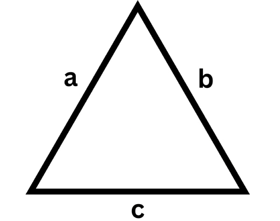
</div>

First, calculate the semi-perimeter $s$. $$s = \frac{a+b+c}{2}$$

Then, we plug $s$ into the equation, $$A=\sqrt{s(s-a)(s-b)(s-c)}$$

<div align='center'>
    <h1> Basic Trigometric Ratios in Right Triangles </h1>
</div>

Trigonometry is the study of relationships between angles and side lengths in triangles. The key idea is, **if you fix an angle, the ratios between the sides are always the same**. This is why trig functions (sin, cos, tan) exist, **they encode those ratios**.

A right triangle has one angle equal to $90^\circ$. This creates a special structure,

- **Hypotenuse** - This is the side opposite the $90^\circ$ angle, which is always the longest.
- **Opposite** - Side across from the angle you are focusing on.
- **Adjacent** - Side next to the angle, but not the hypotenuse. It's often easier to identify the hypotenuse, opposit and thus the final side must be the adjacent.

A hypotenuse is not just the longest side. It is defined as the side opposite the right angle. Even if a triangle has a "longest side", it not called a hypotenuse unless there is a $90^\circ$ angle.

Basic trigonometric ratios can be remembered by an acronym called SOH-CAH-TOA. These only apply **directly to right triangles**.

```math
\begin{align*}
\sin(\theta) &= \frac{\text{opposite}}{\text{hypotenuse}} \\
\cos(\theta) &= \frac{\text{adjacent}}{\text{hypotenuse}} \\
\tan(\theta) &= \frac{\text{opposite}}{\text{adjacent}}
\end{align*}
```

These ratios depend on the hypotenuse and therefore require a right triangle. If you have an opposite of $3$ and hypotenuse of $5$ then we have,

$$\sin(\theta) = \frac{\text{opposite}}{\text{hypotenuse}} = \frac{3}{5} = 0.6$$

This means that the side across from angle $\theta$ is 60% of the hypotenuse. This ratio uniquely determines the angle.

To get the angle from sine, use the inverse sine function.

```math
\begin{align*}
\theta &= \sin^{-1}(0.6) \\
\theta &\approx 36.87^\circ
\end{align*}
```

Therefore, $$\sin(36.87^\circ) = 0.6$$

When applying the arithmatic here, we're applying the inverse sine function. When we go from, $$\sin(\theta) = \frac{o}{h}$$ to $$\theta = \sin^{-1}\left(\frac{o}{h}\right)$$ We're applying the inverse sine function $\sin^{-1}$ to both sides. That is, $$\sin^{-1}(\sin(\theta)) = \sin^{-1}\left(\frac{o}{h}\right)$$

<div align='center'>
    <h1> The Law of Sines </h1>
</div>

<div align='center'>
    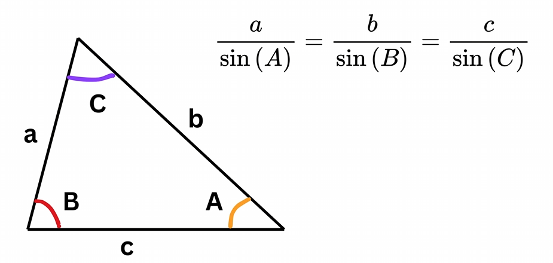
</div>

Where,

- Side $a$ is opposite angle $A$
- Side $b$ is opposite angle $B$
- Side $c$ is opposite angle $C$

When observing the proportional equations,

$$\frac{a}{\sin(A)} = \frac{b}{\sin(B)} = \frac{c}{\sin(C)}$$

We need to fill them in to find the unknowns. We compare two proportional equations and need to fill in the unknowns to solve for a single unknown. This means,

1. If we know two angles, such as $A$ and $B$ we can calculate the third $C$. However, we always need atleast one side length to calculate the other.
2. Given 2 lengths and an angle associated with one of the lengths, we can calculate the angle of the other length.

Take the following example, given

1. $A$ = 50
2. $B$ = 60
3. $a = 10cm$

##### 1. Calculate $C$

We have 2 angles, therefore we can calculate the third angle $C$.

```math
\begin{aligned}
C &= 180^\circ - A - B \\
  &= 180^\circ - 50^\circ - 60^\circ \\
  &= 70^\circ
\end{aligned}
```

##### 2. Calculate Length $b$

When observing the proportional equality,

```math
\frac{a}{\sin(A)} = \frac{b}{\sin(B)}
```

Substitute the known values,

```math
\begin{aligned}
\frac{10}{\sin(50^\circ)} &= \frac{b}{\sin(60^\circ)}
\end{aligned}
```

Rearrange to solve for $b$,

```math
\begin{aligned}
b &= \frac{10 \sin(60^\circ)}{\sin(50^\circ)} \\
  &\approx 11.31 \text{ cm}
\end{aligned}
```

##### 3. Calculate Length $c$

When observing the proportional equality,

```math
\frac{a}{\sin(A)} = \frac{c}{\sin(C)}
```

Substitute the known values,

```math
\begin{aligned}
\frac{10}{\sin(50^\circ)} &= \frac{c}{\sin(70^\circ)}
\end{aligned}
```

Rearrange to solve for $c$,

```math
\begin{aligned}
c &= \frac{10 \sin(70^\circ)}{\sin(50^\circ)} \\
  &\approx 11.23 \text{ cm}
\end{aligned}
```

Now we have every angle and every side length of the triangle with only originally beginning with two angles and a side.

<div align='center'>
    <h1> The Law of Cosines </h1>
</div>

<div align='center'>
    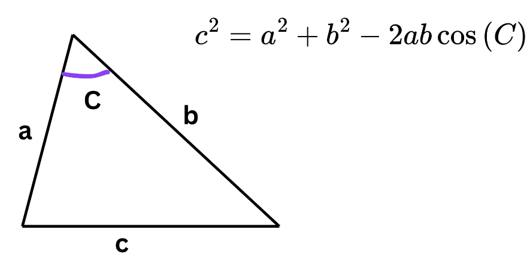
</div>

Where,

- Side $a$ is opposite angle $A$
- Side $b$ is opposite angle $B$
- Side $c$ is opposite angle $C$

When observing the equations,

```math
\begin{aligned}
a^2 &= b^2 + c^2 - 2bc\cos(A) \\
b^2 &= a^2 + c^2 - 2ac\cos(B) \\
c^2 &= a^2 + b^2 - 2ab\cos(C)
\end{aligned}
```

We use these equations when we are given combinations of sides and angles that cannot be solved using the Law of Sines.

This means,

1. Given all three side lengths, we can calculate any angle.
2. Given two side lengths and the included angle, we can calculate the third side.

Take the following example, given

1. $a = 8\text{ cm}$
2. $b = 10\text{ cm}$
3. $C = 60^\circ$


##### 1. Calculate Length $c$

We are given two sides and the included angle, so we use the Law of Cosines.

```math
\begin{aligned}
c^2 &= a^2 + b^2 - 2ab\cos(C) \\
    &= 8^2 + 10^2 - 2(8)(10)\cos(60^\circ) \\
    &= 64 + 100 - 160(0.5) \\
    &= 164 - 80 \\
    &= 84
\end{aligned}
```

```math
\begin{aligned}
c &= \sqrt{84} \\
  &\approx 9.17 \text{ cm}
\end{aligned}
```

##### 2. Calculate Angle $A$

Now that we have all three sides, we can calculate angle $A$.

```math
\begin{aligned}
a^2 &= b^2 + c^2 - 2bc\cos(A)
\end{aligned}
```

Rearrange to solve for $\cos(A)$,

```math
\begin{aligned}
\cos(A) &= \frac{b^2 + c^2 - a^2}{2bc} \\
        &= \frac{10^2 + (9.17)^2 - 8^2}{2(10)(9.17)} \\
        &\approx 0.709
\end{aligned}
```

```math
\begin{aligned}
A &= \cos^{-1}(0.709) \\
  &\approx 45.0^\circ
\end{aligned}
```

##### 3. Calculate Angle $B$

We now calculate the final angle using the angle sum of a triangle.

```math
\begin{aligned}
B &= 180^\circ - A - C \\
  &= 180^\circ - 45.0^\circ - 60^\circ \\
  &= 75.0^\circ
\end{aligned}
```

Now we have every angle and every side length of the triangle with only originally beginning with two sides and the included angle.

<div align='center'>
    <h1> When to Use Law of Sines vs Law of Cosines </h1>
</div>

### Law of Sines

We use the Law of Sines when we have a known **side-angle pair**, meaning a side and its opposite angle are both known. If a side and its opposite angle are known, the Law of Sines can be used provided at least one additional side or angle is known. 

This occurs in the following cases,

1. **AAS (Angle-Angle-Side)** — Two angles and one side. From the original ASA, we can calculate the third and begin the calculations.
2. **ASA (Angle-Side-Angle)** — Two angles and the included side.
3. **SSA (Side-Side-Angle)** — Two sides and a non-included angle.  

The governing equation is,

```math
\frac{a}{\sin(A)} = \frac{b}{\sin(B)} = \frac{c}{\sin(C)}
```

### Law of Cosines

We use the Law of Cosines when we do not have a side-angle pair. If the Law of Sines so not apply, Law of Cosines can be applied.

This occurs in the following cases:

1. **SSS (Side-Side-Side)** — All three sides are known  
2. **SAS (Side-Angle-Side)** — Two sides and the included angle  

The governing equations are,

```math
\begin{aligned}
a^2 &= b^2 + c^2 - 2bc\cos(A) \\
b^2 &= a^2 + c^2 - 2ac\cos(B) \\
c^2 &= a^2 + b^2 - 2ab\cos(C)
\end{aligned}
```

### Ambiguous Case (SSA)

When using the Law of Sines with SSA,

- There may be two possible triangles  
- One possible triangle  
- Or no valid triangle  

This occurs because,

```math
\sin(\theta) = \sin(180^\circ - \theta)
```

<div align='center'>
    <h1> Area of Triangle using Trigonometry </h1>
</div>

<div align='center'>
    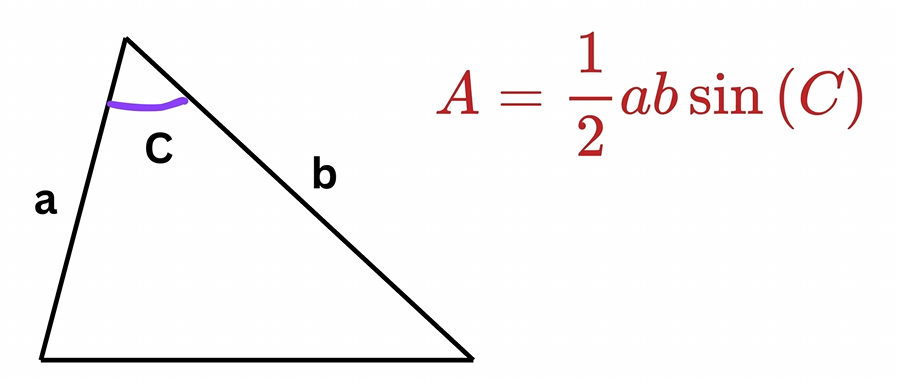
</div>

If two sides and the included angles are known, the area of a triangle is

$$A = \frac{1}{2}ab\sin(C)$$

Alternative forms of this can be written down,

```math
\begin{aligned}
A &= \frac{1}{2}ab\sin(C) \\
A &= \frac{1}{2}bc\sin(A) \\
A &= \frac{1}{2}ac\sin(B)
\end{aligned}
```

This all begins from the basic area formula,

$$A = \frac{1}{2} \cdot \text{base} \cdot \text{height}$$

Where each equations calculates the height using a different angle.

<div align='center'>
    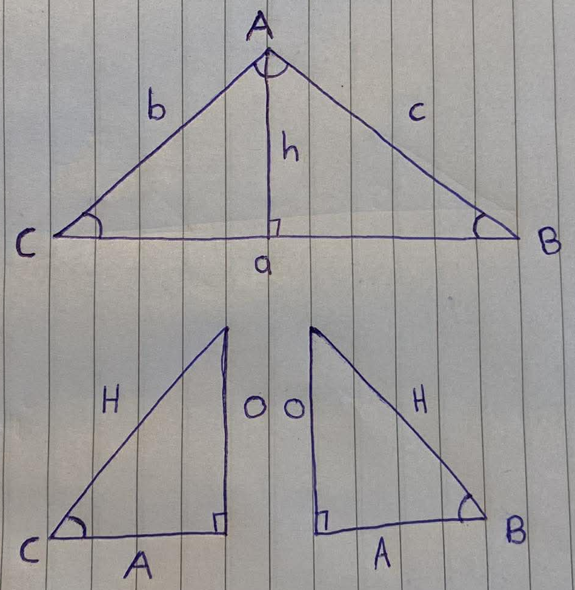
</div>

##### 1. Using angle $C$

So, from the above using $$\sin(\theta) = \frac{O}{H} = \frac{\text{Opposite}}{\text{Hypotenuse}}$$

Using angle $C$,

```math
\begin{aligned}
\sin C &= \frac{h}{b} \\
b\sin C &= h
\end{aligned}
```

Therefore,

$$\boxed{A = \frac{1}{2} \times  ab\sin(C)}$$

##### 2. Using angle $B$

So, from the above using $$\sin(\theta) = \frac{O}{H} = \frac{\text{Opposite}}{\text{Hypotenuse}}$$

Using angle $B$,

```math
\begin{aligned}
\sin B &= \frac{h}{c} \\
c\sin B &= h
\end{aligned}
```

Therefore,

$$\boxed{A = \frac{1}{2} \times  ac\sin(B)}$$

##### 3. Using angle $A$

We cannot use $\angle A$ given the original triangle with base as $a$, because the height $h$ cuts through the angle. Any side of the triangle can be chosen as the base when calculating the area. Therefore, we create a new $h$ from vertex $B$ and use $b$ as the base.

<div align='center'>
    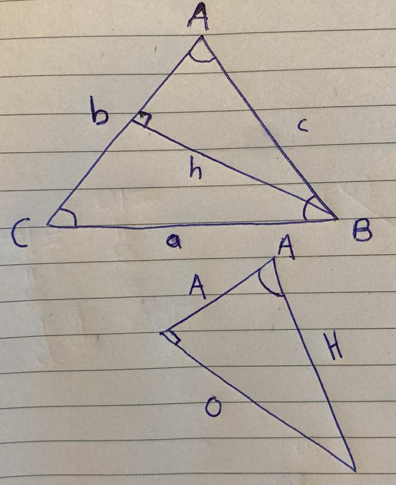
</div>

So, from the above using $$\sin(\theta) = \frac{O}{H} = \frac{\text{Opposite}}{\text{Hypotenuse}}$$

Using angle $A$,

```math
\begin{aligned}
\sin A &= \frac{h}{c} \\
c\sin A &= h
\end{aligned}
```

Therefore,

$$\boxed{A = \frac{1}{2} \times  bc\sin(A)}$$