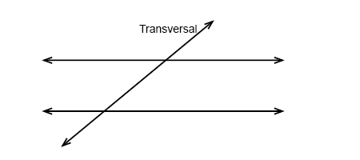
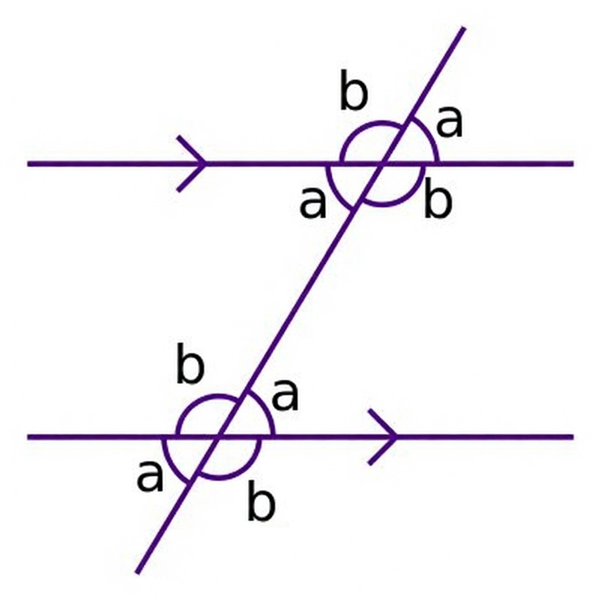
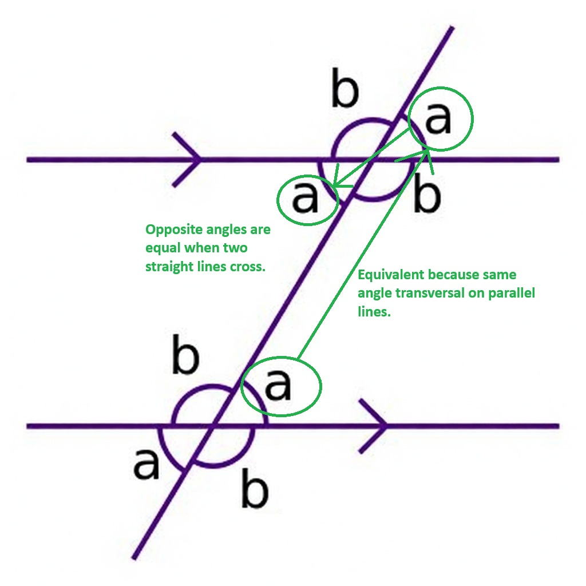
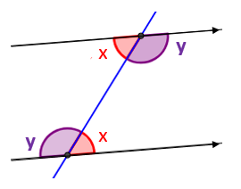
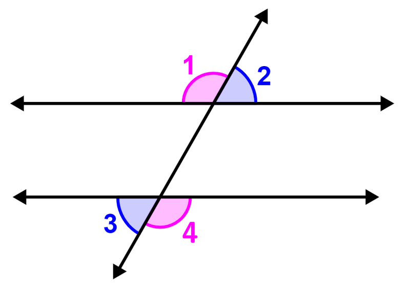
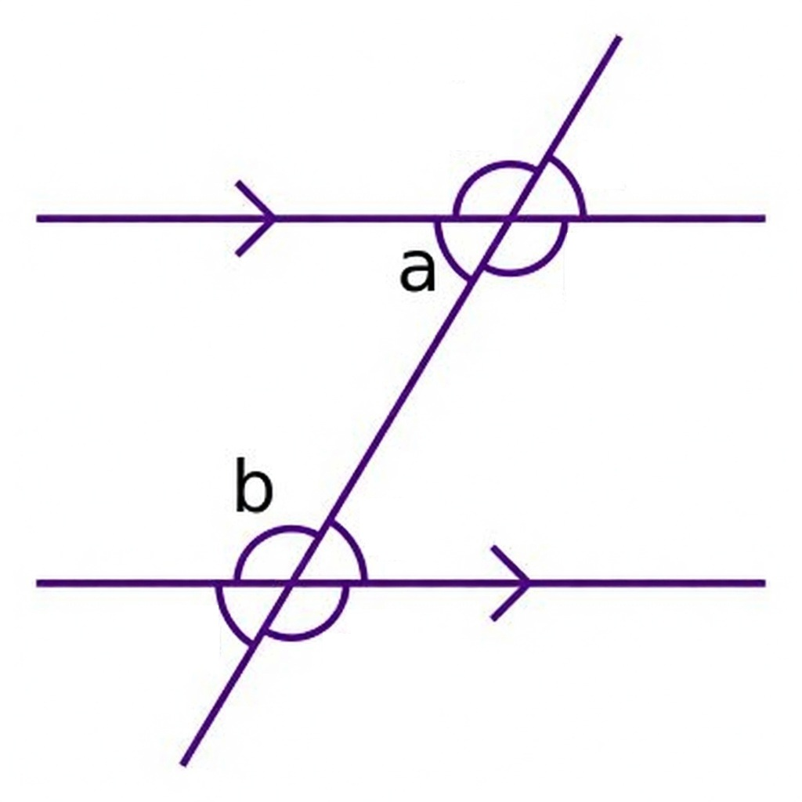
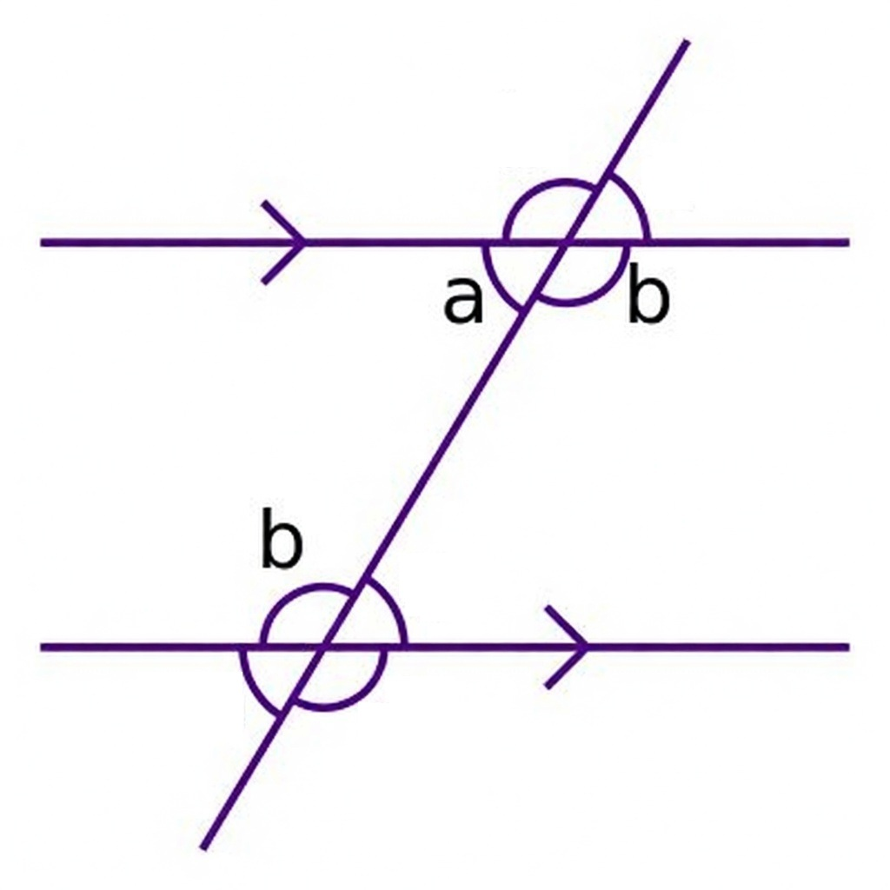
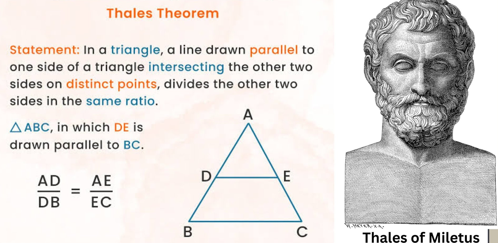

<div align='center'>
    <h1> Properties of Parallel Lines </h1>
</div>

Parallel lines are a fundamental concept in Euclidean geometry. Many geometric theorems and proofs rely on the angle relationships formed when a third line intersects two parallel lines.

When a transversal intersects two parallel lines, a predictable set of angle relationships is created. These relationships allow us to determine unknown angles and construct formal geometric proofs. Understanding these relationships is essential for topics such as polygon angle sums, circle theorems and coordinate geometry.

#### Parallel Lines

Two lines are parallel if they lie in the same plane and never intersect, regardless of how far they are extended. Symbolically this is written as,

```math
l_1 \parallel l_2
```

Parallel lines also main equidistant from each other at every point.

<div align='center'>
    
</div>

#### Traversal

A transversal is a line that intersects two or more other lines at different points.

When a transversal intersects two parallel lines, eight angles are formed.

## Properties of Parallel Lines

When a transversal intersects two parallel lines, the angles created follow several important geometric rules.

<div align='center'>
    
</div>

#### Corresponding Angles

Corresponding angles are angles that appear in the same relative position at each intersection between the transversal and the parallel lines.

If two parallel lines are intersected by a transversal, corresponding angles are equal.

<div align='center'>
    
</div>

We can begin using simple properties. First identify that if we have two parallel lines with a traversal, that the parallel lines will never meet. This can be thought of creating two identical 

<div align='center'>
    
</div>

#### Alternate Interior Angles

Alternate interior angles lie,

- Between parallel lines.
- On opposite sides of the traversal.

If two parallel lines are intersected by a traversal, **alternate interior angles are equal**.

```math
\begin{aligned}
\angle x &= \angle x \\
\angle y &= \angle y
\end{aligned}
```

<div align='center'>
    
</div>

Alternate interior angles form a Z-shaped pattern.

#### Alternate Exterior Angles

Alternate exterior angles lie,

- Outside parallel lines.
- On opposite sides of the traversal.

Alternate exterior angles are equal.

```math
\begin{aligned}
\angle 1 = \angle 4 \\
\angle 2 = \angle 3 \\
\end{aligned}
```

<div align='center'>
    
</div>

#### Co-Interior Angles

Co-interior angles lie between the parallel lines on the same side of the transversal. Co-interior angles are supplementary, meaning their sum is $180^\circ$.

```math
\angle a + \angle b = 180^\circ
```

<div align='center'>
    
</div>

While the previous may not be obvious at first, we know due to the alternate interior angles being equal we can list the other angle $b$. From here, we know that angles on a straight like sum to $180$ and therefore $a + b = 180$.

<div align='center'>
    
</div>

#### Parallel Lines and Triangles

Any line drawn parallel to one side of a triangle creates a smaller triangle that is similar to the original. All angles are preserved and the sides are in proportion. This is the Basic Proportionality Theorem (or Thales' theorem).

<div align='center'>
    
</div>

Additionally,

```math
\frac{AD}{AB} = \frac{AE}{AC}
```
