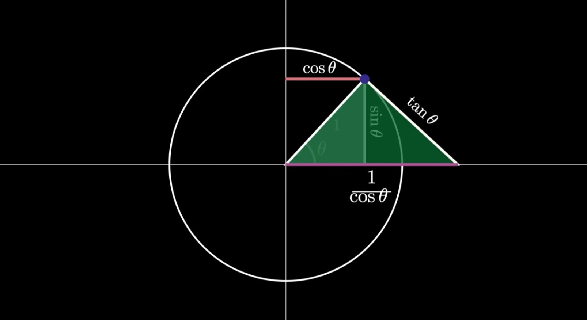

<div align='center'>
    <h1> Trigonometry </h1>
</div>

In nature, we observe numerous phenomena that propagate in the form of waves or can be described by the concept of a wave. To understand these phenomena, we model them mathematically. It is remarkable that the mathematical description of wave, even when solving complicated differential equations can be traced back to a simple geometric shape, **the triangle**. So, how can a wave arise from a triangle?

If we divide the circumfrance of a circle $C$ by the length of the diameter $D$, that is, if we calculate the ratio of the circumfrance to diameter,

```math
\frac{C}{d} = \pi
```

We get a number that **always remains the same**, no matter how large or small the circle is. Today, we know this number as pi. If we rearrange this equation and substitute the diameter as two times the radius, we get

```math
C = 2\pi r
```

With a radius of 1, the circumfrance is simply $2\pi$. It was precisely this circle that was used as a template for a new measurement of angular units. Which is why it became known as the unit circle. Now, instead of imagining that, for example $60^\circ$ consists of 60 parts, we place our circle template with its center at the tip of the angle and measure the length of the arc that this angle encloses.

<div align='center'>
    
</div>

In the case of this angle, the arc length corresponds with $\frac{1}{6}$ of the entire circumfrance. That is, $60^\circ \cong \frac{2\pi}{6} = \frac{\pi}{3}$. At a $90^\circ$ angle, the ark occupies a quarter of the circle. So this angle corresponds to $\frac{90}{360} \cdot 2\pi = \frac{1}{4} \cdot 2\pi = \frac{2\pi}{4} = \frac{\pi}{2}$

<div align='center'>
    
</div>

For a full circle, we eventually measure the complete circumfrance of $2\pi$.

<div align='center'>
    <h1> The Right-Angled Triangle </h1>
</div>

The right-angled triangle is a very special triangle because it can do all things other triangles can do, in addition to the Pythagorean Theorem. Furthermore, we can construct any other triangle from two right angled ones. So, if we understand the right angle triangle, we understand all of the others.

<div align='center'>
    
</div>

For the study of triangles, known as Trigonometry, it is therefore sufficient to study the right-angled triangle.

<div align='center'>
    
</div>

Let us begin by first naming the individual sides.

- **Hypotenuse** - The side opposite the right angle. It is also the longest side.

<div align='center'>
    
</div>

- **Leg** - One of the other two remaining sides.

<div align='center'>
    
</div>

From the perspective of an angle, illustrated below as $\alpha$.

- **Opposite** - The leg opposite the angle.
- **Adjacent** - The leg adjacent to the angle.

<div align='center'>
    
</div>

From the perspective of the other angle $\beta$, you would swap them accordingly.

<div align='center'>
    
</div>

With these three sides, we can create a total of 6 ratios given the permutations of length 2 for the three sides $H$, $O$, $A$.

<div align='center'>
    
</div>

Now comes the remarkable part. These ratios correspond to a number that **does not change no matter how large or small we make the triangle**. For the number to change in ratio $\frac{O}{H}$, we would have to change only the numerator or only the denominator. But how can we change the numerator (Which is the length of the opposite), without changing the denominator (Which is the length of the hypotenuse). Well, **we would have to change the angle $\alpha$**. Meaning, if we set the hypotenuse to a fixed length and increase or decrease the angle $\alpha$, only then can the ratio change.

<div align='center'>
    
</div>

Therefore, if these ratios only change when $\alpha$ changes, **then we can also understand them as functions**. Therefore, these are functions, that **when given an angle, will return the ratio of the two sides**.

<div align='center'>
    
</div>

Each of these functions has been given its own name. This is the meaning for each function

<div align='center'>
    
</div>

These ratios are **independent of the triangles size**. Any two triangles with the same angles are similar, so the ratios remain constant. This is due **triangle similarity**. This comes directly from the concept of similarity in geometry.

Two triangles are similar if,

1. Their corresponding angles are equal.
2. Their corresponding sides are in proportion.

So if two triangles share the same angle $\theta$ and both are right angled, then they automatically have the same three angles.

1. $90^\circ$
2. $\theta$
3. $90^\circ - \theta$


If Triangle $A$ and Triangle $B$ are similar, then all corresponding sides scale by a constant factor. If Triangle $A$ has sides $a, b, c$ then Triangle $B$ is a scaled version $ra, rb, rc$. Therefore,

```math
\frac{rb}{rc} = \frac{\cancel{r}b}{\cancel{r}c} = \frac{b}{c}
```

The scale factor $r$ cancels out.

<div align='center'>
    
</div>

Given that for $\theta_1$,

- $O = b$
- $H = c$

```math
\frac{O}{H} = \frac{b}{c} = \frac{rb}{rc}
```

It is this that allows for the relationship to exist. The size of the triangles do not change the ratio as long as they're similar triangles. This means the ratio $\frac{O}{H}$ is the same for similar triangles and the **only way to break this is to change the angle**. Therefore, the functions $\sin$, $\cos$ and $\cos$ are functions that given an angle $\theta$ can return the ratio for the two triangle sides for a given angle **for a right angled triangle**.

<div align='center'>
    <h1> The Unit Circle </h1>
</div>

The unit circle is a central unifying framework of trignometry, extending the subject beyond the limited context of right-angled triangles into a continuous theory of angles and functions. While early trigonometry defines sine, cosine and tangent as ratios of sides in a triangle, this approach is inherently restricted to acue angles. The unit circle resolves this limitation by redefining trigonometric functions in terms of **geometry on a circle of radius one**, thereby allowing these functions to be defined for all real angles.

<div align='center'>
    
</div>

This describes a circle of radius one centered at the origin. The choice of radius one is not arbitrary, it eliminates scaling factors and allows trigometric ratios to correspond directly to coordinates.

An angle $\theta$ is measured from the positive $x\text{-axis}$. Where this rotation meets the unit circle determines a point $P = (x,y)$. This point defines the trigonometric functions,

- The $x\text{-coordinate}$ is $\cos(\theta)$
- The $y\text{-coordinate}$ is $\sin(\theta)$

Thus, rather than being ratios derived from a triangle, sine and cosine become **functions mapping angles to coordinates**. This shift in interpretation is the fundamental reason the unit circle is used.

The unit circle preserves and generalizes the definitions from right angle triangles. If one inscribes a right angle within the circle, by dropping a perpendicular line from $P$ to the $x\text{-axis}$. The hypotenuse has length $1$, resulting in,

```math
\begin{aligned}
\sin(\theta) &= \frac{\text{opposite}}{\text{hypotenuse}} = \frac{\text{opposite}}{1} = \text{opposite}\\
\cos(\theta) &= \frac{\text{adjacent}}{\text{hypotenuse}} =\frac{\text{adjacent}}{1} = \text{adjacent}
\end{aligned}
```

Within the unit circle framework, trigonometric functions are understood as periodic mappings,

```math
\sin : \mathbb{R} \to [-1,1] \\
\cos : \mathbb{R} \to [-1,1]
```

Each angle corresponds to a unique point on the circle, as $\theta$ increases, this point moves continuously around the circumfrance. This motion directly generates the wave-like graphs of sine and cosine when projected onto the coordinate axes.

Additionally, other trigonometric functions arise naturally.

```math
\tan(\theta) = \frac{\sin(\theta)}{\cos(\theta)}
```

Interpreted as the slope of the line from the origin $P$. This provides a geometric meaning to tangent as a rate of change, linking trigonometry to calculus.

<div align='center'>
    <h1> Changing Angles </h1>
</div>

Given a right angled triangle, the "opposite" is always opposite the angle. However, this can mean that the "opposite" side can change on the same triangle when moving the angle $\theta$.

<div align='center'>
    
</div>

A more coherent way to understand why the "opposite" side is always opposite the angle is through the unit circle. Consider a unit circle centered at the origin. Any angle $\theta$, measured from the positive $x\text{-axis}$, determines a point on the circle with coordinates,

```math
(\cos(\theta), \sin(\theta))
```

Here, cosine represents the horizontal $x$ position and sine represents the vertical $y$ position.

The reason the "opposite" side is always opposite the angle is that it **represents the vertical change produced by the angle**. As $\theta$ increases, the point moves around the circle and its height changes. This vertical change is exactly what $\sin(\theta)$ measures, so the "opposite" side is simply the geometric expression of that vertical component.

When you switch to a different angle in the triangle, the roles of the sides appear to change because you have changed your reference. In the unit circle terms, this is **equivalent to rotating the coordinate system**. The triangle itself stays the same, but what counts as horizontal and vertical shifts relative to the new angle.

In this way, the labels "opposite" and "adjacent" are not arbitrary. They are directly tied to the coordinate definitions of sine and cosine.

- Opposite = Vertical = $\sin(\theta)$
- Adjacent = Horizontal = $\cos(\theta)$

This is why the "opposite" side is always opposite the angle, it **reflects the vertical component** determined by that angle.

<div align='center'>
    <h1> Waves </h1>
</div>

The wave-like graphs of sine, cosine and tangent are direct consequences of their origins in the unit circle. As a point moves around the circle,

- **Sine** captures the vertical motion, producing a smooth oscillation.
- **Cosine** captures horizontal motion, creating the same wave shifted in phase.
- **Tangent** represents a ratio of these motions, leading to repeating but discontinuous curves.

Ultimately, trigonometric graphs are not just abstract shapes, they are visual representations of circular motion unfolding over time.


<div align='center'>
    <h3> The Sine Wave </h3>
</div>

To begin graphing the sine function, we will,

1. Plot the angle $\theta$ on the $x$ axis.
2. The length of the opposite side on the $y$ axis.

Here, the negative length means that the opposite side is in the lower semi-circle.

<div align='center'>
    
</div>

<div align='center'>
    
</div>

We can extend the sine function to larger angle range. We can keep rotating around the circle, beyond $2\pi$. A negative angle will simply mean that we rotate clockwise.

The sine function is periodic, which means,

```math
\sin(x + 2\pi) = \sin(x)
```

This tells us that adding any multiple of $2\pi$ (one full rotation around the unit circle) does not change the value of sine. Effectively, you can think of sine as working in modulo $2\pi$. 

```math
4\pi ≡ 0 \ (\text{mod} \ 2\pi)
```

Therefore,

- $\sin(0) = 0$. This represents no movement.
- $sin(2\pi) = 0$. This represents one full rotation, and back to the same point as $\sin(0)$
- $sin(4\pi) = 0$. This represents two full rotations, and back to the same point as $\sin(0)$
- $sin(6\pi) = 0$. This represents three full rotations, and back to the same point as $\sin(0)$
- ...

<div align='center'>
    
</div>

With all of this, we have found a way to create a mathematical description for a wave, out of a triangle. In reality, not all functions look like the previous pure $\sin$ wave. We can manipulate the function with additional numbers,

- If you multiply the $\sin$ by a certain number, we influence **the amplitude**.
- If we multiply the angle by a certain number, we influence **its frequency**.
- We can also shift the function in the $x$ or $y$ direction by adding constants in and outside the $\sin$ function.

<div align='center'>
    
</div>

<div align='center'>
    <h3> The Cosine Wave </h3>
</div>

To begin graphing the cosine function, we will,

1. Plot the angle $\theta$ on the $x$ axis.
2. Plot the length of the $adjacent$ on the $y$ axis.

Here, the negative length means that the adjacent side is on the left half of the semi-circle. All properties of the cosine functions are equal.

Cosine literally means "complementary sine" because,

```math
\cos(\theta) = \sin(\frac{\pi}{2} -\theta)
```

<div align='center'>
    
</div>

<div align='center'>
    
</div>

<div align='center'>
    
</div>

Cosine is used to calculate the hypotenuse of an extended triangle illustrated below.

<div align='center'>
    
</div>

We begin this proof by creating a single right angled triangle on the unit circle with 3 lengths, $a$, $b$ and $c$. From here, we create a second triangle with another straight line that is a tangent to the point touching the circumfrance. 

Because a line tangent touches the circumfrance to create a right angle and they both have the same angle $\theta$, they're therefore similar triangles as both triangles have all 3 equal angles.

<div align='center'>
    
</div>

Therefore,

```math
\begin{align*}
\frac{c}{b} &= \frac{rc}{rb} \\
\frac{1}{\cos(\theta)} &= \frac{rc}{1} \\
\frac{1}{\cos(\theta)} &= rc
\end{align*}
```

<div align='center'>
    <h3> The Tangent Wave </h3>
</div>


Understanding the graph of $\tan(x)$ begins with clarifying what the function actually represents. Unlike $\sin$ and $\cos$, which describes positions on the unit circle, **tangent describes a relationship**. Specifically, a ratio that can be interpreted as a slope. This distinction

```math
y = \tan(x) = \frac{\sin(x)}{\cos(x)}
```

The tangent function is defined as a ratio of $\sin$ to $\cos$. On the unit circle, a point at angle $x$ has coordinates,

```math
(\cos(x), \sin(x))
```

Therefore, where $x$ represents the angle measured in radians.

- $\sin(x)$ represents the vertical position.
- $\cos(x)$ represents the horizontal position.

Taking the ratio $\frac{\sin(x)}{\cos(x)}$ gives,

```math
\frac{\text{vertical}}{\text{horizontal}} = \text{slope}
```

This finally means, $\tan(x)$ represents the slope of a line making an angle $x$ with the horizontal axis.

<div align='center'>
    
</div>

It's important to notice that we have a fraction. It is mathematically undefined to divide a number by 0. At the bottom of the fraction we have $\cos(x)$. Therefore, the tangent is undefined when

```math
\cos(x) = 0
```

This occurs at,

```math
x = \frac{\pi}{2} + n\pi
```

At these angles the slope becomes infinitely large. Therefore, the graph has vertical asymptotes at these values.

<div align='center'>
    
</div>

While the function $\tan(x)$ represents the slope of the triangle, it can also be used to calculate an additional length illustrated below.

<div align='center'>
    
</div>

We begin this proof by creating a single right angled triangle on the unit circle with 3 lengths, $a$, $b$ and $c$. From here, we create a second triangle with another straight line that is a tangent to the point touching the circumfrance. 

Because a line tangent touches the circumfrance to create a right angle and they both have the same angle $\theta$, they're therefore similar triangles as both triangles have all 3 equal angles.

<div align='center'>
    
</div>

Therefore because these are similar triangles,

```math
\begin{align*}
\frac{a}{b} &= \frac{ra}{rb} \\
\frac{\sin(\theta)}{\cos(\theta)} &= \frac{ra}{1} \\
\frac{\sin(\theta)}{\cos(\theta)} &= ra \\
\tan(\theta) &= ra
\end{align*}
```

<div align='center'>
    <h1> Recriprocal Trigonometric Functions </h1>
</div>

In trigonometry, the primary functions $\sin$, $\cos$ and $\tan$ are used to describe relationships between angles and ratios in right triangles and the unit circle. However, alongside these are additional functions, cotangent, secant and cosecant. While they may initially appear unfamiliar or unnecessary, they are not new ideas but rather extensions of the original three. Each is defined **as the repriprocal**, or inverse, of sine, cosine or tangent. Understanding these functions involves recognising how they relate directly back to the fundamental definitions and how they provide alternate ways of expressing the same geometric relationships.

The three recriprocals can be used to calculation additional lengths shown below, which are demonstrated in more detail in their sections shown below.

<div align='center'>
    
</div>


<div align='center'>
    <h3> Cosecant - The Reciprocal of Sine </h3>
</div>

```math
\csc(\theta) = \frac{1}{\sin(\theta)}
```

Cosecant is the recriprocal of the sine function. Since sine represents the vertical coordinate on the unit circle, cosecant can be understood as a scaled version of this vertical measurement. In geometric terms, it corresponds to the length of a line extending from the origin to a horizontal line tangent to the unit circle. Like secant, cosecant transforms a bounded value (between -1 and 1) into an unbounded one, which grows large as the sine value approaches zero. Although it is not as commonly used in introductory problems, cosecant simplifies many trigonometric expressions and plays an important role in more advanced mathematical contexts.

Below, we will demonstrate that $\csc(\theta)$ represents the length of the hypotenuse shown below. The second triangle was calculated from,

1. Creating a second right angled triangle by creating a line tangent that is perpendicular to the hypotentuse of the right angled triangle on the unit circle.
2. This will create a second angle $90 - \theta$
3. This will result in the final angle equaling $\theta$. This happens due to the calculation,

```math
\begin{aligned}
90 - \theta + 90 + z &= 180 \\
180 - \theta + z &= 180 \\
- \theta + z &= 0 \\
-\theta &= -z \\
\theta &= z
\end{aligned}
```

We can calculate this,

```math
\begin{aligned}
\sin(\theta) &= \frac{O}{H} \\
\sin(\theta) &= \frac{1}{H} \\
\frac{1}{\sin(\theta)} &= H
\end{aligned}
```

Because $\csc(\theta) = \frac{1}{\sin(\theta)}$ it follows,

```math
\csc(\theta) = H
```

<div align='center'>
    
</div>


<div align='center'>
    <h3> Secant - The Reciprocal of Cosine </h3>
</div>

```math
\sec(\theta) = \frac{1}{\cos(\theta)}
```

Secant is defined as the reciprocal of cosine. On the unit circle, cosine represents the horizontal coordinate of a point at a given angle. Taking its reciprocal produces a value that can be interpreted as a scaled or extended version of this horizontal distance. In geometric constructions, secant often appears as the length of a line extending from the origin to the vertical line tangent to the unit circle. This gives secant a clear spatial meaning, it measures how far a line at a given angle must extend to reach a fixed vertical boundary. While this interpretation is less immediately intuitive than sine or cosine, secant becomes especially useful in higher-level mathematics, particularly in calculus and trigonometric identities.


Creating a second right angled triangle by creating a line tangent that is perpendicular to the hypotentuse of the right angled triangle on the unit circle.

We can calculate this from,

```math
\begin{aligned}
\cos(\theta) &= \frac{A}{H} \\
\frac{1}{\cos(\theta)} &= \frac{H}{A} \\
\frac{1}{\cos(\theta)} &= \frac{H}{1} \\
\frac{1}{\cos(\theta)} &= H
\end{aligned}
```

Because of the definition,

```math
\sec(\theta) = \frac{1}{\cos(\theta)}
```

It follows,

```math
\sec(\theta) = H
```

<div align='center'>
    
</div>


<div align='center'>
    <h3> Cotangent - The Reciprocal of Tangent </h3>
</div>

```math
\cot(\theta) = \frac{\cos(\theta)}{\sin(\theta)}
```

Cotangent is defined as the recriprocal of the tangent function. Since tangent itself represents the ratio of sine to cosine, cotangent reverses this relationship. Geometrically, if tangent describes the slope of a line as "rise over run", then cotangent describes the situation as "run over rise". This means that cotangent can be interpreted as an inverse measure of steepness. When a line is very steep and tangent is large, cotangent is small. Cotangent is small when a line is shallow, contangent becomes large. Although less commonly used than tangent, cotangent provides an alternative perspective on the same angular relationship and is particularly useful in certain algebraic manipulations and identities.

Cotangent is also used to calculate an additional side of an extended triangle.

Below, we will demonstrate that $\cot(\theta)$ represents the length of the adjacent leg shown below. The second triangle was calculated from,

1. Creating a second right angled triangle by creating a line tangent that is perpendicular to the hypotentuse of the right angled triangle on the unit circle.
2. This will create a second angle $90 - \theta$
3. This will result in the final angle equaling $\theta$. This happens due to the calculation,

```math
\begin{aligned}
90 - \theta + 90 + z &= 180 \\
180 - \theta + z &= 180 \\
- \theta + z &= 0 \\
-\theta &= -z \\
\theta &= z
\end{aligned}
```

We can calculate this,

```math
\begin{aligned}
\tan(\theta) &= \frac{O}{A} \\
\tan(\theta) &= \frac{1}{A} \\
\frac{\sin(\theta)}{\cos(\theta)} &= \frac{1}{A} \\
\frac{\cos(\theta)}{\sin(\theta)} &= \frac{A}{1} \\
\frac{\cos(\theta)}{\sin(\theta)} &= A
\end{aligned}
```

Because of the definition,

```math
\cot(\theta) = \frac{\cos(\theta)}{\sin(\theta)}
```

It follows,

```math
\cot(\theta) = A
```

<div align='center'>
    
</div>
