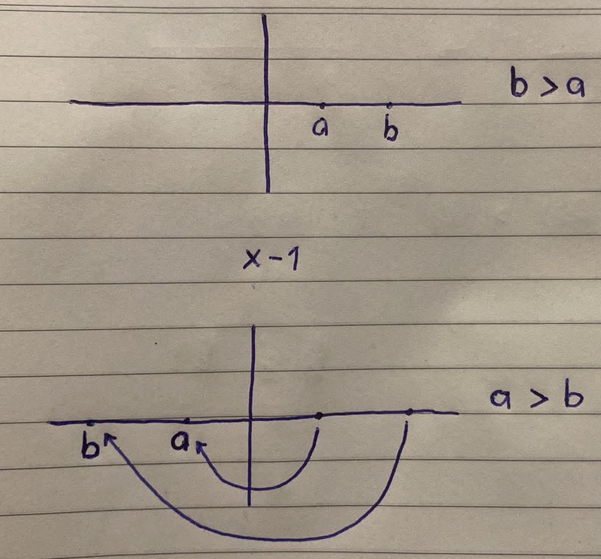
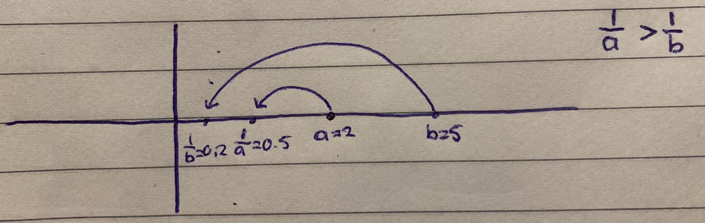
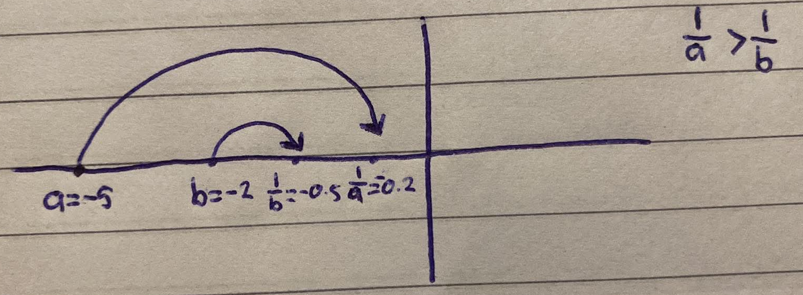
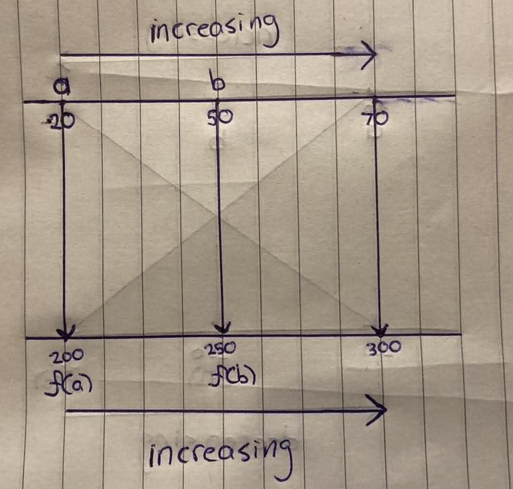
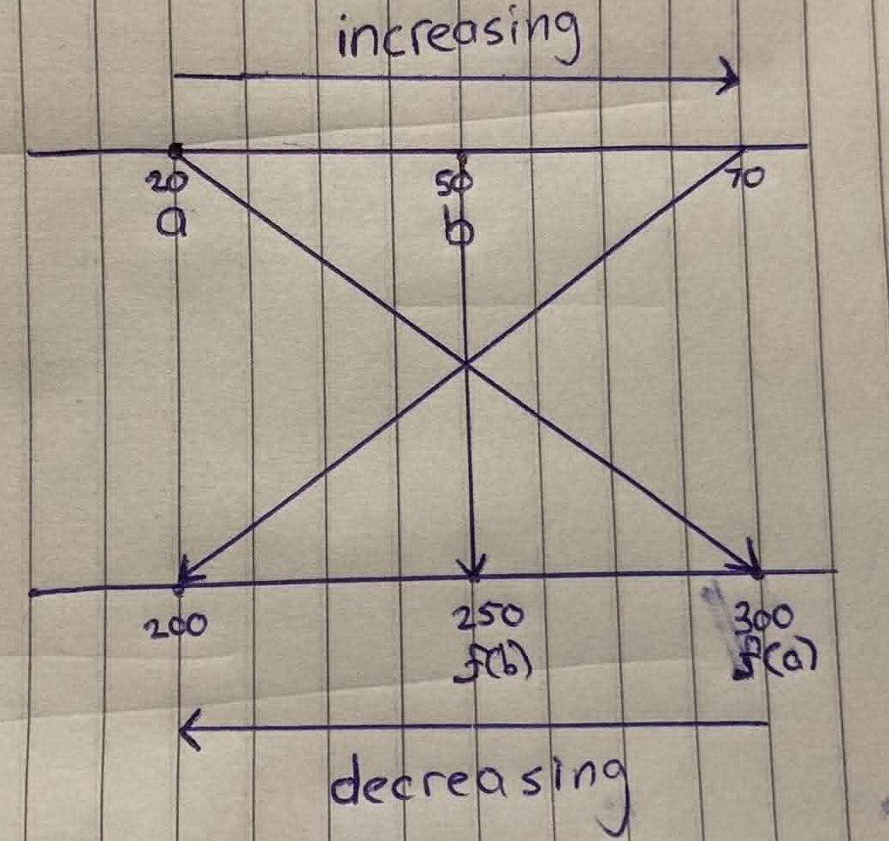

<div align='center'>
    <h1> Inequality Symbols </h1>
</div>

Inequality symbols express order relations on the real number line,

- $a < b$ means $a$ lies to the left of $b$.
- $a > b$ means $a$ lies to the right.

The symbols $\leq$ and $\geq$ include equality. These relations are fundamental to mathematics, appearing in algebra, calculus, optimization and real-world comparisons.

It is crucial to understand how these symbols behave and change when operations are applied to both sides. The answer depends on whether the operation **preserves** or **reverses** the order.

## Addition and Subtraction

For any real numbers, $a$, $b$ and $c$

- If $a < b$, then $a + c < b + c$
- If $a < b$, then $a - c < b - c$

Adding or subtracting the same value shifts both numbers equally on the number line without changing their relative positions. This holds for $\leq$ and $\geq$ too.

```math
\begin{aligned}
3 &< 7 \\
3 + 5 &< 7 + 5 \\
8 &< 12
\end{aligned}
```

## Multiplication and Division - Positive Number

If $a < b$ and $c > 0$, then

- $a \times c < b \times c$
- $\frac{a}{c} < \frac{b}{c}$

Positive multipliers or divisors stretch or compress distances but maintain direction. Both sides move away from zero in the same relative order.

```math
\begin{aligned}
2 &< 5 \\
2\times 4 &< 5\times 4 \\
8 &< 20
\end{aligned}
```

## Multiplication and Division - Negative Number

If $a < b$ and $c < 0$, then

- $a \times c > b \times c$
- $\frac{a}{c} > \frac{b}{c}$

Negative numbers flip positions across zero. Multiplying by a negative number flects both values over the origin, reversing left-right order.

Multiplying by a negative number does two things simultaneously,

1. It scales the number, like multiplication by a positive number.
2. It reflects the number line across zero.

<div align='center'>
    
</div>

```math
\begin{aligned}
3 &< 7 \\
3 \times -2 &> 7\times -2 \\
-6 &> -14
\end{aligned}
```

Always reverse the inequality symbol when multiplying or dividing by a negative number. Forgetting this is a common source of errors in solving inequalities.

## Reciprocals

The reciprocal function reverses inequalities,

- If $a > 0$, $b > 0$ and $a < b$ then $\frac{1}{a} > \frac{1}{b}$. Smaller positive numbers have larger reciprocals.

<div align='center'>
    
</div>

- If $a < 0$, $b < 0$ and $a < b$, then $\frac{1}{a} > \frac{1}{b}$

<div align='center'>
    
</div>

The function,

```math
f(x) = \frac{1}{x}
```

is strictly **decreasing** on $(-\infty, 0)$ and on $(0, -\infty)$. As $x$ increases, within each interval $\frac{1}{x}$ decreases.

## Increasing and Decreasing Functions

#### Increasing Function

An **increasing** function $f$ **preserves inequalities**. A function is increasing if,

```math
a < b \Rightarrow f(a) < f(b) \ \ \ \ \ \ \ \ \ \ \ (\text{or} \leq \text{for non-strict})
```
That is, when we increase the input values $a$ and $b$ that still satisfy $a < b$ we can observe that the output values $f(a)$ and $f(b)$ will be strictly **increasing** to satisfy $f(a) < f(b)$.

<div align='center'>
    
</div>


#### Decreasing Function

A **decreasing** function $f$ **reverses inequalities**. A function $f$ is decreasing if,

```math
a < b \Rightarrow f(a) > f(b) \ \ \ \ \ \ \ \ \ \ \ (\text{or} \leq \text{for non-strict})
```

That is, when we increase the input values $a$ and $b$ that still satisfy $a < b$ we can observe that the output values $f(a)  \ \text{and} \ f(b)$ will be strictly **decreasing** to satisfy $f(a) > f(b)$

<div align='center'>
    
</div>

#### Examples


1. $f(x) = x + 3$. 

This is an **increasing** function and therefore **preserves the equality**. That is,

```math
\begin{aligned}
2 &> 1 \\
f\left(2\right) &> f\left(1\right) \\
5 &> 4
\end{aligned}
```


- $f(x) = -2x$.

This is a **decreasing** function and therefore **changes the equality**. That is,

```math
\begin{aligned}
2 &> 1 \\
f\left(2\right) &< f\left(1\right) \\
-4 &< -2
\end{aligned}
```

- $f(x) = x^2$

This function is special as the equality preservation depends on the domain of which the number is in. Applying any operation is equivalent to composing with a function and checking whether that function is increasing or decreasing on the relveant domain.

 It is **increasing** between $(0, \infty]$ and therefore **preserves the equality**. That is,

```math
\begin{aligned}
5 &> 2 \\
f\left(5\right) &> f\left(2\right) \\
25 &> 4
\end{aligned}
```

It is **decreasing** between $[-\infty, 0)$ and therefore **reverses the equality**. That is,

```math
\begin{aligned}
-2 &> -5 \\
f\left(-2\right) &< f\left(-5\right) \\
4 &< 25
\end{aligned}
```