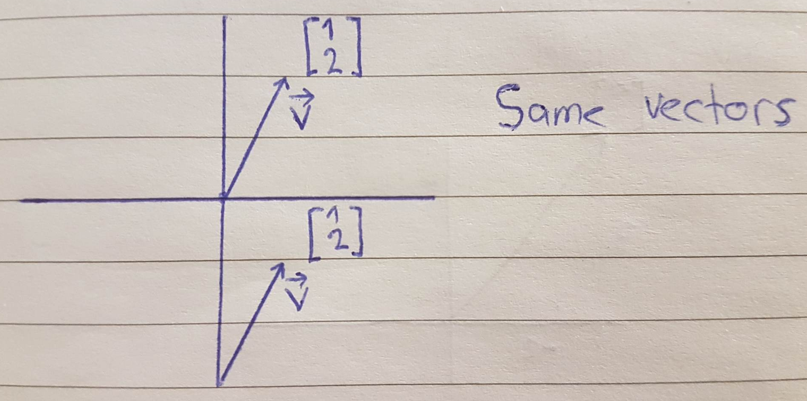

# Linear Algebra fundamentals

The fundamental, root-of-it-all building block for Linear Algebra is the vector.

What defines a given vector is its **length and the direction it is pointing in**, but as long as these two facts are the same you can move it all around and it is still **the same vector**.

In linear algebra, it is **almost always** the case that your vector will be rooted at the **origin**. The coordinates of a vector is a pair of numbers that basically give instructions for how to get from tail of that vector to the head (tip), generally represented as $\begin{bmatrix} X \\ Y \end{bmatrix}$.