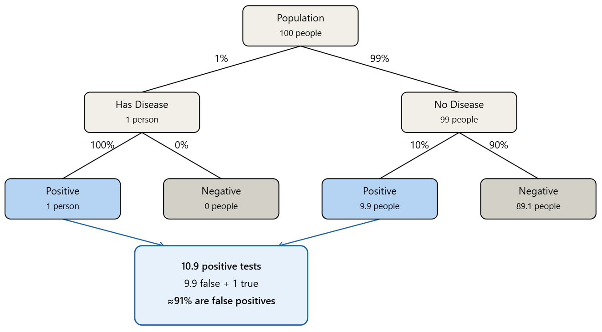
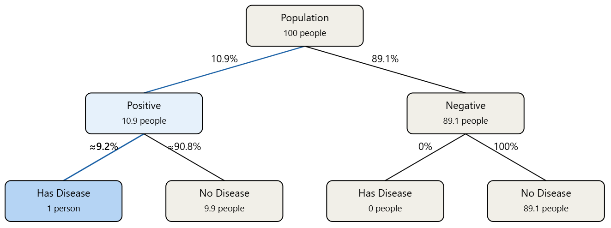
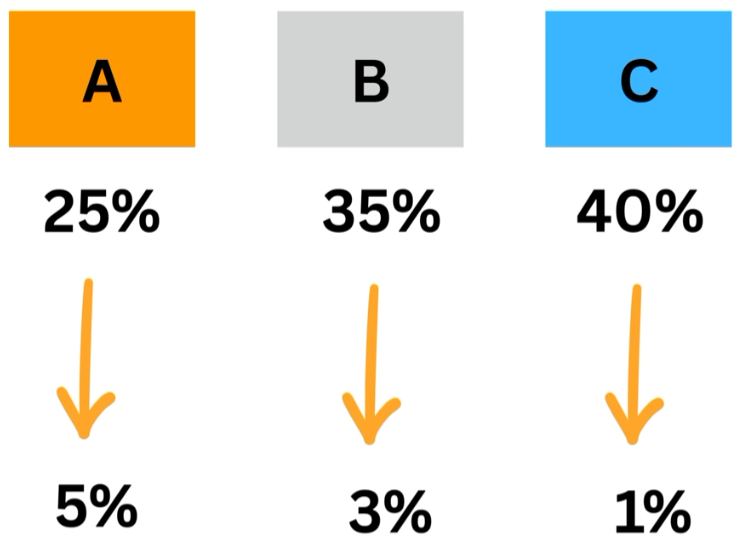
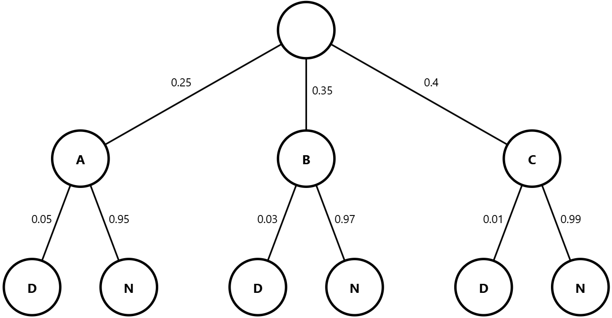
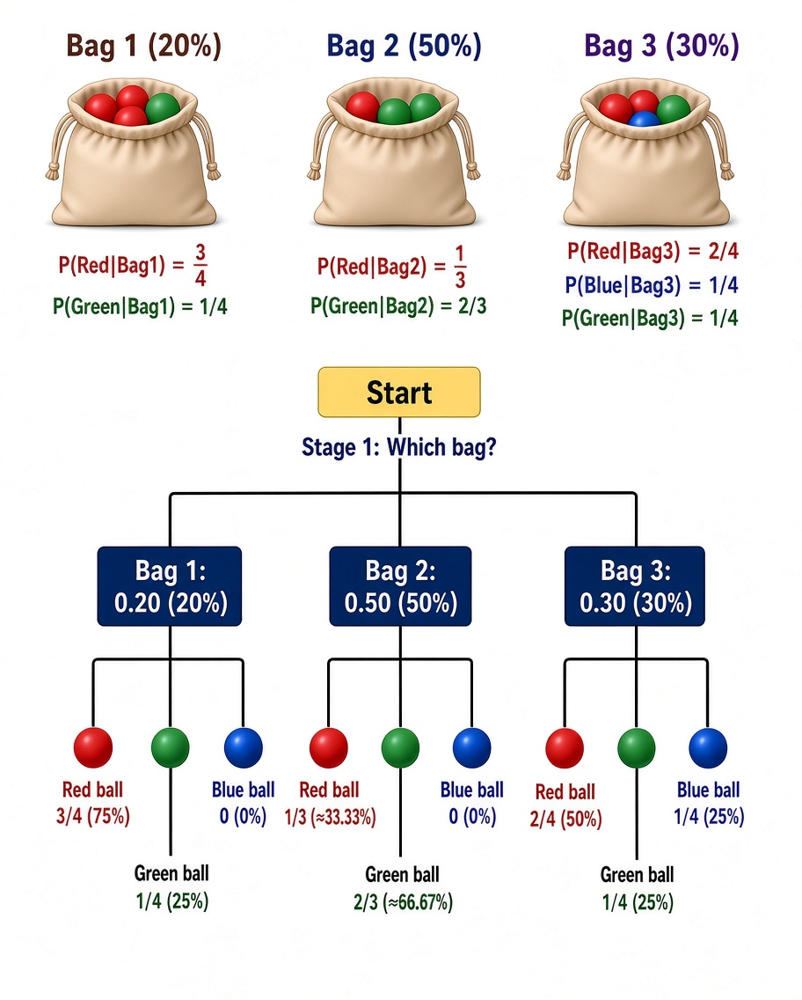
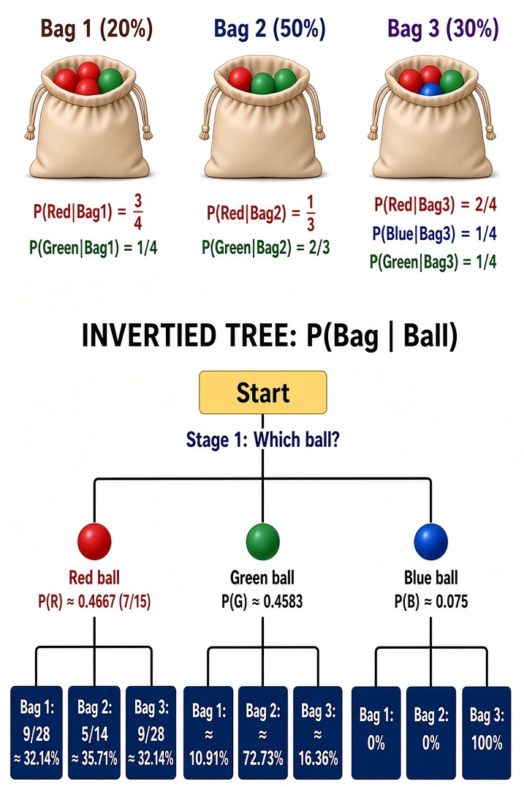

<div align='center'>
    <h1> Bayes Theorem </h1>
</div>

Bayes Theorem is a method for calculating a conditional probability when the conditional probability in the opposite direction is known. It allows us to determine $P(A \mid B)$, the probability of event $A$ given that event $B$ has occurred, using information about $P(B \mid A)$, the probability of $B$ given that $A$ has occurred.

The theorem is particularly useful when new evidence becomes available and we want to update the probability of a particular event or hypothesis. Rather than simply asking how likely some evidence is when a particular condition is true, Bayes Theorem allows us to ask the reverse question, **given that we have observed evidence, how likely is the original condition?**

Bayes Theorem follows directly from the definition of conditional probability. The conditional probability of $A$ given $B$ is

```math
P(A \mid B) = \frac{P(A) P(B \mid A)}{P(B)} = \frac{P(A \cap B)}{P(B)}
```

This can be rearranged to give,

```math
P(A \cap B) = P(B) P(A \mid B)
```

The same intersection can also be calculated by considering the probability of $B$ given $A$.

```math
P(A \cap B) = P(A)P(B \mid A)
```

Since both expressions represent the same probability $P(A \cap B)$, they must be equal.

```math
P(B) P(A \mid B) = P(A)P(B \mid A)
```

Rearranging gives Bayes Theorem,

```math
\boxed{P(A \mid B) = \frac{P(B \mid A)P(A)}{P(B)}}
```

The important feature of this equation is that it connects $P(A \mid B)$ with $P(B \mid A)$. These two probabilities should not be confused.

- $P(B \mid A)$ - What is the probability of $B$, given $A$?
- $P(A \mid B)$ - What is the probability of $A$, given $B$?

In general,

```math
P(A \mid B) \neq P(B \mid A)
```

Bayes Theorem provides a way to move from one direction to the other.

<div align='center'>
    <h1> Understanding Bayes Theorem </h1>
</div>

Bayes Theorem can be understood as a process of updating a probability when new evidence is observed. The probability $P(A)$ represents the initial probability of $A$, before considering evidence. This is sometimes called the **prior probability**. Here, "evidence" means information that we have observed and can use to update the probability.

The probability $P(B \mid A)$ describes how likely the evidence $B$ is when $A$ is true. The probability $P(B)$ represents the overall probability of observing $B$. After taking the evidence into account, $P(A \mid B)$ gives the updated probability of $A$, sometimes called the **posterior probability**.

The idea can therefore be thought of as,

```math
\boxed{\text{Prior probability} \rightarrow \text{Evidence} \rightarrow \text{Updated probability}}
```

A useful way to understand the denominator $P(B)$ is to consider all the different ways in which $B$ can occur. If $A$ and $A^c$, and each of these branches then separate into $B$ and $B^c$. Multiplying along a branch gives the probably of both events occurring. If we want $P(A \mid B)$, we consider only the branches that result in $B$ and determine what proportion of those outcomes came from the $A$ branch.

<div align='center'>
    <h1> Exercises </h1>
</div>

## Testing Positive for a Disease

Suppose **1% of a population has a disease**. A diagnostic test has the following properties:

- If a person **has the disease**, the test is always positive.
- If a person **does not have the disease**, the test is positive **10% of the time**.

A randomly selected person **tests positive**. What is the probability that they **actually have the disease?**

Let,

```math
\begin{aligned}
A &= \{\text{Person has the disease}\} \\
B &= \{\text{Person tests positive}\} \\
\end{aligned}
```

We want to calculate

```math
P(A \mid B)
```

the probability that the person has the disease **given that they tested positive**.

**Tip** - For these questions, make sure to **read it carefully**. Drawing the probability tree below creates two leafs, representing two possibilities of being positive. These represent $P(B \mid A)$ and $P(B \mid A^c)$. Do not get these confused with the requested probability of $P(A \mid B)$. $P(B \mid A)$ is the $100\%$ and $P(B \mid A^c)$ is the $10\%$, both readable directly, unlike $P(A \mid B)$ which runs backward against the tree and has to be calculated.

#### 1 - Construct the Probability Tree

The tree begins with $A$, followed by $B$. The first level gives the probabilities of having or not having the disease,

```math
\begin{aligned}
P(A) &= 0.01 \\
P(A^c) &= 0.99
\end{aligned}
```

The second level gives the conditional probabilities of the test result

```math
P(B \mid A) = 1
```

because the test always detects the disease and

```math
P(B^c \mid A) = 0
```

For someone without the disease,

```math
P(B \mid A^c) = 0.10
```

because $10\%$ of these people receive a false positive, while

```math
P(B^c \mid A^c) = 0.90
```

The tree is therefore,

<div align='center'>
    
</div>

#### 2 - Find the Probability of a Positive Test

There are two ways for a person to test positive.

- They **have the disease** and test positive.
- They **do not have the disease** but receive a false positive.

Therefore,

```math
P(B) = P(A \cap B) + P(A^c \cap B)
```

Using the tree,

```math
\begin{aligned}
P(B) &= 0.01 \cdot 1 + 0.99 \cdot 0.1  \\
     &= 0.01 + 0.099 \\
     &= 0.109
\end{aligned}
```

Thus, $10.9\%$ of the population would be expected to receive a positive test.

#### 3 - Calculate $P(A \mid B)$

We know the person tested positive, so we are interested only in the positive $B$ branches. Conditional probability gives

```math
\begin{aligned}
P(A \mid B) &= \frac{P(A \cap B)}{P(B)} \\
            &= \frac{0.01}{0.109} \\
            &\approx 0.0917
\end{aligned}
```

Therefore,

```math
P(A \mid B) \approx 9.17\%
```

This means that for every 100 people

- About 1 has the disease and you will receive **1 true positive**.

- About 99 do not have the disease and you will receive **9.9 false positives**.

So among the approximately 10.9 people who test positive, only 1 actually has the disease.

```math
\frac{1}{10.9} \approx 9.17\%
```

Thus, a positive test result means there is approximately a $9.17\%$ chance that the person actually has the disease. Although this is the complete answer for the question, it is crucial to understand that this now provides enough information to visualuze $P(A \mid B)$.

<div align='center'>
    
</div>

## Error from A Particular Machine

Suppose we have 3 different machines that build a specific product.

- $25\%$ of balls come from machine $A$.
- $35\%$ of balls come from machine $B$.
- $40\%$ of balls come from machine $C$.

From each of these machine, they have a chance of making the product defective.

- $5\%$ of balls from machine $A$ are defective.
- $3\%$ of balls from machine $B$ are defective.
- $1\%$ of balls from machine $C$ are defective.

<div align='center'>
    
</div>

**Given a defective product, what is the probability it came from $C$?**

Before beginning the question we define multiple events,

```math
\begin{aligned}
A &= \text{Product from machine } A \\
B &= \text{Product from machine } B \\
C &= \text{Product from machine } C \\
D &= \text{Product is defective} \\
\end{aligned}
```

Therefore, we need to find $P(C \mid D)$.

#### 1 - Construct the Probability Tree

<div align='center'>
    
</div>

#### 2 - Find the Probability of a Defective Product

There are 3 ways for a product to be defective,

```math
P(D) = P(A \cap D) + P(B \cap D) + P(C \cap D)
```

Using the tree,

```math
\begin{aligned}
P(D) &= 0.25 \cdot  0.05 + 0.35 \cdot 0.03 + 0.4 \cdot 0.01 \\
     &= 0.0125 + 0.0105 + 0.004 \\
     &= 0.027
\end{aligned}
```

So, $2.7\%$ of all products are defective.

#### 3. Calculate $P(C \mid D)$

We know that the product is defective, so we want to know **what proportion of defective products came from machine $C$**.

```math
P(C \mid D) = \frac{P(C \cap D)}{P(D)}
```

From the tree,

```math
P(C \cap D) = 0.4 \cdot 0.01 = 0.004
```

Therefore,

```math
P(C \mid D) = \frac{0.004}{0.027} = 0.1481 = 14.81\%
```

This follows,

```math
P(C \mid D) = 14.81\%
```

## Which Bag the Red Ball is From

Provided 3 bags,

- Bag $1$ has 3 red balls and 1 green ball.
- Bag $2$ has 1 red ball and 2 green balls.
- Bag $3$ has 2 red balls, 1 green ball and 1 blue ball.

We first define several events,

```math
\begin{aligned}
B_1 &= \{ \text{Ball came from bag 1} \} \\
B_2 &= \{ \text{Ball came from bag 2} \} \\
B_3 &= \{ \text{Ball came from bag 3} \} \\
R &= \{ \text{Ball is red} \}
\end{aligned}
```

**Randomly given a red ball, what is the probability it came from bag $2$?**

Hence, we want to calculate

```math
P( B_2 \mid R)
```

### 1 - Construct the Probability Tree

<div align='center'>
    
</div>

### 2 - Find the Probability of Getting a Red Ball

There are 3 ways to get a red ball,

```math
\begin{aligned}
P(R) &= P(B_1 \cap R) + P(B_2 \cap R) + P(B_3 \cap R) \\
     &= 0.2 \cdot \frac{3}{4} + 0.5 \cdot \frac{1}{3} + 0.3 \cdot \frac{3}{4} \\
     &= 0.15 + 0.1667 + 0.15 \\
     &= 0.4667
\end{aligned}
```

### 3 - Calculate $P(B_2 \mid R)$

We know the ball is red, so we want to know the probability that it came from bag $2$.

```math
P(B_2 \mid R) = \frac{P(B_2 \cap R)}{P(R)}
```

The probability of **Bag $2$ and Red** is,

```math
\begin{aligned}
P(B_2 \cap R) &= P(B_2) \cdot P(R \mid B_2) \\
              &= 0.5 \cdot \frac{1}{3} \\
              &= \frac{1}{6} \\
              &\approx 0.1667
\end{aligned}
```

Therefore,

```math
\begin{aligned}
P(B_2 \mid R) &= \frac{0.1667}{0.4667} \\
              &\approx 0.3571
\end{aligned}
```

Giving us,

```math
P( B_2 \mid R) = 35.71\%
```

So, **given that the ball is red, there is a $35.71\%$ probability that it came from Bag $2$**.

**Extra** - Now that we have calculated the probability $P(B_2 \mid R)$ we can visualize this in a tree.

<div align='center'>
    
</div>

### 1 - Probability of Drawing a Red Ball

```math
\begin{aligned}
P(R) &= P(R \mid B_1) \cdot P(B_1) + P(R \mid B_2) \cdot P(B_2) + P(R \mid B_3) \cdot P(B_3) \\
     &= \frac{3}{4} \cdot 0.2 + \frac{1}{3} \cdot 0.5 + \frac{2}{4} \cdot 0.3 \\
     &= 0.15 + 0.1666 + 0.15 \\
     &= 0.4666 \\
     &= \frac{7}{15}
\end{aligned}
```

### 2 - Probability of Drawing a Green Ball

```math
\begin{aligned}
P(G) &= P(G \mid B_1) \cdot P(B_1) + P(G \mid B_2) \cdot P(B_2) + P(G \mid B_3) \cdot P(B_3) \\
     &=  \frac{1}{4} \cdot 0.2 + \frac{2}{3} \cdot 0.5 + \frac{1}{4} \cdot 0.3 \\
     &= 0.05 + 0.3333 + 0.075 \\
     &=  0.4583 \\
\end{aligned}
```

### 3 - Probability of Drawing a Blue Ball

```math
\begin{aligned}
P(B) &= P(B \mid B_1) \cdot P(B_1) + P(B \mid B_2) \cdot P(B_2) + P(B \mid B_3) \cdot P(B_3) \\
     &= 0 \cdot 0.2 + 0 \cdot 0.5 + \frac{1}{4} \cdot 0.3  \\
     &= 0.075 \\
\end{aligned}
```

### 4 - Calculate $P(B_x \mid G)$

##### Joint probabilities first

```math
\begin{align*}
P(B_1 \cap G) &= P(G \mid B_1)\,P(B_1) = \tfrac14 \times 0.20 = 0.05 = \tfrac{1}{20} \\[6pt]
P(B_2 \cap G) &= P(G \mid B_2)\,P(B_2) = \tfrac23 \times 0.50 = \tfrac13 \approx 0.3333 \\[6pt]
P(B_3 \cap G) &= P(G \mid B_3)\,P(B_3) = \tfrac14 \times 0.30 = 0.075 = \tfrac{3}{40}
\end{align*}
```

##### Total probability of green

```math
P(G) = 0.05 + \tfrac13 + 0.075 = 0.458\overline{3}
```

##### Posterior probabilities

**1. \( P(B_1 \mid G) \)**

```math
P(B_1 \mid G) = \dfrac{P(B_1 \cap G)}{P(G)} = \dfrac{1/20}{0.4583} = \dfrac{1}{20} \times \dfrac{1}{0.4583} \approx 0.1091 \ (10.91\%)
```

**2. \( P(B_2 \mid G) \)**

```math
P(B_2 \mid G) = \dfrac{P(B_2 \cap G)}{P(G)} = \dfrac{1/3}{0.4583} = \dfrac{1}{3} \times \dfrac{1}{0.4583} \approx 0.7273 \ (72.73\%)
```

**3. \( P(B_3 \mid G) \)**

```math
P(B_3 \mid G) = \dfrac{P(B_3 \cap G)}{P(G)} = \dfrac{3/40}{0.4583} = \dfrac{3}{40} \times \dfrac{1}{0.4583} \approx 0.1636 \ (16.36\%)
```
