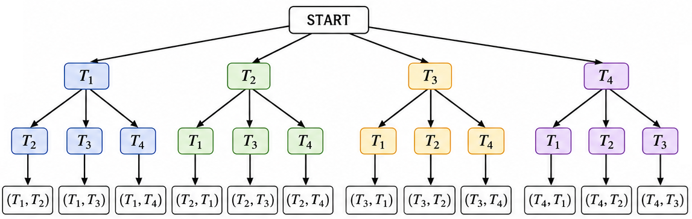
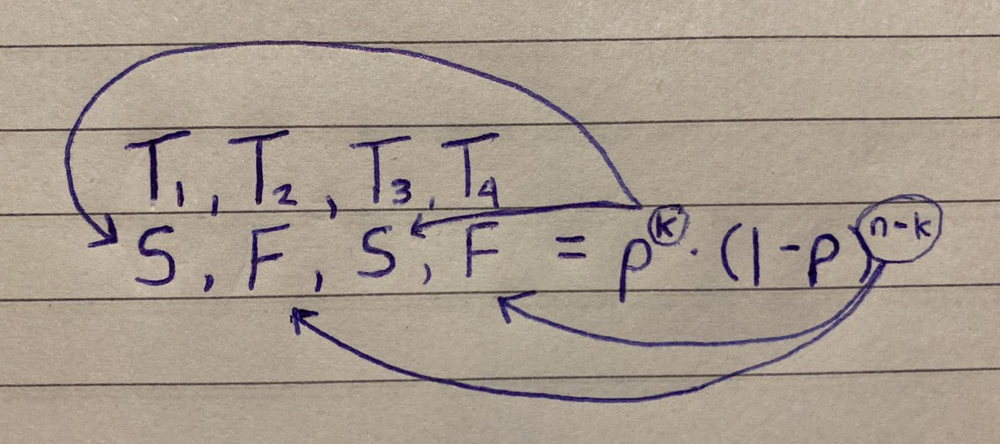
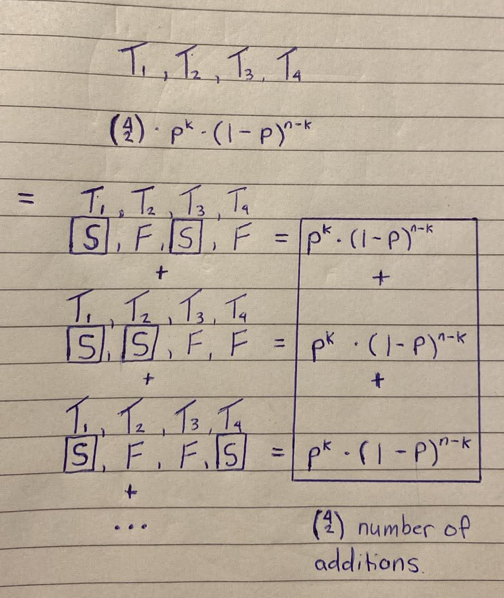

<div align='center'>
    <h1> Binomial Probability </h1>
</div>

Probability is the mathematical study of uncertainty. While some events only occur once, many real-world situations involve **repeating the same random experiment many times**.

- Every lottery ticket purchased
- Every manufactured product inspected
- Every medical test performed
- Every monster defeated in a video game

<p>The central question changes from</p>

<div style="margin-left:2em;">

What is the **probability of one event**?

</div>

<p>to</p>

<div style="margin-left:2em;">

What is the probability of observing a **particular number of successes after many independent attempts**?

</div>

This is precisely the purpose of **binomial probability**. Binomial probability refers to the probability of exact successes on repeated trials in an experiment which has **two possible outcomes**. Binomial probability extends basic probability into repeated trials. Rather than calculating the chance of a single success, it calculates the probability of obtaining

```math
\begin{aligned}
\text{Exactly} &\qquad =  \qquad P(X = x)\\
\text{At least} &\qquad \geq \qquad P(X \geq x) \\
\text{At most} &\qquad \leq \qquad P(X \leq x) \\
\end{aligned}
```

for a specified number of successes after a fixed number of independent trials. A classic occurrence of binomial probability is in video games where monster kills have a chance of dropping a specific item. A classic gaming example comes from the Corrupted Gauntlet in Old School Runescape, where the Enhanced Crystal Seed has an approximate drop probability of

```math
p = \frac{1}{400} = 0.0025
```

Every completed Corrupted Gauntlet run can therefore be viewed as one independent trial with only two possible outcomes

- **Success** - The enhanced crystal seed drops

- **Failure** - The enhanced crystal seed **does not** drop

Because every completion has the same probability of success and does not influence future completions, this satisfies the conditions required for a binomial experiment.

<div align='center'>
    <h1> Essential Terminology </h1>
</div>

- **Trial** - One complete, individually identifiable performance of one experiment. **Each trial produces one outcome**, such as obtaining a drop or not

- **Sample Point** - $n$ outcomes strung together in trial order form one sample point. The full set of sample points is the sample space, $\binom{n}{k}$.

- **Outcome** - The result a single trial produces. In a binomial experiment, every trial produces **exactly one of two** outcomes. Traditionally labelled $S$ (success) and $F$ (failure).

- **Success** - The outcome being counted, not necessarily a desirable one. In the context of video game loot, it means the desired loot **is received**.

- **Failure** - The complementary outcome to success. In the context of video game loot, it means the desired loot **is not received**.

- **$n$** - The number of **trials**. This is the fixed, predetermined total number of trials in the experiment.

- **$k$** - The **number of successes**. This is the specific number of successes whose probability is being calculated.

- **$p$** - The **probability of success**. The fixed probability that any single trial results in success.

- **$q$** - Calculated as $1 -p$. This is the probability of failure. The fixed probability that any single trial results in failure.

- **Independence** - The requirement that the outcome of one trial **has no effect on the probability of any other trial**. $19$ consecutive failures do not raise or lower the probability of success on the $12^{th}$ trial.

- **Binomial Probability** - Binomial probability comes from two Latin roots. "bi" - 2 and "nomial" - names or terms. Binomial probability has its name because each trial has exactly two possible outcomes.

- **Binomail Coefficient** - The word coefficient essentially means a number that tells you how many times something occurs or how much of something there is. A binomial coefficient is the number $\binom{n}{k}$ which tells us how many ways we can choose $k$ items from $n$ items.

<div align='center'>
    <h1> The Four Requirements of a Binomial Experiment </h1>
</div>

A probability experiment follows the binomial model when only four conditions are satisfied.

#### 1 - A Fixed Number of Trials

The total number of repetitions must be predetermined and fixed. For
#### 2 - Only Two Possible Outcomes

Every trial must produce one of only two outcomes. These are traditionally labelled

- **$S$** - Success
- **$F$** - Failure

Importantly, **success means the event we are interested in**, not necessarily a desirable outcome. For the Corrupted Gauntlet,

- **Success** - Enhanced crystal seed drop
- **Failure** - No enhanced crystal seed drop

#### 3 - Constant Probability

Every trial must have exactly the same probability of success. For the enhanced crystal seed

```math
p = \frac{1}{400} = 0.0025
```

Therefore, the probability of failure is

```math
q = 1 - p = \frac{399}{400} = 0.9975
```

#### 4 - Independent Trials

The outcome of one trial **must not change the probability of another**. Receiving no enhanced crystal seed in $199$ completions **does not make the $200^{th}$ completion any more likely to drop one**. Likewise, receiving one on your first completion does not reduce the chance of receiving another immediately afterwards. Each completion remains

```math
\frac{1}{400}
```

This independence is one of the most misunderstood ideas in probability because people often expect "luck" to balance out. In reality, probability has no memory.

<div align='center'>
    <h1> The Binomial Distribution </h1>
</div>

Suppose

- There are $n$ independent trials
- Each trial succeeds with probability $p$
- We wish to know the probability of obtaining exactly $k$ successes
- $X$ is a random variable
- $P(X = k)$ means the probability that exactly $k$ successes occur

The probability is given by the **binomial distribution**

```math
P(X = k) = \binom{n}{k}p^k(1-p)^{n - k}
```

Each term can be analyzed.

```math
P(X = k) = \underbrace{\binom{n}{k}}_{\text{counting}} \times \underbrace{p^k(1-p)^{n-k}}_{\text{probability}}
```

Where

```math
\binom{n}{k}
```

counts **how many different arrangements** of the successes are possible.

```math
p^k
```

calculates the probability that those $k$ successes occur.

```math
(1 - p)^{n - k}
```

calculates the probability that every remaining trial is a failure. The multiplication rule combines these probabilities because every arrangement requires all of those independent events to occur simultaneously.

<div align='center'> 
    <h1> Why the Binomial Coefficient Counts Trials, Not Outcomes </h1>
</div>

The binomial coefficient is often introduced as part of the formula

```math
P(X = k) = \binom{n}{k} p^k (1-p)^{n - k}
```

It is tempting to think that $\binom{n}{k}$ must somehow be a combination of the two possible outcomes, $S$ and $SF. After all, a binomial trial only produces outcomes. However, this is not what the combination formula is doing. **The combination is performed on the trials, not on the outcomes**. This becomes clearer by connecting the binomial coefficient directly to the familiar derivation of combinations from permutations.

##### 1 - The Trials Are Distinct Objects

Consider four completions of the Corrupted Gauntlet. **Before considering their outcomes**, we identify the four trials as,

```math
T_1, \quad T_2, \quad T_3, \quad T_4
```

These are four distinct objects, just as $A, B, C, D$ are four distinct objects in an ordinary permutations and combinations problem. Suppose we want to choose two of these trials. We can first construct the permutation tree. The first position can contain any of the four trials and the second position can contain any of the remaining three.

<div align='center'>
    
</div>

This gives,

```math
_4 P _2 = 4 \times 3 = 12
```

ordered selections. However, if we only care which two trials were selected the, their order is irrelevant. For example,

```math
T_1, T_2 = T_2, T1
```

represent the same pair of trials. Every pair therefore appears $2!$ times in the permutation tree. Dividing by $2!$ removes repeated orderings.

```math
\binom{4}{2} = \frac{_4 P _ 2}{2!} = \frac{4 \times 3}{2!} = 6
```

The six combinations are,

```math
\begin{aligned}
\{T_1, T_2\} \\
\{T_1, T_3\} \\
\{T_1, T_4\} \\
\{T_2, T_3\} \\
\{T_2, T_4\} \\
 \{T_3, T_4\}
\end{aligned}
```

This is exactly the same permutation-to-combination reasoning used with $A, B, C, D$. The only difference is which the objects represent.

- With $A, B, C, D$, we are choosing objects.
- With $T_1, T_2, T_3, T_4$, we are choosing **trial positions**.

##### 2 - Now Assign the Outcomes

**Only after choosing the trial positions do we introduce the outcomes**. Suppose we want exactly two successes We can choose the selected trials to be the successful trials. Every trial inside the selected set is labelled to $S$, while every trial outside the set is labelled $F$. For example,

```math
\{ T_1, T_3\}
```

means that trials $1$ and $3$ are successful.

```math
\begin{array}{cccc}
T_1 & T_2 & T_3 & T_4 \\
S   & F   & S   & F
\end{array}
```

which produces the **outcome sequence**

```math
SFSF
```

The six combinations of trial positions therefore produce six different outcome sequences

```math
\begin{aligned}
\{ T_1, T_2 \} &\rightarrow SSFF \\
\{ T_1, T_3 \} &\rightarrow SFSF \\
\{ T_1, T_4 \} &\rightarrow SFFS \\
\{ T_2, T_3 \} &\rightarrow FSSF \\
\{ T_2, T_4 \} &\rightarrow FSFS \\
\{ T_3, T_4 \} &\rightarrow FFSS \\
\end{aligned}
```

Each sequence contains exactly $2$ successes and $2$ failures. Therefore,

```math
\binom{4}{2} = 6
```

is counting the **six ways to choose which two trials are successful**. It is not counting combinations of the symbols $S$ and $F$.

##### 3 - Why the Outcome Sequences Are Different

At first glance, the sequences

```math
SSFF, \quad SFSF, \quad SFFS
```

all contain the same number of $S$ and $F$. It may therefore seem that they should represent the same combination. This would be true if we were simply selecting objects from a collection. For example,

```math
ABC \quad \text{and} \quad ACB
```

represent the same combination because they both select the same three objects,

```math
\{ A, B, C \}
```

The binomial situation is different because the objects being counted are the **trial positions**. The sequences

```math
SSFF \quad \text{and} \quad SFSF
```

represent different outcomes because the successes occurred on different trials. Thus, although both sequences contain two successes and two failures, they correspond to different selection of trial positions. This is the key distinction,

- **Outcomes** - Tells us **what** happened.
- **Trial position** - Tells us **where** it happened.

The combination formula is counted the latter.

##### 4 - The Same Process for Every Value of $k$

The same reasoning applies to every possible number of successes. For four trials, consider

```math
\binom{4}{0}
```

There is one way to choose zero successful trials,

```math
\{ \}
```

which produces $FFFF$. Therefore, $\binom{4}{0} = 1$.

For one success,

```math
\binom{4}{1} = 4
```

We choose which one of the four trials is successful,

```math
\begin{aligned}
\{ T_1 \} &\rightarrow SFFF \\
\{ T_2 \} &\rightarrow FSFF \\
\{ T_3 \} &\rightarrow FFSF \\
\{ T_4 \} &\rightarrow FFFS \\
\end{aligned}
```

For two successes,

```math
\binom{4}{2} = 6
```

giving

```math
\begin{aligned}
\{ T_1, T_2 \} &\rightarrow SSFF \\
\{ T_1, T_3 \} &\rightarrow SFSF \\
\{ T_1, T_4 \} &\rightarrow SFFS \\
\{ T_2, T_3 \} &\rightarrow FSSF \\
\{ T_2, T_4 \} &\rightarrow FSFS \\
\{ T_3, T_4 \} &\rightarrow FFSS \\
\end{aligned}
```

<div align='center'>
    
</div>

<div align='center'>
    
</div>

For three successes,

```math
\binom{4}{3} = 4
```

giving

```math
\begin{aligned}
\{ T_1, T_2, T_3 \} &\rightarrow SSSF \\
\{ T_1, T_2, T_4 \} &\rightarrow SSFS \\
\{ T_1, T_3, T_4 \} &\rightarrow SFSS \\
\{ T_2, T_3, T_4 \} &\rightarrow FSSS \\
\end{aligned}
```

Finally,

```math
\binom{4}{4} = 1
```

because there is only one way to choose all four trials as successful.

```math
\{ T_1, T_2, T_3, T_4 \} = 1
```

These numbers represent the number of possible outcome sequences containing exactly $k$ successes.

##### 5 - Connecting This to the Binomial Formula

We can now connect this directly to the binomial probability formula,

```math
P(X = k) = \binom{n}{k} \cdot p^k(1-p)^{n-k}
```

The combination component,

```math
\binom{n}{k}
```

counts the number of ways to choose which $k$ of the $n$ trial positions are successes. Once those positions have been chosen, **the remaining $n-k$ positions are failures**. For any one resulting sequence, there are $k$ successes and $n-k$ failures. Its probability is therefore

```math
p^k(1-p)^{n-k}
```

Since there are

```math
\binom{n}{k}
```

different sequences containing exactly $k$ successes, we multiply

```math
\underbrace{\binom{n}{k}}_{\text{number of choices of successful trials}} \cdot 
\underbrace{p^k(1-p)^{n-k}}_{\text{probability of each sequence}}
```

giving

```math
P(X = k) = \binom{n}{k} \cdot p^k(1-p)^{n-k}
```

The important point is that the combination formula has not changed. It is still the same formula derived from permutations,

```math
\binom{n}{k}
=
\frac{{}_nP_k}{k!}
=
\frac{n!}{k!(n-k)!}
```

What has changed is what the $n$ objects represent. In an ordinary combinations problem, the $n$ objects might be

```math
A,B,C,D
```

In a binomial probability problem, the $n$ objects are the distinct trial positions:

```math
T_1,T_2,T_3,\ldots,T_n
```

We choose $k$ of those trial positions and designate them as successes. The resulting selection then corresponds to one particular sequence in the probability tree. Thus the connection can be summarised as,

```math
\begin{array}{c}
\text{Permute the distinct trial positions} \\
\downarrow \\
\text{Remove ordering} \\
\downarrow \\
\text{Choose } k \text{ trial positions} \\
\downarrow \\
\text{Assign } S \text{ to those positions} \\
\downarrow \\
\text{Obtain an outcome sequence}
\end{array}
```

The binomial coefficient therefore provides the combinatorail weight, it fells us how many different probability-tree paths contain exactly $K$ successes.


<div align='center'>
    <h1> Exercises </h1>
</div>

These exercises will be using the Corrupted Gauntlet which has,

- **$p$** = $\frac{1}{400}$ to receivie the enhanced crystal seed
- **$q$** = $\frac{399}{400}$ to **not** receive the enhanced crystal seed. example
- $200$ Corrupted Gauntlet completions (trials)

#### Example 1 - No Drop After 200 Completions

```math
\begin{aligned}
n &= 200 \\
k &= 0
\end{aligned}
```

The binomial formula becomes

```math
P(X = 0) = q^{200} = \left( \frac{399}{400} \right)^{200}
```

This calculation represents $200$ consecutive failures. Evaluating,

```math
P(X = 0) \approx 0.6058
```

Therefore, there is approximately a $60.6\%$ probability of receiving no enhanced crystal seed after $200$ Corrupted Gauntlet completions.

#### Example 2 - Exactly 1 Drop After 200 Completions

```math
\begin{aligned}
n &= 200 \\
k &= 1
\end{aligned}
```

The probability now becomes calculating the number of sample points that have exactly $1$ drop ($S$). The probability becomes

```math
P( X = 1 ) = \binom{200}{1} \cdot p^1q^{399}
```

Since

```math
\binom{200}{1} = 200
```

The probability becomes,

```math
200 \cdot \frac{399}{400} \cdot \left( \frac{1}{400} \right)^{199} \approx 0.30383
```

Which evaluates to

```math
P(X = 1) \approx 0.3
```

Therefore, there is approximately a $30.4\%$ probability of obtaining **exactly one** enhanced crystal see after $200$ completions. Notice how the combination counts every possible position where that single drop could occur.

#### Example 3 - At Least One Drop After 200 Completions

The phrase "at least one" means

- One
- Two
- Three
- ...

Rather than adding every possible probability individually, it is much easier to use the complement. The complement of "at least one" is no drops. Therefore,

```math
P(X \geq 1) = 1 - P(X = 0)
```

Substituting the previous result,

```math
P(X \geq 1) = 1 - q^{200} = 1 - \left( \frac{399}{400} \right)^{200}
```

Evaluating

```math
P(X \geq 1) \approx 0.3942
```

Therefore, there is approximately $39.4\%$ probability of obtained **at least one** enhanced crystal seed within $200$ completions. This illustrates an important principle in probability, when a desired event includes many possible outcomes, calculating its complement is often much simpler than summing them individually.

#### Example 4 - Alteast Two Drops After 200 Completions

The phrase "at least two" includes

- Two
- Three
- Four
- ...

Again, adding all of these probabilities individually would be inefficient. Instead, remove the outcomes that are **not included**. Those are,

1. $0$ drops
2. Exactly $1$ drop

Therefore,

```math
\begin{aligned}
P(X \geq 2) &= 1 - P(X = 1) - P(X = 0) \\
            &= 1 - \binom{200}{1} p^1 q^{199} - q^{200} \\
            &= 1 - 0.3 - 0.605
\end{aligned}
```

Evaluating,

```math
P(X \geq 2) \approx 0.095
```

Therefore, there is approximately $9.1\%$ probability of obtaining 2 or more enhanced crystal seeds within 200 completions.
