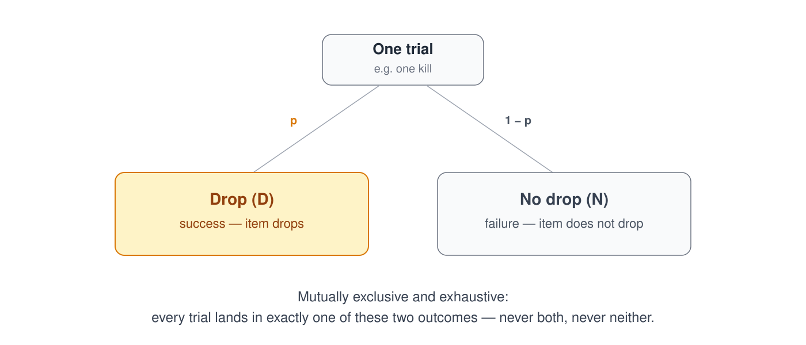
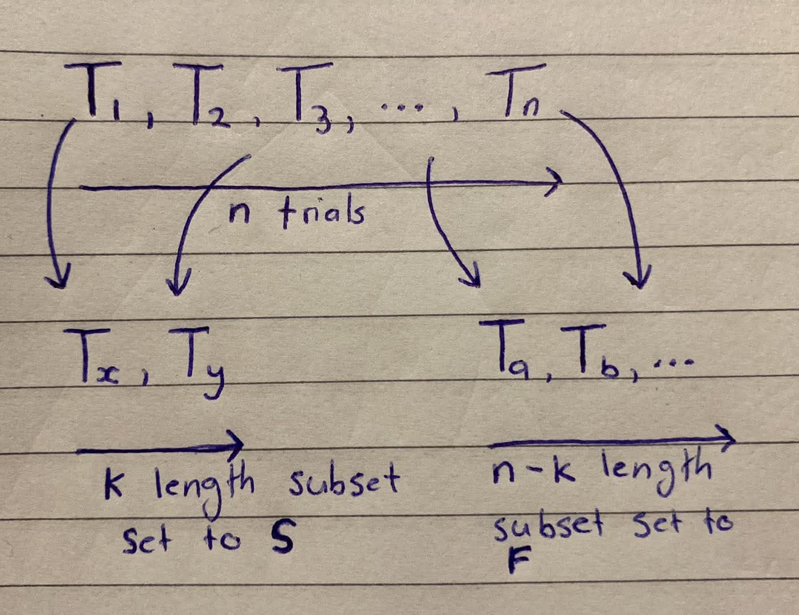
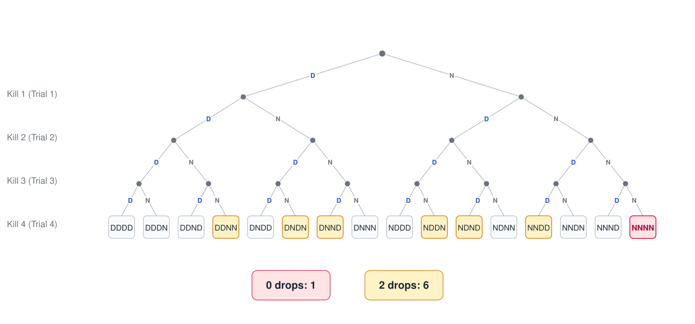

<div align='center'>
    <h1> Binomial Probability </h1>
</div>

Probability is the mathematical study of uncertainty. While some events only occur once, many real-world situations involve **repeating the same random experiment many times**.

- Every lottery ticket purchased
- Every manufactured product inspected
- Every medical test performed
- Every monster defeated in a video game

<p>The central question changes from</p>

<div style="margin-left:2em;">

What is the **probability of one event**?

</div>

<p>to</p>

<div style="margin-left:2em;">

What is the probability of observing a **particular number of successes after many independent attempts**?

</div>

This is precisely the purpose of **binomial probability**. Binomial probability refers to the probability of exact successes on repeated trials in an experiment which has **two possible outcomes**. Binomial probability extends basic probability into repeated trials. Rather than calculating the chance of a single success, it calculates the probability of obtaining

```math
\begin{aligned}
\text{Exactly} &\qquad =  \qquad P(X = x)\\
\text{At least} &\qquad \geq \qquad P(X \geq x) \\
\text{At most} &\qquad \leq \qquad P(X \leq x) \\
\end{aligned}
```

for a specified number of successes after a fixed number of independent trials. A classicc occurrence of binomial probability is in video games where monster kills have a chance of dropping a specific item. A classic gaming example comes from the Corrupted Gauntlet in Old School Runescape, where the Enhanced Crystal Seed has an approximate drop probability of

```math
p = \frac{1}{400} = 0.0025
```

Every completed Corrupted Gauntlet run can therefore be viewed as one independent trial with only two possible outcomes

- **Success** - The enhanced crystal seed drops

- **Failure** - The enhanced crystal seed **does not** drop

Because every completion has the same probability of success and does not influence future completions, this satisfies the conditions required for a binomial experiment.

<div align='center'>
    <h1> Essential Terminology </h1>
</div>

- **Trial** - One complete, individually identifiable performance of one experiment. **Each trial produces one outcome**, such as obtaining a drop or not

- **Sample Point** - $n$ outcomes strung together in trial order form one sample point. The full set of sample points is the sample space, $\binom{n}{k}$.

- **Outcome** - The result a single trial produces. In a binomial experiment, every trial produces **exactly one of two** outcomes. Traditionally labelled $S$ (success) and $F$ (failure).

- **Success** - The outcome being counted, not necessarily a desirable one. In the context of video game loot, it means the desired loot **is received**.

- **Failure** - The complementary outcome to success. In the context of video game loot, it means the desired loot **is not received**.

- **$n$** - The number of **trials**. This is the fixed, predetermined total number of trials in the experiment.

- **$k$** - The **number of successes**. This is the specific number of successes whose probability is being calculated.

- **$p$** - The **probability of success**. The fixed probability that any single trial results in success.

- **$q$** - Calculated as $1 -p$. This is the probability of failure. The fixed probability that any single trial results in failure.

- **Independence** - The requirement that the outcome of one trial **has no effect on the probability of any other trial**. $19$ consecutive failures do not raise or lower the probability of success on the $12^{th}$ trial.

- **Binomial Probability** - Binomial probability comes from two Latin roots. "bi" - 2 and "nomial" - names or terms. Binomial probability has its name because each trial has exactly two possible outcomes.

<div align='center'>
    <h1> The Four Requirements of a Binomial Experiment </h1>
</div>

A probability experiment follows the binomial model when only four conditions are satisfied.

#### 1 - A Fixed Number of Trials

The total number of repetitions must be predetermined and fixed. For example,

- $200$ Corrupted Gauntlet completions
- $50$ manufactured products
- $30$ patients receiving a treatment

The number of trials is denoted by $n$.

#### 2 - Only Two Possible Outcomes

Every trial must produce one of only two outcomes. These are traditionally labelled

- **$S$** - Success
- **$F$** - Failure

Importantly, **success means the event we are interested in**, not necessarily a desirable outcome. For the Corrupted Gauntlet,

- **Success** - Enhanced crystal seed drop
- **Failure** - No enhanced crystal seed drop

#### 3 - Constant Probability

Every trial must have exactly the same probability of success. For the enhanced crystal seed

```math
p = \frac{1}{400} = 0.0025
```

Therefore, the probability of failure is

```math
q = 1 - p = \frac{399}{400} = 0.9975
```

#### 4 - Independent Trials

The outcome of one trial **must not change the probability of another**. Receiving no enhanced crystal seed in $199$ completions **does not make the $200^{th}$ completion any more likely to drop one**. Likewise, receiving one on your first completion does not reduce the chance of receiving another immediately afterwards. Each completion remains

```math
\frac{1}{400}
```

This independence is one of the most misunderstood ideas in probability because people often expect "luck" to balance out. In reality, probability has no memory.

<div align='center'>
    <h1> The Binomial Distribution </h1>
</div>

Suppose

- There are $n$ independent trials
- Each trial succeeds with probability $p$
- We wish to know the probability of obtaining exactly $k$ successes
- $X$ is a random variable
- $P(X = k)$ means the probability that exactly $k$ successes occur

The probability is given by the **binomial distribution**

```math
P(X = k) = \binom{n}{k}p^k(1-p)^{n - k}
```

Each term can be analyzed.

```math
P(X = k) = \underbrace{\binom{n}{k}}_{\text{counting}} \times \underbrace{p^k(1-p)^{n-k}}_{\text{probability}}
```

Where

```math
\binom{n}{k}
```

counts **how many different arrangements** of the successes are possible.

```math
p^k
```

calculates the probability that those $k$ successes occur.

```math
(1 - p)^{n - k}
```

calculates the probability that every remaining trial is a failure. The multiplication rule combines these probabilities because every arrangement requires all of those independent events to occur simultaneously.

<div align='center'> 
    <h1> Why the Binomial Coefficient Counts Trials, Not Outcomes </h1>
</div>

```math
P(X = k) = \binom{n}{k} p^k (1-p)^{n - k}
```

A binomial trial only ever produces 2 outcomes, it is tempting to imagine that $\binom{n}{k}$ is somehow built out of those 2 outcomes, as though $S$ and $F$ the way we would combine letters of an alphabet. This is not the case. **The combinations are not of the outcomes, they are of the trials**.

#### 1 - Every Completion Is Its Own Trial

Consider 200 completions of the Corrupted Gauntlet. It is natural to picture these as one repeated action 200 times, and therefore, in some sense, "the same thing" 200 times over. This picture is misleading. **Each completion is a separate, individually identifiable event**. This means, each kill is its own trial or experiment.

- Completion 1 happened at a specific point in time.
- Completion 2 happened at a different, later point in time.
- $...$
- Completion 200 happened last.

These are 200 distinguishable objects, in exactly the same that $A,B,C,D,E$ are five distinguishable objects. The letters are distinguishable because they are different symbols. The completions are distinguishable because they are different events, different attempts, occurring at different times. **Each at these are trials and thus, have their own outcomes**. Nothing about labelling a completion $S$ or $F$ changes the fact that it was already a distinct event before it resolved to either outcome. This is precisely why $n$ in $\binom{n}{k}$ refers to the number of completions, never to the number of possible outcomes per completion, which is fixed at two regardless of how large $n$ is.

<div align='center'>
    
</div>

#### 2 - Why $DNN$, $NDN$, and $NND$ Are Different Outcomes

Suppose exactly one enhanced crystal seed drops across three completions. The possible sequences are

```math
DNN,\qquad NDN,\qquad NND.
```

At first glance, each sequence contains one $D$ and two $N$'s. It is therefore tempting to think they should all collapse into the single combination $\{D,N,N\}$, just as $ABC$ and $ACB$ collapse into the same combination $\{A,B,C\}$. This is the central misconception. The two situations appear similar because both involve counting. However, they count different kinds of objects.

In the combinations example, the objects are the distinct letters $A$, $B$, $C$, $D$, and $E$. The order in which the letters are selected is irrelevant because every ordering produces the same final selection. For example, both $ABC$ and $ACB$ finish with the set

```math
\{A,B,C\}.
```

Since the final result is identical, these orderings are treated as one combination. In the binomial experiment, the objects being counted are **the trial numbers**. Each trial is distinct because it represents a different completion of the experiment. The question is therefore not _"Which outcomes occurred?"_ but _"Which trials were successes?"_

As,

```math
\begin{aligned}
A, B &= B , A \\
T_1, T_2 &= T_2, T_1
\end{aligned}
```

The three sequences above record different successful trials.

- $DNN$ - the drop occurred on completion 1.
- $NDN$ - the drop occurred on completion 2.
- $NND$ - the drop occurred on completion 3.

These are three distinct outcomes because they correspond to three different choices of the successful trial. If they were merged into a single object $\{D,N,N\}$, the information about **which completion produced the drop** would be lost.

This is exactly why the binomial coefficient appears. There are

```math
\binom{3}{1}=3
```

different choices for the position of the single success. More generally, with $n$ trials and exactly one success,

```math
\binom{n}{1}=n,
```

because the success can occur on any one of the $n$ trials.

An important distinction is that the **sample space** consists of the individual sequences

```math
DNN,\qquad NDN,\qquad NND,
```

whereas the event

```math
X=1
```

means **exactly one drop occurred**, regardless of which completion produced it. In set notation,

```math
\{X=1\}=\{DNN,\;NDN,\;NND\}.
```

The binomial coefficient counts how many sequences belong to this event. In general, the event $X=k$ consists of every sequence containing exactly $k$ successes and $n-k$ failures, and there are

```math
\binom{n}{k}
```

such sequences.

#### 3 - Visualizing $\binom{n}{k}$ Correctly

The correct construction never begins by writing $S$ and $F$. It begins by listing the trials themselves, unlabelled.

```math
T_1, T_2, T_3, ... , T_n
```

From this list of $n$ distinguishable trials, $\binom{n}{k}$ counts the ways to select an unordered subset of size $k$ trials, a pure act of choosing, carried out before any outcome has been assigned.

For

- $n = 4$
- $k = 2$

$\binom{4}{2}$ produces 6 subsets from the set of all trials of length $k$,

```math
\binom{4}{2} = \frac{4!}{2! (4 - 2)!} = \frac{4 \times 3 \times 2 \times 1}{2 \times 1(2 \times 1)} = \frac{4 \times 3 \times 2 \times 1}{4} = 3 \times 2 = 6
```

```math
\begin{aligned}
\{T_1, T_2\} \\
\{T_1, T_3\} \\
\{T_1, T_4\} \\
\{T_2, T_3\} \\
\{T_2, T_4\} \\
 \{T_3, T_4\}
\end{aligned}
```

<div align='center'>
    
</div>

This is exactly what

```math
P(X = k) = \binom{n}{k} p^k (1-p)^{n - k}
```

is doing and why the combinations formula is used. It is calculating the number of combinations we can take from the total number of trials, $6$ in this example and multiply this by the probability of 2 successful drops. This is essentially a shorthand for

<div align='center'>
    
</div>

These can be observed by creating the probability tree below, where we can see the 6 paths calculated. **Only after a subset has been chosen does labelling occur**. Every trial inside subset is set to $S$ and every trial outside the set is set to $F$. Choosing $\{T_1, T_3\}$ as an example, produces the sequence $S F S F$.

```math
\begin{array}{cccc}
T_1 & T_2 & T_3 & T_4 \\
S   & F   & S   & F
\end{array}
```

This two-stage process.

1.  First grab $k$ of the $n$ **trials**
2.  Label these trials as $S$
3.  Implicitly label the remaining $n - k$ trials as $F$

<div align='center'>
    
</div>

The decision tree appears as

<div align='center'>
    
</div>

<div align='center'>
    <h1> Exercises </h1>
</div>

These exercises will be using the Corrupted Gauntlet which has,

- **$p$** = $\frac{1}{400}$ to receivie the enhanced crystal seed
- **$q$** = $\frac{399}{400}$ to **not** receive the enhanced crystal seed.

#### Example 1 - No Drop After 200 Completions

Here,

```math
\begin{aligned}
n &= 200 \\
k &= 0
\end{aligned}
```

The binomial formula becomes

```math
P(X = 0) = q^{200} = \left( \frac{399}{400} \right)^{200}
```

This calculation represents $200$ consecutive failures. Evaluating,

```math
P(X = 0) \approx 0.6058
```

Therefore, there is approximately a $60.6\%$ probability of receiving no enhanced crystal seed after $200$ Corrupted Gauntlet completions.

#### Example 2 - Exactly 1 Drop After 200 Completions

Now

```math
\begin{aligned}
n &= 200 \\
k &= 1
\end{aligned}
```

The probability now becomes calculating the number of sample points that have exactly $1$ drop ($S$). The probability becomes

```math
P( X = 1 ) = \binom{200}{1}p^1q^{399}
```

Since

```math
\binom{200}{1} = 200
```

The probability becomes,

```math
200 \cdot \frac{399}{400} \cdot \left( \frac{1}{400} \right)^{199} \approx 0.30383
```

Which evaluates to

```math
P(X = 1) \approx 0.3
```

Therefore, there is approximately a $30.4\%$ probability of obtaining **exactly one** enhanced crystal see after $200$ completions. Notice how the combination counts every possible position where that single drop could occur.

#### Example 3 - At Least One Drop After 200 Completions

The phrase "at least one" means

- One
- Two
- Three
- ...

Rather than adding every possible probability individually, it is much easier to use the complement. The complement of "at least one" is no drops. Therefore,

```math
P(X \geq 1) = 1 - P(X = 0)
```

Substituting the previous result,

```math
P(X \geq 1) = 1 - q^{200} = 1 - \left( \frac{399}{400} \right)^{200}
```

Evaluating

```math
P(X \geq 1) \approx 0.3942
```

Therefore, there is approximately $39.4\%$ probability of obtained **at least one** enhanced crystal seed within $200$ completions. This illustrates an important principle in probability, when a desired event includes many possible outcomes, calculating its complement is often much simpler than summing them individually.

#### Example 4 - Alteast Two Drops After 200 Completions

The phrase "at least two" includes

- Two
- Three
- Four
- ...

Again, adding all of these probabilities individually would be inefficient. Instead, remove the outcomes that are **not included**. Those are,

1. $0$ drops
2. Exactly $1$ drop

Therefore,

```math
\begin{aligned}
P(X \geq 2) &= 1 - P(X = 1) - P(X = 0) \\
            &= 1 - \binom{200}{1} p^1 q^{199} - q^{200} \\
            &= 1 - 0.3 - 0.605
\end{aligned}
```

Evaluating,

```math
P(X \geq 2) \approx 0.095
```

Therefore, there is approximately $9.1\%$ probability of obtaining 2 or more enhanced crystal seeds within 200 completions.
