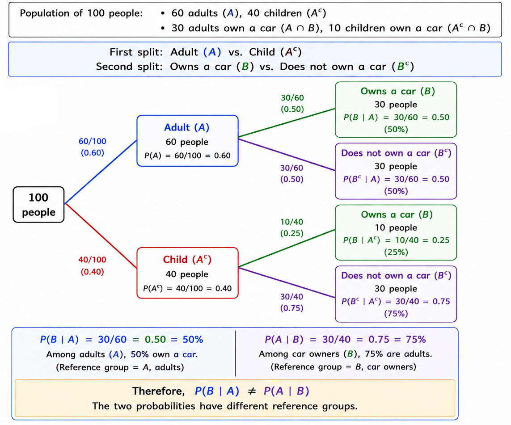
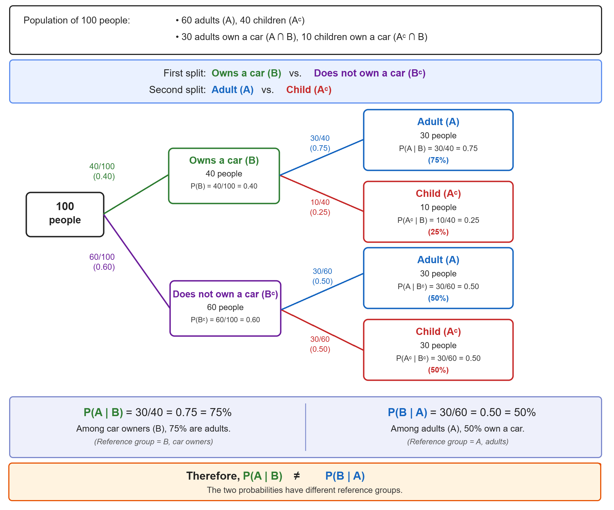
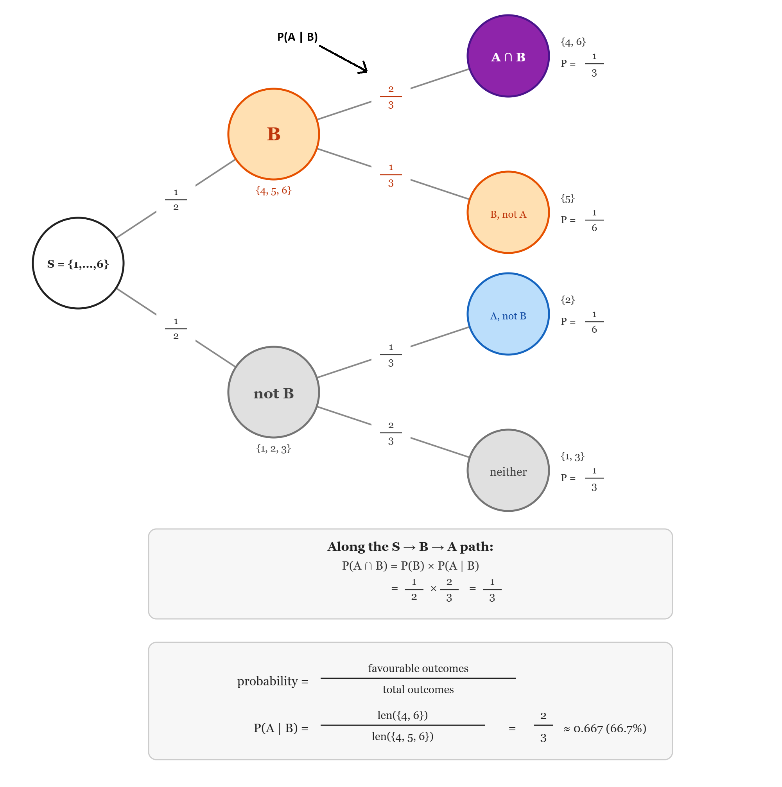

<div align='center'>
    <h1> Conditional Probability </h1>
</div>

Conditional probability is the probability of an event **when we already know that another event has occurred**. The notation is

```math
P(A \mid B)
```

and is read as "The probability of $A$, given $B$". The vertical bar,

```math
\mid
```

does not refer to any set operation. It means "given that" or "under the condition that". Therefore,

```math
P(A | B)
```

means, "What is the probability that $A$ occurs, given that we know $B$ has occurred"? This introduces an important idea, **the information that $B$ has occurred changes what outcomes are relevant to us**. The vertical bar does not indicate a sequence in time. For example,

```math
P(A \mid B)
```

does not necessarily mean, first $B$ happened **and then** $A$ happened. It means, **we know that $B$ is true**, and we want the probability of $A$ under that information. The events could happen simultaneously. For example, with a single die roll

```math
\begin{aligned}
A &= \{ \text{Even} \} \\
B &= \{ \text{Greater than 3} \}
\end{aligned}
```

The $4$ outcome satisfies both conditions at the same time. We can still ask,

```math
P(A \mid B)
```

The notation is about **information and conditions**, not necessarily chronological order.

### Distinguishing Order - $P(A \mid B)$ and $P(B \mid A)$

Consider a population of 100 people.

- 60 are adults
- 40 are children
- 30 adults own a car
- 10 children own a car

Let,

```math
\begin{aligned}
A &= \{\text{ Adult }\} \\
B &= \{\text{ Owns a car }\}
\end{aligned}
```

Then,

```math
P(B \mid A) = \frac{30}{60} = 50\%
```

This asks, "Among adults, what percentage own a car?". However,

```math
P(A \mid B) = \frac{30}{40} = 75\%
```

This asks, "Among people who own a car, what percentage are adults?". Therefore,

```math
P(B \mid A) \neq P(A \mid B)
```

in general. The two probabilities have different reference groups. When creating a probability tree for this, we can first draw a probability tree starting from the root, branching off between splitting adults and children. Therefore, to find $P(B \mid A)$, we traverse the branches $A \rightarrow B$ to calculate $\frac{\text{Favourable outcomes}}{\text{Outcome sample space}} = \frac{30}{60} = 50\%$. To calculate $P(A \mid B)$ using this tree, we need to use,

```math
P(A \mid B) = \frac{P(A \cap B)}{P(B)}
```

Multiply along each path to get "owns a car" leaf probabilities. Add those two leaves together to get $P(B)$, since "owns a car" can happen via either the adult or child branch and these paths are mutually exclusive.

```math
\begin{aligned}
P(A \cap B) &= P(A) \cdot P(B \mid A) = 0.6 \times 0.5 = 0.30 \\
P(A^c \cap B) &= P(A^c) \cdot P(B \mid A^c) = 0.4 \times 0.25 = 0.10 \\
P(B) &= P(A \cap B) + P(A^c \cap B) = 0.30 + 0.10 = 0.40
\end{aligned}
```

Therefore,

```math
P(A \mid B) = \frac{P(A \cap B)}{P(B)} = \frac{0.3}{0.4} = 75\%
```

<div align='center'>
    
</div>

If we want to traverse the tree directly to find $P(A \mid B)$, we actually need **a second probability tree**. This is where the order of the tree matters. The current tree is structured as,

```math
A \text{ (Adult) } \rightarrow B \text{ (Owns a car) }
```

So it gives us $P(B \mid A)$ directly, but $P(B \mid A)$ is asking the opposite direction. To avoid using the bayes theorem as previously done, we can construct a second tree and traverse

```math
B \text{ (Owns a car) } \rightarrow A \text{ (Adult) }
```

<div align='center'>
    
</div>

Now the sample space is clear and calculating $P(A \mid B)$ is simply,

```math
P(A \mid B) = \frac{\text{Favourable outcomes}}{\text{Outcome sample space}} = \frac{30}{40} = 75\%
```

### Rolling a Die

Suppose a fair six-sided die is rolled. The sample space is,

```math
S = \{ 1,2, 3, 4, 5, 6 \}
```

Let,

```math
\begin{aligned}

A &= \{ \text{Even} \} = \{ 2, 4, 6 \} \\
B &= \{ \text{Greater than 3} \} = \{ 4, 5, 6 \}
\end{aligned}
```

Without any additional information,

```math
P(A) = \frac{3}{6} = \frac{1}{2}
```

There are 3 even outcomes out of 6. **Now suppose we are told, the number rolled was greater than 3**, we have been given the information that $B$ occurred. The outcomes

```math
\{ 1, 2, 3 \}
```

are therefore no longer relevant to the question. Our relevant outcomes are now,

```math
\{ 4, 5, 6 \}
```

Among these 3 outcomes, 2 are even,

```math
\{ 4, 6 \}
```

Therefore,

```math
P( A | B) = \frac{2}{3}
```

Notice what happened, $P(A) = \frac{3}{6}$ but $P(A \mid B) = \frac{2}{3}$. The probability of $A$ changed because we received additional information. The die itself did not change, what changed was the **set of outcomes we are considering when performing the calculation $\frac{\text{Favourable outcome}}{\text{Total possible outcomes}}$**.

<div align='center'>
    
</div>

Conditional probability can therefore be understood as,

```math
\text{Probability of } A \text{ within the outcomes where } B \text{ has occurred}
```

This is perhaps the most useful way to think about

```math
P( A \mid B)
```

The condition $B$ establishes **the new reference set**. We then ask what proportion of that reference set also satisfies $A$.

In set notation

```math
B
```

is our relevant set, while

```math
A \cap B
```

is the portion of that set that also satisfies $A$. Therefore,

```math
P(A \mid B) = \frac{\text{Part of } B \text{ that is also } A}{\text{All of } B}
```

which leads directly to the formal definition. The definition of conditional probabilty is,

```math
\boxed{P(A \mid B) = \frac{P(A \cap B)}{P(B)}}
```

provided that $P(B) > 0$. The formula contains two important pieces.
