<div align='center'>
    <h1> Introduction </h1>
</div>

Probability provides a mathematical framework for describing uncertainty. It allows the likelihood of an event to be quantified and provides a consistent set of rules for determining the likelihood of combinations of events. Although probability is often introduced through simple percentages or fractions, its underlying structure is based on relationships between **outcomes, events and sample space**.

**A probability can be interpreted as a proportion of possible outcomes**. This is expressed as a fraction,

```math
\frac{\text{Favourable outcomes}}{\text{Total number of possible outcomes}}
```

When expressed as a percentage, it describes a quantity per one hundred. For example, a probability of $20\%$ can be interpreted as $20$ outcomes occurring for every $100$ equally likely outcomes. This interpretation provides an intuitive connection between probability and proportions, while the corresponding decimal and fractional representations provide the mathematical forms used in calcuatlions,

```math
20\% = \frac{20}{100} = 0.2
```

The calculation of compound probabilities requires more than simply assigning a probability to an individual event. Events can occur together, occur separately, depend upon one another or be mutually exclusive. Consequently, probability contains several fundamental operations for combining and relating events. The intersection $A \cap B$ describes the occurrence of both events, while the union $A \cup B$ describes the occurrence of either event. Conditional probability, represented by $P( A \mid B)$, describes the probability of one event, given another event has occurred.

<div align='center'>
    <h1> Essential Terminology </h1>
</div>

### Outcome

An outcome is a **single possible result** of a random experiment. It is one complete result of the experiment. For a single roll of a six-sided die, each of

```math
1, 2, 3, 4, 5, 6
```

is an individual outcome. An outcome is therefore an individual element of the sample space. For example,

```math
4 \in S
```

indicates that rolling a 4 is one of the possible outcomes. In a more complicated experiment, an outcome itself consists of several results. For example, when a coin is tossed twice, the sample space is

```math
S = \{ HH, HT, TH, TT \}
```

$HT$ is one outcome representing Heads on the first toss followed by Tails on the second toss. In a probability tree, outcomes are all **leaf nodes**.

<div align='center'>
    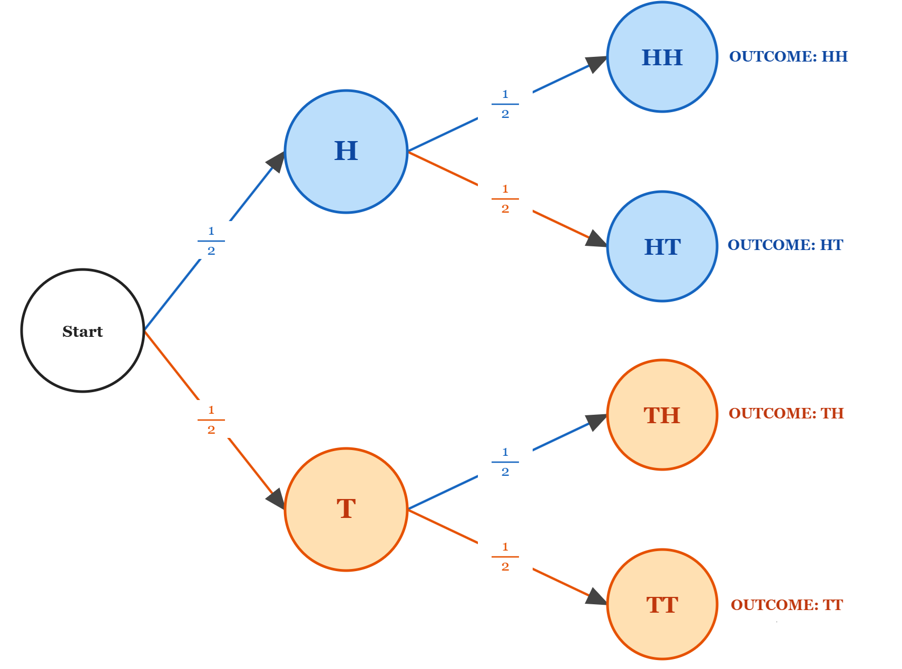
</div>

### Sample Space

The sample space, denoted by

```math
S
```

is the **complete set of all possible outcomes** of a random experiment. For example, when a fair six-sided die is rolled once, a sample space is

```math
S = \{ 1, 2, 3, 4, 5, 6 \}
```

Every possible result of the experiment must be contained within the same space. Similarly, when a coin is tossed once,

```math
S = \{ H, T\}
```

where $H$ represents Heads and $T$ represents Tails. The sample space therefore establishes the complete set of possibilities against which probabilities are measured.

<div align='center'>
    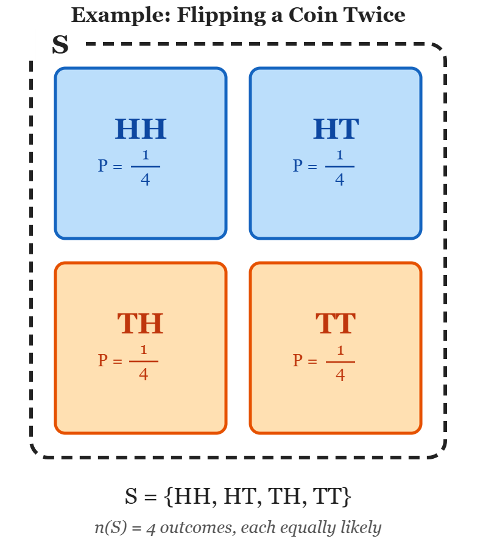
</div>

### Event

An event is a collection of one or more **outcomes from the sample space**. Events are commonly represented by capital letters such as,

```math
A, \qquad B, \qquad C
```

For example, when rolling a six-sided die, define the event

```math
A = \{ \text{Rolling an even number} \}
```

The event consists of the outcomes

```math
A = \{ 2, 4, 6 \}
```

Thus, an event is a **set of outcomes** satisfying a particular condition. An event can contain several outcomes, a single outcome or no outcomes at all.

<div align='center'>
    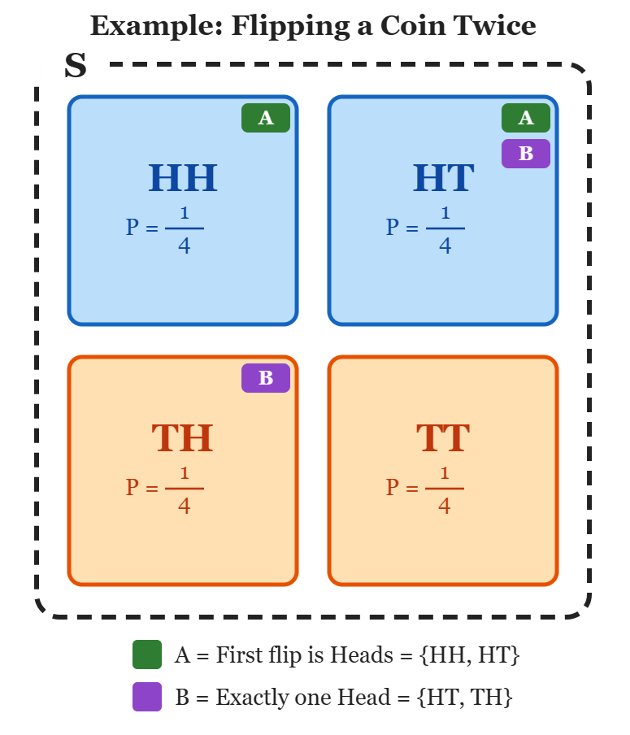
</div>

### Probability

The probability of an event $A$, written

```math
P(A)
```

is a numerical measure of the likelihood that $A$ will occur. Probability is bounded by

```math
0 \leq P(A) \leq 1
```

The extreme values have the following meaning,

```math
P(A) = 0 = \{ \} = \empty


```

means that $A$ is impossible, while

```math
P(A) = 1 = \{ \text{All possible outcomes} \}
```

means that $A$ is certain. For equally likely outcomes, probably can be calculated as

```math
P(A) = \frac{\text{Favourable outcomes in } A}{\text{Total number of possible outcomes}}
```

It is important to distinguish total number of possible outcomes and $S$ because in probability we often perform continuous reduction in $S$ when we know other events have occurred. This however, only occurs for conditional probability. For example, when rolling a fair six-sided die, the probability of rolling an even number is

```math
P(A) = \frac{3}{6} = \frac{1}{2}
```

There are 3 outcomes satisfying the event,

```math
\{2, 4, 6 \}
```

out of six possible outcomes in the sample space.

### Complement

The complement of an event $A$, written

```math
A^c
```

or sometimes

```math
A'
```

represents the event that $A$ does not occur. If

```math
A = \{ \text{Rolling an even number} \}
```

then

```math
A^c = \{ \text{Rolling an odd number} \}
```

Therefore, $A^c$ is an event that comes all outcomes not inside of $A$. Because an event and its complement together account for every possible outcome,

```math
P(A) + P(A^c) = 1
```

Therefore,

```math
P(A^c) = 1 - P(A)
```

The complement becomes particularly useful when an event is difficult to calculate directly but its opposite is easier. For example, the probability of obtaining at least one success in repeated trials can often be calculated by finding the probability of obtaining zero success and subtracting it from 1.

### Intersection

The intersection of two events is the set out of outcomes that belong to **both** events. It is represented by

```math
A \cap B
```

The symbol $\cap$ therefore corresponds to the word "and". For example, suppose a die is rolled and

```math
\begin{aligned}
A &= \{ \text{Even} \} \\
B &= \{    \text{Greater than 3}  \}
\end{aligned}
```

Then,

```math
\begin{aligned}
A &= \{ 2, 4, 6\} \\
B &= \{ 4, 5, 6\}
\end{aligned}
```

The **outcomes** belonging to both events are,

```math
A \cap B = \{ 4, 6\}
```

Therefore,

```math
P( A \cap B) = \frac{\text{Favourable outcomes}}{\text{Total number of possible outcomes}}= \frac{\{ 4, 6 \}}{\{ 1, 2, 3, 4, 5, 6\}}= \frac{2}{6} = \frac{1}{3}
```

The intersection is central to the multiplication rule discussed later because the probability of $A \cap B$ represents the probability that **both conditions are satisfied**.

### Union

The union of two events is the set of outcomes that belong to **either event, or to both events**. It is represented by,

```math
A \cup B
```

The symbol $\cup$ therefore corresponds to the word "or". Using the same example,

```math
\begin{aligned}
A &= \{ 2, 4, 6\} \\
B &= \{ 4, 5, 6 \}
\end{aligned}
```

The union is

```math
A \cup B = \{  2, 4, 5, 6   \}
```

Therefore,

```math
P(A \cup B) = \frac{\text{Favourable outcomes}}{\text{Total number of possible outcomes}} = \frac{\{2, 4, 5, 6 \}}{\{ 1,2,3,4,5,6\}} = \frac{4}{6} = \frac{2}{3}
```

The distinction between intersection and union is fundamental.

```math
\begin{aligned}
A \cap B &\rightarrow A \text{ and } B \\
A \cup B &\rightarrow A \text{ or } B
\end{aligned}
```

<div align='center'>
    <h1> $A \cap B \qquad A \text{ and } B$</h1>
</div>

The symbol

```math
A \cap B
```

represents the intersection of events $A$ and $B$. It describes for which both $A$ and $B$ occur. The symbol $\cap$ comes from set theory, where it represents the intersection of two sets. The word intersection refers to the portion that two sets have in common. In probability, this common portion consists of the outcomes that satisfy both conditions.

Therefore

```math
A \cap B
```

is read as **$A \text{ and } B$**.

It is important to distinguish this from the word "then". The intersection itself does **not specify an order or a point in time**. Events $A \text{ and } B$ may describe two properties of the same outcome, or they may describe events occurring at different stages of an experiment. For example, if a single die is rolled, let

```math
\begin{aligned}
A &= \{ \text{Even number} \} \\
B &= \{ \text{Number greater than 3} \}
\end{aligned}
```

The sample space is

```math
S = \{ 1, 2, 3, 4, 5, 6 \}
```

The two events are,

```math
\begin{aligned}
A &= \{ 2, 4, 6 \} \\
B &= \{  4, 5, 6\}
\end{aligned}
```

The outcomes satisfying both conditions are

```math
A \cap B = \{ 4, 6 \}
```

Therefore, the intersection consists of the outcomes that are simultaneously members of both $A$ and $B$. The intersection can be visualised using a Venn Diagram. Each circle represents an event, while the overlapping region represents the outcomes belonging to both events.

<div align='center'>
    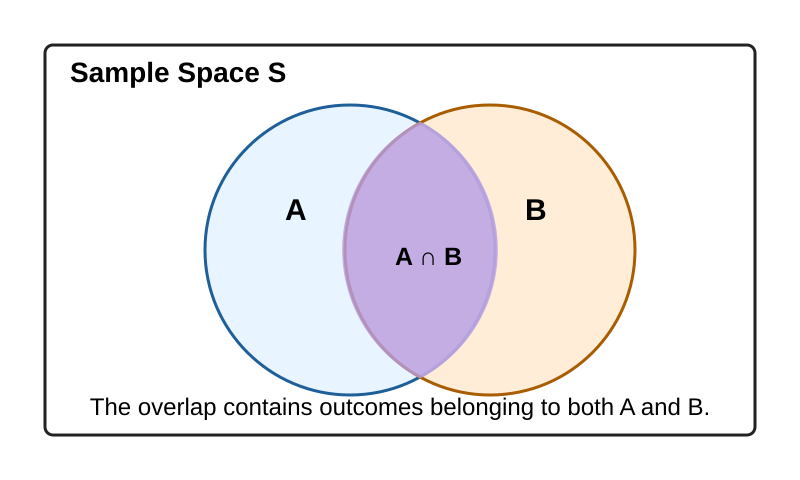
</div>

Conceptually,

```math
A \cap B = \text{The overlap between A and B}
```

For a probability tree $A \cap B$ is visualized by multiplying the probability of $A$ with $P(B \mid A)$. Alternatively, $P(B)$ with $P(A \mid B)$, however a different probability tree where the root branches immediately to $P(B)$ is required to visualize that.

<div align='center'>
    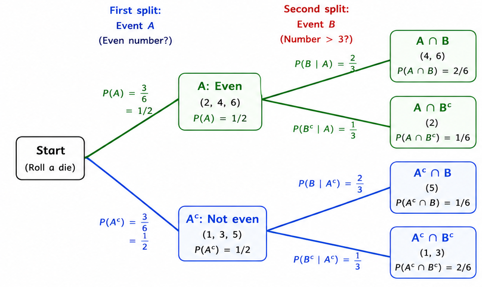
</div>

This interpretation is **independent of whether the events are simultaneous or sequential**. The intersection simply asks, **which outcomes satisfy both conditions?**

### Calculating $P(A \cap B)$

Once the intersection has been identified, its probability can be calculated in the usual way. For equally likely outcomes,

```math
P(A \cap B) = \frac{\text{Number of outcomes in } A \cap B}{\text{Total number of outcomes in } S}
```

Returning to the die example,

```math
\begin{aligned}
S &= \{ 1, 2, 3, 4, 5, 6 \} \\
A \cap B &= \{ 4, 6 \}
\end{aligned}
```

There are 2 outcomes in the intersection and 6 outcomes in the entire sample space.

```math
P( A \cap B) = \frac{2}{6} = \frac{1}{3}
```

This is the actual calculation within the actual sample space. It is useful to express this result in several different but equivalent ways.

##### 1. Actual Sample Space

The die has 6 possible outcomes,

```math
\{ 1, 2, 3, 4, 5, 6 \}
```

2 of the 6 possible outcomes satisfy both conditions,

```math
\{ 4, 6 \}
```

Therefore,

```math
P(A \cap B) = \frac{\text{Number of outcomes in } A \cap B}{\text{Total number of outcomes in } S} = \frac{2}{6} = \frac{1}{3}
```

<div align='center'>
    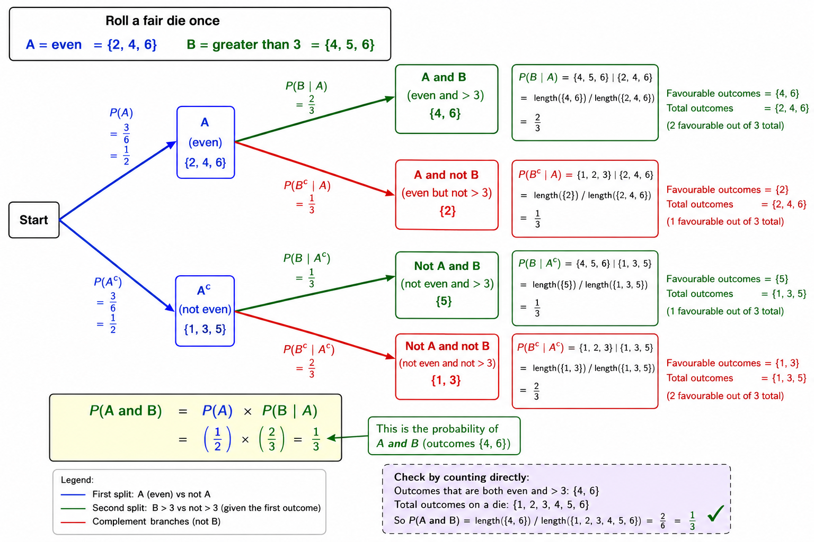
</div>

##### 2. Equivalent Proportion

The fraction

```math
P(A \cap B) = \frac{2}{6} = \frac{1}{3}
```

means that **one third of the sample space** satisfies both conditions. This is a statement about the proportion of the 6 possible outcomes.

##### 3. Equivalent Percentage

Converting the proportion to a percentage gives,

```math
\frac{1}{3} \times 100\% \approx 33.33\%
```

Therefore,

```math
P(A \cap B) \approx 33.33\%
```

The percentage is simply another representation of the same probability. It does not mean that the die suddenly has 100 possible outcomes. The $33.33\%$ can also be interpreted in terms of repeated rolls. If the experiment of rolling the die were repeated a very large number of times, we would expect approximately $33.33\%$ of the rolls to produce an outcome satisfying both conditions. For example, over 600 independent rolls, we would expect approximately

```math
600 \times \frac{1}{3} = 200
```

rolls to satisfy both conditions. This is a **long-run interpretation** of the probability. It does not alter the original 6 outcome sample space. Therefore, the four statements are all describing the same probability.
### The Multiplication Rule

The direct counting method above works particularly well when the sample space is small and its outcomes are easily enumerated. However, probability frequently involves much larger or sequential sample spaces where directly listing every outcome is impractical. This is where the multiplication rule becomes important. The general multiplication is

```math
P(A \cap B) = P(A) \cdot P(B \mid A)
```

where

```math
P ( B \mid A)
```

means, **the probability of $B$, given that $A$ has already occurred**. First, determine what proportion satisfies $A$. Then, among those outcomes satisfying $A$, determine what proportion also satisfies $B$. The second probability is a proportion of the first group. Multiplication is precisely the operation required to calculate a proportion of a proportion.

<div align='center'>
    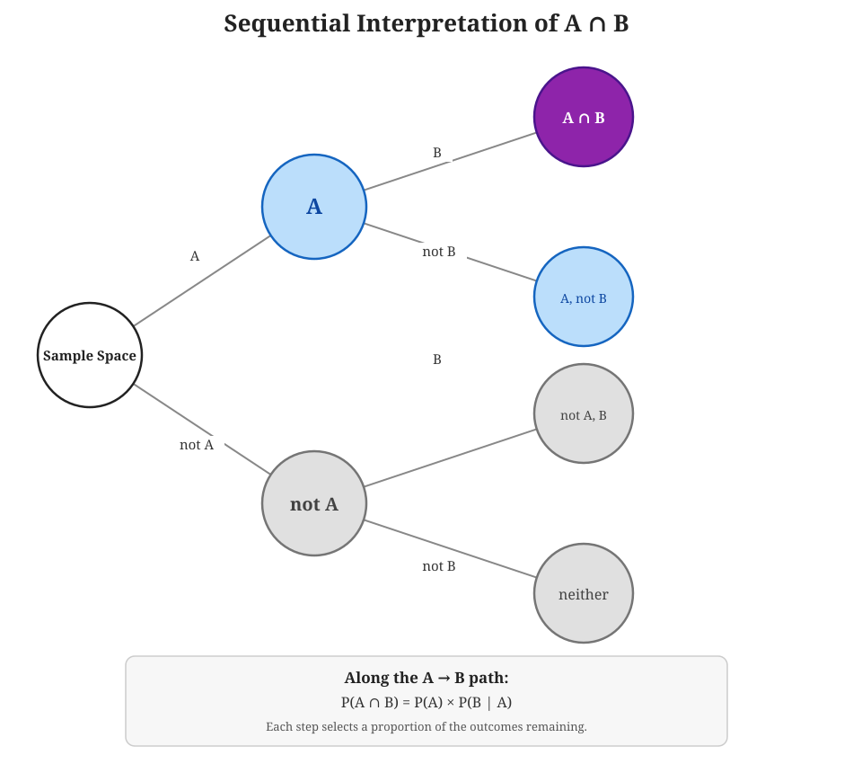
</div>

##### Example - Drawing Cards Without Replacement

Consider a standard deck containing 52 cards. Suppose 2 cards are drawn without replacement. We want the probability that,

- The first card is an Ace <strong> and </strong> the second card is a King

Define,

```math
\begin{aligned}
A &= \{ \text{First card is an Ace} \} \\
B &= \{ \text{Second card is a King} \}
\end{aligned}
```

We want,

```math
P(A \cap B)
```

There are 4 aces among the 52 cards. Therefore,

```math
P(A) = \frac{4}{52} = \frac{1}{13}
```

As a percentage,

```math
\frac{1}{13} \approx 7.69\%
```

So there is a $7.69\%$ probability that the first card is an Ace. Now suppose the first card was an Ace. One card has been removed, leaving $51$ cards. Because the removed card was an Ace, all 4 kings are still present. Therefore,

```math
P(B \mid A) = \frac{4}{51}
```

The multiplication rule gives us,

```math
P(A \cap B) = P(A) \cdot P(B \mid A)
```

Hence,

```math
P(A \cap B) = \frac{4}{52} \cdot \frac{4}{51}
```

Therefore,

```math
P(A \cap B) = \frac{16}{2652} = \frac{4}{663} \approx 0.603\%
```

So the probability of drawing an Ace followed by a King is approximately $0.603\%$.

<div align='center'>
    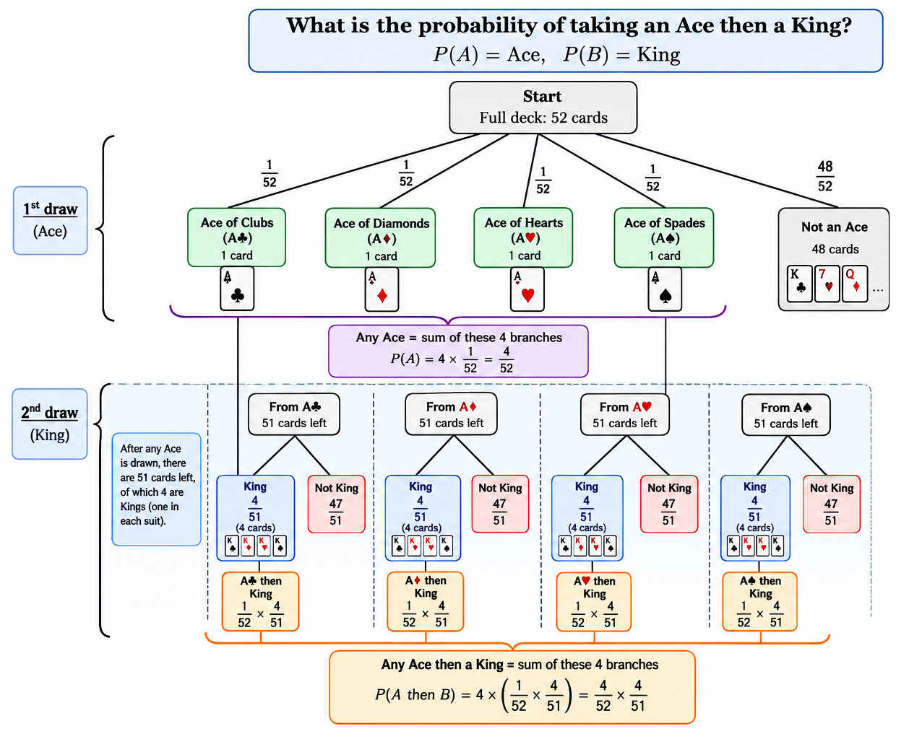
</div>

##### Example - Rolling a Die

Suppose we have

```math
\begin{aligned}
S &= \{ 1, 2, 3, 4, 5, 6 \} \\
A &= \text{Selecting an even number } \\
B &= \text{Selecting a number greater than 3 } \\
\end{aligned}
```

##### 1. Find $P(A)$

The even numbers are,

```math
A = \{ 2, 4, 6 \}
```

There are 3 even numbers out of 6,

```math
P(A) = \frac{3}{6} = \frac{1}{2}
```

##### 2. Find $P( B \mid A)$

$P( B \mid A)$ means,

- What is the probability of $B$ occurring, **given that $A$ has already occurred**?

Since we know the number is **even**, our possible outcomes are now only

```math
\{ 2, 4, 6 \}
```

Of these, the numbers greater than 3 are,

```math
\{ 4, 6 \}
```

Therefore,

```math
P(B \mid A) = \frac{2}{3}
```

##### 3. Multiply Them

```math
P(A) \cdot P(B \mid A) = \frac{1}{2} \cdot \frac{2}{3} = \frac{1}{3}
```

Importantly, this is equal to the probability of both conditions occurring.

```math
P(A \cap B) = \frac{1}{3}
```

because the numbers that are **both even and greater than 3** are,

```math
\{ 4, 6\}
```

so there are 2 favourable outcomes out of the original 6.

```math
P( A \cap B) = \frac{2}{6} = \frac{1}{3}
```

Thiis is a nice example of why

```math
P( A \cap B) = P(A) \cdot P(B \mid A)
```

works. $P(A)$ gets you into a restricted set, and $P(B \mid A)$ tells you what proportion of that restricted set satisfies $P(B)$.

### The Same Multiplication Rule Can Be Written Both Ways

There is an important point that should not be overlooked. The multiplication rule can be written as,

```math
P(A \cap B) = P(A) \cdot P(B \mid A)
```

but it can equally be written as

```math
P(A \cap B) = P(B) \cdot P(A \mid B)
```

These are not 2 different rules. They are 2 ways of approaching the **same intersection**.

The first asks

- What is the probability of $A$, followed by the probability of $B$ given $A$

```math
P(A \cap B) = P(A) \cdot P(B \mid A)
```

while the second asks

- What is the probability of $B$, followed by the probability of $A$ given $B$

```math
P(A \cap B) = P(B) \cdot P(A \mid B)
```

Both must produce the same probability because they describe the same set of outcomes.

```math
A \cap B = B \cap A
```

Therefore,

```math
P(A) \cdot P(B \mid A) = P(B) \cdot P(A \mid B)
```

This is an important property of intersection, although conditional probabilities can be different, the final probability of the intersectin is the same. **This equality is the foundation of Bayes Theorem** as dividing both sides by $P(B)$ produces,

```math
\boxed{P(A \mid B) = \frac{P(A) \cdot P(B \mid A)}{P(B)}}
```

### Why the Result Cannot Exceed 1

The multiplication rule also naturally explains why an intersection can never exceed $1$. Every probability satisfies,

```math
0 \leq P(A) \leq 1
```

and every conditional probability satisfies

```math
0 \leq P(B \mid A) \leq 1
```

We want to show that

```math
0 \leq P(A \cap B) \leq 1
```

Using the multiplication,

```math
P( A \cap B) = P(A) \cdot P(B \mid A)
```

First, start with the inequality for the conditional probability,

```math
0 \leq P(B \mid A) \leq 1
```

Because,

```math
0 \leq P(A) \leq 1
```

we know that $P(A)$ is non-negative. Therefore, we can multiply every part of the inequality by $P(A)$ without changing the direction of the inequalities.

```math
0 \leq P(A) \cdot P(B \mid A) \leq P(A) \cdot 1
```

But we already know that

```math
P(A) \leq 1
```

Therefore,

```math
0 \leq P(A) \cdot P(B \mid A) \leq P(A) \leq 1
```

So,

```math
\begin{aligned}
0 &\leq P(A) \cdot P(B \mid A) \leq \cancel{P(A)} \leq 1 \\
0 &\leq P(A) \cdot P(B \mid A) \leq 1
\end{aligned}
```

Finally, using the multiplication rule,

```math
P(A \cap B) = P(A) \cdot P(B \mid A)
```

we can replace the product with $P(A \cap B)$,

```math
\boxed{0 \leq P(A \cap B) \leq 1}
```

Therefore, the probability of an intersection can never be less than $0$ or greater than $1$. This is represented by $0$ meaning, no outcomes in the event and $1$ meaning all outcomes in the event occur.

<div align='center'>
    <h1> $A \cup B \qquad A \text{ or } B$ </h1>
</div>

The notation

```math
A \cup B
```

represents the **union** of events $A$ and $B$. The union is read as $A \text{ or } B$. In probability, however, the word "**or**" has a precise meaning. Unless otherwise stated, it is an **inclusive or**.

```math
A \cup B = A \text{ occurs, }B \text{ occurs, or both occur}
```

This is different from the intersection $A \cap B$, which means $A \text{ and } B$. The distinction is therefore,

```math
\begin{aligned}
\cap &\rightarrow \text{AND}  \\
\cup &\rightarrow \text{OR}
\end{aligned}
```

The intersection asks us to find the outcomes common to both events, whereas the union asks us to collect **every outcome that belongs to at least one of the events**. In ordinary language, "or" can sometimes mean one option, but not the other. For example, "You may choose tea or coffee". This could mean that exactly one must be chosen. Probability normally uses a different interpretation. When we say,

```math
A \text{ or } B
```

we include three possibilities.

1. $A$ occurs and $B$ does not.
2. $B$ occurs and $A$ does not.
3. Both $A$ and $B$ occur.

Therefore,

```math
A \cup B
```

means **at least one of $A$ or $B$ occurs**. The possibility of both occurring is important because it is precisely what creates the need to account for the overlap.

#### Die Example

Consider a fair six-sided die,

```math
S = \{ 1, 2, 3, 4, 5, 6 \}
```

Let,

```math
\begin{aligned}
A &= \{ {\text{ Even number }}\} \\
B &= \{ {\text{ Number greater than 3 }}\} \\
\end{aligned}
```

Therefore,

```math
\begin{aligned}
A &= \{ 2, 4, 6 \} \\
B &= \{ 4, 5, 6 \} \\
\end{aligned}
```

We want to determine $A \cup B$. This means. which outcomes are even, greater than 3, or both?

| Outcome | Even? $A$ | Greater than 3? $B$ | In $A\cup B$? |
| ------: | :-------: | :-----------------: | :-----------: |
|       1 |    No     |         No          |      No       |
|       2 |    Yes    |         No          |      Yes      |
|       3 |    No     |         No          |      No       |
|       4 |    Yes    |         Yes         |      Yes      |
|       5 |    No     |         Yes         |      Yes      |
|       6 |    Yes    |         Yes         |      Yes      |

Therefore,

```math
A \cup B = \{ 2, 4, 5, 6\}
```

There are $4$ outcomes satisfying at least one of the conditions. Therefore,

```math
P( A \cup B ) = \frac{4}{6} = \frac{2}{3}
```

As with the previous probability examples, it is useful to separate the actual sample space from its proportional, percentage and repeated-trial interpretations. For this example,

```math
P( A \cup B) = \frac{4}{6} = \frac{2}{3}
```

### Why We Cannot Add $P(A)$ and $P(B)$

At first glance, the die example might suggest a very simple rule. We know,

```math
\begin{aligned}

P(A) &= \frac{3}{6} \\

P(B) &= \frac{3}{6}

\end{aligned}
```

Perhaps we could simply add them,

```math
P(A) + P(B) = \frac{3}{6} + \frac{3}{6} = \frac{6}{6} = 1
```

This would suggest a probability of $100\%$. However, we already know that,

```math
A \cup B = \{ 2, 4, 5, 6 \} = \frac{4}{6} = \frac{2}{3}
```

The outcomes $4$ and $6$ were counted once when considering $A$, and then counted **again** when considering $B$. Therefore, a simple **addition has counted the overlap twice**. To correct the double counting, we subtract the intersection once

```math
\boxed{P(A \cup B) = P(A) + P(B) - P(A \cap B)}
```

This is the general addition rule for two events. For the die,

```math
\begin{aligned}

P(A) &= \frac{3}{6} \\

P(B) &= \frac{3}{6} \\

P(A \cap B) &= \frac{2}{6}

\end{aligned}
```

Therefore,

```math
P(A \cup B) = \frac{3}{6} + \frac{3}{6} - \frac{2}{6} = \frac{3 + 3 - 2}{6} = \frac{4}{6} = \frac{2}{3}
```

The subtraction is therefore not an arbitrary part of the formula. **It corrects for the outcomes that were counted twice**. The $A$ region contains,

```math
\{ 2, 4, 6 \}
```

and the region $B$ contains

```math
\{ 4, 5, 6 \}
```

This would represent,

```math
A + B = \{ 2, 4, 6, 4 , 5, 6\}
```

The outcomes $4$ and $6$ appear twice. Therefore, they have been counted twice. The calculation,

```math
3 + 3 - 2 = 4
```

corrects this,

```math
A \text{ outcomes + } B \text{ outcomes } - \text{overlap}
```

<div align='center'>
    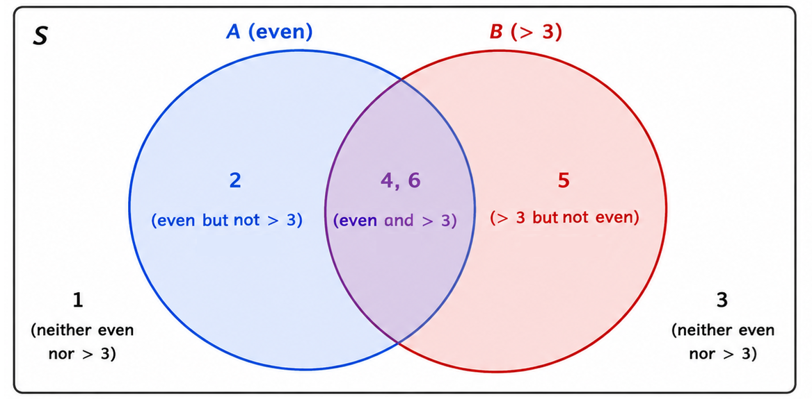
</div>

#### Drawing a King or Heart

Consider drawing a single card from a standard deck of 52 cards. Let,

```math
\begin{aligned}
A &= \{ \text{Card is a Heart} \} \\
B &= \{ \text{Card is a King} \} \\
\end{aligned}
```

There are 13 hearts and 4 kings.

```math
\begin{aligned}
|A| &= 13 \\
|B| &= 4 \\
\end{aligned}
```

However, the King of Hearts belongs to both events. This is because a King of Hearts is both a King and a Heart. Therefore,

```math
| A \cap B | = 1
```

We want the probability that the card is a **Heart or a King**. Using the union formula,

```math
\begin{aligned}
P(A \cup B) &= P(A) + P(B) - P(A \cap B) \\
P(A \cup B) &= \frac{13}{52} + \frac{4}{52} - \frac{1}{52} \\
P(A \cup B) &= \frac{16}{52} = \frac{4}{13}
\end{aligned}
```

There are actually 16 cards satisfying at least one condition.

- 13 Hearts
- 4 Kings
- The King of Hearts was counted in both groups

Therefore,

```math
13 + 4 - 1 = 16
```

<div align='center'>
    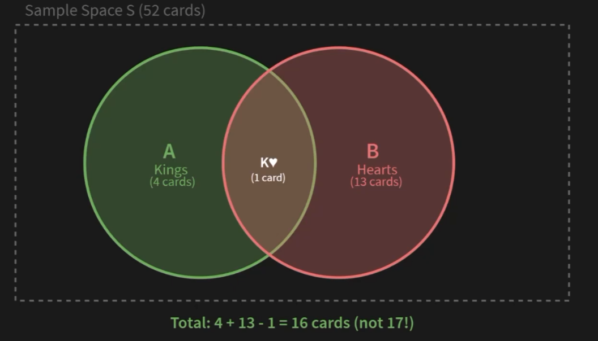
</div>

### Mutually Exclusive Events

There is one important special case where the subtraction terms disappears. Suppose $A$ and $B$ **cannot occur together**. Such events are called mutually exclusive. In mathematical terms,

```math
A \cap B = \{ \} = ∅
```

Therefore,

```math
P(A \cap B) = 0
```

The union formula becomes,

```math
P(A \cup B) = P(A) + P(B) -0
```

Therefore,

```math
P(A \cup B) = P(A) + P(B)
```

for **mutually exclusive events**. For example, on a single roll of a six-sided die, let

```math
\begin{aligned}
A &= \{  \text{Roll a } 2 \} \\
B &= \{  \text{Roll a } 5 \} \\
\end{aligned}
```

A single roll **cannot simultaneously produce both $2$ and $5$**. Therefore,

```math
A \cap B = ∅
```

So

```math
P(A \cup B) = \frac{1}{6} + \frac{1}{6} = \frac{2}{6} = \frac{1}{3}
```

The probability of rolling a 2 **or** a 5 is therefore,

```math
\frac{1}{3}
```

There is no overlap to subtract because the two events cannot occur together.

### $A \cup B$ Does Not Mean "Exactly One"

This distinction is important. In probability,

```math
A \cup B
```

normally means, $A$ or $B$ or both. If we wanted to describe the situation where exactly **one** occurs, we would need to exclude the intersection. The probability of exactly $A$ or $B$ is therefore,

```math
P(\text{Exactly one of } A, B) = P(A) + P(B) - 2P(A \cap B)
```

We subtract the intersection twice because the ordinary addition,

```math
P(A) + P(B)
```

counts the intersection twice, whereas the "exactly one" condition requires the intersection to be counted 0 times. By contrast, the ordinary union

```math
A \cup B
```

requires the intersection to be counted **once**, which is why we subtract it only once.

<div align='center'>
    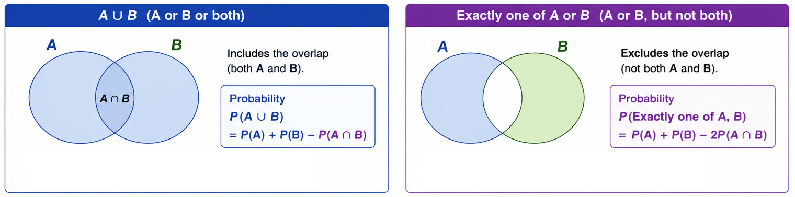
</div>
