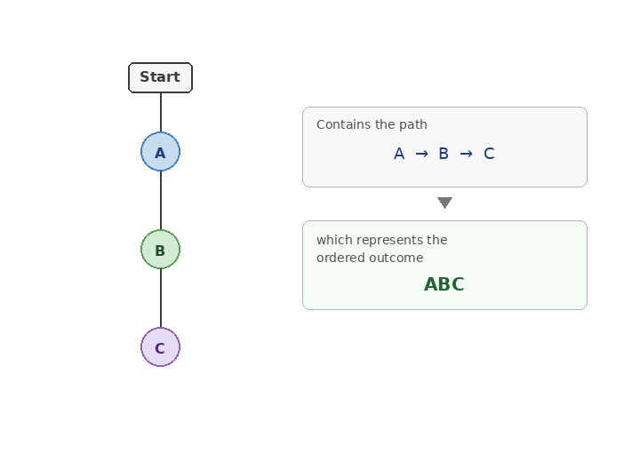
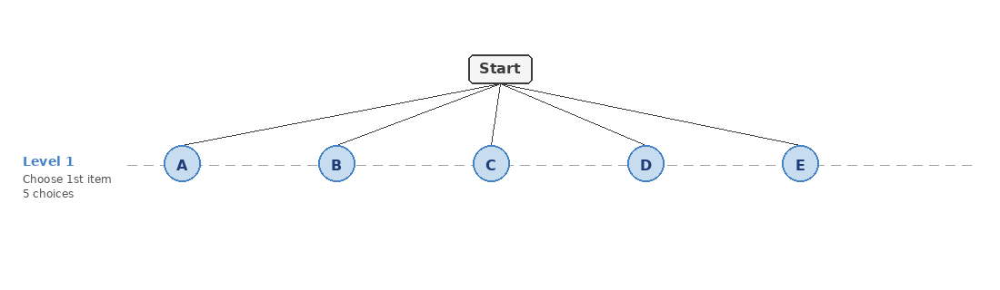
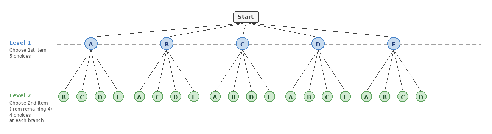
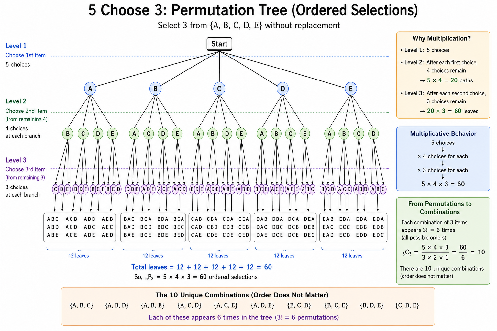
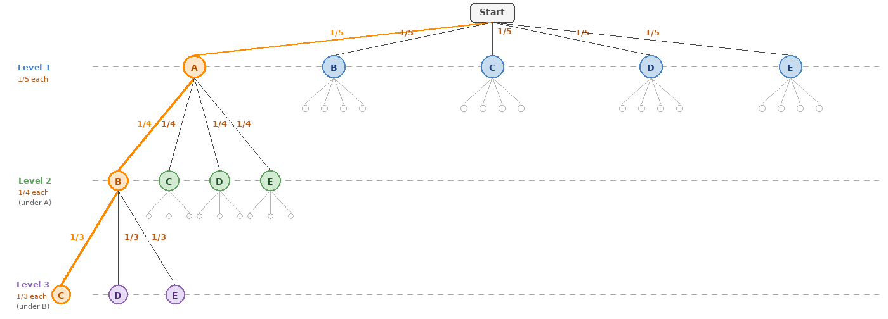

<div align='center'>
    <h1> Probability Trees </h1>
</div>

A probability tree is a graphical representation of a sequential experiment. It illustrates every possible sequence of events by decomposing the experiment into a series of individual decisions. Each branch represents one possible choice, while each complete route through the tree represents one complete outcome of the experiment.

Probability trees are widely used to calculate probabilities, but they serve a much deeper purpose. They provide a visual explanation of the multiplication principle, demonstrate why permutations are counted differently from combinations, and introduce the recursive nature of many counting problems. Rather than memorising formulas, a probability tree allows those formulas to emerge naturally from the structure of the experiment itself.

Throughout this section, consider selecting three objects from the set

```math
{A, B, C, D, E}
```

without replacement.

<div align='center'>
    <h1> Probability Tree Structure </h1>
</div>

A probability tree consists of four basic components.

- **Root** - The starting point of the experiment before any choices have been made.

- **Branch** - A possible decision that extends the experiment.

- **Node** - The state of the experiment after one or more decisions. This is attached to the end of a branch and represents a choice in the experiment.

- **Path** - The sequence of branches from the root to a particular node.

- **Leaf** - A node without any children. This is the very end node of a complete path.

For example,

<div align='center'>
    
</div>

Contains the path

```math
A \to B \to C
```

which represents the ordered outcome

```math
ABC
```

The objective of a probability tree is not to count branches or nodes. During construction, many paths are incomplete. These will be called **active paths**. Once a path reaches the final stage of the experiment, it becomes a **completed path**, representing one possible outcome.

<div align='center'>
    <h1> Constructing the Tree </h1>
</div>

The experiment consists of selecting three objects without replacement. Initially,

```math
\text{start}
```

there is exactly one active path.

#### Depth 1

At depth one, every available choice can be selected. This means we connect a branch from `start` to a node where each node is every available choice. Therefore,

```math
P_1 = 5 \times 1 = 5
```

<div align='center'>
    
</div>

#### Depth 2

Each of the 5 active paths now has 4 remaining choices. So for each node, connect a new branch to a new node, where the new node cannot be selected previously in the path.

<div align='center'>
    
</div>

This means their are 4 new nodes for every node on the previous depth. So the the total number of nodes at the bottom (Leaf nodes) is now,

```math
\begin{aligned}
P_2 = 4 &\times \text{Previous Depth Nodes} \\
P_2 = 4 &\times 5 = 20
\end{aligned}
```

#### Depth 3

This is the calculation for the number of permutations for 3 choices from 5 options. This is now the final depth. Given that the previous depth was 2, there are now 3 choices remaining. Therefore, each leaf nodes of depth 2 connects to 3 new nodes using branches.

<div align='center'>
    
</div>

This means their are 3 new nodes for every node on the previous depth. So the the total number of nodes at the bottom (Leaf nodes) is now,

```math
\begin{aligned}
P_3 = 3 &\times \text{Previous Depth Nodes} \\
P_3 = 3 &\times 20 = 60
\end{aligned}
```

Due to the cumulative law,

```math
\begin{aligned}
P_3 &= 3 \times 20  \\
P_3 &= 3 \times (4 \times 5)  \\
P_3 &= 5 \times 4 \times 3
\end{aligned}
```

The completed tree therefore contains 60 completed paths, each representing one ordered outcome. This step by step calculation for identifying the number of leaf nodes at the desired depth also guides why we use multiplication at each depth to find the number of permutations, this is extremely important for understanding how the total number of orders

<div align='center'>
    <h1> Ordered Outcomes </h1>
</div>

Each completed path represents a **unique sequence of selections**.

```math
ABC
```

and

```math
ACB
```

contain the same three objects but correspond to different paths through the tree. Because the order of selection differs, they are regarded as different outcomes. A probability tree therefore counts **ordered outcomes**, also known as **permutations**. For this experiment,

```math
5 \times 4 \times 3 = 60
```

ordered outcomes exist.

<div align='center'>
    <h1> From Permutations to Combinations </h1>
</div>

Suppose the order of selection is no longer important. The completed paths,

```math
\begin{aligned}
ABC \\
ACB \\
BAC \\
BCA \\
CAB \\
CBA
\end{aligned}
```

all represent the same subset

```math
{A, B, C}
```

The tree counts all 6 paths because they represent different orders of selection. Since three objects may be arranged in

```math
3! = 6
```

different orders, every combination appears 6 times within the completed tree. To count each selection only once, we divide by the number of repeated orderings. Therefore,

```math
\binom{5}{3} = \frac{5 \times 4 \times 3}{3 \times 2 \times 1} = 10
```

The probability tree naturally counts permutations first. Combinations are obtained by removing the repeated orderings.

<div align='center'>
    <h1> Probability Trees and Probability </h1>
</div>

Up to this point, the tree has been used only for counting. To calculate probabilities, **each branch is labelled with the probability** of making that particular choice. For example, the probability of selecting $A$ first is

```math
\frac{1}{5}
```

After selecting $A$, 4 objects remain, so the probability of selecting $B$ next becomes

```math
\frac{1}{4}
```

Finally, after selecting $A$ and $B$, three objects remain, giving

```math
\frac{1}{3}
```

The probability of the completed path

```math
A \to B \to C
```

is therefore,

```math
\frac{1}{5} \times \frac{1}{4} \times \frac{1}{3} = \frac{1}{60}
```

Just as the number of paths grow by multiplication, the probability of travelling along a particular path is found by multiplying the probabilities assigned to each branch.

<div align='center'>
    
</div>
