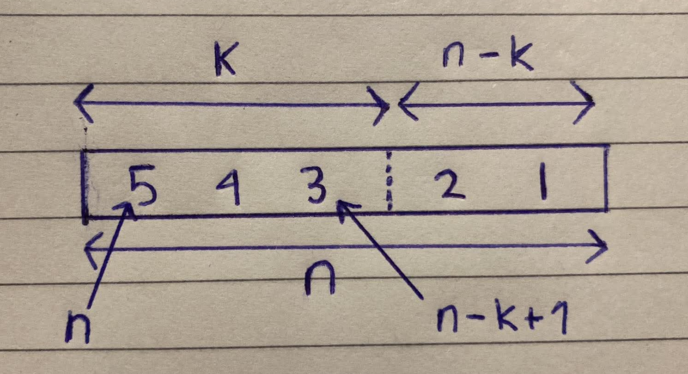

<div align='center'>
    <h1> Deriving the Combination Formula </h1>
</div>

A probability tree records every possible **ordered outcome** of a sequential experiment. Each completed path represents one unique ordering of the selected objects, meaning the tree naturally counts **permutations** rather than **combinations**. For example, selecting 3 objects from

```math
\{A,B,C,D,E\}
```

without replacement produces

```math
5\times4\times3=60
```

completed paths. However, many of these paths differ only in the order of selection. For instance,

```math
ABC
```

and

```math
ACB
```

are different permutations because the order of selection differs, yet they represent the same combination

```math
\{A,B,C\}.
```

Having a base understanding for how the number of permutations are calculated using the probability tree is an essential skill to derive the combination formula as they're very similar.

```math
\binom{n}{k}
=
{}_nC_k
=
\frac{n!}{k!(n-k)!}
```

The standard permutation formula and combination formula **assumes you cannot reuse an object**.

## From Factorials to Permutations

Suppose there are $n$ distinct objects, and every object is arranged in order. The first position may be occupied by any of the $n$ objects. Once the first position has been filled, only $n-1$ objects remain for the second position. The third position then has $n-2$ available objects, and this process continues until every object has been placed.

Applying the multiplication principle gives

```math
n(n-1)(n-2)\cdots2\cdot1
```

This product is called the **factorial** of $n$, written

```math
n!
=
n(n-1)(n-2)\cdots2\cdot1
```

Therefore, the number of possible ordered arrangements of $n$ distinct objects is

```math
n!
```

This counts permutations of **all** $n$ objects.

## Partial Permutations and the Falling Factorial

In many counting problems, not every object is selected. Instead, only $k$ objects are chosen from the original $n$. Where,

```math
0 \leq k \leq n
```

Since only the first $k$ positions are filled, the multiplication stops after $k$ factors,

```math
n(n-1)(n-2)\cdots(n-k+1)
```

This product is known as the **falling factorial**, written

```math
n^{\underline{k}}
```

<div align='center'>
    
</div>

Thus,

```math
n^{\underline{k}}
=
n(n-1)(n-2)\cdots(n-k+1)
```

For the probability tree considered throughout this proof,

```math
5^{\underline{3}}
=
5\times4\times3
=
60
```

which is precisely the number of completed paths in the tree. The probability tree therefore provides a visual interpretation of the falling factorial. Each factor represents the number of available choices at the next depth of the tree.

## Expressing the Falling Factorial Using Factorials

The falling factorial can be written in terms of ordinary factorials. Begin with the factorial of $n$,

```math
n!
=
n(n-1)(n-2)\cdots2\cdot1
```

Now separate the first $k$ factors from the remaining factors,

```math
n!
=
\underbrace{n(n-1)\cdots(n-k+1)}_{\text{first }k\text{ factors}}
\times
\underbrace{(n-k)(n-k-1)\cdots2\cdot1}_{(n-k)!}
```

The second product is exactly

```math
(n-k)!
```

Therefore,

```math
n!
=
n^{\underline{k}}(n-k)!
```

Dividing both sides by \((n-k)!\) gives

```math
n^{\underline{k}}
=
\frac{n!}{(n-k)!}
```

As a concrete example,

```math
\frac{5!}{(5-3)!}
=
\frac{5!}{2!}
=
\frac{5\times4\times3\times2\times1}{2\times1}
=
5\times4\times3,
```

where the final two factors cancel, leaving exactly the falling factorial. Since the falling factorial counts ordered selections, the number of permutations of $k$ objects chosen from $n$ is

```math
{}_nP_k
=
n^{\underline{k}}
=
\frac{n!}{(n-k)!}
```

This is the **permutation** formula.

## From Permutations to Combinations

The permutation formula counts every possible ordering of the selected objects. A combination, however, **ignores the order** in which those objects were selected. For example, the probability tree contains the 6 completed paths

```math
\begin{aligned}
ABC \\
ACB \\
BAC \\
BCA \\
CAB \\
CBA
\end{aligned}
```

yet all 6 represent the same combination,

```math
\{A,B,C\}
```

The probability tree counts 6 paths because it records **every possible ordering** of the 3 selected objects. More generally, any collection of $k$ distinct objects can be arranged in

```math
k!
```

different orders. Consequently, every combination has been counted exactly $k!$ times by the permutation formula. To count each combination only once, we divide the total number of permutations by $k!$,

```math
{}_nC_k
=
\frac{{}_nP_k}{k!}
```

Substituting the permutation formula gives

```math
{}_nC_k
=
\frac{\dfrac{n!}{(n-k)!}}{k!} = \frac{n!}{(n-k)!} \cdot \frac{1}{k!}
```

which simplifies to

```math
\boxed{
\binom{n}{k} = _nC_k
=
\frac{n!}{k!(n-k)!}
}
```

For the running example,

```math
\binom53
=
\frac{5!}{3!(5-3)!}
=
\frac{5!}{3!\,2!}
=
\frac{120}{6\times2}
=
10
```

The probability tree therefore counts **60 ordered paths**, while the combination formula recognises that every unique selection of 3 objects appears exactly

```math
3!=6
```

times among those paths. Dividing by these repeated orderings leaves

```math
\frac{60}{6}=10
```

which is precisely the number of unique **combinations**.
