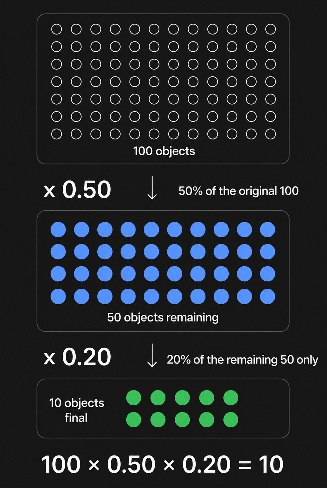
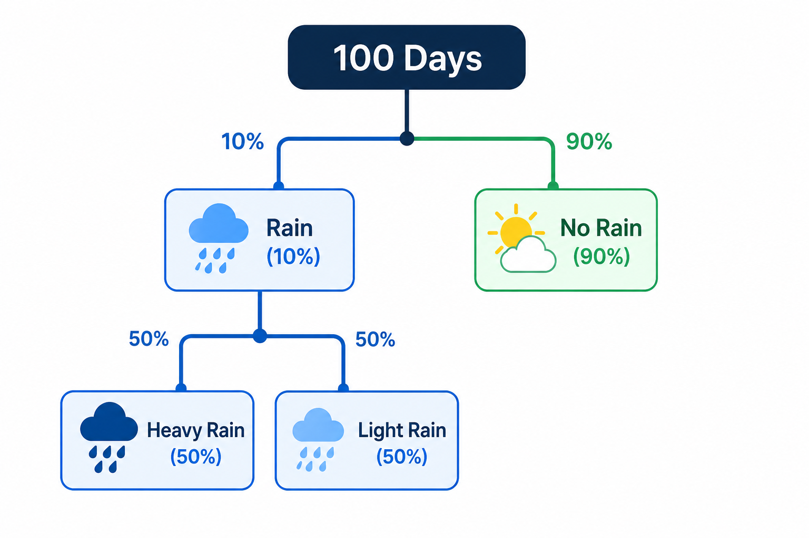
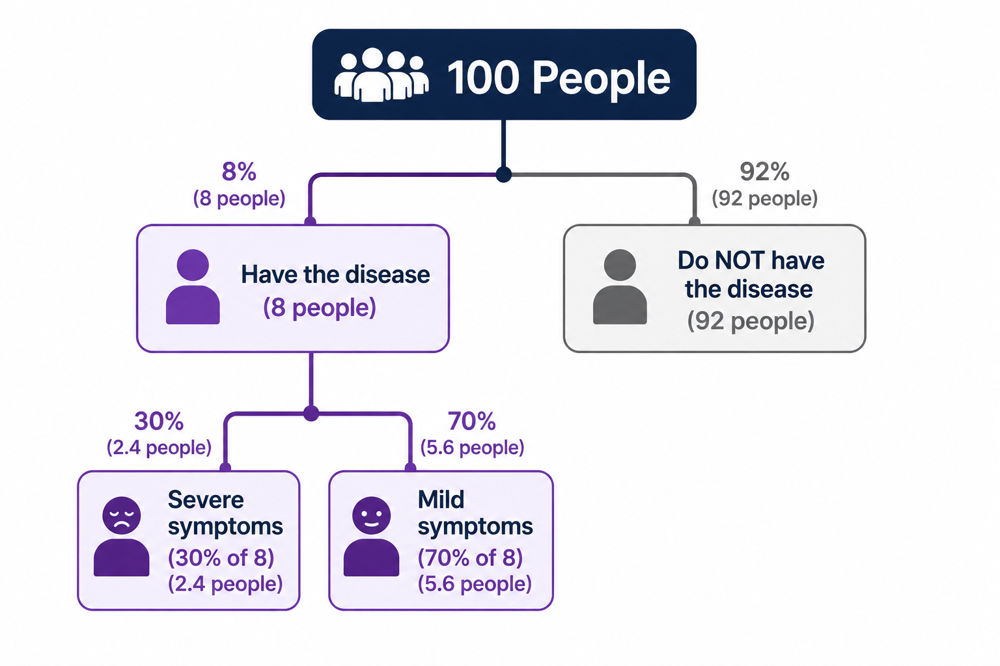
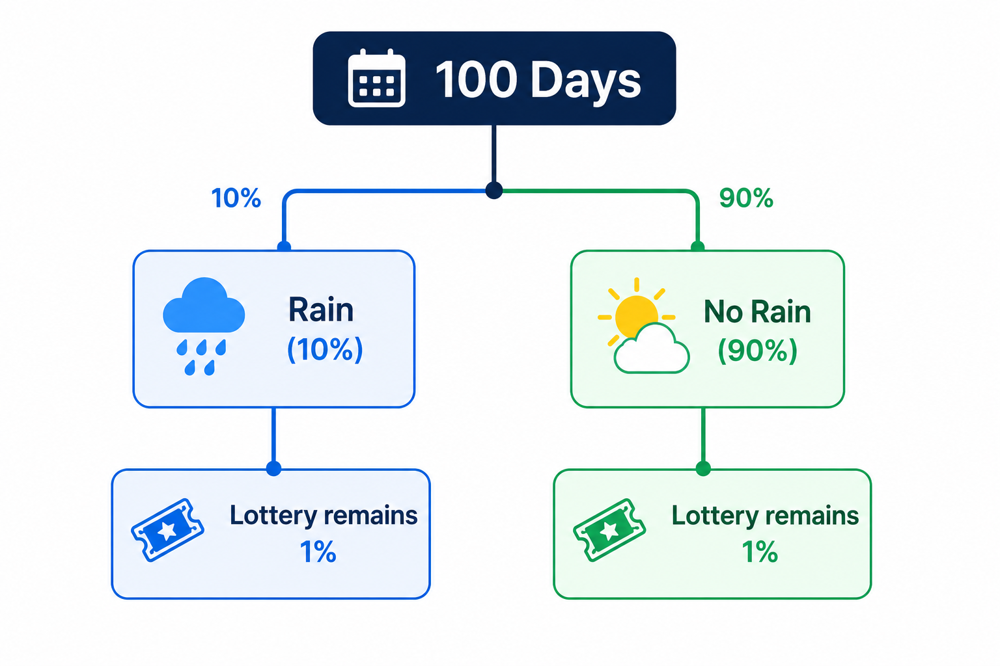
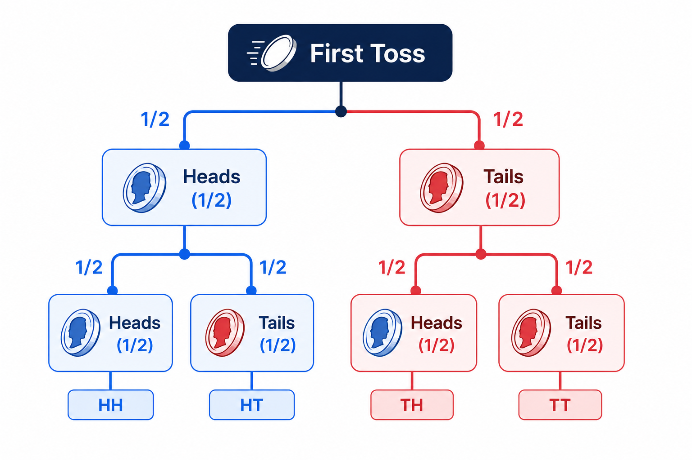
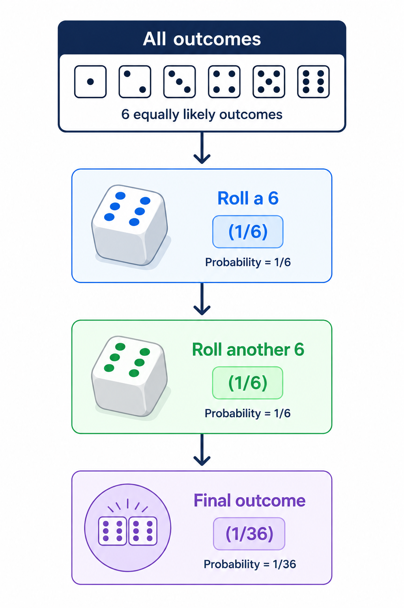

<div align='center'>
    <h1> Multiplicative Behaviour in Probability </h1>
</div>

Probability is the branch of mathematics concerned with measuring the likelihood that an event will occur. Every probability represents a **proportion of all possible outcomes within a sample space**. A probability of $0$ indicates that an event is impossible, whereas a probability of $1$ indicates that an event is certain. All other probabilities lie between these two extremes.

Probabilities are commonly expressed as percentages. The world percent originates from the Latin $per centum$, meaning "per one hundred". Consequently,

- $10\%$ means $10$ out of every $100$
- $25\%$ means $25$ out of every $100$
- $50\%$ means $50$ out of every $100$

Viewing percentages as "per one hundred" provides a useful interpretation of probability. Rather than treating percentages as abstract numbers, they may be interpreted as counts within a sample of $100$ equally likely outcomes.

One of the most fundamental principles of probability is that when determining the probability that multiple events occur together, the calculation is performed using multiplication rather than addition. The reason for this does not originate from a special rule unique to probability. Instead, it follows directly from the mathematical meaning of multiplication itself.

<div align='center'>
    <h1> Multiplication as Taking a Fraction of a Quantity </h1>
</div>

Before considering probability, it is useful to understand what multiplication represents. Multiplication is commonly introduced as repeated addition. While this interpretation is useful when multiplying whole numbers, it does not explain why multiplication is used with fractions, percentages or probabilities. A more general interpretation is that multiplication determines a fraction (or proportion) of an existing quantity. Rather than simply combining equal groups, multiplication scales a quantity by a given factor, producing a new amount that is proportional to the original.

Suppose there are $100$ objects, taking $50\%$ of these objects means keeping half of them. Now suppose $20\%$ of those remaining objects are selected. The second percentage is not applied is not applied to the original $100$ objects. Instead, it is applied only to the $50$ objects that remained after the first selection.

Mathematically,

```math
100 \times 0.50 \times 0.20 = 10
```

<div align='center'>
    
</div>

This illustrates an important mathematical principle. The first multiplication selects a fraction of the original quantity. The second multiplication selects a fraction **of the quantity that already remains**. Every additional multiplication continues this process by taking another fraction of the current quantity. Probability behaves in exactly the same manner. Each event selects a proportion of the sample space, and every subsequent event selects a proportion of the outcomes that remain.

<div align='center'>
    <h1> Why Addition Cannot Be Used </h1>
</div>

Addition and multiplication answer fundamentally different questions. Addition combines quantities. For example,

```math
10 + 5 = 15
```

means that two separate quantities have been combined into one larger quantity Multiplication, however, determines a fraction of an existing quantity. For example,

```math
10 \times 0.50 = 5
```

does not combine two numbers. Instead, it calculates half of $10$. Probability follows this same distinction. When determining the probability that **both events occur**, the second event does not create additional outcomes. Instead, it selects a subset of the outcomes that already satisfy the first event. Consequently, the second probability must be applied to the remaining subset, making multiplication the appropriate mathematical operation.

<div align='center'>
    <h1> Dependent Events </h1>
</div>

Two events are said to be **dependent** when the occurrence of one event changes the probability of the other. For dependent events,

```math
P( A \cap B) = P(A) \times P(B \mid A)
```

The symbol,

```math
|
```

is called the **conditional bar** and is read as "given that". Therefore,

```math
P(B \mid A)
```

means, the probability of $B$, given that event $A$ **has already occurred**. The event before the conditional bar is the probability being measured. The event after the conditional bar specifies the condition under which that probability is evaluated. The conditional bar therefore changes the same space. Instead of considering every possible outcome, the calculation is restricted to the subset of outcomes satisfying the stated condition.

#### Example 1 - Rain and Heavy Rain

Suppose a weather forecast states,

- Probability of rain is $10\%$
- Probability of heavy rain, given that it rains is $50\%$

Since percentages represent quantities per one hundred, consider a sample space consisting of $100$ equally likely days. Initially,

- 10 days are rainy.
- 90 days are dry.

This relationship can be represented using a probability tree.

<div align='center'>
    
</div>

The second probability applies **only** to the rainy branch. Among the $10$ rainy days,

- $5$ experience heavy rain.
- $5$ experience light rain.

Therefore,

```math
P(\text{Rain and Heavy Rain}) = 10\% \times 50\% = 5\%
```

The multiplication occurs because the second percentage represents $50\%$ **of rainy days**, not $50\%$ of all possible days. Travelling down a single path of the tree successfully restricts the sample space. Each branch represents another fraction of the outcomes remaining from the previous branch.

#### Example 2 — Disease and Severe Symptoms

Suppose a medical study reports that,

- $8\%$ of people have a particular disease.
- Among people who have the disease, $30\%$ develop severe symptoms.

Again, consider a sample space consisting of $100$ people. Initially,

- $8$ people have the disease.
- $92$ people do not.

The second probability applies only to the people who have the disease.

<div align='center'>
    
</div>

Among the $8$ people with the disease,

```math
8 \times 0.30 = 2.4
```

Therefore, $2.4$ out of every $100$ people both have the disease and develop severe symptoms. Expressed as probabilities,

```math
8\% \times 30\% = 2.4\%
```

The second percentage is evaluated only within the subset defined by the first event. Their are multiple ways of performing these types of percentage arithmatic.

```math
\frac{8}{100} \cdot \frac{3}{100} = 0.024
```

Then, change the numerical version to a percentage from $0.024 \times 100 = 2.4\%$. The next is to take it literally, as $30\%$ of $8\%$. So start with $8\%$ and then take $30\%$ of it.

```math
30\% \times 8\% = 0.3 \times 8\% = 2.4 \%
```

or the other way around,

```math
8\% \times 30\% = 0.08 \times 30\% = 2.4\%
```

<div align='center'>
    <h1> Independent Events </h1>
</div>

Two events are said to be **independent** when the occurrence of one event has **no influence on the** probability of the other. Mathematically,

```math
P(B \mid A) = P(B)
```

This states that the probability of event $B$ remains unchanged even after event $A$ has occurred. Because,

```math
P(B \mid A) = P(B)
```

the multiplication rule simplifies to

```math
\begin{aligned}
P(A \cap B) &= P(A) \times P(B \mid A) \\
P(A \cap B) &= P(A) \times P(B) \\
\end{aligned}
```

Although the notation becomes simpler, the mathematical reasoning remains identical. The second probability is still applied to the remaining subset of outcomes. The difference is that its value does not change because the two events do not influence one another.

#### Example 1 — Rain and Winning the Lottery

Suppose

- Probability of rain is $10\%$
- Probability of winning the lottery is $1\%$

Rain and the lottery are independent are independent events because the weather has no influence on the lottery draw.

<div align='center'>
    
</div>

Regardless of which branch is followed, the lottery probability remains exactly $1\%$. The combined probability is therefore,

```math
10\% \times 1\% = 0.1\%
```

Unlike the dependent examples, the second percentage does not change after the first event occurs. However, multiplication still occurs because the lottery probability is evaluated within whichever subset remains.

#### Example 2 — Two Consecutive Coin Tosses

Consider tossing a fair coin twice. Each toss has two possible outcomes,

- Heads
- Tails

<div align='center'>
    
</div>

Suppose the required outcome is,

- Heads on the first toss, **and**
- Heads on the second toss

Following the corresponding path through the tree,

```math
\frac{1}{2} \times \frac{1}{2} = \frac{1}{4}
```

The first toss reduces the sample space to half of all possible outcomes. The second toss again reduces the remaining outcomes by half. The probability is therefore,

```math
\frac{1}{4}
```

Since each coin toss is independent of the previous toss, the second probability remains

```math
\frac{1}{2}
```

regardless of the outcome of the first toss.

#### Example 3 — Rolling a Six Twice

Consider rolling a fair six-sided die twice. The probability of rolling a $6$ on the first roll is

```math
\frac{1}{6}
```

The probability of rolling a $6$ on the second roll is also

```math
\frac{1}{6}
```

because each roll is independent. This sequence may be represented as a successive restrictions of the sample space.

<div align='center'>
    
</div>

Therefore,

```math
\frac{1}{6} \times \frac{1}{6} = \frac{1}{36}
```

Each roll removes outcomes that no longer satisfy the required condition, leaving only the outcomes that satisfy both events simultaneously. The multiplication does not occur because the events are dependent or independent. It occurs because each event **selects a fraction of the outcomes that remain**. The distinction between dependent and independent events determines only whether the size of the next fraction changes after previous information is known. The underlying mathematical process remains the repeated selection of subsets from an existing sample space, making multiplication the natural and inevitable operation.