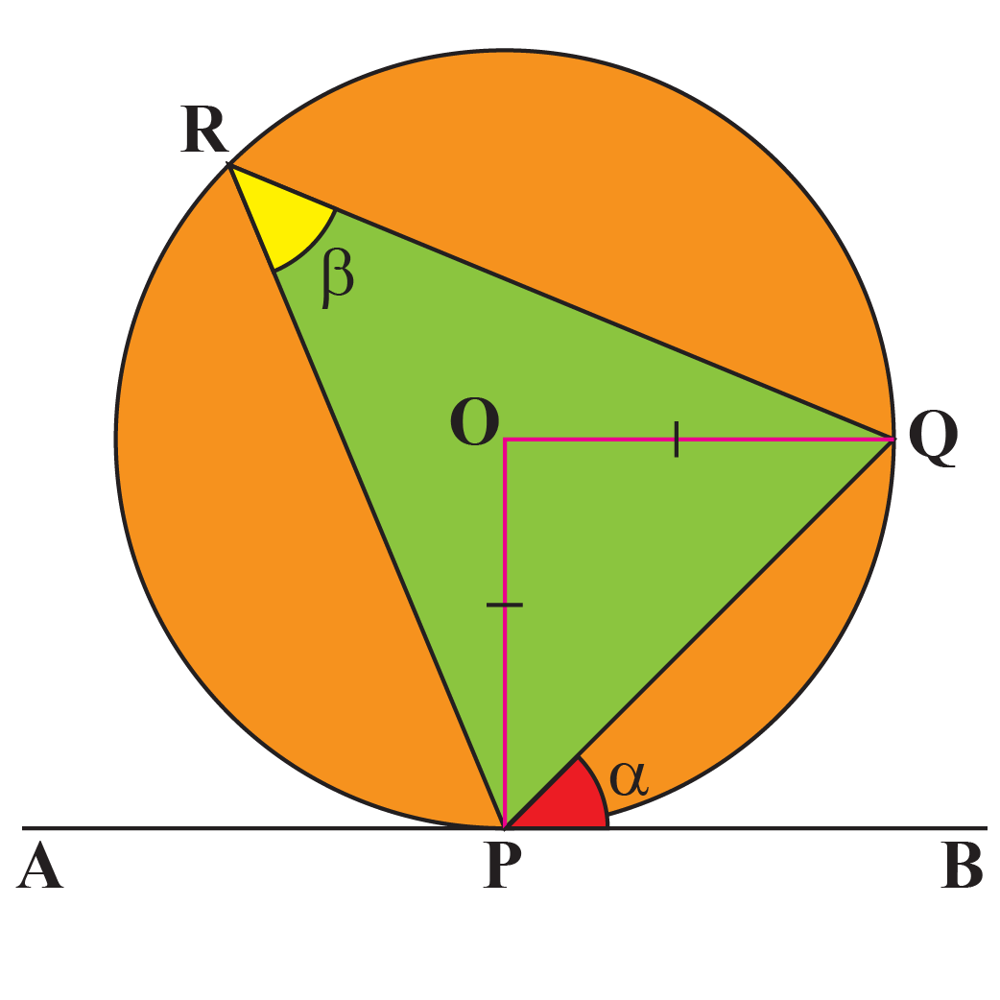

<div align='center'>
    <h1> Alternate Segment Theorem </h1>
</div>

The angle between the chord and the tangent is equal to the angle by the the chord in the alternate segment.

<div align='center'>
    
</div>

Let $P$ be a point on the circumference of a circle and $O$ be the centre.

Let $\overline{AB}$ be the tangent to the circle at $P$. The tangent makes an angle $\alpha$ with the chord $PQ$.

Consider the angle in the alternate segment,

```math
\angle PRQ = \beta
```

We aim to prove

```math
\alpha = \beta
```

#### Step 1 — Triangle $OPQ$

Since $OP$ and $OQ$ are radii of the circle,

```math
OP = OQ
```

Therefore triangle $OPQ$ is isosceles, giving

```math
\angle OPQ = \angle OQP
```

Using the angle sum of a triangle,

```math
\angle POQ = 180^\circ - \angle OPQ - \angle OQP
```

```math
\angle POQ = 180^\circ - 2\angle OPQ
\tag{1}
```

#### Step 2 — Tangent–Radius Property

A radius is perpendicular to a tangent at the point of contact.

```math
OP \perp AB
```

Hence

```math
\angle OPB = 90^\circ
```

Since the angle between the tangent $AB$ and the chord $PQ$ is $\alpha$,

```math
\alpha = 90^\circ - \angle OPQ
\tag{2}
```

#### Step 3 — Substitute

From (2),

```math
\angle OPQ = 90^\circ - \alpha
```

Substitute into (1):

```math
\angle POQ = 180^\circ - 2(90^\circ - \alpha)
```

```math
\angle POQ = 2\alpha
```

#### Step 4 — Angle at the Centre Theorem

The angle at the centre is twice the angle at the circumference subtended by the same arc.

```math
\angle POQ = 2\alpha
```

and

```math
    \angle POQ = 2\beta
```

Therefore,

```math
    2\alpha = 2\beta
```

Finally concluding,

```math
\boxed{\alpha = \beta}
```

Thus, the **angle between the tangent and the chord equals the angle in the alternate segment**, proving the **Alternate Segment Theorem**.