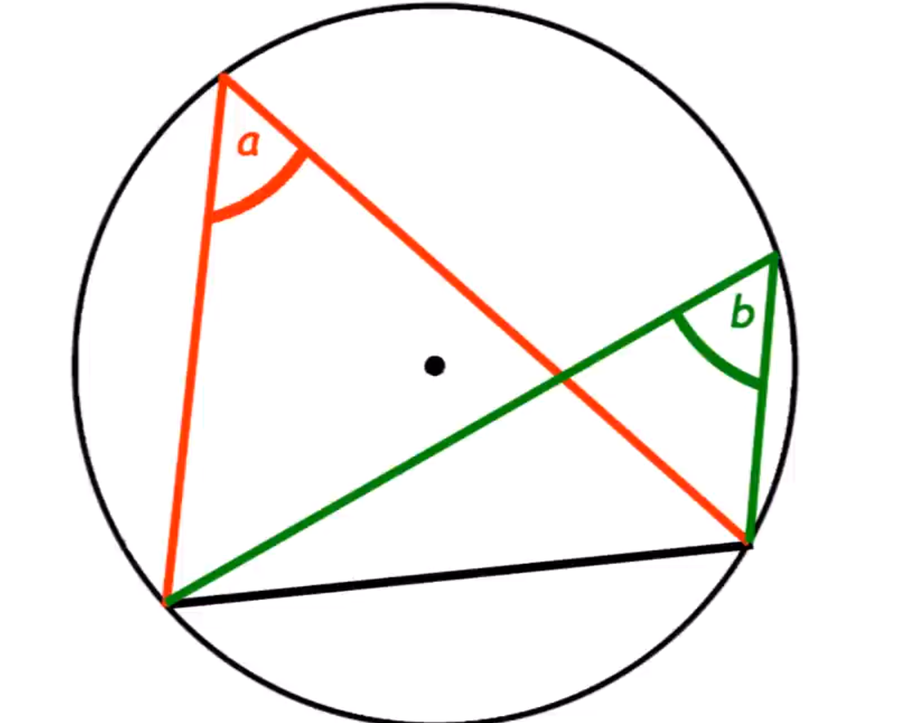
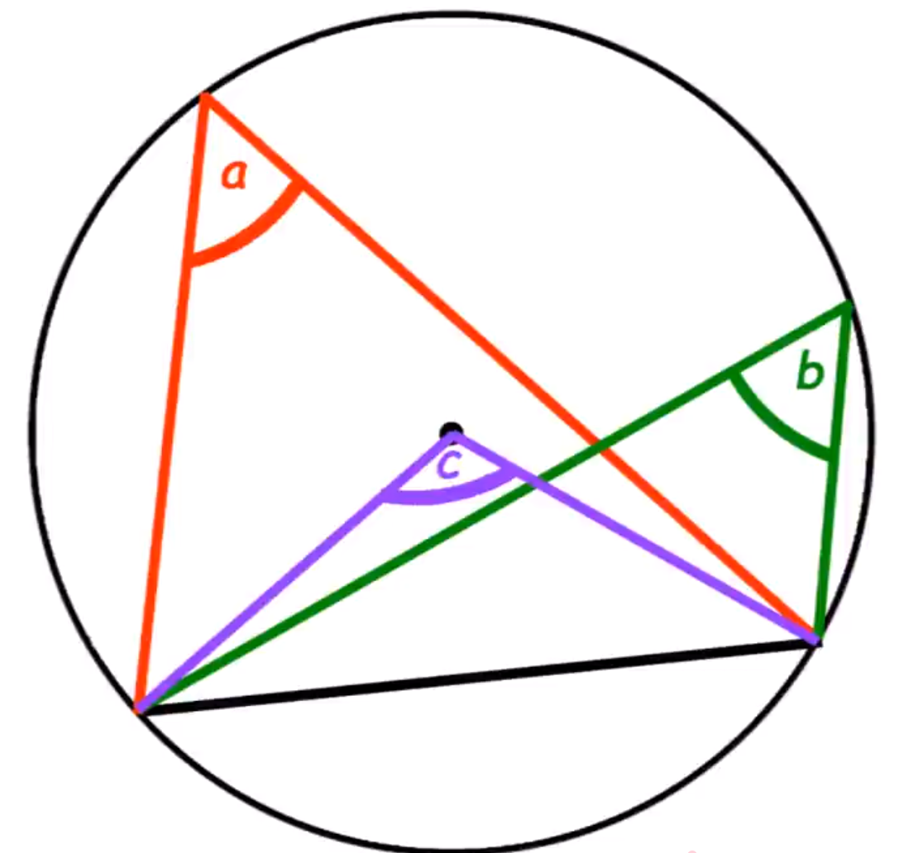

    <h1> Angles Subtending from the Same Arc are Equal

We will begin this proof by creating our illustration diagram. This contains angles \( a \) and \( b \).

    

Next, we will create another angle subtending to the arc. This will come from the centre of the circle.

    

Now, based on the circle theorm "Inscribed Angle Theorem" that states "The angle subtended by an arc at the centre of a circle is twice the angle subtended at any point on the circumfrence" this follows.

\[
2a = 2c \\
2b = 2c \\
\]

Therefore,

\[
2a = 2b \\
\boxed{a = b}
\]
