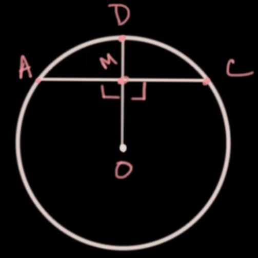
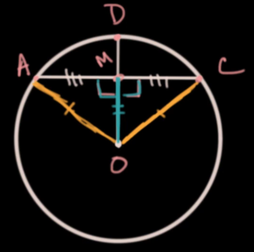

    <h1> Chord Bisector Theorem </h1>

The perpendicular bisector of a chord is a line passing through the center of the circle such that it divides the chord into two equal parts and meets the chord at a right angle.

    

Let \(O\) be the centre of the circle and let \(\overline{AC}\) be a chord.

Let \(OM\) intersect \(\overline{AC}\) at \(M\) such that

\[
OM \perp AC
\]

We want to prove

\[
AM = MC
\]

    

### Step 1 — Radii are equal

Since \(O\) is the centre of the circle,

\[
OA = OC
\]

because all radii of a circle are equal.

### Step 2 — Right angles are formed

Since

\[
OM \perp AC
\]

it follows that

\[
\angle OMA = \angle OMC = 90^\circ
\]

### Step 3 — Consider the triangles

Consider the triangles

\[
\triangle OMA \quad \text{and} \quad \triangle OMC
\]

### Step 4 — Show the triangles are congruent

We know

\[
OA = OC
\]

\[
OM = OM
\]

(common side)

\[
\angle OMA = \angle OMC
\]

Therefore

\[
\triangle OMA \cong \triangle OMC
\]

by the **RHS (Right angle–Hypotenuse–Side)** congruence rule.

### Step 5 — Conclude the chord is bisected

Since the triangles are congruent, corresponding sides are equal. Therefore

\[
AM = MC
\]

The line perpendicular from the centre of a circle to a chord bisects the chord.

\[
\boxed{AM = MC}
\]