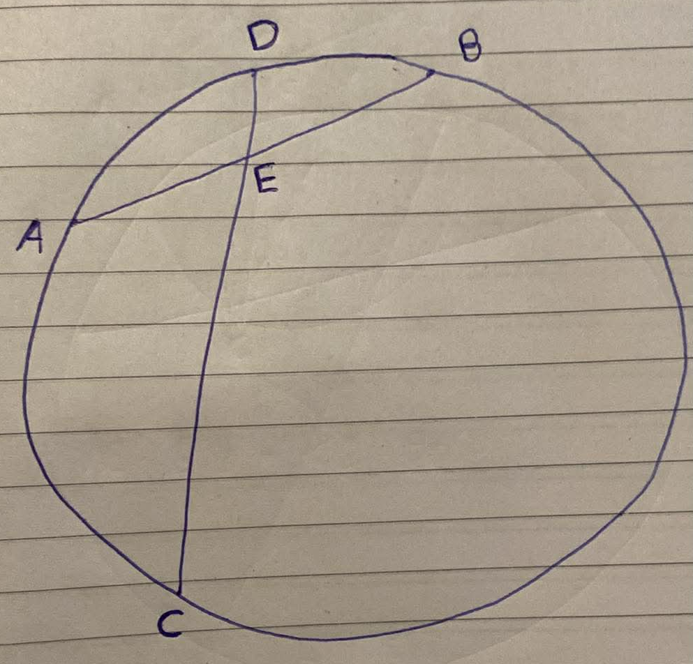
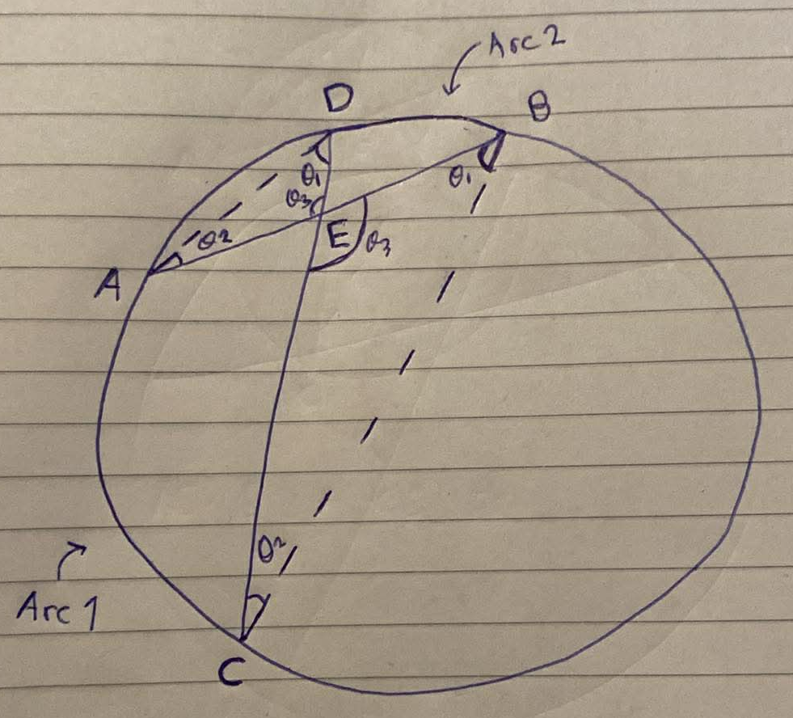

<div align='center'>
    <h1> Chord Chord Theorem </h1>
</div>

The Chord Chord Theorem states that,

```math
AE \cdot EB = CE \cdot ED
```

<div align='center'>
    
</div>

To begin this proof we will draw lines from verticies $A$ to $D$ and $C$ to $B$.

<div align='center'>
    
</div>

1. Because the $\angle ADC$ and $\angle ABC$ are from the want arc. They will therefore have the same angle, identified as $\theta_1$
2. Because the $\angle DAB$ and $\angle DCB$ are from the want arc. They will therefore have the same angle, identified as $\theta_2$
3. Finally, both the two triangles have two equal angles $\theta_1$ and $\theta_2$ and therefore implies that the last angle must be equal. Equivalently, because the two lines cross are straight lines, we know that the opposing angles are equal. Both methods can identify the last angle $\theta_3$

Because both triangles have equal angles, it means that these are **similar triangles**. This means, each side increases at the exact same ratio to keep the angles the same. Therefore,

```math
\frac{AE}{CE} = \frac{ED}{EB}
```

```math
AE \cdot EB = CE \cdot ED
```
