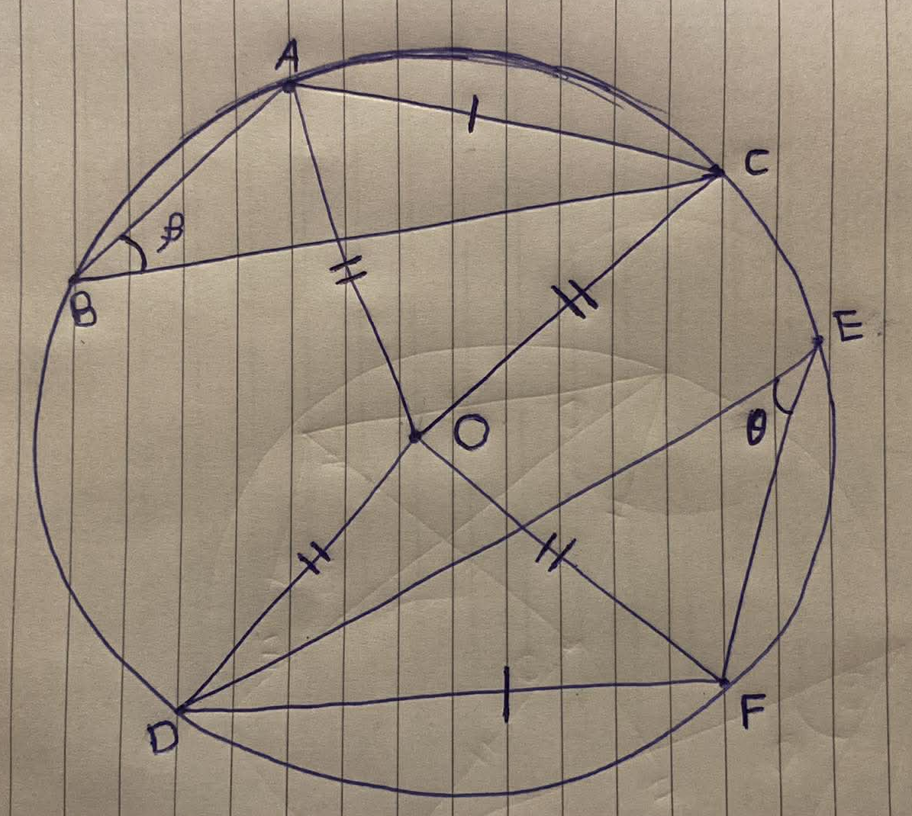

<div align='center'>
    <h1> Equal Chords Subtend Equal Angles Theorem </h1>
</div>


## Theorem

Equal chords in the same circle subtend equal angles at the circumference.

<div align='center'>
    
</div>


# Proof

Let $O$ be the centre of the circle.

Let $\overline{AC}$ and $\overline{DF}$ be chords of the circle such that

```math
AC = DF
```

Let

```math
\beta = \angle ABC
```

and

```math
\theta = \angle DEF
```

Join the radii

```math
OA, OC, OD, OF
```

### Step 1 — Radii are equal

Since $O$ is the centre of the circle,

```math
OA = OC = OD = OF
```

because all radii of a circle are equal.

### Step 2 — Compare the central triangles

Consider the triangles

```math
\triangle AOC
\quad \text{and} \quad
\triangle DOF
```

We know

```math
OA = OD
```

```math
OC = OF
```

```math
AC = DF
```

Therefore

```math
\triangle AOC \cong \triangle DOF
```

by **SSS congruence**.

### Step 3 — Central angles are equal

Thus

```math
\angle AOC = \angle DOF
```

### Step 4 — Use the inscribed angle theorem

Angles at the circumference standing on the same arc are half the corresponding central angle.

Thus

```math
\beta = \frac{1}{2}\angle AOC
```

and

```math
\theta = \frac{1}{2}\angle DOF
```

Since

```math
\angle AOC = \angle DOF
```

it follows that equal chords in the same circle subtend equal angles at the circumference.

```math
\boxed{\beta = \theta}
```
