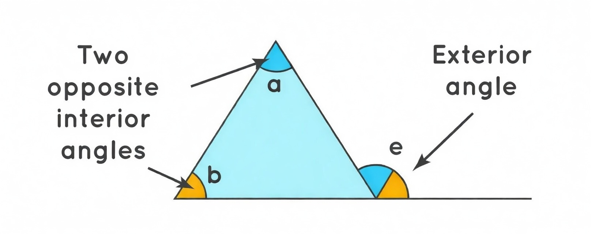
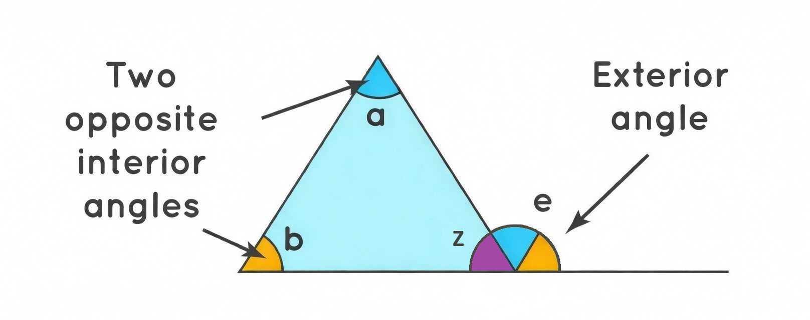

    <h1> Exterior Angle Theorem Proof </h1>

The measure of an exterior angle of a triangle is equal to the sum of the measures of the two remote interior angles (also called the non-adjacent or opposite interior angles).

An exterior angle is formed by extending one side of the triangle beyond a vertex. The exterior angle is the angle between that extended side and the adjacent side. The two remote interior angles are the interior angles of the triangle that are not adjacent to the exterior angle (i.e., the ones at the other two vertices).

In the example below, this states that the angle \( e \) will be equal to the sum of angle \( a \) and angle \( b \).

    

#### Proof

To create this proof, we will introduce a third variable \( Z \).

    

First, factor \( e \) into the equation by substituting out \( z \). The goal of this is to create a final equation to represent \( e \) using only \( a \) and \( b \).

Given,
\[
a + b + z = 180
\]

and,

\[
e + z = 180
\]

We will rewrite this into,

\[
z = 180 - e
\]

Therefore,

\[
\begin{aligned}
a + b + z &= 180 \\
a + b + 180 - e &= 180 \\
a + b - e &= 0 \\
\end{aligned}
\]

Finally giving us,

\[
    \boxed{a + b = e}
\]

This concludes that the exterior angle \( e \) is the sum of the two interior angles that non-adjacent to the exterior angle.
