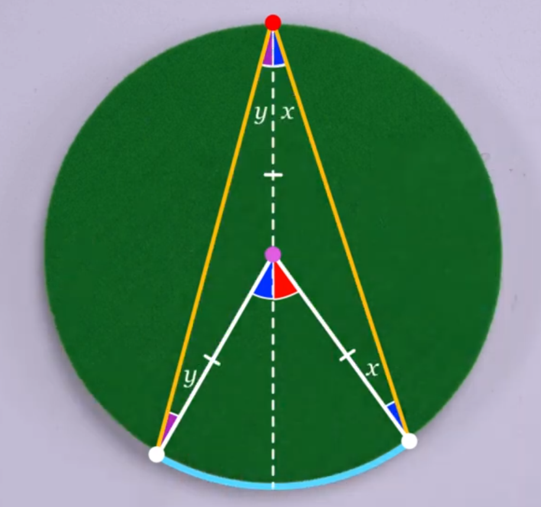
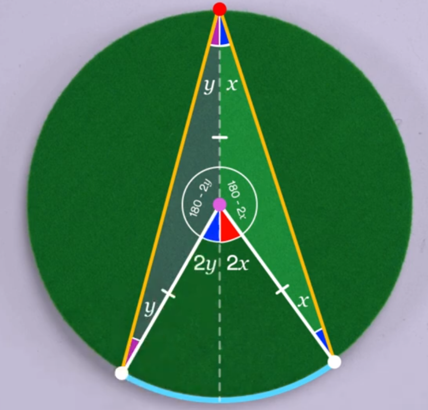
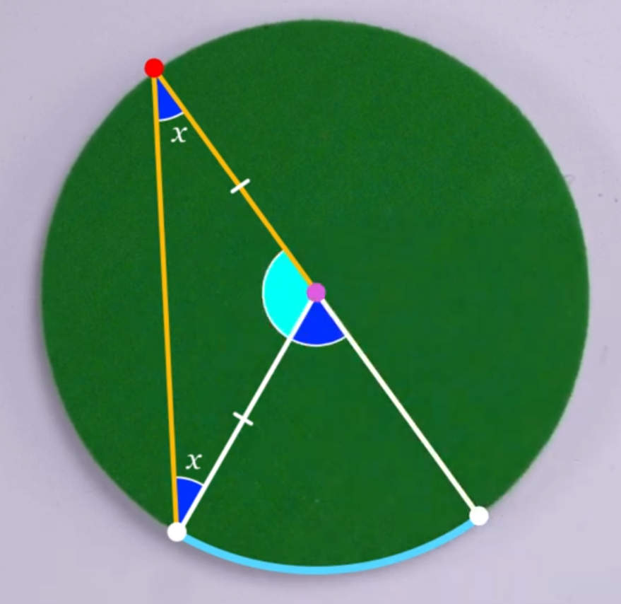
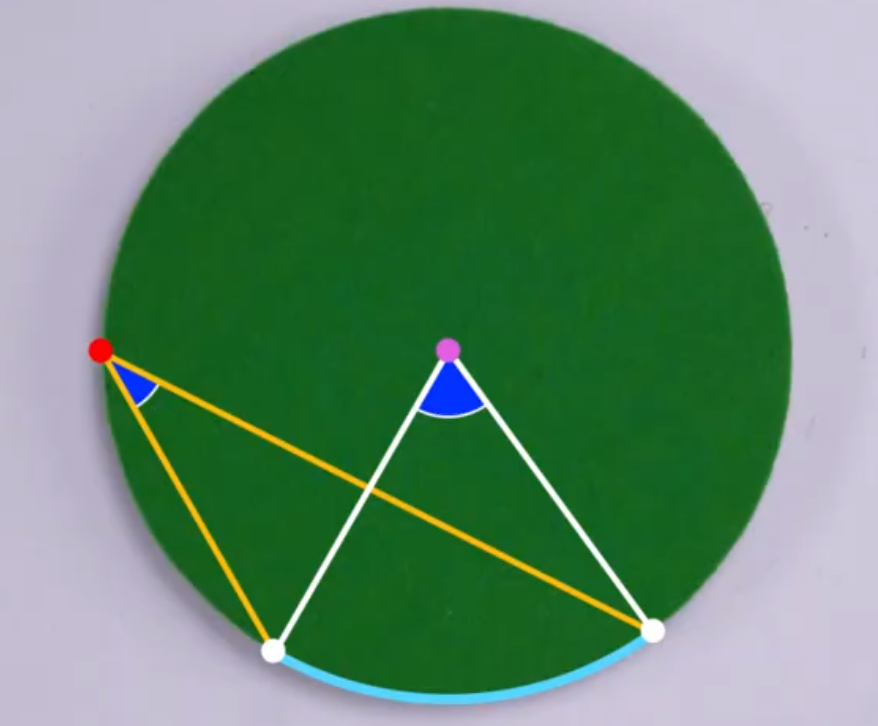
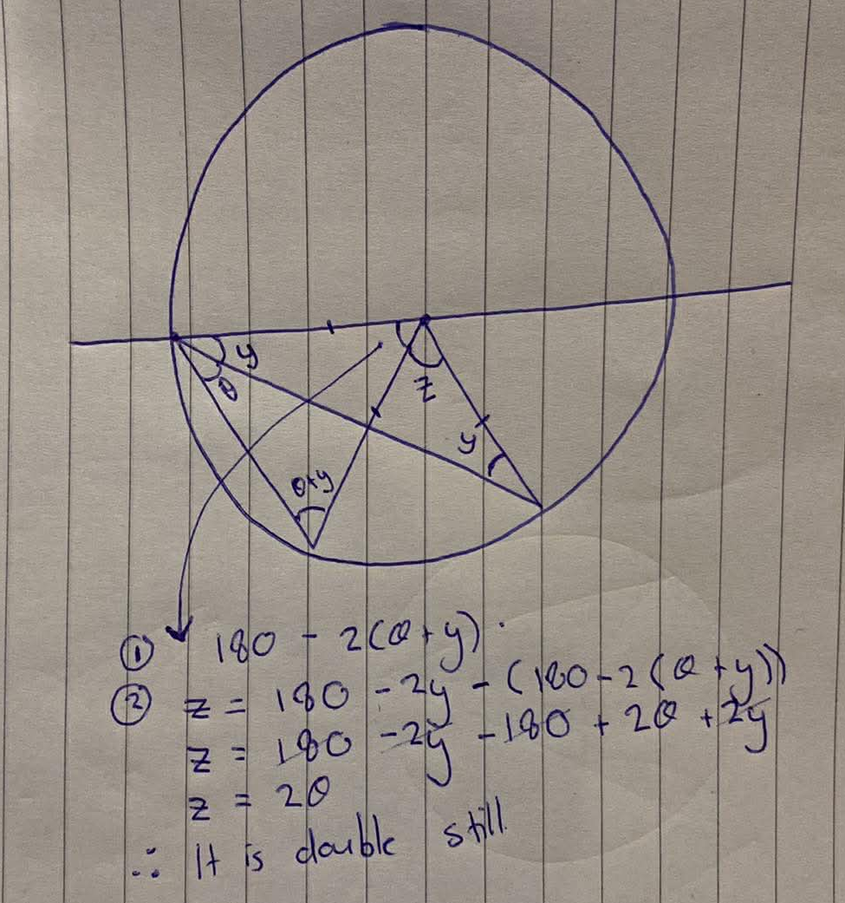

    <h1> Inscribed Angle Theorem </h1>

The inscribed angle theorem states that an angle θ inscribed in a circle is half of the central angle 2θ that intercepts the same arc on the circle.

- An inscribed angle is an angle whose vertex lies on the circle and whose sides are chords of the circle.
- An inscribed polygon is a polygon inside a circle with all its vertices touching the circle.

This is illustrated below via a diagram. Here, we attempt to prove this theorem.

    

## Proof Part One - The Angle is Above the Centre

To begin the proof, we will begin with the following operations.

1. Draw a line down the centre, splitting the angles in half.
2. Note that we have created two isosceles triangles. This is because the two sides of each triangle are the same length of the radius. From here, illustrate this by creating two angles of the same degree for each isoscele triangle named $ x $ and $ y $.

    

3. Given these are isoceles triangles we can mark the remaining angle as $ 180 - 2x $ and $ 180 - 2y $.
4. This means the remaining angle to be calculated can be immediately identified as $ 2x $ given the exterior angle theorem or calculated via,

$$
\begin{aligned}
180 - 2x + z &= 180 \\
-2x + z &= 0 \\
-2x &= -z \\
\end{aligned}
$$

Therefore,
$$
    \boxed{2x = z}
$$
Similarily for $ y $. Hence, the remaining angle is calculated as $ 2x $ and $ 2y $ for the opposing side.

    

Therefore, the inscribed angle is $ x + y $ and the bottom angle is $ 2(x + y$). Therefore, the angle from the center point to the arc is twice the angle on the inscribed angle on the same arc that lies on the circumfrance.

## Proof - The Arc Angle Crosses the Centre

Now, in the previous example we had the arc angle above the center angle. If instead it crosses, the following can be performed.

1. Create the subtended angle from the arc to the circumfrance.
2. Create another isoceles triangle (Due to both sides having the same length, the radius). Called these angles $ x $.
3. Therefore, the remaining angle inside the triangle is $ 180 - 2x $. Leading from this, the outside outside must therefore be $ 180$ (The angles on a straight line) $ - (180 - 2x) = 2x $.

Therefore, this still holds.

    

## Proof - The Arc Angle is Below the Centre

    

    

