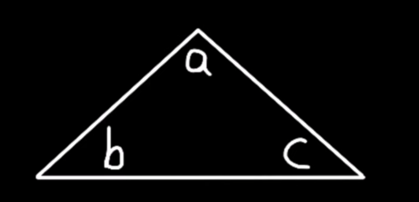
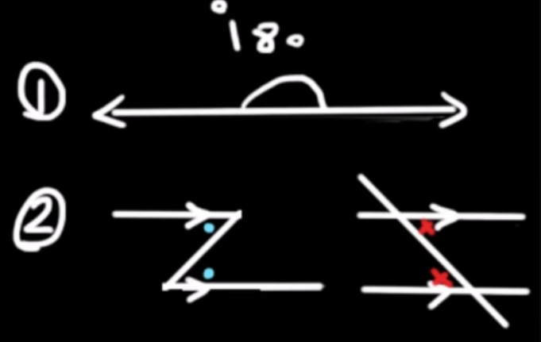

    <h1> The sum of angles inside a triangle equal 180 </h1>

We want to prove that $a + b + c = 180$.

    

To prove this, we need to use the properties of the relationship of parallel lines. To following geometric knowledge requirements for this include,

1. The angles above a straight line sum to 180.
2. Alternate interior angles for a given traversal passing two parallel lines are equal.

    

#### Step One - Draw Two Parallel Lines.

To begin, we include two parallel lines. The first parallel line will be added below any single triangle line with the second being parallel to this line, crossing another triangle vertex.

    

#### Step Two - Identify Parallel Line Properties.

Once we have added the two paralle lines, we can treat each triangle edge as a traversal. Hence, we can move the interior angle of the triangle to make it to the equal angle outside, identified below.

    

We know that,

$$
b + a + c = 180
$$

because these are the angles below the top parallel line, listed previously as geometric property one.

Therefore, this can be summarized as,

$$
\boxed{a + b + c = 180}
$$

Thus, proving that the sum of all angles inside a triangle equal 180.
