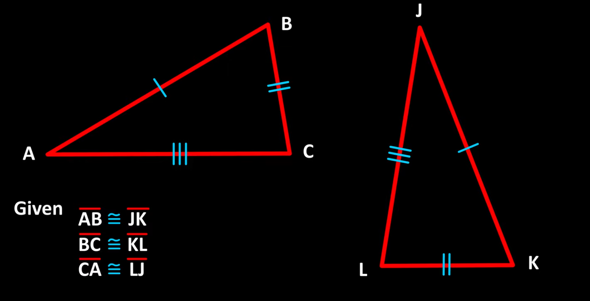
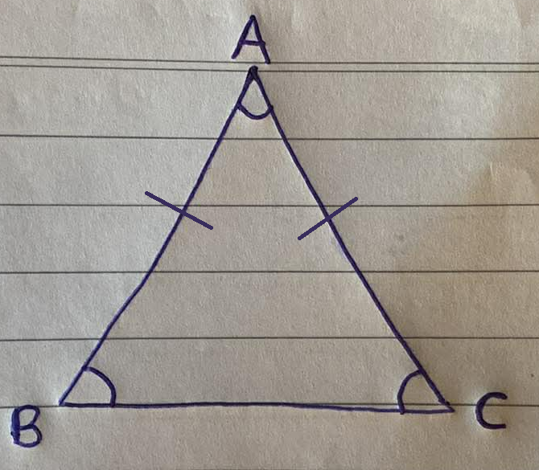
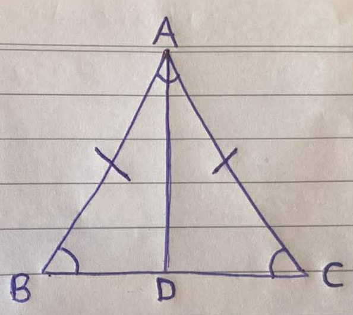

    <h1> Isoceles Triangle Proof </h1>

One of the foundational results in Euclidean geometry is the **Isosceles Triangle Theorem**, which states that in a triangle with two equal sides, the angles opposite those sides are equal. Although this result is sometimes explained informally using symmetry, a rigorous proof requires precise definitions and a structured logical argument.

### Terminology and Symbol Definitions

#### Triangle Notation

The symbol

$$
\triangle ABC
$$

denotes the triangle determined by three non-collinear points $A$, $B$, and $C$.

The sides of the triangle are the line segments:

$$
AB, \quad BC, \quad CA.
$$

Here, $AB$ denotes the **length** of the line segment joining points $A$ and $B$.

#### Equality of Line Segments

When we write

$$
AB = AC,
$$

we mean that the length of segment $AB$ equals the length of segment $AC$.

A triangle satisfying

$$
AB = AC
$$

is called an **isosceles triangle**.

#### Angle Notation

The symbol

$$
\angle ABC
$$

denotes the angle with vertex at point $B$, formed by segments $BA$ and $BC$.

The middle letter always indicates the vertex of the angle.

Thus:

- $\angle ABC$ is the angle at $B$.
- $\angle BCA$ is the angle at $C$.

#### Congruence

The symbol

$$
\cong
$$

denotes **congruence**.

Two triangles are congruent if:

- Their corresponding sides are equal in length.
- Their corresponding angles are equal in measure.

Thus,

$$
\triangle ABD \cong \triangle ACD
$$

means triangle $ABD$ and triangle $ACD$ are identical in size and shape.

    

#### The Side–Side–Side (SSS) Congruence Theorem

The **SSS Congruence Theorem** states:

> If three sides of one triangle are equal in length to three sides of another triangle, then the two triangles are congruent.

This theorem is the central logical tool in the proof.

## Statement of the Theorem

Let $\triangle ABC$ be a triangle such that

$$
AB = AC.
$$

Then,

$$
\angle ABC = \angle BCA.
$$

Where A, B and C are verticies on the triangle.

    

## Proof

#### Step 1 — Construction of a Midpoint

Let $D$ be the midpoint of segment $BC$.

By definition of midpoint:

$$
BD = DC
$$

and point $D$ lies on segment $BC$.

Construct the segment $AD$.

We now consider two triangles:

$$
\triangle ABD
\quad \text{and} \quad
\triangle ACD.
$$

    

#### Step 2 — Establish Equality of Three Sides

We verify three equalities:

1. From the hypothesis:

$$
AB = AC
$$

2. From the definition of midpoint:

$$
BD = DC
$$

3. By the reflexive property of equality:

$$
AD = AD
$$

#### Step 3 — Apply SSS Congruence

Since the three corresponding sides of $\triangle ABD$ and $\triangle ACD$ are equal, the SSS Congruence Theorem implies:

$$
\triangle ABD \cong \triangle ACD
$$

#### Step 4 — Deduce Equality of Angles

By the definition of congruence, corresponding angles of congruent triangles are equal. Therefore,

$$
\angle ABD = \angle DCA
$$

Because point $D$ lies on segment $BC$, the lines $BD$ and $BC$ are collinear. Thus,

$$
\angle ABD = \angle ABC
$$

and similarly,

$$
\angle DCA = \angle BCA
$$

Hence,

$$
\angle ABC = \angle BCA
$$
