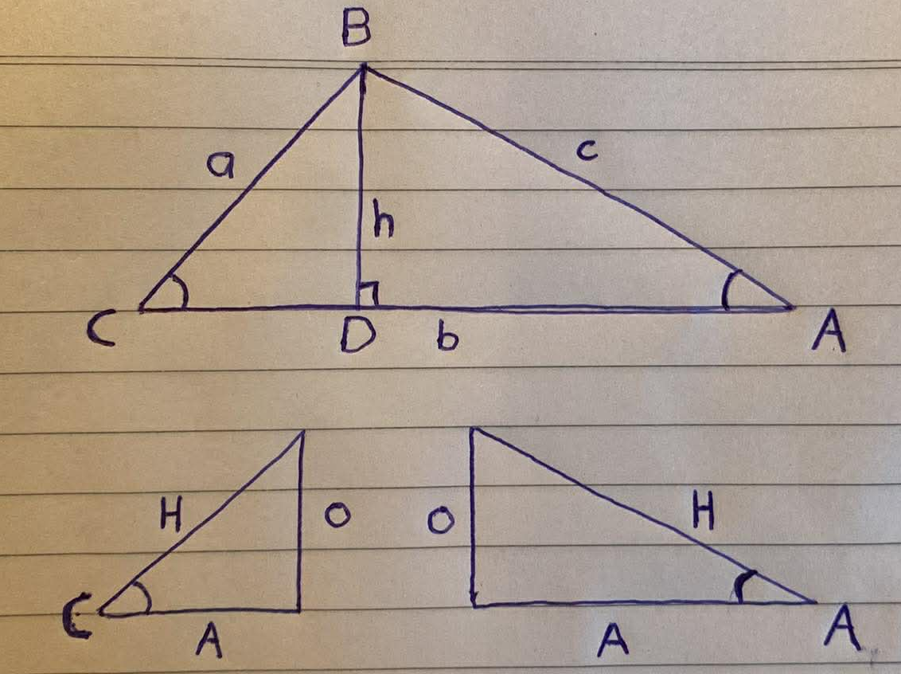

    <h1> Law of Cosines </h1>

The Law of Cosines states that for any triangle $ABC$, with sides $a$, $b$ and $c$.

$$c^2 + a^2 + b^2 -2ab\cos(C)$$

    

This definition proceeds using the definition of cosine,

$$\cos(\theta) = \frac{A}{H} = \frac{\text{Adjacent}}{\text{Hypotenuse}}$$

1. In the right triangle $BCD$, from the definition of cosine.

$$
\begin{aligned}
\cos(C) &= \frac{CD}{a} \\
CD &= a \cos(C)
\end{aligned}
$$

2. Subtract from side $b$

$$
\begin{aligned}
CD &= b - DA \\
b - DA &= a \cos(C) \\
\end{aligned}
$$

Therefore,

$$\boxed{DA = b - a \cos(C)}$$

3. In the triangle $BCD$, from the definition of sine.

$$
\begin{aligned}
\sin(C) &= \frac{BD}{a} \\
\end{aligned}
$$

Therefore,

$$\boxed{BD = a \sin(C)}$$

4. In the triangle $ADB$, apply the Pythagorean Theorem.

$$
c^2 = BD^2 + DA^2
$$

4. Substitute for $BD$ and $DA$.

Previously calculated,

$$
\begin{aligned}
BD &= a \sin(C) \\
DA &= b - a \cos(C)
\end{aligned}
$$

Therefore,

$$
\begin{aligned}
c^2 &= (a \sin(C))^2 + (b - a \cos(C))^2 \\
    &= a^2 \sin^2(C) + b^2 - 2ab \cos(C) + a^2 \cos^2(C)
\end{aligned}
$$

5. Rearrange the terms.

Factor out $a^2$ to create,

$$c^2 = a^2(\sin^2(C) + cos^2(C)) + b^2 -2ab\cos(C)$$

Now, because $sin^2(\theta) + cos^2(\theta) = 1$ we can condense this to finally prove,

$$\boxed{c^2 = a^2 +b^2 -2ab\cos(C)}$$