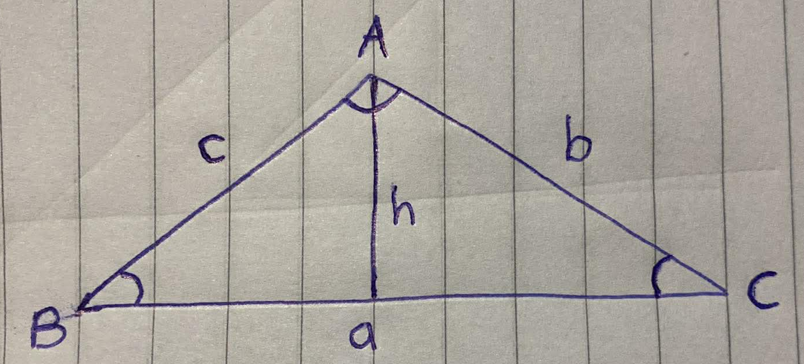
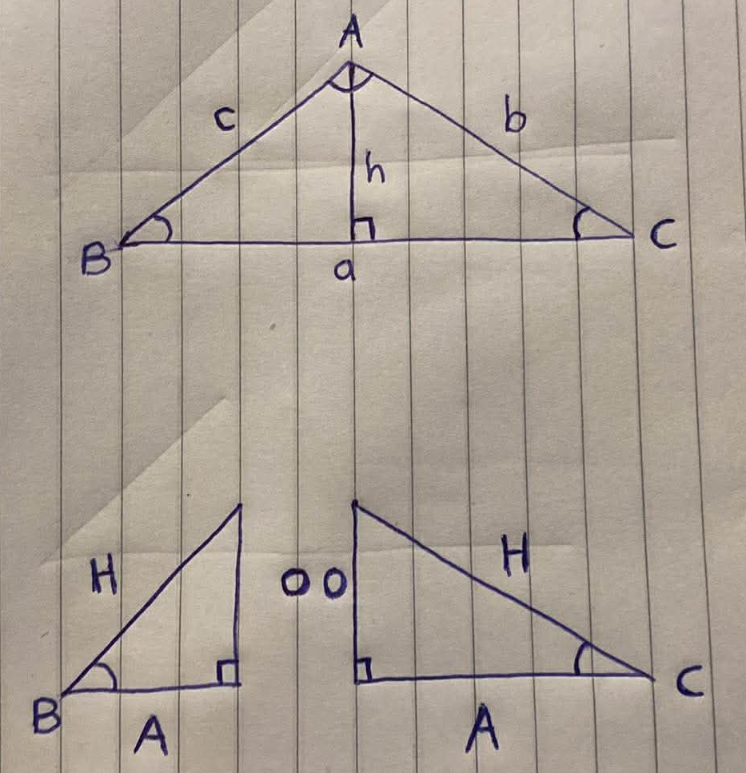
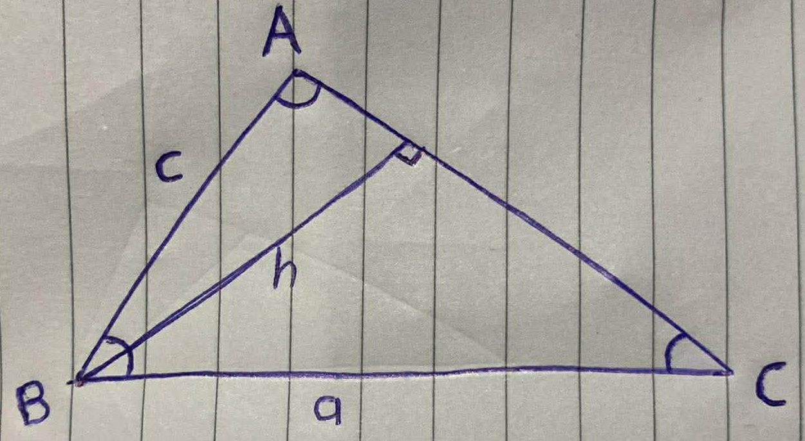
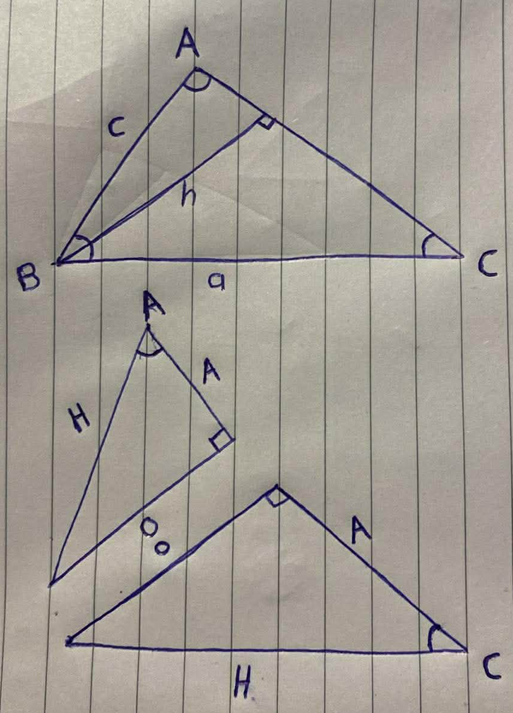
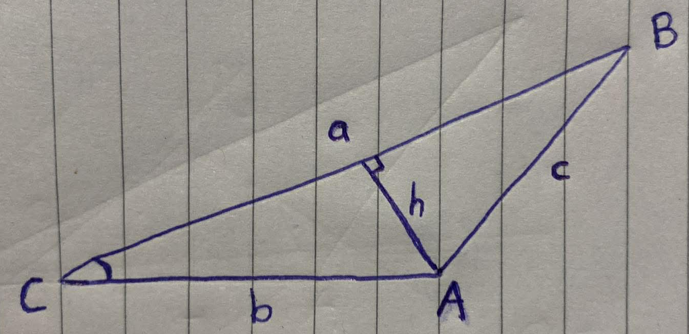
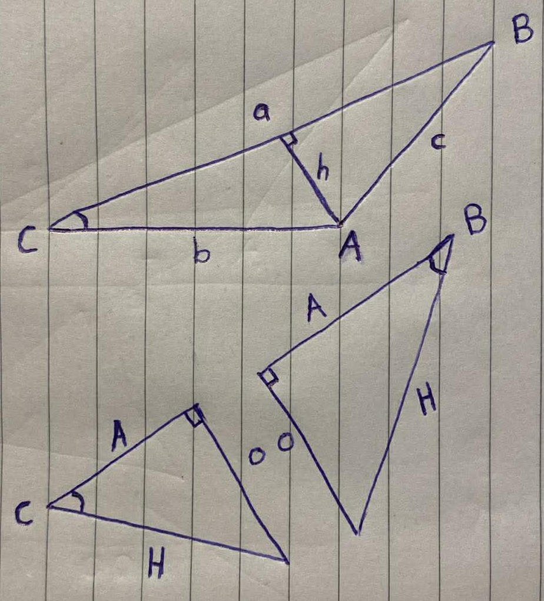
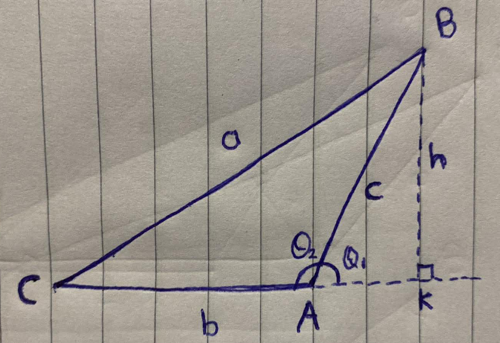
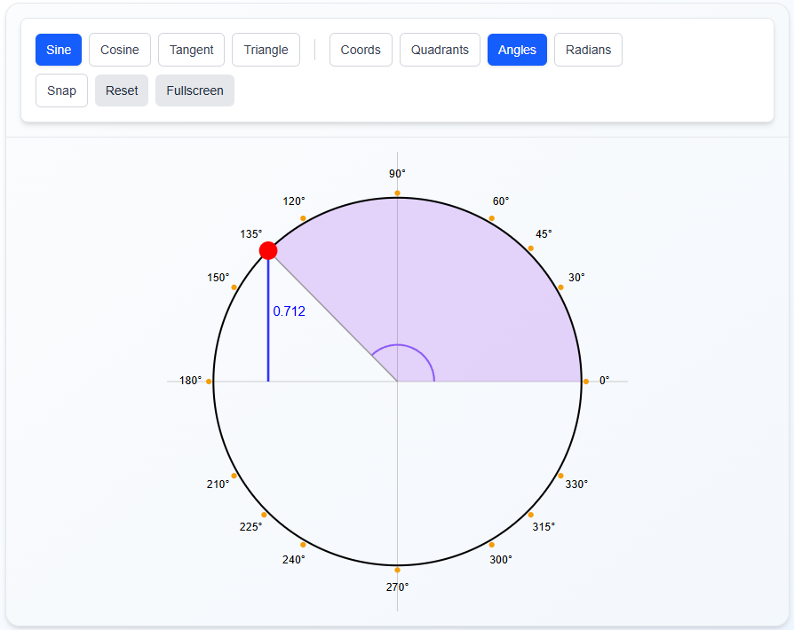
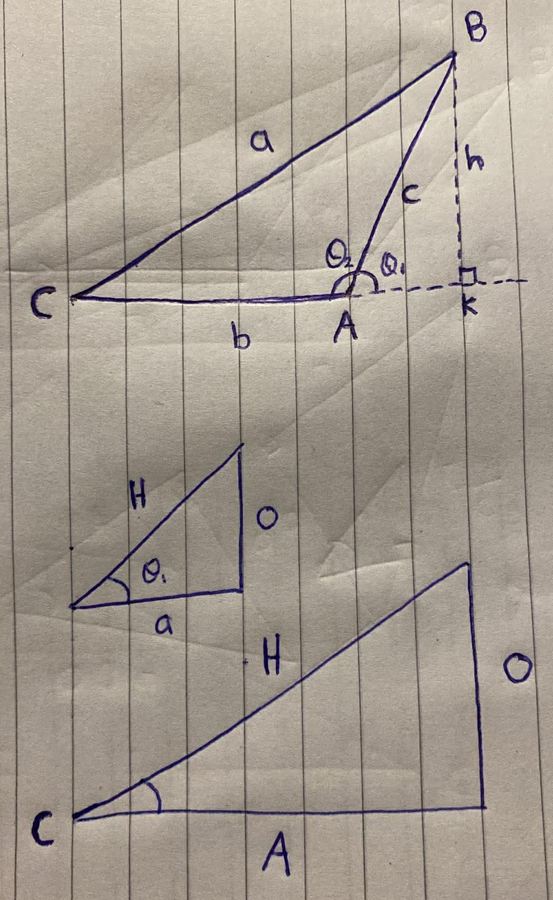

    <h1> Law of Sines </h1>

The Law of Sines states that for any triangle ABC, with sides $a$, $b$ and $c$,

$$\frac{a}{\sin(A)} = \frac{b}{\sin(B)} = \frac{c}{\sin(C)}$$

A proof in geometry is sufficient only if it establishes a statement for all cases allowed for its assumptions, using definitions and arguments that remain valid across those cases. If any configuration is excluded or relies on conditions not guaranteed by the hypothesis, the proof is incomplete.

In the context of Law of Sines, a proof using only acute triangles is not sufficient because it depends on constructing a perpendicular height within the triangle and interpreting sine using right-triangle ratios, which are only valid for angles less than $90^\circ$. This argument does not extend to obtuse triangles, where the perpendicular lies outside the triangle and the same geometric relationships do not hold in the same way.

By including both acute and obtuse cases, the proof becomes sufficient because it accounts for all possible triangle configurations. Together, these cases ensure that the Law of Sines is established for any triangle, satisfying that a geometric proof must be universally valid within its domain.

### Acute Triangles

    

##### 1. Define the altitude $h$ from the vertex $A$ of the triangle 

##### 2. Define known relationships

Given that we have created two right angle triangles, we will use both to define two relationships. Remember that the hypotenuse is always the longest side of a triangle, but the opposite can change depending on which angle you want.

    

- The **opposite**, labeled $O$ is the side opposite the angle. In both situations with angle $\angle B$ or $\angle C$, this corresponds to the side $h$.
- The **hypotenuse** is different for each right angle triangle. For calculating $\angle B$, it is the side labeled $c$. For calculating $\angle C$, it is the side labeled $b$.

$$
\sin(\theta) = \frac{O}{H}
$$

Therefore,

$$
\begin{align*}
\sin B &= \frac{h}{c} \\
\sin C &= \frac{h}{b}
\end{align*}
$$

Which can be rearranged to:

$$
\begin{align*}
c \cdot \sin B &= h \\
b \cdot \sin C &= h
\end{align*}
$$

Since both equal $h$,

$$
c \cdot \sin B = b \cdot \sin C
$$

Dividing both sides by $\sin B \cdot \sin C$ gives:

$$
\boxed{\frac{c}{\sin C} = \frac{b}{\sin B}}
$$ 

Now that this is an established relationship for $c$ and $b$, we need to include $a$ to complete the proportionality relationship. To complete this we create an identical triangle but instead create two right angle triangles by extending a line from vertex $B$.

    

This will again create two right angle triangles.

    

$$
\sin(\theta) = \frac{O}{H}
$$

Therefore,

$$
\begin{align*}
\sin A &= \frac{h}{c} \\
\sin C &= \frac{h}{a}
\end{align*}
$$

Which can be rearranged to:

$$
\begin{align*}
c \cdot \sin A &= h \\
a \cdot \sin C &= h
\end{align*}
$$

Since both equal $h$,

$$
c \cdot \sin A = a \cdot \sin C
$$

Dividing both sides by $\sin A \cdot \sin C$ gives:

$$
\frac{c}{\sin C} = \frac{a}{\sin A}
$$

##### 3. Join the relationships

From the two derived relationships we have:

$$
\frac{c}{\sin C} = \frac{b}{\sin B}
$$

and

$$
\frac{c}{\sin C} = \frac{a}{\sin A}
$$

Since both ratios are equal to $\frac{c}{\sin C}$, it follows that all three ratios are equal:

$$
\boxed{\dfrac{a}{\sin A} = \dfrac{b}{\sin B} = \dfrac{c}{\sin C}}
$$

This is the **Law of Sines**.

### Obtuse Triangles

The proof above requires that we draw two altitudes of the triangle. In the case of obtuse triangles, two of the altitudes are outside the triangle, so we need a slightly different proof. It uses one interior altitude and one exterior altitude.

    

From here, create two right angle triangles from vertex $A$ by creating the line $h$.

- The **opposite**, labeled $O$ is the side opposite the angle. In both situations with angle $\angle B$ or $\angle C$, this corresponds to the side $h$.
- The **hypotenuse** is different for each right angle triangle. For calculating $\angle B$, it is the side labeled $c$. For calculating $\angle C$, it is the side labeled $b$.

    

$$
\sin(\theta) = \frac{O}{H}
$$

Therefore,

$$
\begin{align*}
\sin B &= \frac{h}{c} \\
\sin C &= \frac{h}{b}
\end{align*}
$$

Which can be rearranged to:

$$
\begin{align*}
c \cdot \sin B &= h \\
b \cdot \sin C &= h
\end{align*}
$$

Since both equal $h$,

$$
c \cdot \sin B = b \cdot \sin C
$$

Dividing both sides by $\sin B \cdot \sin C$ gives:

$$
\boxed{\frac{c}{\sin C} = \frac{b}{\sin B}}
$$ 

Now that this is an established relationship for $c$ and $b$, we need to include $a$ to complete the proportionality relationship. To complete this we create an identical triangle but instead create a single right angle triangles by extending a line from vertex $B$.

    

The angles $BAC$ and $BAK$ are supplementary, so the sine of both are the same. That is,

$$\sin(\theta) = \sin(180 - \theta)$$

Below illustrates an example with $45^\circ$, that is,

$$\sin(45) = \sin(180-45)$$

    

This proof involves the smaller triangle and the larger triangle.

    

Given that

$$
\sin(\theta_1) = \frac{h}{c}
$$

and from the supplementary angle identities of sine previously mentioned,

$$
\sin(\theta_1) = \sin(\theta_2)
$$

it follows that

$$
\begin{align*}
\sin(\theta_1) &= \sin(\theta_2) = \frac{h}{c} \\
\sin(\theta_2) &= \frac{h}{c} \\
c \cdot \sin(\theta_2) &= h
\end{align*}
$$

Because $\theta_2$ is equal to $A$, we finally have,

$$\boxed{c \cdot \sin(A) = h}$$

Next, we need to creation a relationship using the larger triangle. That is,

$$\sin(C) = \frac{h}{a}$$

Therefore,

$$\boxed{a \cdot \sin(C) = h}$$

Combining both into,

$$a \cdot \sin(C) = c \cdot \sin(A)$$
$$\boxed{\frac{a}{\sin(A)} = \frac{c}{\sin(C)}}$$

Finally, we can combine the previous equality,

$$
\frac{c}{\sin C} = \frac{b}{\sin B}
$$ 

to prove for an obtuse triangle,

$$
\boxed{\frac{a}{\sin A} = \frac{c}{\sin C} = \frac{b}{\sin B}}
$$ 