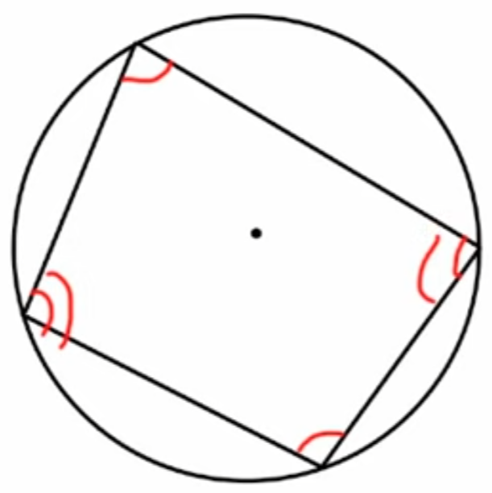
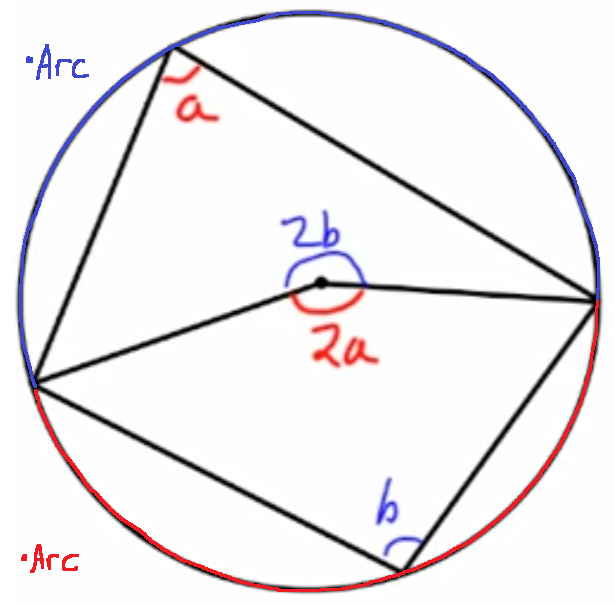
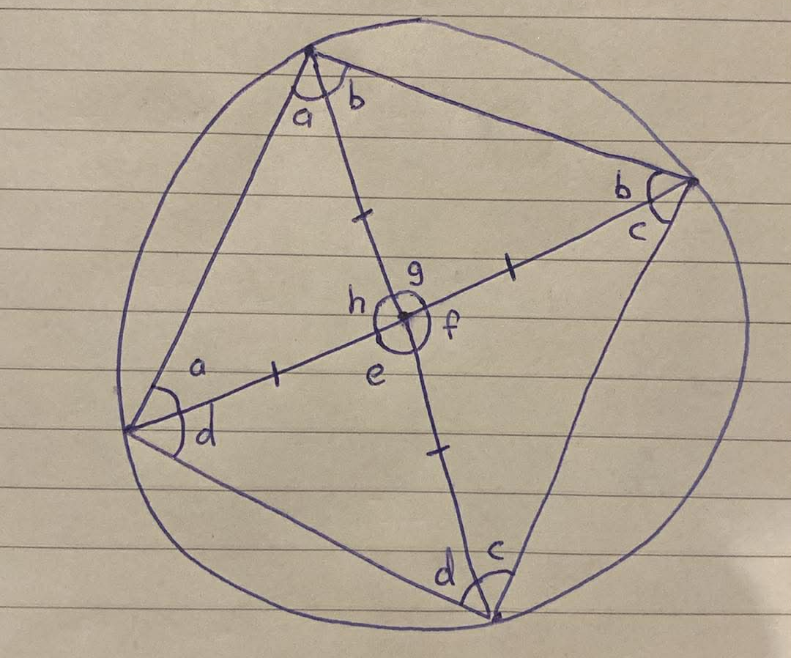

    <h1> Opposite angles in a cyclic quadrilateral sum to 180 </h1>

A cyclic quadrilateral is a quadrilateral whose four vertices lie on a single circle circumfrance. If all four verticies do not lie on the circle cumfrance, it is considered a quadrilateral. Such figures possess a number of elegant and powerful angle properties that make them central objects in classical Euclidean geometry. The defining characteristic of a cyclic quadrilateral is that each interior angle subtends an arc of the same circle, which leads to the fundamental result that opposite angles sum to 180.

#### Proof One - Using Inscribed Angle Theorem

The first proof we will do is show this relationship using the inscribed angle theorem. The original cyclic quadrilateral is drawn below.

    

We will now create a situation to apply the inscribed angle theorem.

    

We know that,

\[
    2a + 2b = 360
\]

Therefore,

\[
    a + b = 180
\]

#### Proof Two - Using Isoceles Triangles

    

**Given:**

\[
\begin{aligned}
2a + h &= 180 \\
2b + g &= 180 \\
2c + f &= 180 \\
2d + e &= 180
\end{aligned}
\]

**Rearranging:**

\[
\begin{aligned}
a &= \frac{180 - h}{2} \\
b &= \frac{180 - g}{2} \\
c &= \frac{180 - f}{2} \\
d &= \frac{180 - e}{2}
\end{aligned}
\]

**Summing:**

\[
\begin{aligned}
a + b + c + d
&= \frac{1}{2}
\left(
(180 - h) + (180 - g) + (180 - f) + (180 - e)
\right) \\
&= \frac{1}{2}
\left(
720 - (h + g + f + e)
\right)
\end{aligned}
\]

Since angles around a point sum to \(360^\circ\),

\[
h + g + f + e = 360
\]

**Substitute:**

\[
\begin{aligned}
a + b + c + d
&= \frac{1}{2}(720 - 360) \\
&= \frac{1}{2}(360) \\
&= 180
\end{aligned}
\]

\[
\boxed{(a + b) + (c + d) = 180^\circ}
\]