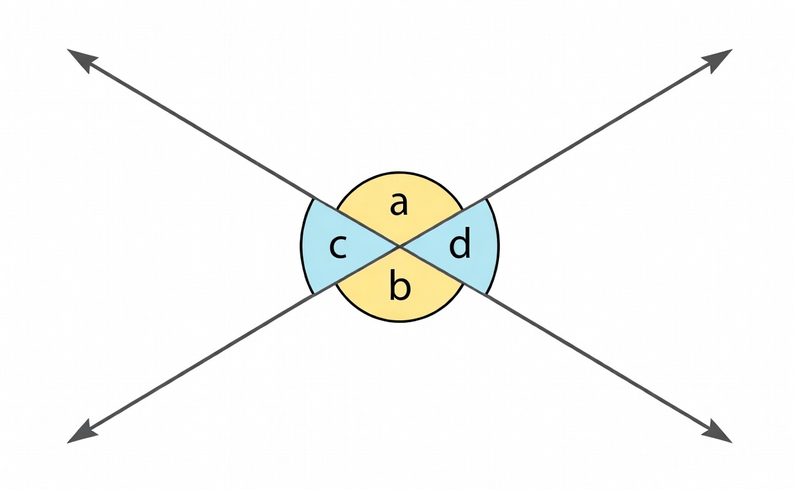

    <h1> Opposing Angles are Equal </h1>

While it maybe intuitive to some, mathematical proofs are a very useful method to understanding why some mathematical properties are defined the way they are.

When **two straight lines cross**, they form four angles at that single common point (the vertex). The two pairs of opposite (non-adjacent) angles are called vertical angles because they share the same vertex and stand "vertically opposite" each other across that point—meaning they are positioned directly across from one another through the intersection.

The vertical angles theorem (sometimes called the opposing or opposite angles theorem) states that when two straight lines intersect, the pairs of opposite angles formed are equal in measure. This behaviour occurs when two lines intersect, four angles are formed. There are two pairs of non-adajcent angles. These pairs are called vertical angles. In the image below (a,b) and (c,d) are vertical angle pairs.

    

Here, we to prove that $a = b$ and $c = d$.

We know by mathematical definition,

$$
a + d = 180
$$

This is because angles above any line sum to 180. We can do the same thing for,

$$
d + b = 180
$$

Therefore,

$$
a + d = d + b \\
a = b
$$

Hence, this is a simple proof to known that opposing angles are identical. Different approaches can also be done such as,

$$
a + c = 180 \\
c + b = 180
$$

Now, format this back to $c$

$$
c = 180 - a \\
c = 180 - b
$$

Now, replace the common factor of $c$.

$$
180 - a = 180 - b \\
-a = -b \\
\boxed{a = b}
$$
