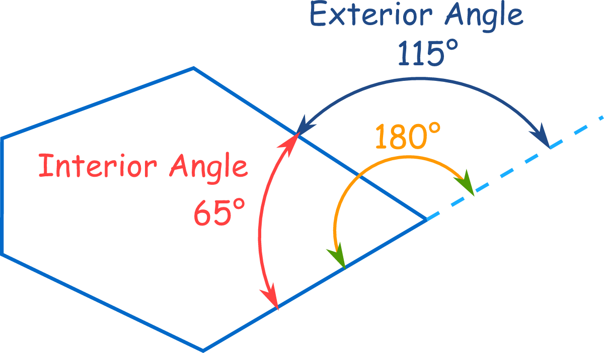
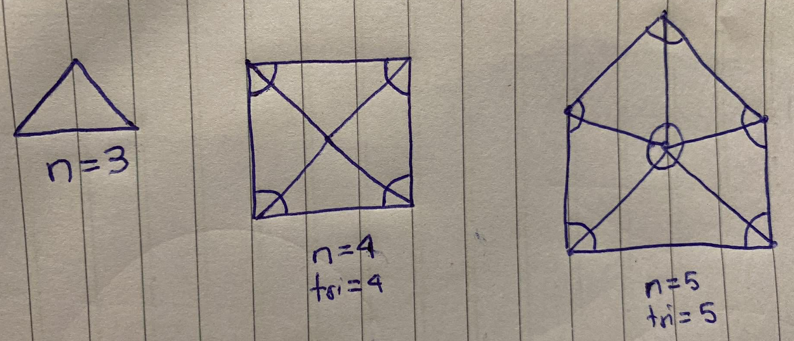
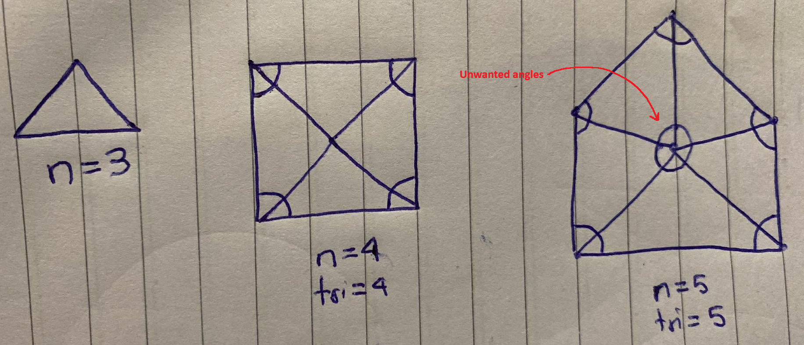
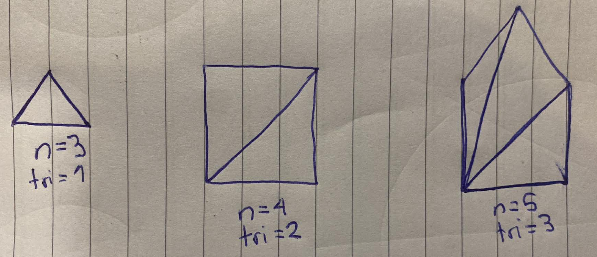
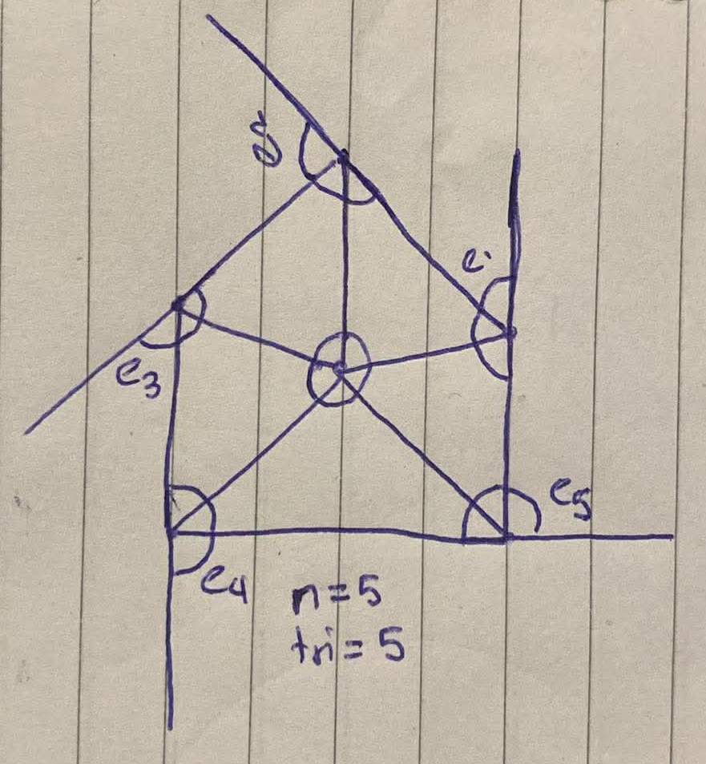

<div align='center'>
    <h1> Sum of Interior Angles </h1>
</div>

The interior angle of a polygon is the angle inside the shape at each vertex, formed by two adjacent sides, while the exterior angle is the turning angle you make at that vertex when traversing the boundary in one consistent direction (typically 180° minus the interior angle at convex vertices). Their key relationship is that, at every vertex, the interior angle and its corresponding exterior angle are supplementary and add up to exactly 180°.

<div align='center'>
    
</div>

Now, the sum of the interior angles is not always a constant value and we will construct two proofs to construct a formula to calculate the sum of the interior angles.

#### Proof One

To begin this proof, we will create a visual diagram of the the first three shapes from $n$ equals 3 to 5.

<div align='center'>
    
</div>

1. For each shape with $n$ numbers of verticies, create a point in the centre of the shape and draw a line to each vertex.
2. For each shape, for $n$ number of verticies we have created $n$ number of triangles.
3. Each triangle has $180$ degrees of angles, this means the sum of all angles for the total number of triangles is $n \cdot 180$.
4. The previous calculation $n \cdot 180$ includes the angles that do not include the shape interior angles, that is, it contains the angles in the triangle that are not part of the interior shape angles.

<div align='center'>
    
</div>

Therefore, we need to keep the calculation that involves the complete interior angle and exclude the angles we do not want. These are the angles that sum to 360 that are all angles that are not the angles used for the interior angle.

```math
\begin{align*}
n \cdot 180 - 360 &= n \cdot 180 - 2 \cdot 180 \\
&= 180(n - 2)
\end{align*}
```

Therefore, the sum of the interior angles in a shape will be,

```math
\boxed{180(n-2)}
```

#### Proof Two

The second method of this proof is to instead connect each vertex with every other vertex. This creates a relationship where the number of triangles is always 2 less than $n$. Hence, this immediately creates the formula $180(n - 2)$.

<div align='center'>
    
</div>

#### Proof - Exterior Angles of a Convex, non-intersecting Polygon Sum to 360

Now, we can use this proof to to prove that the sum of the exterior angles of any polygon equal 360.

<div align='center'>
    
</div>

- Let the polygon be a simple polygon (non-self-intersecting, closed) with $n \geq 3$ sides (and therefore $n \geq 3$ vertices).  
- Let the interior angles be denoted $\alpha_1, \alpha_2, \dots, \alpha_n$.  
- At each vertex, the corresponding exterior angle (taken in a consistent turning direction) is $180^\circ - \alpha_i$.

The sum of all exterior angles is:

```math
\sum_{i=1}^{n} (180^\circ - \alpha_i)
```

Distribute the summation:

```math
\sum_{i=1}^{n} (180^\circ - \alpha_i) = \sum_{i=1}^{n} 180^\circ - \sum_{i=1}^{n} \alpha_i
```

The first sum is $180^\circ$ added $n$ times:

```math
\sum_{i=1}^{n} 180^\circ = n \times 180^\circ
```

So the expression becomes:

```math
n \times 180^\circ - \sum_{i=1}^{n} \alpha_i
```

From the proof illustrated above we know that the sum of the interior angles is $(n - 2) \times 180$.

```math
\sum_{i=1}^{n} \alpha_i = 180^\circ(n - 2)
```

Substitute this in:

```math
n \times 180^\circ - 180^\circ(n - 2) \\
n \times 180^\circ -180^\circ \times n + 360^\circ\\
\cancel{n \times 180^\circ} \cancel{-180^\circ \times n} + 360^\circ = 360^\circ\\
```

Therefore, for any simple polygon with $n \geq 3$ sides:

```math
\sum \text{exterior angles} = 360^\circ
```
