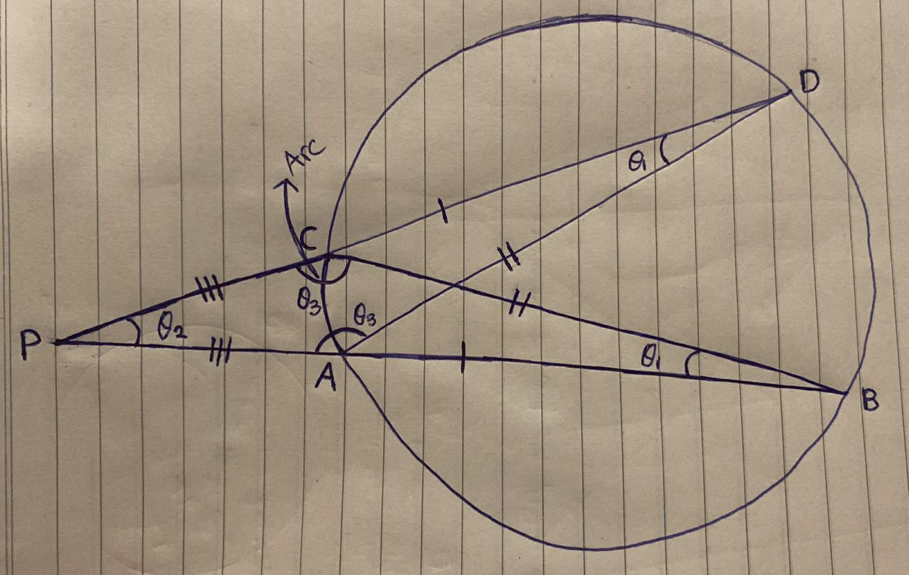
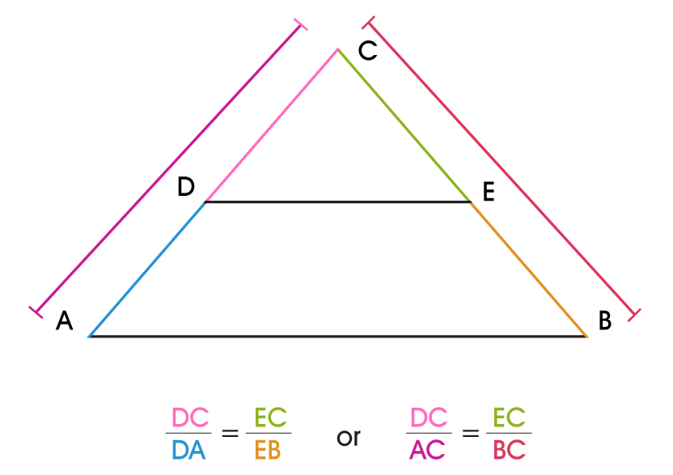
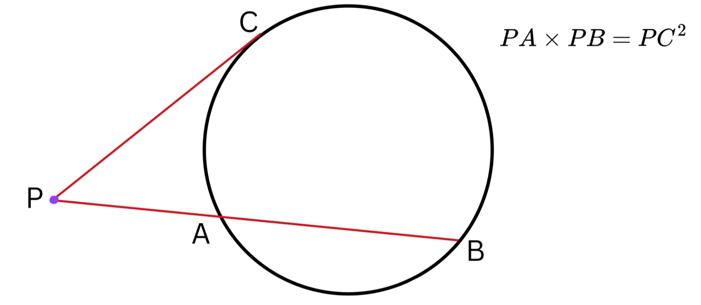
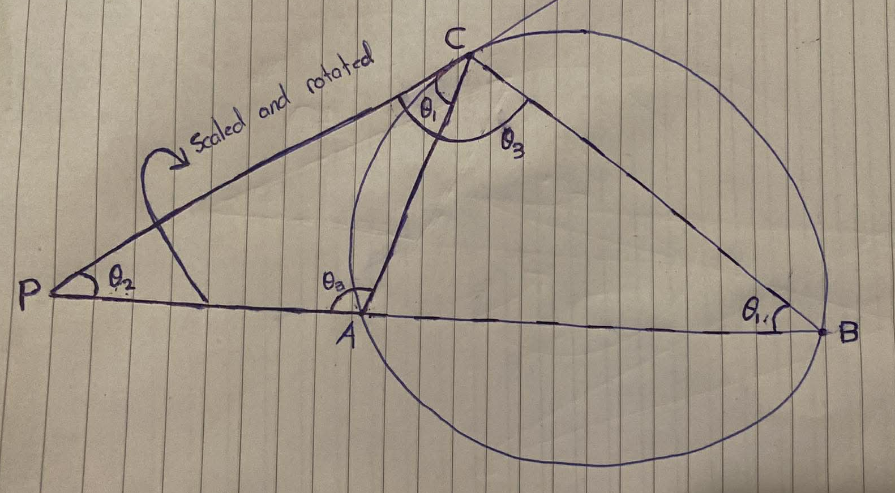

    <h1> Two Sectant Theorem </h1>

The Two Secant Theorem states that when two secant lines are drawn from the same point outside a circle, the product of the length of each entire secant and its external segment is equal.

In the following example we can observe,

$$
    PA \cdot PB = PC \cdot PD
$$

    

Consider the triangles

$$
\triangle PAD
$$

and

$$
\triangle PCB
$$

where the points $A, B, C, D$ lie on the circle and the secants intersect at the external point $P$.

### Step 1: Equal angles from the same arc

Angles subtended by the same arc of a circle are equal.

Both $\angle CDA$ and $\angle CBA$ subtend arc $CA$. Therefore,

$$
\angle CDA = \angle CBA
$$

### Step 2: Angle at the external point

Both triangles share the same vertex $P$, formed by the intersection of the two secant lines. Hence,

$$
\angle DPA = \angle BPD
$$

### Step 3: Triangle similarity

Since two pairs of corresponding angles are equal,

$$
\triangle PAD \sim \triangle PCB
$$

by the AA similarity criterion. This occurrs because both triangles have two identical angles and hence, must have a third identical angle. Given that both triangles have all three identical angles, they're similar. Similar triangles difference from congruent triangles. Similar triangles mean that all three have identical angles, but can differ in size. However, congruent triangles have all three identical angles and idential size. Hence, similar triangles can differ and size, but this growth on each size has identical ratio on each side.

### Step 4: Ratio of corresponding sides

From triangle similarity,

$$
\frac{PA}{PC} = \frac{PD}{PB}
$$

Where $PA$ is from the same edge of the triangle as the other triangle $PC$. Because they're similar and have identical angles, the ratio of each edge much be kept when resizing. Hence the ratio of this edge will be equal of the ratio of the other edge $PD$ from the same edge of the other triangle $PD$.

    

### Step 5: Rearranging

Multiplying both sides gives,

$$
\boxed{PA \cdot PB = PC \cdot PD}
$$

    <h1> Tangent-Secant Theorem </h1>

**Given:**
* An external point $P$.
* A tangent segment from $P$ touching the circle at point $C$.
* A secant segment from $P$ intersecting the circle at points $A$ and $B$.

    

**To Prove:**
$$PA \times PB = PC^2$$

**Construction:**
Draw line segments (chords) $AC$ and $BC$ inside the circle to form two triangles $\triangle PAC$ (the smaller triangle) and $\triangle PCB$ (the larger triangle containing the whole shape).

    

## Step-by-Step Proof

1.  **Identify a common angle:**
    * Look at $\triangle PAC$ and $\triangle PCB$. Both triangles share the angle at point $P$.
    * $\angle P \cong \angle P$ (Common Angle)

2.  **Use the Alternate Segment Theorem:**
    * This theorem states that the angle between a tangent and a chord through the point of contact is equal to the angle in the alternate segment.
    * The angle between tangent $PC$ and chord $AC$ is $\angle PCA$.
    * The angle in the alternate segment subtended by chord $AC$ is $\angle PBC$ (or just $\angle B$).
    * Therefore, $\angle PCA \cong \angle PBC$.

3.  **Establish Triangle Similarity:**
    * Because we have found two corresponding angles that are equal, we can conclude that the two triangles are similar by the Angle-Angle (AA) similarity postulate.
    * $\triangle PAC \sim \triangle PCB$

4.  **Set up the ratio of corresponding sides:**
    * Since the triangles are similar, the ratio of their corresponding sides must be equal.
    * In the small $\triangle PAC$, the side opposite $\angle PCA$ is $PA$. In the large $\triangle PCB$, the corresponding side opposite $\angle PBC$ is $PC$.
    * In the small $\triangle PAC$, the third side (opposite the unstated angle) is $PC$. In the large $\triangle PCB$, the corresponding third side is $PB$.
    * Using the corresponding sides containing $P$, we get:
    $$\frac{PA}{PC} = \frac{PC}{PB}$$

5.  **Solve the equation:**
    * Cross-multiply the ratios to get the final formula:
    $$PA \times PB = PC^2$$