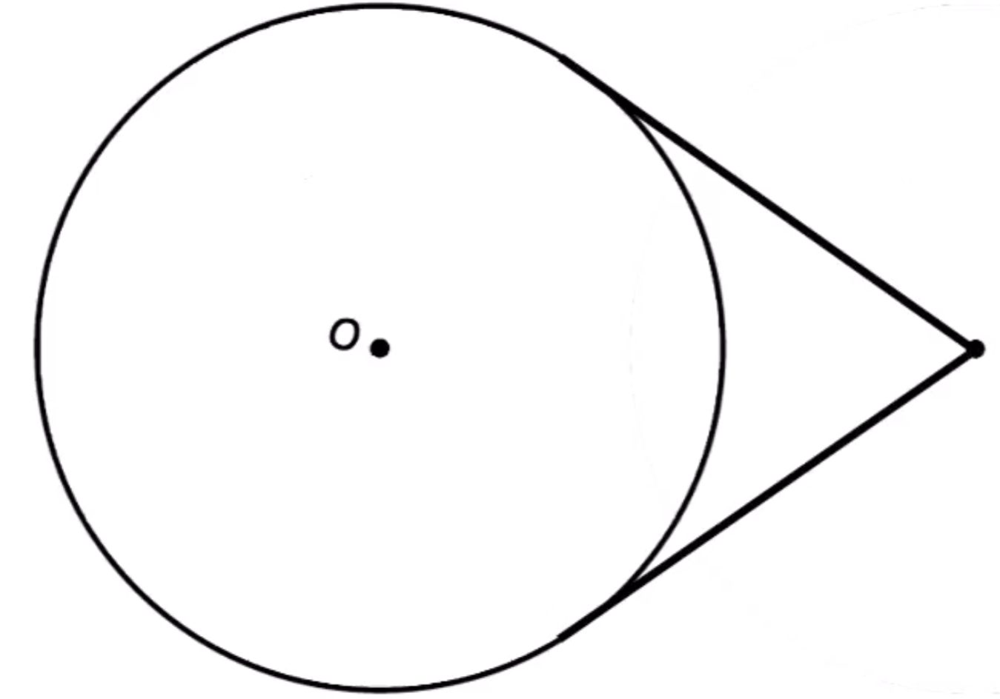
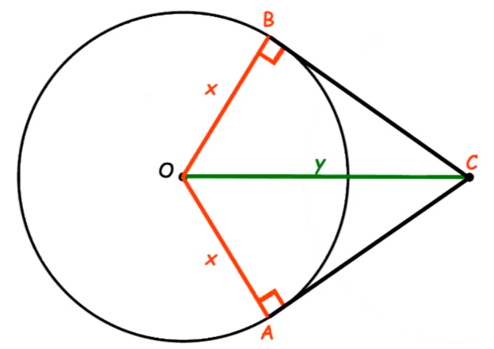

    <h1> Two Tanget <h1>

The two tangent theorem states that a point outside a circle, the two tangent segments drawn to the circle are equal in length.

    

We will begin this proof by outling the following information,

1. Draw two lines from the centre point \( O \) to the tangent point. Both will have the length of the radius and thus, we can name the same variable \( x \). Draw \( x \) to both verticies on the tangent point \( B \) and \( A \).
2. Draw a line from the centre point \( O \) to the origin point \( C \). Call this length \( Y \).
3. We know from the definition of a tangent line, that a tangent meets the radius it will form 90 degrees. Therefore, we are able to use pythagoras theorem to calculate the length of either side.

$$
BC = \sqrt{y^2 - x^2}
$$

Identically,

$$
AC = \sqrt{y^2 - x^2}
$$

Therefore,

\[
    AC = BC
\]

Telling us, that the two tangents formed from an external point onto a circle will have equal length. 

    

