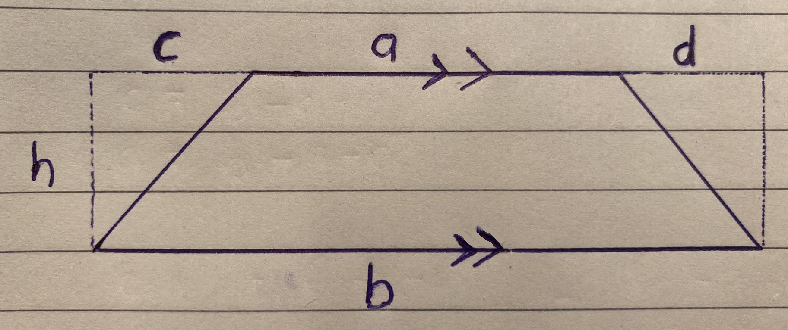

<div align='center'>
    <h1> Trapezoid Area - Thought Process </h1>
</div>

<div align='center'>
    
</div>

Finding success in geometric proofs is often misunderstood as being good at modifying algebraic expressions. While algebra is important, it is not the primary skill being tested. Geometry proofs are fundamentally about recognising relationships within a figure and then expressing those relationships mathematically. Algebra should describe the geometry, not replace it.

A useful way to approach any geometric proof is to separate the process into three stages.

1. **Model the geometry.**
2. **Identify the important relationships.**
3. **Translate those relationships into algebra.**

Keeping these stages distinct prevents many common mistakes.

### Stage 1 - Model the Geometry

Successful proofs begin by transforming an unfamiliar figure into several familiar ones because mathematical reasoning builds new knowledge from what has already been established. From first principles, an unfamiliar figure has properties that have not yet been proved, while familiar figures have properties that follow from definitions, axioms, or previously proven theorems. By rearranging the unfamiliar figure into known shapes without changing the property being investigated (such as area or length), we can apply existing results to logically deduce the desired conclusion. In essence, proofs succeed by expressing the unknown in terms of the known.

The first objective is to replace the unknown shape with simpler shapes whose area formulas are already known from definitions. For example, when proving the area of a trapezoid, it is natural to begin with a rectangle and remove the two corner triangles.

<div align='center'>
    
</div>

This produces,

```math
A = bh - \frac{ch}{2} - \frac{dh}{2}
```

At this stage, no algebraic manipulation should occur. The goal is simply to produce a mathematically correct model of the diagram. The goal at this stage is to break down the shape into smaller, familiar shapes. However, modelling is only the beginning. A correct model does not guarantee an easy proof. The proof becomes easy only after identifying the correct relationships within that model.

### Stage 2 - Study the Structure Before Manipulating Equations

This is arguably the most important stage and is often overlooked. When creating an algebraic expression, do not immediately begin expanding brackets, substituting equations or solve for unknowns. This is understandable, but does not simplify the proof in an ideal manner. Proofs require a different mindset. Before performing any algebra, pause and inspect the expression itself. Several questions should always be asked.

- **What variables are expected to remain?**

Suppose the goal is to prove

```math
A = \frac{(a + b)h}{2}
```

The variables that appear in the final formula are

- $a$
- $b$
- $h$

The variables

- $c$
- $d$

do not appear. This immediately tells us something important. The variables $c$ and $d$ are **temporary variables**. They were introduced only to help describe the figure. Since they do not appear in the final result, they must eventually disappear. $c$ and $d$ are auxiliary variables, these are variables you invent to help solve a problem. It's job is to bridge the gap between what you know and what you want to prove.

When looking at the trapezoid, do these variables determine the quantity I'm trying to calculate, or do they merely describe the shape? In the trapezoid proof, $c$ and $d$ describe the trapezoids geometry, such as the leg positions and angles, but they **do not independently determine its area**. The area depends only on the lengths of the parallel sides and the perpendicular height, so $c$ and $d$ are auxiliary variables that must eventually be expressed in terms of those quantities or eliminated.

The rectangle is your construction, not the trapezoid.

So,

- $a$ - Belongs to the trapezoid
- $b$ - Belongs to the trapezoid
- $h$ - Belongs to the trapezoid
- $c$ - Belongs to your rectangle decomposition.
- $d$ - Belongs to your rectangle decomposition.

This should immediately make you suspicious. Anything introduced purely because you chose a particular proof straghety probably shouldn't survive to the final theorem. Consider the expression

```math
A = bh - \frac{ch}{2} - \frac{dh}{2}
```

A common mistake is to think about $c$ and $d$ separately because they're written separately. Instead, inspect the structure. Both terms contain,

- The same factor $h$
- The same coefficient $\frac{1}{2}$

Factoring gives

```math
A = bh - \frac{h}{2}(c + d)
```

This reveals something that was hidden before.

- The proof does not require $c$ individually.
- The proof does not require $d$ individually.

It only requires $c + d$. This is a crucial shift in thinking. Rather than asking,

- How do I eliminate $c$?
- How do I eliminate $d$?

We instead ask,

- Can I find a relationship for $c + d$ directly?

The proof immediately becomes simpler. The geometry tells us

```math
c + a + d = b
```

Therefore,

```math
c + d = b - a
```

No algebra discovered this relationship. **The diagram should generate the equations. The equations should not replace the diagram**. Whenever the algebra begins to feel complicated, return to the figure and ask what relationships are visually obvious. Very often the missing equation is already present in the geometry.

### Stage 3 - Perform Only Purposeful Algebra

Substitute

```math
c + d = b - a
```

into

```math
A = bh - \frac{h}{2}(c + d)
```

This gives

```math
A = bh - \frac{h}{2}(b - a)
```

Expand

```math
A = bh - \frac{1}{2}bh + \frac{1}{2}ah
```

Manipulate $bh$ by multiplying it by $\frac{2}{2}$

```math
bh = \frac{2bh}{2}
```

giving

```math
\begin{aligned}
A &= \frac{2bh}{2} - \frac{1}{2}bh + \frac{1}{2}ah \\
  &= \frac{2bh}{2} - \frac{bh}{2} + \frac{ah}{2} \\
  &= \frac{2bh - bh + ah}{2} \\
  &= \frac{(2b - b + a)h}{2} \\
  &= \frac{(b + a)h}{2} \\
  &= \frac{(a + b)h}{2} \\
\end{aligned}
```

Notice that every algebraic step now has a geometric reason behind it. Nothing was manipulated simply because it looked algebraic. The greatest misconception about proofs is that they are exercises in algebraic manipulation. In reality, they are exercises in recognising mathematical structure. Algebra is merely the language used to communicate those structures.

<div align='center'>
    <h1> Common Pitfalls </h1>
</div>

### Pitfall 1 - Solving for Variables That Never Need to Be Known

A surprisingly common mistake is to automatically isolate every unknown variable. For example,

```math
c = b - d - a
```

and

```math
d = b - c - a
```

Although both equations are correct, they are not useful. Each equation merely recreates the other variable. Substituting one into the other creates an endless cycle because neither equation introduces new information. Both are simply rearrangements of

```math
c + d = b - a
```

This highlights an important principle. **Do not solve for variables simply because they exist**. Instead ask,

- What quantity does my proof actually require?

If the proof only contains

```math
c + d
```

then solving separately for $c$ and $d$ is unnecessary work. A good proof solves only what is needed.

### Pitfall 2 - Expanding Before Looking for Structure

Expansion often feels productive because more algebra appears on the page. However, more algebra is not always better algebra. Consider,

```math
-\frac{ch}{2}-\frac{dh}{2}
```

Expanding elsewhere in the proof would only create additional terms. Factoring instead produces,

```math
-\frac{h}{2}(c + d)
```

which immediately reveals the geometric relationship required. This suggests another useful principle to always look for structure before performing manipulation! **Factoring often reveals relationship, expansion often hides them!**

### Pitfall 3 - Allowing Algebra to Lead the Proof

Algebra is a language. Geometry is the source of the ideas. Whenever algebra begins becoming increasingly complicated, resist the temptation to continue manipulating symbols. Instead, return to the picture. Ask,

- What lengths obviously add together?
- What angles are equal?
- What triangles are congruent?

The diagram almost always contains relationships that dramatically simplify the algebra. Proofs are strongest when the geometry guides every algebraic step.
