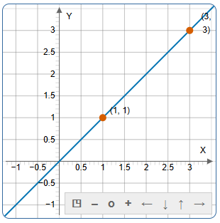

<div align='center'>
    <h1> Ratios </h1>
</div>

A ratio is a mathematical expression that **compares two quantities**, showing how much of one quantity exists relative to another. It describes a proportional relationship rather than an absolute amount. Ratios are fundamentally **about comparison**, not isolated values.

For example, a ratio $3:1$ indicates that one quantity occurs three times for every single occurrence of another.

#### The Standard Colon Form

The most common representation of ratio is the colon form, written as $x:y$, such as $3:1$.

In this form,

- Both quantities are shown explicitly.
- The relationship between them is preserved visually.
- No calculation is required to interpret the comparison.

This form is especially useful when describing group relationships, such as population structures, mixtures or distributions. For instance, a $3:1$ ratio indicates that one group is three times the size of another.

#### Fractional Form of Ratios

Ratios can also be written in fractional form. The ratio $3:1$ can be expressed as $\frac{3}{1}$.

This form highlights that a ratio is fundamentally a divison.

- The first quantity is divided by the second.
- The relationship becomes a single comparable value.

Fractional form is particularly used in mathematics because it connects ratios to operations, allowing them to be manipulated algebraically and simplified.

A ratio compares two quantites, $7:3$. This means "7 for every 3". It's just a relationship, not a calculation. A fraction uses the same two numbers, but as divison. $\frac{7}{3}$ means "7 divided by 3" which gives a single number $\approx 2.33$.

A ratio and a fraction are built from the same numbers in the same order.

```math
7:3 ↔ \frac{7}{3}
```

A ratio is a comparison. A fraction is that comparision turned into a number. A fraction answers how many times bigger is the first number than the second. So, $\frac{7}{3} \approx 2.33$. Means, "7 is about 2.33 times as big as 3". Therefore we can express that as,

```math
7:3
```

or equivalently

```math
2.33:1
```

Both describe the same ratio. Hence we can finally say, A ratio compares two numbers. A fraction divides those same two numbers to show the size of the comparison.

```math
a:b ↔ \frac{a}{b}
```

#### Numerical (Decimal or Whole Number) Form

When the division in a fractional ratio is performed, the result becomes a single number. For example, $\frac{3}{1} = 3$. This does not change the ratio itself but compresses it into a simplified form. A number like $3$ still represents a relationship. $3:1$ in ratio form. Meaning three units of one quantity for every one unit of another. Thus, whole numbers and decimals can be interpreted as ratios where the second term is implicitly $1$.

#### Equivalent Ratios and Simplification

Ratios can be scaled without changing their meaning.

```math
3:1 = 6:2 = 9:3
```

Each of these simplifies to the same fractional value.

```math
\frac{3}{1} = \frac{6}{2} = \frac{9}{3} = 3
```

This demonstrates that a ratio is defined by its relationship, not the specific numbers used to express it. Simplification reveals the constant proportional structure underlying different representations.

#### Ratios as Rates and "Per Unit" Thinking

In many real-world applications, ratios describe how much of one quantity corresponds to a single unit of another. These are often called rates.

Examples include,

- Speed - $60\frac{km}{hr}$
- Wage - $100\frac{dollars}{hr}$

This "per 1" interpretation is directly linked to division and explains why ratios often appear as single numbers in applied mathematics.

#### Ratios in Coordinate Geometry - Slope

A key application of ratios is slope in coordinate geometry. Slope is defined as

```math
\frac{\Delta y}{\Delta x}
```

This is a ratio comparing vertical change to horizontal change.

For example,

- A slope of 3 corresponds to $3:1$, this means that we have 3 units up for every 1 unit accross.
- A slope of $0.5$ corresponds to $1:2$, this means that we have 1 unit up for every 2 units accross.
- A slope of $-2$ corresponds to $-2:1$, this means that we have 2 units down for every 1 unit across.

In each case, **the slope is a compressed numerical form of an underlying ratio**.

The slope $m$ is calculated as,

```math
m = \frac{y_2 - y_1}{x_2 - x_1}
```

Given two points $P_1 = (1,1)$ and $P_2 = (3,3)$.

```math
\begin{aligned}
m &= \frac{3 - 1}{3 - 1} \\
m &= \frac{2}{2} \\
m &= 1
\end{aligned}
```

While the slope is a single integer $1$, it is to be understood as the ratio $\frac{1}{1}$ or $1:1$. Meaning, whenever the value of $y$ increases by $1$, $x$ also increases by $1$. 

Hence, for a linear line with slope $m$, this ratio must be consistent. Therefore if we have a point $x$ and to keep the ratio $1:1$ the same,

```math
\begin{aligned}
m &= \frac{\Delta y}{1} = 1 \\
m &= \Delta y = 1 \cdot 1 = 1
\end{aligned}
```

Hence, at position $x=5$, the point $P$ must be at $(5,5)$.

<div align='center'>
    
</div>