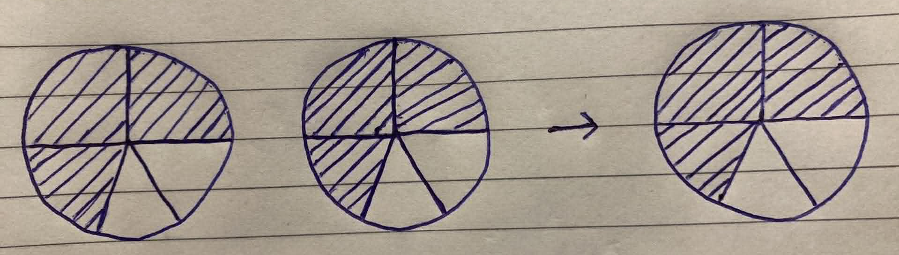

<div align='center'>
    <h1> Ratios </h1>
</div>

A ratio is a mathematical expression that **compares two quantities**, showing how much of one quantity exists relative to another. Unlike an isolated number, **a ratio describes a relationship**. It tells us how two quantities are connected rather than how large either quantity is by itself. A ratio does not represent addition, multiplication, or a completed calculation. It describes how two quantities are related.

The purpose of a ratio is to show relative size or proportion, not to require that both quantities can change. The quantities **may be able to scale, but they do not have to**. A useful way to identify a ratio is to ask, **"What is being compared to what?"**. If the relationship expresses "How much of one quantity exists relative to another", then a ratio is present.

Some ratios compare two things that can both vary

- $\text{Males} : \text{Females}$
- $\text{Flour} : \text{Milk}$
- $\text{Rise} : \text{Run}$

Other ratios compare something to a fixed whole

- $\text{Part} : \text{Total}$
- $\text{Sector Angle} : 360^\circ$
- Percentages (Per 100).

In all cases, the ratio tells us how big one quantity is compared to the other.

Ratios appear throughout mathematics and everyday life. They are used to describe mixtures, populations, rates, probabilities, geometic relationships and many other forms of comparison. Understanding ratios begins with understanding that they are fundamentally about **comparing quantities**. Ratios appear throughout mathematics and science, in each case, a ratio compares the size of one quantity with the size of another quantity. Although these concepts appear different, they all rely on comparing quantities through ratios.

| Concept        | Ratio                                |
| -------------- | ------------------------------------ |
| Fraction       | Part $:$ Whole                         |
| Percentage     | Part $:$ Whole                         |
| Probability    | Favourable Outcomes $:$ Total Outcomes |
| Slope          | Rise $:$ Run                           |

Ratios are the mathematical language of comparison. Fractions, percentages, rates, slopes, scales, probabilities, and many physical quantities can all be understood as different representations of ratios. By describing how quantities relate rather than how large they are individually, ratios provide one of the fundamental tools for modelling relationships throughout mathematics.

<div align='center'>
    <h1> The Standard Colon Form </h1>
</div>

The most common way to write a ratio is using colon notation.

```math
a : b
```

When you write $a : b$, by itself, it is **incomplete contextually**. To make it meaningful, you must define what $a$ and $b$ represent, $a$ and $b$ only become meaningful when tied to a context and values. So you should write,

```math
a : b = 3 : 5
```

means "$3$ of the first quantity for every $5$ of the second quantity". The colon notation is useful because both quantities remain visible, making the comparison easy to interpret.

For example,

```math
3:5
```

can be read as,

- 3 apples to 5 berries.
- 3 for every 5.

However

```math
a : b = 3 : 5
```

should be read as,

- $a$ to $b$ equals $3$ to $5$.
- $a$ is to $b$ as $3$ is to $5$.
- $a$ and $b$ are in the ratio $3:5$.

Conclusively,

- $3:5$ is a specific ratio value.
- $a : b$ is a ratio of quantities.
- $a : b = 3 : 5$ states that the quantities have that ratio value.

<div align='center'>
    <h1> Ratios as Fractions </h1>
</div>

A ratio can be expressed as a fraction. Every ratio $a : b$ can be written as the fraction $\frac{a}{b}$, and the value of that fraction represents the ratio. The fraction $\frac{a}{b}$ has multiple different, but equivalent interpretations,

1. **Division** - $a$ divided by $b$, providing a single number. Answers the question, how many times $b$ goes into $a$?
2. **Comparison / Ratio** - $a$ compared to $b$, or "$a$ for every $b$". More precisely, for every $1$ unit of quantity $b$, there are $\frac{a}{b}$ units of quantity $a$.
3. **Part-to-Whole** - $a$ out of $b$ equal parts.

When we have a ratio comparing $a$ to $b$, we represent this comparison to a relative amount such as,

```math
a : b = 3 : 5
```

This is interpreted as $3$ units of $a$ for every $5$ units of $b$. Such as $3$ males for every $5$ females. The ratio view of fractions is the important concept to understand here. When we compare one ratio, we compare it to the simplified ratio. When we observe the fraction $\frac{a}{b} = \frac{3}{5}$ as a ratio, we interpret this as $a$ for every $b$ . This requires $a$ to increase every $b$ to allow for the fraction to be able to be simplified to be equal to $\frac{3}{5}$. This implies $\frac{3}{5}$ can be multiplied by some number $\frac{k}{k}$, which creates the ratio $\frac{a}{b}$. In other words,

```math
\frac{a}{b} = \frac{3}{5} = \frac{k \cdot 3}{k \cdot 5}
```

<div align='center'>
    
</div>


This also means we can have the equivalent ratio,

```math
a : b = \frac{3}{5} : 1
```

This is interpreted as $\frac{3}{5}$ units of $a$ for every $1$ unit of $b$, or simply $\frac{3}{5}$ of $a$ per unit of $b$. Dividing $a$ by $b$ gives us the amount of $a$ per single unit of $b$. Because a fraction can be interpreted as $a$ for every $b$ it follows that,

```math
a : b = \frac{a}{b} \qquad \text{or} \qquad a = \frac{a}{b} \cdot b
```

This means, the ratio of $a$ to $b$ is equal to the fraction $a$ divided by $b$. The letters $a$ and $b$ here are **placeholders for quantities**. Hence, when we say 

```math
\text{Males} : \text{Females} = 3 : 5
```

- $a$ is the actual number of males, this is variable and can be any number.
- $b$ is the actual number of females, also variable.

Then we write,

```math
\frac{a}{b} = \frac{3}{5}
```

We are dividing the actual number of males ($a$) by the actual number of females ($b$). The result of that divison must be some multiple of $\frac{3}{5}$. For example, if there are $15$ females ($b = 15$), then

```math
\frac{a}{15} = \frac{3}{5} \Rightarrow a = 9
```

For a complete explicit explanation, this would be viewed as

```math
\text{Males} : \text{Females} = 3 : 5 = 9 : 15
```

Therefore,

- $\text{Males} : \text{Females}$ - Names the two quantities being compared.
- $3 : 5$ - Gives the actual simplified ratio.
- $a : b$ - The actual value of males and females, to compare to the ratio.

Because ratios are relative quantites,

```math
a : b = 3 : 5 = k \cdot a : k \cdot b
```

Therefore,

```math
\frac{a}{b} = \frac{3}{5} = \frac{k \cdot 3}{k \cdot 5}
```

This has multiple interpretations, all are valid. The difference is comparing to a per unit of $b$ or scaling $b$ so that $a$ is no longer represented as a fraction.

- For every unit of $b$, $a$ increases by $\frac{a}{b}$. In our example, for every $1$ unit increase of $b$, $a$ increases by $\frac{3}{5} \cdot b$
- For every $5$ unit increase of $b$, $a$ increases by $3$

To summarize,

- $a : b = 3 : 5$ means the ratio $a$ to $b$ is $3$ to $5$. This represents a ratio of two quantities, where $a$ and $b$ are the actual quantities
- Therefore $\frac{a}{b} = \frac{3}{5}$
- This tell us, for every $1$ unit of $b$, there are $\frac{3}{5}$ units of $a$. This is required to keep it a fractional multiple of $\frac{3}{5}$

So $\frac{a}{b}$ represents the amount of $a$ per $1$ unit of $b$. To illustrate this with an example,

```math
\begin{aligned}
\text{Apples : Berries} &= 3 : 5 \\
\text{Apples : Berries} &= \frac{3}{5} : 1\\
\frac{3}{5}\text{ Apples} &: 1\text{ Berry}
\end{aligned}
```

This now states that their are $\frac{3}{5}$ apples **per 1 berry**. This information allows us to create a fractional relationship, allowing us to perform algebra. Hence,

```math
\frac{a}{b} = \frac{3}{5}
```

This means if we have $b = 5$, only $a=3$ satisfies the ratio. This fractional notation matches the colon notation $\text{Apples : Berries} = 3 : 5$. Additionally, because $a:b$ is just another way of writing the fraction $\frac{a}{b}$, it follows

```math
\begin{aligned}
a:b = 3:5 \qquad &\Leftrightarrow \qquad \frac{a}{b} = \frac{3}{5} = 0.6 \\[6pt]
a:b = 1:2 \qquad &\Leftrightarrow \qquad \frac{a}{b} = \frac{1}{2} = 0.5 \\[6pt]
a:b = 10:4 \qquad &\Leftrightarrow \qquad \frac{a}{b} = \frac{10}{4} = \frac{5}{2} = 2.5
\end{aligned}
```


So, suppose we have a ratio of milk to flour when baking a cake that is

```math
\text{Milk} : \text{Flour} = 2 : 3
```

We write this as a fraction,

```math
\frac{\text{Milk}}{\text{Flour}} = \frac{a}{b} = \frac{2}{3}
```

Now, take an example where we have 6 quantites of flour, how much quantity of milk do we need to keep this ratio correct? This is when we would set $b = 6$.

```math
\begin{aligned}
\frac{\text{a}}{6} &= \frac{2}{3} \\
\text{a} &= \frac{2}{3}\cdot 6 \\
\text{a} &= \frac{12}{3} \\
\text{a} &= 4
\end{aligned}
```

This represents,

```math
\text{Milk} : \text{Flour} = 2 : 3 = 4 : 6
```

<div align='center'>
    <h1> Part-to-Part and Part-to-Whole Ratios </h1>
</div>

Ratios can compare two parts of a group (part-to-part) or compare one part to the entire group (part-to-whole). These two types exist because they answer fundamentally different questions and serve different practical purposes.

Suppose there are $3$ apples and $5$ berries. The total number of fruits is $3 + 5 = 8$.


### Part-to-Part Ratios

```math
\begin{aligned}
\text{Apples : Berries} &= 3 : 5 \\
\text{Berries : Apple} &= 5 : 3
\end{aligned}
```

This type of ratio answers questions such as,

- How does the amount of apples compare directly to the amount of berries?
- If I increase or decrease one group, how much should the other change to maintain the same relationship?

Part-to-part ratios excel at situations where you need to maintain a consistent proportion while scaling quantities up or down. The relationship between the two parts stays constant no matter how large or small the total becomes.

Common use cases include,

- Receipes, e.g. $\text{Milk} : \text{Flour} = 2 : 3$
- Mixing solutions or paint
- Population comparisons

This type of ratio is powerful precisely because both quantities can vary while keeping their relative proportion fixed.

### Part-to-Whole Ratios

```math
\begin{aligned}
\text{Apples : Total Fruit} &= 3 : 8 \\
\text{Berries : Total Fruit} &= 5 : 8
\end{aligned}
```

This type of ratio answers questions such as,

- What fraction or share of the total is apples?
- What proportion of the entire group do berries represent?
- If I know the total, how many apples or berries are there?

A ratio only requires a comparison of relative size. It does not require both quantities to be variable. Even if the "whole" is constant (Such as $360^\circ$ in a circle), the comparison remains a valid ratio.

Useful questions they answer,

- What fraction of the full circle is this sector? e.g. $90^\circ : 360^\circ = 1 : 4 = \frac{1}{4}$
- What percentage of the total is this part? e.g. $3 : 8 = \frac{3}{8} = 37.5\% = 37.5 : 100$
- What proportion of students passed the test? e.g. $\text{passed} : \text{total} = 18:30 = 3:5$

Part-to-whole ratios are especially valuable for understanding shares, probabilities, percentages and fractions. Both types use the same data but focus on different relationships. Part-to-part ratios are ideal for scaling and mixing, while part-to-whole ratios are ideal for understanding proportions and shares of a total.


<div align='center'>
    <h1> Ratios as Percentages </h1>
</div>

Ratios are used in percentages. Percentages literally mean "per hundred". Therefore, a percentage is a ratio to $100$. This relationship explains why fractions and percentages are fundamentally ratios. Consider a basket containing $3$ apples and $5$ berries, giving a total of $8$ pieces of fruit. The ratio of apples to total fruit is

```math
3 : 8
```

This ratio can also be written as the fraction

```math
\frac{3}{8}
```

which evaluates to

```math
0.375
```

Expressing the same proportion per hundred gives

```math
37.5\%
```

Thus,

```math
3 : 8 = \frac{3}{8} = 0.375 = 37.5\% = 37.5 : 100
```

These are not different mathematical facts, they're different representations of the same relationship. The ratio notation emphasises comparison, the fraction notation emphasises division and the percentage notation expresses the ratio relative to a standard reference quantity of $100$.


The idea of ratios being percentages also appears in geometry. A sector angle of $72^\circ$ compared with a full circle of $360^\circ$ forms the ratio,

```math
72 : 360 = 1 : 5 = 20 : 100 = 20\%
```

Although the full circle angle is always $360^\circ$, the ratio remains useful because it tells us that the sector occupies $20\%$ of the cirle. This proportion can then be applied to any quantity that scales directly with the angle. As the sector angle increases, both the enclosed area and the arc length increase in the same proportion. Consequently, if the sector occupies $20\%$ of the total angle, it also occupies $20\%$ of the total area and $20\%$ of the total circumfrance.

For example, suppose a circle has radius $10$ cm. It's area is,

```math
\pi r^2 = \pi(10)^2 = 100 \pi \text{ cm}^2
```

Since a $72^\circ$ sector represents

```math
\frac{72}{360} = \frac{1}{5} = 20\%
```

of the circle,

```math
\begin{aligned}
\frac{72}{360} &= \frac{\text{Sector Area}}{100\pi} = \frac{1}{5} \\
\frac{72}{360} \cdot 100\pi &= \text{Sector Area} \\
\frac{1}{5} \cdot 100\pi &= \text{Sector Area} \\
20\pi &= \text{Sector Area}
\end{aligned}
```

This calculation works because the angle ratio describes the fraction of the entire circle occupied by the sector. Once this fraction is known, it can be applied directly to the circles area. This viewpoint can be viewed viewed via the colon expression,

```math
\begin{aligned}
\text{Sector Angle} &: \text{Circle Angle} &= 1 : 5 &= 72 : 360\\
\text{Sector Area} &: \text{Circle Area} &= 1 : 5 &= 20\pi : 100\pi 
\end{aligned}
```

Which therefore follows,

```math
\frac{\text{Sector Angle}}{\text{Circle Angle}} = \frac{\text{Sector Area}}{\text{Circle Area}} = \frac{1}{5} = \frac{72}{360} = \frac{20\pi}{100\pi}
```


#### Example One

```math
300:200 
```

This means $300$ compared to $200$. We can simplify the ratio by dividing both terms by $100$.

```math
300:200 = 3 : 2
```

This tells us that for every $3$ units of the first quantity, there are $2$ units of the second quantity. A ratio can also be written as a fraction,

```math
300 : 200 \leftrightarrow \frac{300}{200}
```

Evaluating this fraction gives,

```math
\frac{300}{200} = \frac{3}{2} = 1.5
```

This means the first quantity is $1.5$ times the second quantity. A percentage is simply a ratio expressed per $100$. So starting with $1.5$, multiply by $100$. 

```math
1.5 \cdot 100\% = 150\%
```

Therefore,

```math
150\% = \frac{150}{100} = 150 : 100
```

#### Example Two

Suppose we have a ratio

```math
40 : 200 = 1 : 5
```

This is expressed in fractional form as

```math
\frac{1}{5} = 0.2 = 20\%  = 20 : 100
```

Comparing this to our original ratio $40 :200$, this is a multiple of $40 : 200$ by halving each term.

#### Example Three

Suppose we are given percentages. $49\%$ of the population is female and $51\%$ of the population is male. This means,

```math
\text{Male}: \text{Female} = 51 : 49 = 510, 000 : 490, 000 = 1.04 : 1
```

We can also compare it to the total population. Suppose we perform this calculations for the ratio of males to total population.

```math
51 : 100
```

Therefore,

```math
51\% = \frac{51}{100} = 51 : 100 = 510, 000 : 1, 0000, 000
```

#### Example Four

Suppose we instead ask for a percentage of a number. What is $50\%$ of $1000$?

By definition, $25\%$ means $25$ per $100$, that is the ratio,

```math
25 : 100
```

A percentage is always $\frac{\text{part}}{\text{whole}}$. Therefore,

```math
\begin{align*}
\frac{\text{part}}{\text{whole}} &= \frac{25}{100} = \frac{1}{4} \\
\text{part} &= \frac{1}{4} \cdot \text{whole} \\
\text{part} &= \frac{1}{4} \cdot 1000 \\
\text{part} &= 250\\
\end{align*}
```

This follows,

```math
\text{part} : \text{whole} = 25 : 100 = 125 : 500
```


<div align='center'>
    <h1> Ratios as Rates </h1>
</div>

Many practical applications of ratios involve comparing a quntity to a single unit of another quantity. These comparisons are called rates. Examples include

```math
60 \frac{\text{km}}{\text{hr}}
```

These may be interpreted as "60 kilometres for every 1 hour". This is the equivalent colon representation.

```math
\text{km} : \text{hr} = 60 : 1
```

Rates are simply ratios expressed relative to one unit of a quantity. This "per one" interpretation explains why many ratios are often represented as a single number.

```math
\frac{\text{km}}{\text{hr}} = \frac{60}{1}
```

<div align='center'>
    <h1> Proportions </h1>
</div>

We first define,

- **Quantity** - What is being measured. This can be length, mass, time, angle, ...

- **Unit** - The standard used to measure the quantity. This can be metre, kilogram, radian, ...

- **Measurement** - A number together with a unit. A measurement of a quantity has a unit.

| Quantity | Unit          | Measurement |
| -------- | ------------- | ----------- |
| Length   | metre (m)     | 5 m         |
| Mass     | kilogram (kg) | 12 kg       |
| Angle    | degree (°)    | 90°         |
| Angle    | radian (rad)  | $\pi$ rad |


A ratio compares two **measurements**, indicating how much of one measurement corresponds to the other. When two measurements are **proportional**, they maintain a constant ratio, meaning that **if one measurement is multiplied by a constant factor, the other is multiplied by the same factor**. Consequently, the relationship between any two corresponding pairs of measurements can be represented by equal ratios. This constant relationship can be expressed using either fraction notation,

```math
\frac{a}{b} = \frac{c}{d} \qquad \text{or} \qquad a : b = c : d
```

This is read as, $a$ is to $b$ as $c$ is to $d$. Proportions are powerful because they allow us to use information from one relationship to solve for unknowns in another.

A **quantity** is a property that can be measured, such as length, mass, time or angle. It exists independently of any unit of measure. A **measurement** is the numerical value together with a unit that describe the size of the quantity. For example, the length of a stick is a quantity. It may be measured as $1 \text{ m}$, $100 \text{ cm}$ or $1000 \text{ mm}$. Although these measurements use different numbers and different units, they all describe the same underlying quantity, the sticks length.

The same principle applies to angles. **The quantity is the amount of rotation, while the measurement expresses that rotation in a particular unit**. A complete revolution is one specific quantity of rotation. It can be measured as either $360^\circ$ or $2\pi$ radians. These are different measurements of the same quantity, just as $1 \text{ m}$ and $100 \text{ cm}$ are different measurements of the same length.

Because degrees and radians are **two linear units of measurement of the same quantity (angle)**, the relationship between their measurements is proportional. A complete revolution as both $360^\circ$ and $2 \pi$ radians, establishing the constant ratio between the two units. Consequently, every angle has both a degree measurement and a radian measurement, and these measurements are always related by the same constant ratio. This relationship can be written as

```math
2 \pi \text{ rad} : 360^\circ = x \text{ rad} : y ^\circ
```

or equivalently

```math
\frac{2 \pi \text{ rad}}{360^\circ} = \frac{x \text{ rad}}{ y ^\circ}
```

Hence, the mathematical process for proportionality can be expressed by several steps.

##### 1. Identify two equivalent measurements of the same quantity

A quantity may be measured using different units. If two measurements describe the same underlying quantity, they are equivalent, even though their numerical values differ. These equivalent measurements establish the relationship between the units.

- Length - $1 \text{ m} = 100 \text{ cm}$
- Angle - $2\pi \text{ rad} = 360^\circ$

##### 2. Express the equivalent measurements as a ratio

Since the measurements are equivalent, they define a fixed relationship between the two units. This relationship can be written as a ratio using colon notation.

- $1 \text{ m} : 100 \text{ cm}$
- $2\pi \text{ rad} : 360^\circ$

##### 3. Express the ratio as a proportion to compare corresponding measurements

Because the relationship between the units is constant, any other pair of equivalent measurements must preserve the same ratio. This is written as a proportion, either using fractions or colon notation.

```math
\frac{1 \text{ m}}{100 \text{ cm}} = \frac{x \text{ cm}}{y \text{ cm}}
```

#### Same Type of Quantity, Different Sizes

This occurs when comparing corresponding parts of two objects that have the **same shape, but possibly different sizes**. Consider two similar triangles, triangle $A$ has sides $3\text{cm}$, $4\text{cm}$ and $5\text{cm}$. Triangle $B$ is an enlarged version with one corresponding side measuring $6\text{cm}$. Because the triangles are similar, the ratios of their corresponding sides are equal.

```math
\frac{3}{6} = \frac{4}{x} = \frac{5}{y}
```

Solving the proportion gives $x = 8\text{ cm}$ and $y = 10\text{ cm}$. This type of proportion is essential in trigonometry, scale drawings and geometry. It shows that when shapes are similar, corresponding angles are equal and corresponding sides remain in constant proportion. Similarily, in a right-angled triangle, the sine of an angle $\theta$ is defined as the ratio.

```math
\sin(\theta) = \frac{\text{Opposite}}{\text{Hypotenuse}}
```

This ratio is constant for a fixed angle, no matter the size of the triangle. On the unit circle, the hypotenuse is standardized to $1$. Therefore,

```math
\begin{aligned}
\sin(\theta) &= \frac{\text{O}}{\text{H}} \\
\sin(30^\circ) &= \frac{1}{2} = \frac{k \cdot 1}{k \cdot 2}
\end{aligned}
```

The equivalent colon representation is,

```math
\sin(30^\circ) = \text{Opposite} : \text{Hypotenuse} = 0.5 : 1 = k \cdot 0.5 : k \cdot 1
```

In a small triangle with a hypotenuse length of $6 \text{ cm}$ and $\theta = 30$.

```math
\begin{aligned}
\sin(30^\circ) &= \frac{\text{O}}{\text{H}} = \frac{0.5}{1} = \frac{\text{O}}{1 \cdot 6} = \frac{\text{O}}{6} \\
\frac{0.5}{1} &= \frac{\text{O}}{6} \\
\frac{6 \cdot 0.5}{1} &= \frac{3}{1} = 3 = \text{O}
\end{aligned}
```

This means, the opposite length must be equal to $3$ to keep the original ratio a multiple of $\frac{0.5}{1}$

#### Different Types of Quantities That Are Related

Here, the proportion connects two different measurements that are linked by an underlying rule or property. We can take the circle sector as an example. A circle sector has a central angle of $72^\circ$. The full circle is always $360^\circ$.

```math
\frac{\text{Sector Angle}}{\text{Full Angle}} = \frac{72^\circ}{360^\circ} = \frac{1}{5}
```

Because a circle is symmetric around its center, the angle and the area are distributed proportionally. Therefore, the same ratio applies to the areas.

```math
\frac{\text{Sector Angle}}{\text{Full Angle}} = \frac{\text{Sector Area}}{\text{Total Circle Angle}} = \frac{1}{5}
```

This allows us the calculate the sectors area directly from its angle.

- In the similar triangles case, we compare the same measurement (length to corresponding length) across different sizes.

- In the circle sector case, we compare different measurements (angle to area) that are mathematically linked.

In both situations, the core idea is the same, **the relative relationship remains constant**. This constant relationship is what makes proportions so useful for solving problems.

<div align='center'>
    <h1> Ratios in Coordinate Geometry </h1>
</div>

One of the most important ratios in mathematics is the slope of a straight line. Slope is not merely a formula. It is a ratio describing how two quantities change together. A slope is defined as,

```math
m = \frac{\Delta y}{\Delta x}
```

This ratio compares vertical change to horizontal change. For example,

- A slope of $3$ corresponds to the ratio $3 : 1$
- A slope of $0.5$ corresponds to the ratio $1 : 2$
- A slope of $-2$ corresponds to the ratio $-2 : 1$

Each slope value is a compressed numerical form of an underlying ratio. The slope between two points is calculated using

```math
m = \frac{y_2 - y_1}{x_2 - x_1}
```

Given the points $(0, 0)$ and $(4, 2)$. We obtain,

```math
\begin{aligned}
m &= \frac{2 - 0}{4 - 0} \\
m &= \frac{2}{4} \\
m &= \frac{1}{2} \\
m &= 0.5
\end{aligned}
```

The slope is therefore $0.5$, this can be viewed as a ratio $1 : 2$. This means, for every $2$ units travelled horizontally, the line rises by $1$ unit vertically. Alternatively, $\text{run} : \text{rise} = 1 : 2$. Because this ratio remains constant, every point on the line must preserve this relationship between horizontal and vertical movement.

For example,

- Moving $2$ units right required moving $1$ unit up.
- Moving $4$ units right requires moving $2$ units up.
- ...

These relationships can be written as,

```math
\frac{1}{2} = \frac{k \cdot 1}{k \cdot 2} = 0.5
```

Although the distance change, the ratio remains constant. This constant ratio is what defines a straight line with slope $0.5$. In other words, the slope is not merely a number. It is a ratio that describes how the vertical change must compare to the horizontal change at every point on the line.