<div align='center'>
    <h1> Probability in a Bell Curve </h1>
</div>

Probability can initially be understood as the proportion of favourable outcomes within the total number of possible outcomes,

```math
P(A)=\frac{\text{Number of favourable outcomes}}{\text{Total number of outcomes}}
```

For example, when rolling a fair six-sided die, there are six possible outcomes. If the event \(A\) is rolling an even number, the favourable outcomes are \(2,4,6\), giving

$$
P(A)=\frac{3}{6}=\frac12=0.5=50\%
$$

The important idea is that probability is fundamentally a **proportion**. We compare the number of outcomes belonging to an event with the total number of outcomes. This same idea can be applied to a dataset. Suppose 10,000 people have their heights measured. Instead of asking whether one particular outcome occurs, we can ask questions such as,

<div style='margin-left: 2em; margin-bottom: 0.5em;'>
What is the probability that a randomly selected person has a height <b>between 170 cm and 175 cm? </b>
</div>

If 2,700 of the 10,000 people fall within this interval, then

```math
P(170\leq X<175)
=
\frac{2700}{10000}
=
0.27
=
27\%
```

At this stage, probability is still simply the familiar idea of

```math
\boxed{\frac{\text{Favourable observations}}{\text{Total observations}}}
```

The challenge is to develop a way of representing this probability graphically. A histogram provides a way to organise the 10,000 observations into ranges, or **bins**. For example, suppose the heights are divided into intervals of 5 cm,

<div align='center'>
    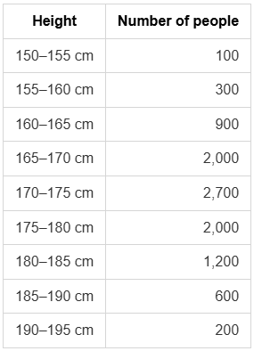
</div>

<div align='center'>
    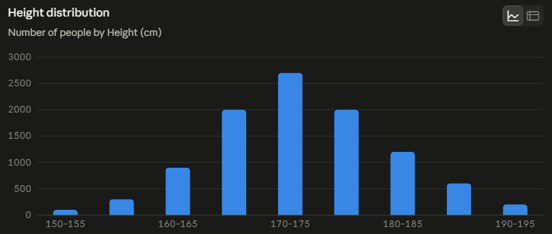
</div>

The horizontal axis represents **height**, while the vertical axis initially represents the **number of people** in each bin. For the 170 – 175 cm bin, the bar represents 2,700 people. Because the bin is 5 cm wide, however, the geometric area of the bar is

```math
\text{area}
=
\text{height}\times\text{width}.
```

If the vertical height is simply 2,700 people, then

```math
2700\text{ people}\times5\text{ cm}
=
13500\text{ people}\cdot\text{cm}.
```

This area does not directly represent the number of people. The width of the bin has introduced an extra factor. Therefore, if we want the **area of a histogram bar to represent the number of observations**, we need to change what the vertical axis means. For the 170–175 cm interval, there are 2,700 people spread across 5 cm. We can therefore calculate the number of people **per centimetre**:

```math
\frac{2700\text{ people}}{5\text{ cm}}
=
540\frac{\text{people}}{\text{cm}}.
```

The height of this histogram bar is therefore

```math
540\frac{\text{people}}{\text{cm}}.
```

Now the area of the bar is

```math
540\frac{\text{people}}{\text{cm}}
\times5\text{ cm}
=
2700\text{ people}.
```

The units explain why this works,

```math
\begin{aligned}
\text{Height} \times \text{Base} &= \text{Area} \\
\frac{\text{people}}{\text{cm}}\times\text{cm} &= \text{people}
\end{aligned}
```

The vertical axis is now called **frequency density**. The crucial change is therefore,

```math
\boxed{
\text{bar height}
=
\frac{\text{number of observations}}{\text{bin width}}
}
```

so that

```math
\boxed{
\text{area of bar}
=
\text{number of observations}.
}
```

This also explains why different bins can have different heights. A bin containing many people will have a greater density than a bin containing fewer people. The complete calculations for this dataset is,

<div align='center'>
    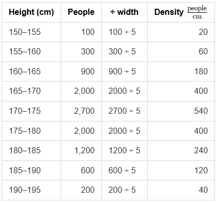
</div>

Creating another histogram with the Y axis of density.

<div align='center'>
    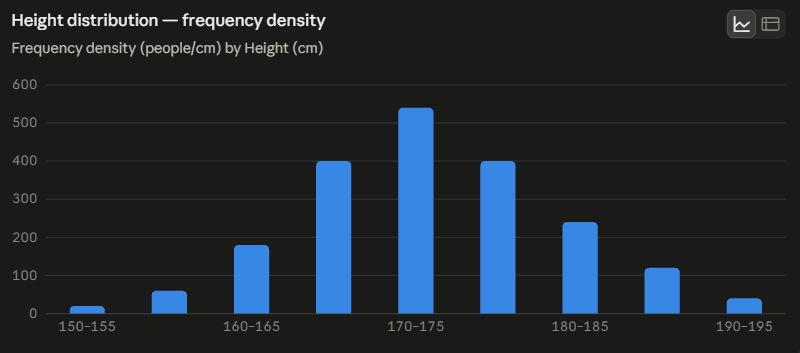
</div>

We can take the same idea one step further. Previously, the area of a bar represented the **number of people**. But probability is not the number of people, it is the proportion of people out of the total. For the 170–175 cm bin, there are 2,700 people out of 10,000,

```math
P(170\leq X<175)
=
\frac{2700}{10000}
=
0.27.
```

We can therefore divide the frequency density by the total population,

```math
\frac{540\text{ people/cm}}{10000\text{ people}}
=
540 \frac{\text{people}}{\text{cm}} \times \frac{1}{10 000} \text{people}
=
0.054\frac{1}{\text{cm}}
```

This gives a **probability density** of

```math
0.054\frac{\text{probability}}{\text{cm}}
```

More precisely, because probability itself is dimensionless, this can be written as

```math
0.054\text{ cm}^{-1}
```

The area of the bar is now

```math
0.054\frac{1}{\text{cm}}\times5\text{ cm}
=
0.27
```

Therefore,

```math
\boxed{\text{area of the bar}=\text{probability}}
```

and the units explain why,

```math
\boxed{
\frac{\text{probability}}{\text{cm}}
\times
\text{cm}
=
\text{probability}
}
```

This gives us an important conceptual progression,

```math
\boxed{
\text{people}
\rightarrow
\frac{\text{people}}{\text{cm}}
\rightarrow
\frac{\text{probability}}{\text{cm}}
}
```

The vertical axis has changed from counting observations to describing how densely probability is distributed across the height axis.

<div align='center'>
    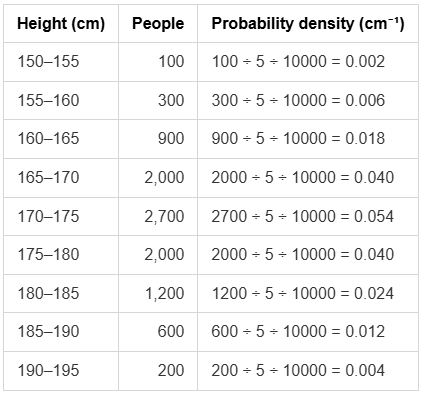
</div>

<div align='center'>
    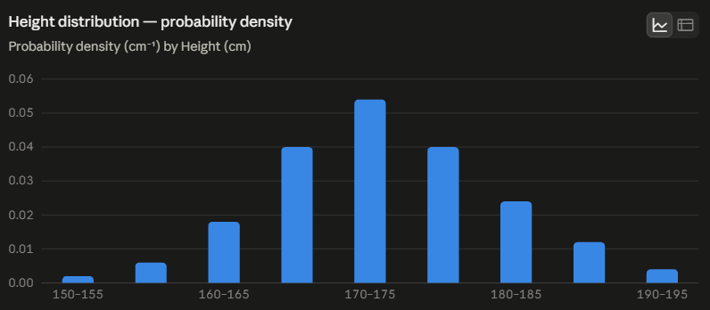
</div>

The area of these bars now represent the probability of a randomly selected person being within that range.

<div align='center'>
    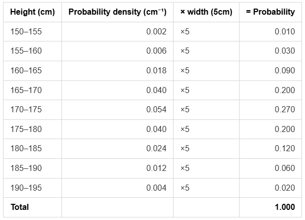
</div>

The 5 cm bins are useful, but they give us only a relatively coarse picture of the distribution. We can return to the original 10,000 measurements and divide them into smaller intervals. **Instead of 5 cm bins, we could use 1 cm bins**. For each bin we calculate

```math
\text{probability density}
=
\frac{\text{number of observations in bin}}
{\text{total observations}\times\text{bin width}}.
```

This produces a new step-shaped function, which can be called $f_1(x)$. We could then use even smaller bins,

```math
f_5(x)
\rightarrow
f_1(x)
\rightarrow
f_{0.1}(x)
\rightarrow
f_{0.01}(x)
\rightarrow\cdots
```

<div align='center'>
    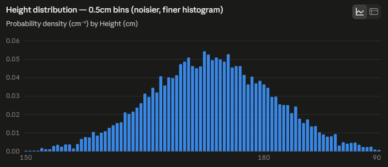
</div>

The bars become narrower and the graph provides an increasingly detailed representation of how the observations are distributed across the height axis. For a very small interval of width $\Delta x$, the probability within that interval can be approximated by

```math
P(X\text{ is in the interval})
\approx
f(x)\Delta x.
```

This is simply the same rectangle-area idea we already established:

```math
\boxed{\text{probability}\approx\text{height}\times\text{width}}.
```

Here, the height is probability per centimetre and the width is centimetres. However, an important distinction must be made, **with a finite dataset, making the bins indefinitely small does not necessarily produce a perfectly smooth curve**. Eventually the bins become sparse and noisy. The smooth bell curve therefore does **not** literally come from mechanically smoothing the histogram. Instead, when the observed histogram has an approximately bell-shaped pattern, we can use a known mathematical distribution to **model and estimate that underlying shape**. The famous mathematical model used for a bell-shaped distribution is the **normal distribution**, also called the Gaussian distribution. Its **probability density function** is

```math
\boxed{
f(x)=
\frac{1}{\sigma\sqrt{2\pi}}
e^{-\frac{(x-\mu)^2}{2\sigma^2}}
}
```

This function is not something we create ourselves from the individual histogram bars. It is a known mathematical function that was developed through the work of mathematicians including Abraham de Moivre, Pierre-Simon Laplace and Carl Friedrich Gauss. The dataset is used to estimate the parameters of this known function.

From our dataset,

```math
\begin{aligned}
\mu &= 173.45 \\
\sigma &\approx 7.896 \\
f(x) &=
\frac{1}{7.896\sqrt{2\pi}}
e^{-\frac{(x-173.45)^2}{2(7.896)^2}}
\end{aligned}
```

<div align='center'>
    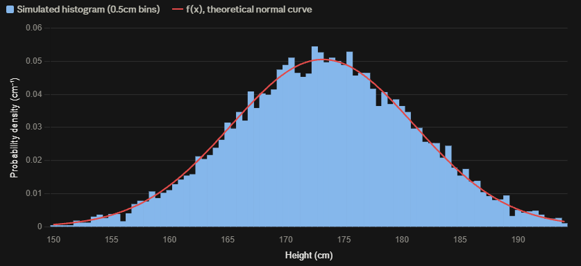
</div>

**Tip** - Copy the raw text into Desmos to visualize the graph and see the behaviour for low or high $f(x)$ values.

```
f(x)=(1/(7.896\sqrt{2\pi}))e^{-((x-173.45)^2)/(2(7.896)^2)}
```

The first parameter is the mean,

```math
\mu
=
\frac{x_1+x_2+\cdots+x_N}{N}
```

The second parameter is the standard deviation, which measures the spread of the observations around the mean. Once the mean and standard deviation have been obtained from the dataset, they can be substituted into the normal density function. The resulting function is a smooth curve defined for every possible value of $x$.

The mean controls the centre of the curve,

```math
\mu\rightarrow\text{centre}
```

The standard deviation controls its spread,

```math
\sigma\rightarrow\text{spread}
```

Thus, the dataset gives us information about **where the distribution is centred and how widely it is spread**, while the known normal function provides the smooth mathematical shape.

The important distinction is,

```math
\boxed{
\text{Histogram}=\text{empirical representation of observed data}
}
```

whereas

```math
\boxed{
\text{Normal PDF (Probability Density Function)}=\text{mathematical model of the distribution}
}
```

The normal PDF can therefore be regarded as our estimated smooth probability-density curve when the data are approximately normally distributed.

The PDF represents an idealised population, while any histogram is drawn from only a limited, randomly selected portion of it, so a perfect match was never realistic, and narrowing the bins makes this worse rather than better, since each bin then holds fewer points and becomes correspondingly more volatile. The PDF's area over a given interval is best read as a **long-run average**, that is, the proportion of observations one would expect there across many samples rather than a fixed outcome for this particular dataset, whose actual counts will naturally wander due to chance. Rather than demanding an exact match, the appropriate standard is whether the PDF reflects the data's broad contours, with any remaining differences resembling random fluctuation rather than a consistent, directional error.

<div align='center'>
    <h1> Integrating the PDF to Find a Probability</h1>
</div>

The normal probability density function gives us a value of probability density at every point $x$. For example, if at some height

```math
f(170)=0.05\frac{1}{\text{cm}}
```

this does **not** mean that the probability of someone being exactly 170 cm tall is 5%. Instead, it means that probability is being distributed at a rate of approximately $0.05$ probability per centimetre around that location.

For a small interval $\Delta x$

```math
P(X\text{ is in the interval})
\approx
f(x)\Delta x.
```

If we divide a larger interval into many small pieces, the total probability is approximately the sum of the individual pieces:

```math
P(a\leq X\leq b)
\approx
\sum_i f(x_i)\Delta x.
```

This is precisely the idea behind integration. As the intervals become increasingly narrow, the summation becomes a definite integral,

```math
\boxed{
P(a\leq X\leq b)
=
\int_a^b f(x)\,dx
}
```

The units again explain the meaning

```math
\underbrace{f(x)}_{\text{probability/cm}}
\underbrace{dx}_{\text{cm}}
```

therefore

```math
\frac{\text{probability}}{\text{cm}}\times\text{cm}
=
\text{probability}.
```

Integration is therefore not introducing a completely new interpretation of probability. It is extending the same **area = proportion** idea from histogram rectangles to a continuously varying curve.

<div align='center'>
    <h1> Standard Deviation and the 68-95-99.7 Rule</h1>
</div>

We have established that the normal probability density function

```math
f(x)=
\frac{1}{\sigma\sqrt{2\pi}}
e^{-\frac{(x-\mu)^2}{2\sigma^2}}
```

allows us to calculate probability by finding the area under the curve,

```math
P(a\leq X\leq b)
=
\int_a^b f(x)\,dx.
```

The horizontal axis of this function is the original measurement, such as height in centimetres. Although this allows us to calculate probabilities, it is useful to express positions relative to the mean and standard deviation instead of using the original units. The **$z$-score** provides a way of expressing how far a value is from the mean in standard-deviation units,

```math
z=\frac{x-\mu}{\sigma}
```

The numerator,

```math
x-\mu,
```

measures the distance between the observation $x$ and the mean. Dividing by $\sigma$ expresses this distance in terms of standard deviations. For example,

```math
z=0
```

means that $x$ is exactly at the mean,

```math
z=1
```

means that $x$ is one standard deviation above the mean, and

```math
z=-1
```

means that $x$ is one standard deviation below the mean.

The $z$-score therefore gives us a new horizontal coordinate. Instead of describing a value by its original measurement $x$, **we can describe it by its number of standard deviations from the mean**. To transform the PDF from the $x$-coordinate to the $z$-coordinate, we first rearrange the $z$-score formula:

```math
z=\frac{x-\mu}{\sigma}
```

Multiplying by $\sigma$,

```math
\sigma z=x-\mu
```

and adding $\mu$,

```math
\boxed{x=\mu+\sigma z}
```

This equation tells us how every position on the new $z$-axis corresponds to a position on the original $x$-axis. For example, if $z=1$, then

```math
x=\mu+\sigma
```

which is exactly one standard deviation above the mean.

Our original probability calculation uses

```math
\int f(x)\,dx.
```

Here, $dx$ represents a very small width along the original $x$-axis. Since

```math
x=\mu+\sigma z,
```

a small change in $z$ produces a small change in $x$. Differentiating this relationship gives

```math
\begin{aligned}
\frac{dx}{dz} &= \sigma \\
dx &=\sigma\,dz
\end{aligned}
```

The relationship

```math
dx=\sigma\,dz
```

therefore tells us that a small width on the $z$-axis corresponds to a width $\sigma$ times as large on the original $x$-axis.

<div align='center'>
    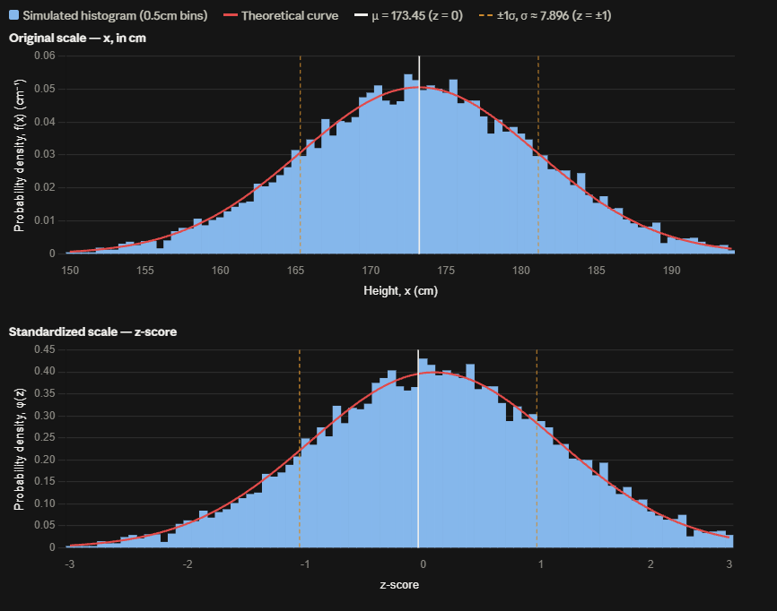
</div>

The original probability density function $f(x)$ describes probability density **per unit of $x$**. When we standardise using

```math
z = \frac{x - \mu}{\sigma}
```

The same points are represented on a new $z$-axis, where one unit of $z$ corresponds to $\sigma$ units of $x$. Simply defining $g(z)=f(\mu+\sigma z)$ therefore moves the original heights to their corresponding $z$-locations, but does not adjust those heights for the change in horizontal scale. It is a valid function, but it is not yet the probability density of $Z$.

To make the new graph a probability density, its area must represent the **same probability** as the corresponding area on the original graph. Therefore, if $\Delta x=\sigma\Delta z$,

```math
f(x)\Delta x
=
f(\mu+\sigma z)(\sigma\Delta z)
=
\left[\sigma f(\mu+\sigma z)\right]\Delta z.
```

Thus the standardised density must be

```math
\boxed{\phi(z)=\sigma f(\mu+\sigma z)}.
```

The factor $\sigma$ makes the new graph taller or shorter precisely enough to compensate for the change in horizontal scale, preserving the probability represented by the area.

### Creating a New Formula for $z$-Score

We can now return to the probability represented by the area under the original probability-density function,

```math
P(a\leq X\leq b)
=
\int_a^b f(x)\,dx
```

We have established the relationship

```math
z=\frac{x-\mu}{\sigma}
```

which can be rearranged to give

```math
x=\mu+\sigma z.
```

This tells us how a position on the original $x$-axis corresponds to a position on the new $z$-axis. Taking differentials gives

```math
dx=\sigma\,dz
```

For example, if $\sigma=10$, then an interval of width $0.1$ on the $z$-axis corresponds to an interval of width

```math
dx=10(0.1)=1
```

on the $x$-axis.

The important consequence is that changing the horizontal scale also changes how the probability density must be expressed. The original function $f(x)$ describes probability density per unit of $x$. If we simply evaluate it at the corresponding $x$-coordinate,

```math
g(z)=f(\mu+\sigma z)
```

we obtain a valid function that gives the original PDF height at each corresponding $z$-coordinate. However, it is not yet the probability density with respect to $z$. To see why, consider a small interval. On the original graph, its probability is approximately

```math
f(x)\,dx
```

The same interval expressed using the $z$-coordinate must represent exactly the same probability. Since

```math
dx=\sigma\,dz
```

we have

```math
f(x)\,dx
=
f(\mu+\sigma z)(\sigma\,dz)
=
\left[\sigma f(\mu+\sigma z)\right]dz
```

<div align='center'>
    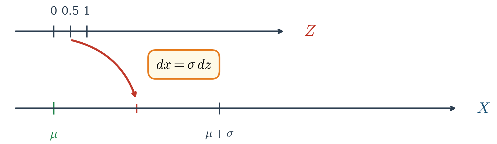
</div>

<div align='center'>
    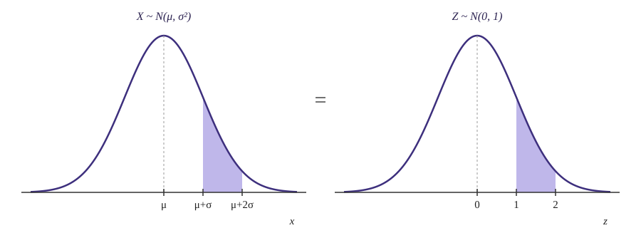
</div>

Therefore, the function that represents probability density on the new $z$-axis is

```math
\boxed{
\phi(z)=\sigma f(\mu+\sigma z)
}
```

The factor of $\sigma$ compensates for the change in horizontal scale. If the $z$-axis compresses the original $x$-axis by a factor of $\sigma$, the density must increase by the corresponding factor so that the area, and therefore the probability, remains unchanged. Thus,

```math
\boxed{
f(x)\,dx=\phi(z)\,dz
}
```

Both sides represent the same small probability, they are simply expressed using different coordinate systems. We can now substitute the original normal PDF into

```math
\phi(z)=\sigma f(\mu+\sigma z)
```

Starting with

```math
f(x)=
\frac{1}{\sigma\sqrt{2\pi}}
e^{-\frac{(x-\mu)^2}{2\sigma^2}}
```

we replace $x$ with $\mu+\sigma z$:

```math
\begin{aligned}
\phi(z)
&=
\sigma f(\mu+\sigma z)
\\
&=
\sigma
\left[
\frac{1}{\sigma\sqrt{2\pi}}
e^{-\frac{((\mu+\sigma z)-\mu)^2}{2\sigma^2}}
\right]
\\
&=
\sigma
\left[
\frac{1}{\sigma\sqrt{2\pi}}
e^{-\frac{(\sigma z)^2}{2\sigma^2}}
\right]
\\
&=
\frac{1}{\sqrt{2\pi}}
e^{-z^2/2}
\end{aligned}
```

Therefore, the **standard normal probability-density function** is

```math
\boxed{
\phi(z)=
\frac{1}{\sqrt{2\pi}}
e^{-z^2/2}
}
```

Notice that $\mu$ and $\sigma$ no longer appear in the final expression. They have not simply disappeared, their effects have been absorbed into the standardisation of the horizontal coordinate. The original value of $\mu$ determines where the centre of the distribution lies, while $\sigma$ determines the scale of the original $x$-axis. The $z$-score removes both of these features by expressing position in terms of standard deviations from the mean.

Consequently, every normal distribution can be represented on the same standardised $z$-axis. The centre is always $z=0$, one standard deviation from the mean is $z=\pm1$, two standard deviations is $z=\pm2$, and so on.

The transformation can therefore be summarised as

```math
\boxed{
z=\frac{x-\mu}{\sigma}
}
```

which converts an original $x$-coordinate into its standardised $z$-coordinate,

```math
\boxed{
x=\mu+\sigma z
}
```

which tells us how the two coordinate systems correspond, and

```math
\boxed{
dx=\sigma\,dz
}
```

which tells us how the width of an interval changes between the two coordinate systems. Together, these relationships transform the original normal PDF $f(x)$ into the standard normal PDF $\phi(z)$ while preserving the probability represented by the area under the curve.

For example, consider the interval within one standard deviation of the mean,

```math
\mu-\sigma\leq X\leq\mu+\sigma
```

The lower boundary has the $z$-score

```math
z=
\frac{(\mu-\sigma)-\mu}{\sigma}
=
-1
```

while the upper boundary has the $z$-score

```math
z=
\frac{(\mu+\sigma)-\mu}{\sigma}
=
1
```

Therefore,

```math
P(\mu-\sigma\leq X\leq\mu+\sigma)
=
P(-1\leq Z\leq1)
```

These probabilites are built from their results through intergration,

```math
\begin{aligned}
P(\mu-\sigma\leq X\leq\mu+\sigma) &= \int_{\mu - \sigma}^{\mu + \sigma} f(x) \ dx\\


P(-1\leq Z\leq1)
&=
\int_{-1}^{1} f(\mu + \sigma z) \sigma \ dz \\
\end{aligned}
```

Using the standard normal PDF,

```math
P(-1\leq Z\leq1)
=
\int_{-1}^{1}
\frac{1}{\sqrt{2\pi}}
e^{-z^2/2}\,dz
```

Evaluating this area gives

```math
\boxed{
P(-1\leq Z\leq1)\approx0.6827
}
```

or

```math
\boxed{68.27\%}.
```

The same calculation can be performed for two and three standard deviations:

```math
P(\mu-2\sigma\leq X\leq\mu+2\sigma)
\approx95.45\%
```

and

```math
P(\mu-3\sigma\leq X\leq\mu+3\sigma)
\approx99.73\%
```

This produces the familiar **68–95–99.7 rule**:

```math
\boxed{
\begin{aligned}
\mu\pm1\sigma &\approx 68.27\%\\
\mu\pm2\sigma &\approx 95.45\%\\
\mu\pm3\sigma &\approx 99.73\%
\end{aligned}
}
```

These percentages are therefore not separate rules that were arbitrarily memorised. They are probabilities obtained by integrating the standard normal probability-density function over intervals measured in standard deviations from the mean.

The $z$-score does not create the probability. The probability already comes from the **area under the probability-density function**. The $z$-score provides a standardised coordinate system in which the same probabilities can be described using the common scale of standard deviations from the mean.
