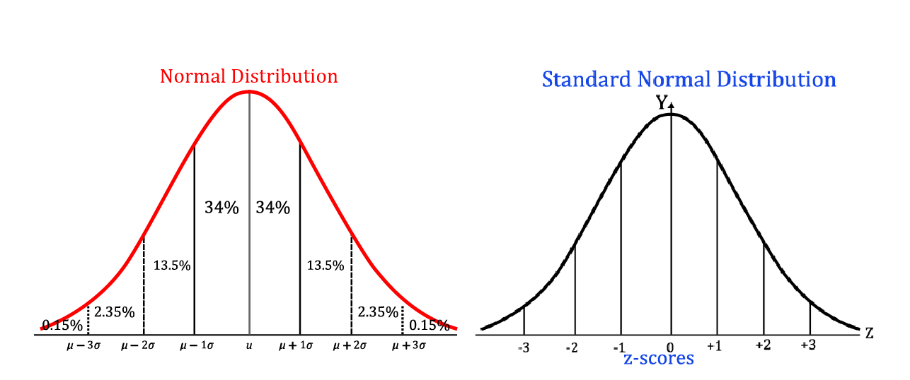
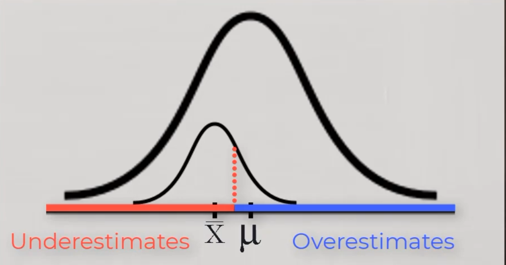
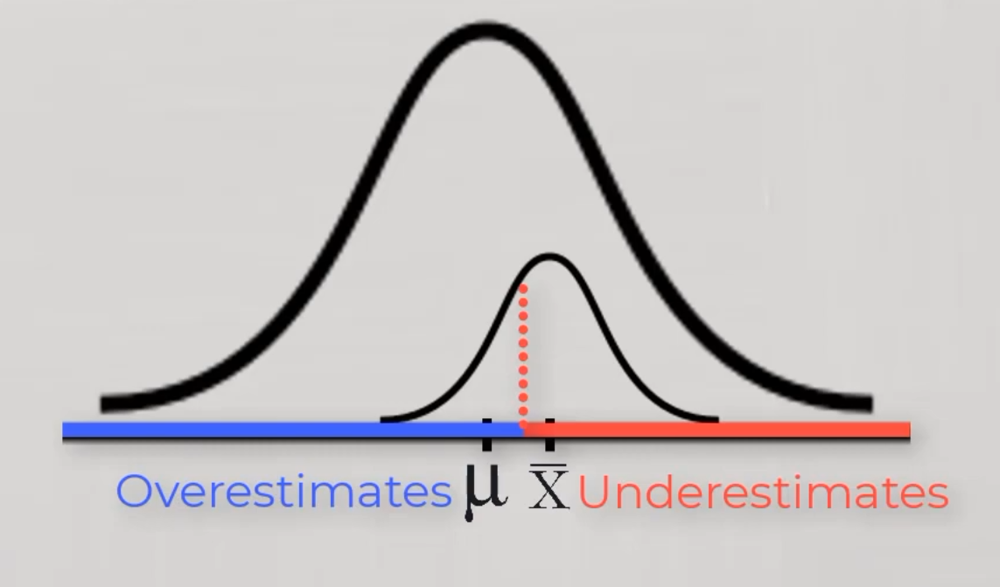
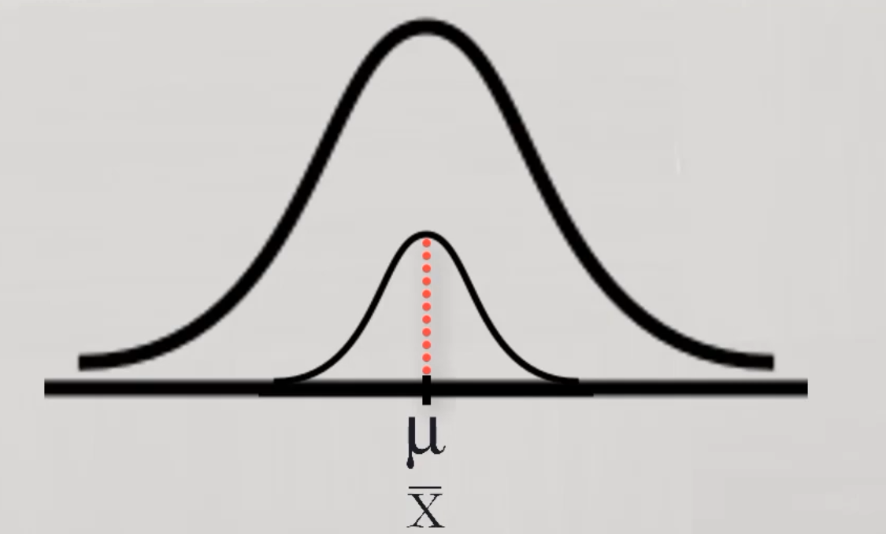
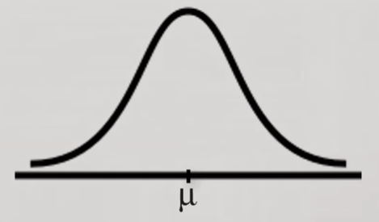
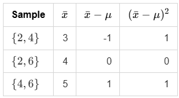

<div align='center'>
    <h1> Standard Deviation </h1>
</div>

When describing a dataset, it is often useful to begin by summarising its values with a single number. The arithmetic mean provides a simple way to do this,

```math
\bar{x}=\frac{1}{n}\sum_{i=1}^{n}x_i
```

The mean, however, tells us nothing about how the individual observations are distributed around it. Consider the two datasets

```math
A=\{4,5,5,6,5\}
```

and

```math
B=\{1,3,5,7,9\}
```

Both have a mean of $5$, yet they clearly have different amounts of spread. The observations in $A$ are clustered closely around the mean, whereas the observations in $B$ are much more dispersed. This demonstrates an important limitation of the mean by itself, **it summarises the dataset with a single value, but does not describe how much the observations vary.** To describe a dataset fully, we therefore need to consider both its mean and the amount of variation among its observations. **Standard deviation provides a numerical description of this variation by measuring the spread of observations around their mean**. The purpose of standard deviation is therefore relatively intuitive, it attempts to answer the question, **“How much do the observations typically differ from the mean?”** However, arriving at this single number requires several steps. Each step exists for a particular mathematical reason, and understanding these reasons is more useful than simply memorising the final formula.

The first step is to determine how far each observation is from the mean. For an observation $x_i$, its difference from the mean is

```math
x_i-\bar{x}
```

This quantity is called the **deviation from the mean**. A positive deviation indicates that the observation lies above the mean, while a negative deviation indicates that it lies below the mean.

For example, consider dataset $B$,

```math
B=\{1,3,5,7,9\}
```

with mean

```math
\bar{x}=5.
```

The deviations from the mean are therefore

```math
-4,\,-2,\,0,\,2,\,4
```

At first, it might seem that we could simply average these deviations to obtain a measure of spread. However, this immediately creates a problem. **The negative deviations cancel the positive deviations**. The average deviation might initially seem like a reasonable way to describe the typical difference between observations and the mean. For example, for the dataset

```math
B=\{1,3,5,7,9\}
```

the mean is $5$, giving deviations of $-4,-2,0,2,4$. Taking their average gives

```math
\frac{-4+(-2)+0+2+4}{5}=0
```

This occurs because the deviations below the mean are exactly balanced by the deviations above it. In fact, this will always happen when deviations are calculated from the arithmetic mean. We can see why algebraically.

Starting with the average deviation,

```math
\frac{1}{n}\sum_{i=1}^{n}(x_i-\bar{x})
```

we can expand the summation into two separate summations,

```math
\frac{1}{n}\left(
\sum_{i=1}^{n}x_i
-
\sum_{i=1}^{n}\bar{x}
\right)
```

The second summation requires some care because $\bar{x}$ **does not depend on $i$**. It is the same value for every observation. Therefore,

```math
\sum_{i=1}^{n}\bar{x}
```

means adding $\bar{x}$ to itself $n$ times,

```math
\underbrace{\bar{x}+\bar{x}+\bar{x}+\cdots+\bar{x}}_{n\text{ times}}
```

which gives

```math
\sum_{i=1}^{n}\bar{x}=n\bar{x}
```

Therefore,

```math
\sum_{i=1}^{n}(x_i-\bar{x})
=
\sum_{i=1}^{n}x_i-n\bar{x}
```

The arithmetic mean is defined as

```math
\bar{x}=\frac{1}{n}\sum_{i=1}^{n}x_i
```

so multiplying both sides by $n$ gives

```math
n\bar{x}=\sum_{i=1}^{n}x_i
```

Substituting this into the expression for the average deviation gives

```math
\frac{1}{n}
\left(
\sum_{i=1}^{n}x_i
-
\sum_{i=1}^{n}x_i
\right)
=
\frac{1}{n}\cdot0
=
0
```

Therefore,

```math
\frac{1}{n}\sum_{i=1}^{n}(x_i-\bar{x})=0
```

The average deviation therefore cannot tell us how much the observations vary around the mean. The positive and negative deviations will always cancel one another, regardless of how widely the observations are spread. We therefore need a way to measure the magnitude of the deviations without allowing their signs to cancel.

The mean is the value obtained by equally distributing the total among all observations. Therefore, when each observation is compared with this equal share, the positive and negative differences must have a net total of zero. Otherwise, the equal share would not contain the same total as the original observations.

**The average deviation from the mean is consequently always zero**, regardless of how spread out the observations are. It therefore cannot be used as a measure of variation. We need a way to prevent deviations on opposite sides of the mean from cancelling each other. One approach would be to take their absolute values, but standard deviation instead uses a different operation, **squaring** each deviation.

The squared deviation of an observation is

```math
(x_i-\bar{x})^2
```

Squaring has several important effects.

- Every squared deviation is non-negative, so observations above and below the mean can no longer cancel each other.

- Squaring causes **larger deviations to contribute disproportionately more** to the result.

- Additional benefits of squaring instead of using an absolute sign is to make the derivative easier to calculate for calclus applications. A deviation of $2$, for example, contributes

```math
2^2=4
```

whereas a deviation of $4$ contributes

```math
4^2=16
```

The larger deviation is therefore given four times as much weight. Once each deviation has been squared, we can calculate their average. This gives the **variance** of the dataset,

```math
\frac{1}{n}\sum_{i=1}^{n}(x_i-\bar{x})^2
```

Variance therefore represents the **average squared distance of the observations from their mean**.

- **Variance** - Measures the average **squared distance** of values from their mean. It describes how spread out the data are, in **squared units**.

- **Standard deviation** - The **square root of the variance**. It measures the typical spread of values from the mean, in the same units as the original data.

For dataset $B$, the squared deviations are

```math
16,\;4,\;0,\;4,\;16
```

so the variance is

```math
\frac{16+4+0+4+16}{5}=8
```

Although variance successfully describes the amount of spread, it introduces another problem. Because the deviations were squared, the resulting quantity is expressed in **squared units**. For example, if the observations represent heights measured in centimetres, then the deviations are measured in centimetres, but the squared deviations are measured in centimetres squared. A variance of $8$ would therefore have units of

```math
\text{cm}^2
```

which is not directly comparable to the original measurements. To return to the original units, we take the square root of the variance. This produces the **standard deviation**,

```math
\sigma
=
\sqrt{
\frac{1}{n}
\sum_{i=1}^{n}(x_i-\bar{x})^2
}
```

The square root reverses the effect of squaring and returns the result to the same units as the original observations. Standard deviation can therefore be interpreted as a measure of the typical scale of the deviations from the mean.

For dataset $B$, the standard deviation is

```math
\sigma
=
\sqrt{8}
\approx2.83
```

The same calculation can be applied to dataset $A$. Since

```math
A=\{4,5,5,6,5\}
```

also has a mean of $5$, its deviations are

```math
-1,\;0,\;0,\;1,\;0
```

The squared deviations are therefore

```math
1,\;0,\;0,\;1,\;0
```

The variance is

```math
\frac{1+0+0+1+0}{5}
=
\frac{2}{5}
```

giving a standard deviation of

```math
\sigma
=
\sqrt{\frac{2}{5}}
\approx0.63
```

The two datasets therefore have the **same mean but very different standard deviations**,

```math
\sigma_A\approx0.63
```

and

```math
\sigma_B\approx2.83
```

**This captures the difference that the mean alone could not describe**. Dataset $A$ has a small standard deviation because its **observations remain close to the mean**, while dataset $B$ has a much larger standard deviation because its **observations extend further away from the mean**.

It is important to note that standard deviation is not simply the average distance from the mean. The deviations are first squared, then averaged, and finally square-rooted. It is more precisely the **root-mean-square of the deviations from the mean**. This distinction becomes important when interpreting what standard deviation represents mathematically.

So far, standard deviation has been developed purely from the structure of a dataset. We have started with the mean as a measure of centre, measured how far observations lie from that centre, prevented positive and negative deviations from cancelling by squaring them, averaged those squared deviations to obtain variance, and finally taken the square root to return to the original units.

This becomes particularly useful when the data follows a **normal distribution**. In a normal distribution, the mean and standard deviation have a direct geometric interpretation. The mean determines the centre of the distribution, while the standard deviation determines how widely the distribution is spread around that centre.

Consider the probability density function of a normal distribution,

```math
f(x)
=
\frac{1}{\sigma\sqrt{2\pi}}
e^{-\frac{(x-\mu)^2}{2\sigma^2}}
```

The quantity

```math
\frac{x-\mu}{\sigma}
```

appearing in the exponent measures how far $x$ is from the mean in units of standard deviation. This quantity is so useful that it is given its own name, the **$z$-score**,

```math
z=\frac{x-\mu}{\sigma}
```

A value of $z=0$ therefore corresponds to the mean. A value of $z=1$ is one standard deviation above the mean, while $z=-1$ is one standard deviation below it.

<div align='center'>
    
</div>

This provides a way to describe positions within different normal distributions using the same scale. For example, suppose one distribution has

```math
\mu=100,\qquad \sigma=15
```

and another has

```math
\mu=50,\qquad \sigma=5
```

The raw values $115$ and $55$ are expressed on completely different scales, but both are one standard deviation above their respective means,

```math
\frac{115-100}{15}=1
```

and

```math
\frac{55-50}{5}=1
```

Their $z$-scores are therefore identical. Standardisation has converted their positions from their original measurement scales into a common scale measured in standard deviations from the mean. This transformation can be written more generally as

```math
Z=\frac{X-\mu}{\sigma}
```

The resulting variable $Z$ is known as the **standard normal variable**. Its mean is $0$ and its standard deviation is $1$. The importance of this transformation becomes clearer when considering probability. For a continuous random variable, probability is represented by the area under its probability density function. Therefore, the probability that $X$ lies between two values $a$ and $b$ is

```math
P(a\leq X\leq b)
=
\int_a^b f(x)\,dx
```

The total area under the probability density function is $1$, because the random variable must take some value within its entire possible range,

```math
\int_{-\infty}^{\infty}f(x)\,dx=1
```

Standardisation allows this probability to be calculated using the same standard normal distribution regardless of the original values of $\mu$ and $\sigma$. From

```math
z=\frac{x-\mu}{\sigma}
```

we can rearrange to obtain

```math
x=\mu+\sigma z
```

Differentiating this relationship gives

```math
dx=\sigma\,dz
```

This relationship is important because it describes how a small change in the standardised coordinate $z$ corresponds to a change in the original coordinate $x$. A horizontal interval of width $dz$ on the standardised scale corresponds to an interval of width

```math
dx=\sigma\,dz
```

on the original scale.

The standard deviation therefore determines the horizontal scale of the distribution. A larger $\sigma$ means that the same change in $z$ corresponds to a larger change in $x$, causing the distribution to be more spread out along the $x$-axis. However, increasing the horizontal spread cannot simply increase the total area under the curve. Since the total area must remain equal to $1$, the height of the density must adjust accordingly. This is why the normal density contains the factor

```math
\frac{1}{\sigma}
```

The factor compensates for the horizontal stretching caused by $\sigma$.

Continuing, we want to structure this so we're writing it in terms of $z$. Therefore, we want to replace occurrences of $x$ with its equivalent $z$.

```math
x=\mu+\sigma z
```

into the normal density gives

```math
\begin{aligned}
f(x)
&= \frac{1}{\sigma\sqrt{2\pi}}e^{-\frac{(x-\mu)^2}{2\sigma^2}}\\
f(\mu + \sigma z)&= \frac{1}{\sigma\sqrt{2\pi}}e^{-\frac{((\mu+\sigma z)-\mu)^2}{2\sigma^2}}\\
&= \frac{1}{\sigma\sqrt{2\pi}}e^{-\frac{(\sigma z)^2}{2\sigma^2}}\\
&= \frac{1}{\sigma\sqrt{2\pi}}e^{-z^2/2}
\end{aligned}
```

Because

```math
\begin{aligned}
dx &= \sigma\,dz \\
z &= \frac{x - \mu}{\sigma}
\end{aligned}
```

the probability integral becomes

```math
\begin{aligned}
P(a\leq X\leq b)
&=
\int_a^b f(x)\,dx
\\
&=
\int_{\frac{a-\mu}{\sigma}}^{\frac{b-\mu}{\sigma}}
\frac{1}{\sigma\sqrt{2\pi}}
e^{-z^2/2}
\,
\sigma\,dz
\\
&=
\int_{\frac{a-\mu}{\sigma}}^{\frac{b-\mu}{\sigma}}
\frac{1}{\sqrt{2\pi}}
e^{-z^2/2}
\,dz
\end{aligned}
```

The function that remains,

```math
\phi(z)
=
\frac{1}{\sqrt{2\pi}}
e^{-z^2/2}
```

is the probability density function of the standard normal distribution. This shows why standard deviation is so important. It is not merely a number that describes how spread out a dataset happens to be. Within the normal distribution, $\sigma$ determines the scale on which distances along the $x$-axis are measured. Standardisation removes that scale by converting $x$ into $z$, allowing different normal distributions to be represented by the same standard normal curve. For this reason, probabilities that initially appear to require different calculations can all be expressed in terms of the same standardised distribution. The interval from one standard deviation below the mean to one standard deviation above the mean,

```math
\mu-\sigma\leq X\leq\mu+\sigma
```

becomes

```math
-1\leq Z\leq1
```

Therefore,

\[
\begin{aligned}
P(\mu-\sigma\leq X\leq\mu+\sigma)
&=P(-1\leq Z\leq1)\\
&=\int\_{-1}^{1}\frac{1}{\sqrt{2\pi}}e^{-z^2/2}\,dz\\
&\approx 0.682689\\
&\approx 0.6827\\
&=68.27\%
\end{aligned}
\]

For the standard normal distribution, this area is approximately

```math
0.6827
```

or

```math
68.27\%
```

Similarly, approximately $95.45\%$ of the distribution lies within two standard deviations of the mean, and approximately $99.73\%$ lies within three standard deviations. This is commonly referred to as the **68–95–99.7 rule**.

Standard deviation therefore connects several ideas that initially appear separate. It begins as a way of measuring how observations vary around their mean, but in a normal distribution it becomes the scale used to measure distance along the distribution. Standardising by this scale transforms any normal distribution into the same standard normal distribution, allowing probabilities to be interpreted as areas on a common curve.

Each step follows from the problem created by the previous one. The mean describes the centre, deviations describe distance from that centre, squaring prevents cancellation, averaging produces variance, taking the square root restores the original units, and dividing by the standard deviation converts measurements into a common scale. For a normal distribution, that common scale is what allows the area under the curve to be interpreted consistently as probability.

<div align='center'>
    <h1> Population and Sample Calculations</h1>
</div>

For a **complete population**, where the population mean is denoted by $\mu$, the standard deviation is written

```math
\sigma
=
\sqrt{
\frac{1}{N}
\sum_{i=1}^{N}(x_i-\mu)^2
}
```

When working with a **sample rather than the entire population**, the corresponding sample standard deviation is usually written

```math
s
=
\sqrt{
\frac{1}{n-1}
\sum_{i=1}^{n}(x_i-\bar{x})^2
}
```

- **$\sigma$** - Population standard deviation
- **$s$** - Sample standard deviation.
- **$\mu$** - Population mean
- **$N$** - Population size
- **$n$** - Sample size
- **$\hat{x}$** - Sample of population mean
- **$n - 1$** - Division amount to calculate the mean of a sample of the population, this is called Bessel's correction.

The difference between $n$ and $n-1$ is not because there are fewer observations in the sample. Rather, $n-1$ is used when estimating the population variance from a sample because the sample mean has already been estimated from those same observations. This correction compensates for the tendency of the sample variance calculated with $n$ to underestimate the true population variance. This is called **Bessels Correection**.

## Bessel's Correction - A Visual Approach

The reason for Bessel's correction can first be understood visually by comparing the sample mean $\bar X$ with the true population mean $\mu$.

The sample variance measures the spread of the observations around $\bar X$, whereas the population variance measures the spread around $\mu$. Since $\bar X$ is calculated from the observations themselves, it is positioned specifically to minimise the total squared distance from those observations. Consequently, the squared deviations around $\bar X$ tend to be smaller than those around $\mu$. This remains true whether the sample mean is below, above, or exactly equal to the population mean.

### When $\bar X < \mu$

<div align='center'>
    
</div>

Let's suppose we had a normally distributed population with population mean $\mu$. We have to assume that we do not know what $\mu$ is, this is generally the case as we do not usually know the true population mean. We do not need to know the population mean in order to see that using $\bar X$ will tend to give us an underestimate of our deviations.

Suppose we take a sample from our population and average it to get $\bar X$ that gives us a number below $\mu$. Now we need to think about that that will do to our deviations. What we can realize is that **the point exactly between $\bar X$ and $\mu$** will create the split between underestimating deviations and overestimating deviations. The points below this split will **underestimate the deviation** and the points above this split will **overestimate the deviation**.

- **Underestimation** - This occurs because as we move left from the point between $\bar X$ and $\mu$, we become closer to $\bar X$ and further away from $\mu$. This means the deviation (Distance) to $\bar X$ decreases, as it inversely increases (Further away) from $\mu$.

- **Overestimation** - This occurs exactly after the split point because as we move along $x$, we're further away from $\bar X$ (Increasing deviation) but becoming closer to $\mu$ (Decreasing the deviation).

Illustrated in the diagram above, if our sample set were normally distributed, separating the sample dataset at the split between $\bar X$ and $\mu$ will tell us **more of the scores in our sample tend to underestimate than overestimate**. Therefore, when we sum the **squared distances** to our sample mean, we know that it will result in an underestimate of the true variance of the population.

### When $\bar X > \mu$

<div align='center'>
    
</div>

We can observe the equivalent behaviour when $\bar x$ is above the mean. In this case their will be a point and any scores above that point are going to underestimate the deviation because they're closer to $\bar x$ than $\mu$ and any scores below that point will now be overestimates, because they're further away from from $\bar X$ and closer to $\mu$.

However, the conclusion is the same. We must have more scores in our sample dataset that are underestimates than overestimates. Therefore, in total, we're going to end up with an underestimate because $\bar X$ differs from $\mu$. So any time that $\bar X$ differs from $\mu$ we'll get an underestimate of the deviations.

### When $\bar X = \mu$

<div align='center'>
    
</div>

It is also possible that you could get an $\bar X$ that actually equals $\mu$. If this happens then you won't be underestimating the deviation. You'll be getting deviation just right because $\bar X$ equals $\mu$ so comparing $\bar X$ is exactly the same as comparing to $\mu$. However, this is going to happen in a very small minority of the possible samples you might draw from the population. When this does happen where you get $\bar X$ equal to $\mu$, you won't know that it happened because **you actually do not know $\mu$**. You will not be able to say for sure that that's what happened. So it's generally safer to assume is that your $\bar X$ differs from $\mu$ because most samples will get an $\bar X$ that differs from $\mu$. It is therefore safer to assume you will always have an underestimate. This is going to be more accurate in most cases and is going to be incorrect in a very small number of cases.

If the sample mean happens to equal the population mean,

```math
\bar X=\mu,
```

then every observation has exactly the same deviation from either mean,

```math
X_i-\bar X=X_i-\mu.
```

Consequently,

```math
\sum_{i=1}^n(X_i-\bar X)^2
=
\sum_{i=1}^n(X_i-\mu)^2
```

The three cases therefore lead to the same underlying conclusion, although individual squared deviations can be either larger or smaller when measured from $\bar X$, the **total** squared deviation around $\bar X$ is always less than or equal to the total squared deviation around $\mu$.

We can also note here that as our sample size gets larger and larger, then our $\bar X$ will be a better approximation of $\mu$. So as our sample size gets larger, $\bar X$ gets closer and closer to $\mu$. This means that as our sample size gets larger and larger, our underestimate of the deviation gets smaller and smaller.

<div align='center'>
    
</div>

## Bessel's Correction - Degrees of Freedom

The use of $n-1$ in the sample variance can also be understood in terms of degrees of freedom. The key observation is that the deviations from the sample mean are not all independent.

For a sample of $n$ observations,

```math
X_1,X_2,\ldots,X_n
```

the sample mean is

```math
\bar X=\frac{1}{n}\sum_{i=1}^n X_i
```

By rearranging,

```math
\sum_{i=1}^n X_i=n\bar X
```

Therefore,

```math
\sum_{i=1}^n(X_i-\bar X)
=
\sum_{i=1}^nX_i-n\bar X
=
0
```

This means that the deviations from the sample mean must always sum to zero. Consequently, the $n$ deviations cannot vary independently, once any $n-1$ deviations are known, **the final deviation is completely determined by the requirement that their sum must equal zero**.

For example, consider five deviations,

```math
d_1,d_2,d_3,d_4,d_5
```

where

```math
d_i=X_i-\bar X
```

They must satisfy

```math
d_1+d_2+d_3+d_4+d_5=0
```

If the first four deviations are known, the fifth must be

```math
d_5=-(d_1+d_2+d_3+d_4)
```

The fifth deviation therefore **has no independent freedom to vary**. There are only four independently varying deviations,

```math
5-1=4
```

In general, a sample of $n$ observations has

```math
\boxed{n-1}
```

degrees of freedom when deviations are measured from the sample mean. This loss of one degree of freedom occurs because the sample mean has been estimated from the same $n$ observations. Once $\bar X$ has been calculated, it imposes the constraint

```math
\sum_{i=1}^n(X_i-\bar X)=0
```

The sample variance therefore uses $n-1$, rather than $n$, as its denominator:

```math
\boxed{
S^2=
\frac{1}{n-1}
\sum_{i=1}^n(X_i-\bar X)^2
}
```

The $n-1$ denominator is not simply a consequence of having fewer observations. There are still $n$ squared deviations in the numerator. Rather, $n-1$ represents the number of deviations that are free to vary independently after the sample mean has been estimated.

This provides an intuitive explanation for Bessel's correction. Because the sample mean is calculated from the observations, it uses one degree of freedom and causes the remaining deviations to satisfy a constraint. Dividing by $n$ would therefore underestimate the population variance on average. Dividing by $n-1$ compensates for this loss and produces an unbiased estimator of the population variance,

```math
E[S^2]=\sigma^2
```

## Bessel's Correction - Limit Approach

Consider the sample variance calculated using $n$ in the denominator,

```math
S_n^2
=
\frac{1}{n}
\sum_{i=1}^n (X_i-\bar X)^2
```

This estimator is biased because the sample mean $\bar X$ is calculated from the same observations whose variance is being estimated. To see how this bias changes as the sample size increases, consider the smallest possible sample sizes.

### $n=1$

If there is only one observation, then the sample mean is exactly equal to that observation,

```math
\bar X=X_1
```

Therefore,

```math
S_1^2
=
(X_1-\bar X)^2
=
0
```

The estimator therefore gives $0$, even though the true population variance is $\sigma^2$. Writing the bias as the difference between the expected estimator and the true variance,

```math
\operatorname{Bias}(S_1^2)
=
E[S_1^2]-\sigma^2
```

gives

```math
\operatorname{Bias}(S_1^2)
=
0-\sigma^2
=
-\sigma^2
```

Thus, for $n=1$, the estimator is biased downward by the entire population variance.

### $n=2$

With two independent observations, the sample mean is

```math
\bar X=\frac{X_1+X_2}{2}
```

The sample variance estimator using $n=2$ can therefore be written as

```math
S_2^2
=
\frac{1}{2}
\left[
(X_1-\bar X)^2+(X_2-\bar X)^2
\right]
=
\frac{(X_1-X_2)^2}{4}
```

Since $X_1$ and $X_2$ are independent observations from the same population. We need to use,

```math
\begin{aligned}
\operatorname{Var}(X) &= E[(X - E[X]^2)] \\
\operatorname{Var}(X_1 - X_2) &= E\left[  ((X_1 - X_2)) - E[X_1 - X_2])^2 \\  \right] \\
\operatorname{Var}(X_1 - X_2) &= E\left[  ((X_1 - X_2)) - E[X_1] + E[X_2])^2 \\  \right] 
\end{aligned}
```

Because $E[X_i] = \mu$, $-E[X_1] + E[X_2] = -\mu + \mu = 0$. Therefore,

```math
\operatorname{Var}(X_1-X_2)
=
E[(X_1-X_2)^2]
=
2\sigma^2
```

Finally giving.

```math
E[S_2^2]
=
\frac{1}{4}(2\sigma^2)
=
\frac{\sigma^2}{2}
```


Thus, the estimator captures variation, but its expected value is only half of the true population variance. Its bias is therefore

```math
\operatorname{Bias}(S_2^2)
=
E[S_2^2]-\sigma^2
=
\frac{\sigma^2}{2}-\sigma^2
=
-\frac{\sigma^2}{2}
```

This suggests that the magnitude of the bias decreases according to

```math
\frac{\sigma^2}{n}
```

The exact result is

```math
\operatorname{Bias}(S_n^2)
=
-\frac{\sigma^2}{n}
```

Therefore,

```math
E[S_n^2]
=
\sigma^2-\frac{\sigma^2}{n}
=
\sigma^2\left(1-\frac{1}{n}\right)
```

As the sample size becomes arbitrarily large,

```math
\lim_{n\to\infty}E[S_n^2]
=
\lim_{n\to\infty}
\sigma^2\left(1-\frac{1}{n}\right)
=
\sigma^2
```

The bias therefore approaches zero:

```math
\boxed{
\lim_{n\to\infty}\operatorname{Bias}(S_n^2)=0
}
```

This shows that dividing by $n$ produces an estimator whose bias becomes negligible as the sample size increases. However, for a finite sample, the estimator remains biased.

### Correcting the Bias

From

```math
E[S_n^2]
=
\sigma^2\left(1-\frac{1}{n}\right)
```

we can correct for the factor causing the bias:

```math
\frac{E[S_n^2]}{1-\frac{1}{n}}
=
\sigma^2
```

Since

```math
1-\frac{1}{n}
=
\frac{n-1}{n}
```

this becomes

```math
E[S_n^2]\frac{n}{n-1}
=
\sigma^2
```

Now substitute the definition of $S_n^2$:

```math
E\left[
\frac{1}{n}
\sum_{i=1}^n(X_i-\bar X)^2
\right]
\frac{n}{n-1}
=
\sigma^2
```

Simplifying,

```math
E\left[
\frac{1}{n-1}
\sum_{i=1}^n(X_i-\bar X)^2
\right]
=
\sigma^2
```

Therefore, the unbiased estimator of the population variance is

```math
\boxed{
S^2
=
\frac{1}{n-1}
\sum_{i=1}^n(X_i-\bar X)^2
}
```

The denominator $n-1$ is therefore the exact adjustment required to
remove the downward bias introduced by using the sample mean.


## Bessel's Correction - Algebraic Approach

We work throughout with a random sample $x_1, x_2, \dots, x_n$ drawn independently from a population with mean $\mu$ and variance $\sigma^2$. The sample mean is

```math
\bar x = \frac{1}{n}\sum_{i=1}^n x_i
```

Our goal is to show that
```math
E\left[\sum_{i=1}^n (x_i - \bar x)^2\right] = (n-1)\sigma^2
```

Dividing by $n-1$ then produces an unbiased estimator of $\sigma^2$.

Expected value is the **long-run average** of a random variable, where each possible value is weighted by its probability. The expected value of a discrete random variable $x$ that takes values $x$ with probabilities $P(x)$ is the probability-weighted average,
```math
E[x] = \sum x \cdot P(x)
```

If the variable is continuous, the sum is replaced by an integral, but the idea is identical. So when you see

```math
E[X]
```

you should mentally read it as, "Take the average of $X$ over all of its possible outcomes, weighted by their probabilites".

**Brief illustration -** Consider the finite set $\{1, 2, 3, 4, 5\}$ and draw one number uniformly at random (each has probability $1/5$). Then

```math
\begin{aligned}
E[x] &= 1\cdot\frac15 + 2\cdot\frac15 + 3\cdot\frac15 + 4\cdot\frac15 + 5\cdot\frac15 \\&= \frac{1 + 2 +3 + 4 +5}{5} \\ &= \frac{15}{5} \\ &= 3
\end{aligned}
```

which is exactly the ordinary average of the five numbers.

### Four Fundamental Equalities

#### 1. $E[x_i] = \mu$

Let the entire finite **population** be the numbers $x_1, x_2, \dots, x_N$. The population mean is defined as the ordinary average

```math
\mu = \frac{1}{N}\sum_{i=1}^N x_i
```

Draw one observation uniformly at random and call it $x_i$. Each population member has probability $1/N$, so by the definition of expected value,

```math
\begin{aligned}
E[x_i] &= \sum_{i=1}^N x_i \cdot \frac{1}{N} \\ &= \frac{1}{N}\sum_{i=1}^N x_i \\  &= \mu
\end{aligned}
```

#### 2. $E[(x_i - \mu)^2] = \sigma^2$

The **population variance** is defined as the ordinary average of the squared deviations from $\mu$.

```math
\sigma^2 = \frac{1}{N}\sum_{i=1}^N (x_j - \mu)^2
```

When we draw $x_i$ at random, the random variable $(x_i - \mu)^2$ takes the value $(x_j - \mu)^2$ with probability $1/N$. Therefore

```math
\begin{aligned}
E[(x_i-\mu)^2] &= \sum_{i=1}^N (x_j-\mu)^2 \cdot \frac{1}{N} \\ &= \frac{1}{N}\sum_{i=1}^N (x_j-\mu)^2 \\ &= \sigma^2
\end{aligned}
```

#### 3. $E[\bar x] = \mu$

When working with these proofs, it is important to distinguish the population size $N$ from the sample size $n$,

```math
 \boxed{N=\text{population size}\qquad n=\text{sample size}} 
```

Suppose the population consists of the fixed values

```math
 x_1,x_2,\ldots,x_N 
```

A random sample of size $n$ is then drawn from this population. The observations in that sample are represented by the random variables

```math
 X_1,X_2,\ldots,X_n 
```

The sample mean is therefore

```math
 \bar X=\frac{1}{n}\sum\_{i=1}^{n}X_i 
```

The important distinction is that the index $i$ in this equation runs from $1$ to $n$ because it is indexing the **observations in the sample**, not the observations in the entire population. Although each $X_i$ is a sample observation, **it was randomly selected from the population**. Therefore, each $X_i$ has the same expected value as the population mean,

```math
 E[X_i]=\mu 
```

Thus, by linearity of expectation,

```math
 \begin{aligned} E[\bar X] &=E\left[\frac{1}{n}\sum_{i=1}^{n}X_i\right]\\ &=\frac{1}{n}E\left[\sum_{i=1}^{n}X_i\right]\\ &=\frac{1}{n}\sum\_{i=1}^{n}E[X_i]\\ &=\frac{1}{n}\cdot n\mu\\ &=\mu \end{aligned} 
```

This does not mean that any individual sample mean is equal to $\mu$. Rather, if random samples of size $n$ were repeatedly taken from the population, the long-run average of their sample means would equal the true population mean $\mu$.

#### 4. $E[(\bar x - \mu)^2] = \sigma^2/n$

The variance of the sample mean is the expected squared distance of $\bar x$ from its expected value. Variance is a function that measures the expected squared distance of a random variable from its expected value.

```math
\begin{aligned}
\operatorname{Var}(\bar X) &= E[(\bar X - E[\bar X])^2] \\ &= E[(\bar X - \mu)^2]
\end{aligned}
```

where the last step uses equality 3. The key is that $\bar x$ is itself a random variable, **because it depends on which sample is selected**. Take a very small example, suppose the population is,

```math
 \{2,4,6\} 
```

and we take samples of $n=2$. The population mean is,

```math
 \mu=\frac{2+4+6}{3}=4. 
```

Now consider three possible samples.

<div align='center'>
    
</div>

So the variance of the sample mean is the expected squared distance of $\bar x$ from its expected value,

```math
 \operatorname{Var}(\bar X) = E[(\bar X-E[\bar X])^2] 
```

Take a random sample of size 2, calculate its sample mean $\bar x$, measure the squared distance between that sample mean and the true population mean $\mu$, and then take the long-run average of those squared distances **over all possible random samples**.

We already know,

```math
 E[\bar X]=\mu=4 
```

Therefore,

```math
 \operatorname{Var}(\bar X) = E[(\bar X-4)^2] 
```

$E[(\bar X-4)^2]$ means to average those squared deviations over all possible values of $\bar X$, according to their probabilities. The possible values of $(\bar X-4)^2$ are,

```math
 1,\quad0,\quad1 
```

Each has an equal probability of $\frac13$, therefore taking their average,

```math
\begin{aligned}
\operatorname{Var}(\bar X) &= 1 \left( \frac{1}{3}\right) + 0 \left( \frac{1}{3}\right) + 1 \left( \frac{1}{3}\right) \\ &= \frac{1 + 0 + 1}{3} \\ &= \frac{2}{3}
\end{aligned}
```

If we repeatedly take random samples of size 2, calculate each sample mean, find its distance from the true population mean $\mu$, square that distance, and average those squared distances, the result approaches $\frac23$. Therefore, $\frac23$ is the average squared distance from the sample mean from $\mu$.

When you write

```math
 \boxed{\operatorname{Var}(\bar X)=E[(\bar X-\mu)^2]} 
```

it means to take all the possible sample means, measure how far each is from the population mean, square those distances, and take their expected value (weighted average).

The reason $E[\bar X]=\mu$ is what allows the first expression to become the second,

```math
E[(\bar X−E[ \bar X])^2]=E[(\bar X−μ)^2]
```

Now compute the variance directly,

```math
\begin{aligned}
\operatorname{Var}(\bar X) &= \operatorname{Var}\left(\frac{1}{n}\sum_{i=1}^n x_i\right)  \\ &= \frac{1}{n^2}\operatorname{Var}\left(\sum_{i=1}^n x_i\right)
\end{aligned}
```

$X_i$ is one random observation, but $E[(X_i - \mu)^2]$ **averages over every possible value that $X_i$ could take**. This is why the $\frac{1}{N}$ multiplication is not directly included like the normal variance calculation, it is included inside of $E[\cdot]$.

```math
\begin{align*}
\operatorname{Var}(X_i) &= E[(X_i - \mu)^2] \\
&= \sum_{j=1}^{N} (x_j - \mu)^2 P(X_i = x_j) \\
&= \sum_{j=1}^{N} (x_j - \mu)^2 \cdot \frac{1}{N} \\
&= \frac{1}{N} \sum_{j=1}^{N} (x_j - \mu)^2 \\
&= \sigma^2
\end{align*}
```

Independence of the observations implies that the variance of a sum equals the sum of the variances,

```math
\begin{aligned}
\operatorname{Var}\left(\sum_{i=1}^n x_i\right) &= \sum_{i=1}^n \operatorname{Var}(x_i) \\ &= \sum_{i=1}^n \sigma^2 \\ &= n\sigma^2
\end{aligned}
```

Hence
```math
\operatorname{Var}(\bar X) = \frac{1}{n^2}\cdot n\sigma^2 = \frac{\sigma^2}{n}
```
which is exactly

```math
E[(\bar X - \mu)^2] = \frac{\sigma^2}{n}
```

## Algebraic Identity

Rewrite each deviation from the sample mean by inserting and subtracting $\mu$,

```math
X_i - \bar X = (X_i - \mu) - (\bar X - \mu)
```

Square both sides and sum over $i$,

```math
\begin{aligned}
\sum_{i=1}^n (X_i - \bar X)^2
&=
\sum_{i=1}^n
\left[(X_i-\mu) - (\bar X - \mu)\right]^2 \\
&=
\sum_{i=1}^n (X_i-\mu)^2
- 2(\bar X - \mu)\sum_{i=1}^n (X_i - \mu)
+ \sum_{i=1}^n (\bar X - \mu)^2
\end{aligned}
```

The middle sum simplifies at once,

```math
\sum_{i=1}^n (X_i - \mu)
=
n(\bar X - \mu)
```

so the cross-term becomes

```math
-2n(\bar X-\mu)^2
```

The final sum is simply

```math
n(\bar X-\mu)^2
```

Adding these two corrections yields the compact identity

```math
\boxed{
\sum_{i=1}^n (X_i - \bar X)^2
=
\sum_{i=1}^n (X_i - \mu)^2
-
n(\bar X - \mu)^2
}
```

## Taking the Expected Value

Apply the expectation operator to both sides of the identity:

```math
E\left[\sum_{i=1}^n (X_i-\bar X)^2\right]
=
E\left[\sum_{i=1}^n (X_i-\mu)^2\right]
-
n\,E[(\bar X-\mu)^2]
```

The first term on the right is

```math
E\left[\sum_{i=1}^n (X_i-\mu)^2\right]
=
\sum_{i=1}^n E[(X_i-\mu)^2]
=
n\sigma^2
```

(by linearity and equality 2).

The second term is

```math
n\cdot E[(\bar X-\mu)^2]
=
n\cdot\frac{\sigma^2}{n}
=
\sigma^2
```

(by equality 4).

Therefore,

```math
\boxed{
E\left[\sum_{i=1}^n (X_i-\bar X)^2\right]
=
n\sigma^2-\sigma^2
=
(n-1)\sigma^2
}
```
