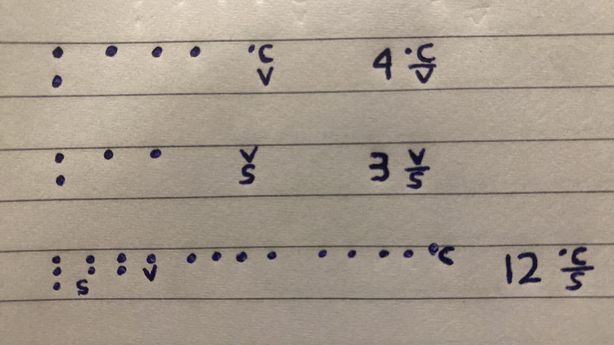

<div align='center'>
    <h1> Introduction of Units </h1>
</div>

A unit, in mathematical and scientific contexts is a standardized quantity used as a refernce for measuring a particular physical or abstract property. It assigns meaning to a numerical value by **specifying the dimension it represents**. For instance, the number "6" alone is dimensionless and ambiguous, however, when paired with a unit such as $6 \ \frac{\mathrm{km}}{\mathrm{h}}$, it becomes velocity, indicating a rate of change in position over time. Formally, units are part of dimensional analysis, a branch of mathematics that **ensures consistency in equations** by tracking dimensions associated with quantites. A unit is a constraint on how a numerical value participates in equations. Units are algebraic labels that enforce correct combination of quantities. **Only equations give physical meaning, units alone never do**. Units must be fixed and cannot contain numerical information.

A quantity is defined as an ordered pair consisting of a scalar and a unit. Equivalently, it may be written as the product.

```math
Q = xu
```

Where,

-  $x ∈ \mathbb{R}$ is a numerical magnitude.
- $u$ is a unit representing a reference standard.

The unit $𝑢$ specifies the dimension of the quantity and provides semantic meaning to the scalar $𝑥$. Without $𝑢$, the numerical value $𝑥$ alone is dimensionally indeterminate. The expression $xu$ is interpreted as $x$ times the reference quantiy defined by $u$

A unit defines **the dimension** of a quantity, and the **scalar multiplies** that unit to determine its magnitude. Consider the example $6 \frac{\mathrm{km}}{\mathrm{h}}$, "km" denotes kilometres and "h" denotes hours. The "/" symbol indicates divison, hence $6 \ \frac{\mathrm{km}}{\mathrm{h}}$ is read as "kilometres per hour". Meaning, the distance travelled in kilometres divided by the time elapsed in hours. This interpretation allows us to understand the quantity as a rate, for every hour, 6 kilometres are covered.

- **Length** - $5m$ (metres), read as "five metres". Here, the unit "m" specifies linear extent.
- **Area** - $4m^2$ (square metres), read as "four square metres", indicating length squared.
- **Volume** - $3m^3$ (cubic metres), read as "three cubic metres", from length cubed.
- **Density** - $2 \ \frac{\mathrm{kg}}{\mathrm{m^3}}$, read as "two kilogrames per cubic metre", a mass per unit volume.

<div align='center'>
<h1> Meaning and Creation </h1>

</div>

A unit derives its meaning from its ability to quantify measurable quantities in a consistent and reproducible manner. Units are created through standardization bodies like the International System of Units (SI), which defines seven base units.

1. **Meter (m)** - For length, is defined from the speed of light
2. **Kilogram (kg)** - For mass.
3. **Second (s)** - For time, it is defined by a specific atomic transition.
4. **Ampere (A)** - For electric current.
5. **Kelvin (K)** - For temperature.
6. **Mole (mol)** - For amount of substance.
7. **Candela (cd)** - For luminous intensity.

Derived units are formed by algebraic combinations of these base units via multiplication, division or exponentiation.

For example,

- **Velocity $\frac{\mathrm{m}}{\mathrm{s}}$** = $\frac{\mathrm{Length}}{\mathrm{Time}}$, created by dividing length by time.

- **Acceleration $\frac{\mathrm{m}}{\mathrm{s^2}}$** = $\frac{\mathrm{Length}}{\mathrm{Time^2}}$, from velocity divided by time.

- **Force (Newton) $\frac{\mathrm{kg \ \cdot \ m }}{\mathrm{s^2}}$**, from mass times acceleration.

Base units like "metre" are not ratios, they are fundamental references. However, many derived units, especially rates are ratios, such as speed $\frac{\mathrm{distance}}{\mathrm{time}}$. Even non-ratio units can be expressed dimensionally, for instance energy (joule) is $\frac{\mathrm{kg \ \cdot \ m^2 }}{\mathrm{s^2}}$, which is not purely a ratio but a product of ratios. Units can also be dimensionless, such as angles ($\mathrm{rad}$) or ratios like efficiency, e.g. 0.8 meaning 80%.

Creation of a unit involves,

1. **Selection of base units** - Choose appropriate standards, e.g. SI vs Imperial.
2. **Algebraic operations** - Multiply for products (e.g. $Area = Length \cdot Length$), divide for rates (e.g. $density = \frac{mass}{volume}$) or raise to powers (e.g. $pressure = \frac{force}{area} = \frac{N}{m^2}$)
3. **Prefixes for scaling** - Use SI prefixes like kilo ($10^{3}$) to adjust magnitude without changing the dimension.

In practice, units ensure that each term in an equation is consistent, compatible and in the same dimension. For example, in the kinematics equation $v = u + at$, all terms must have units of velocity for the equation to hold.

A term in this context is any individual piece of an equation seperated by a plus or minus sign. Key points about terms i,

- **Simple or compound** - A term can be a single variable (e.g $u$) or a combination of variables (e.g. $at$)

- **Independent contribution** - Each term contributes independently to the total value of the expression.

- **Unit consistency** - Terms that are added or subtracted must have the same units, otherwise the equation is physically meaningless.

In the equation $v = u + at$

- $u$ has the unit of velocity, $\frac{m}{s}$
- $at$ has the unit of velocity $\frac{m}{s}$ because $a \ (\frac{m}{s^2}) \cdot t \ (s) = \frac{m}{s}$

Therefore, the equation is valid and the plus and minus of each term can occur because all terms share compatible units.

#### Units as Operational Constraints, Not Representations

In Physics and mathematics, a **unit does not describe what a quantity looks like** and does not encode a physical mechanism. Instead, a unit functions as an **operational constraint**. It specifies how a numerical value is permitted to participate in equations, comparisons and algebraic operations.

Formally, a physical quantity consists of a numeric value together with a unit. The unit acts as a **comparison standard**, defining what "1" means for that kind of measurement and determining which quantities may be meaningfully added, subtracted, multiplied or divided. For example, lengths may be added to lengths, but not to times. Forces may be multiplied by distances, but not added to them. In this sense, units play a role analogous to types in a programming language, they prevent invalid operations and enforce structural consistency.

#### Division vs Multiplication of Units

When units are divided, the result is a **rate**. A unit such as $\frac{m}{s}$ **answers a "per" question**. How much length corresponds to one unit of time. Rate units are often intuitive because they align with everyday experience and sequential reasoning.

Multiplication of units, by contrast does not produce a rate and does not imply spatial extension, motion or geometry. A product such as $N \cdot m$ signifies joint dependence. The resulting quantity depends linearly on both contributing quantities simultaneously. This dependence is purely algebraic. If either factor is scaled, the resulting quantity scales proportionally. If both are scaled, the effect compounds. No additional interpretation is implied by the multiplication itself.

#### Why Compound Units Resist Visualization

Certain compound units, mostly notably area ($m^2$), has a geometric visualization. This is a special case arising from the structure of physical space, not a general feature of unit multiplication. Most compound units such as $N \cdot m$, $\frac{kg \cdot m}{s}$, or $J \cdot s$ **do not correspond to shapes, regions or spatial distributions**. Attempting to visualize them leads to confusion because such units **were never intended** to represent physical objects or configurations.

Questions such as "Where is the meter" or "What shape does $N \cdot m$ make" are therefore category errors. They assume that a unit must encode spatial or mechanical structure, when it infacts **it encodes algebraic compatibility**.

#### Meaning Comes from Equations, Not Units

**A unit itself carries no physical meaning** beyond its algebraic role. The same unit may appear in distinct physical contexts with different interpretations. For example, $N \cdot m$ appears in both work and torque, yet these quantites differ fundamentally in behaviour and interpretation. The distinction arises from the **equations in which the unit appears, not from the unit itself**.

Therefore, physical meaning is assigned by equations and laws, while units serve to ensure that those equations are internally consistent and dimensionally valid. Units enforce how quantities combine, equations determine what those combinations represent.

Units should be understood as **algebraic labels that constrain numeric values**, not as representations of physical objects, motions or geometries. Multiplying units create a new label that records simultaneous dependence on multiple base quantities. Visualization is optional and often unavailable, area is an exception rather than a model.

**Units enforce consistency, equations assign meaning**. Once this distinction is accepted, compound units such as $N \cdot m$ cease to be mysterious and instead become predictable elements of a coherent algebraic system.

<div align='center'>
    <h1> Different Types of Units </h1>
</div>

#### Base Units

These are the fundamental, irreducible units defined independently. As mentioned, SI base units include m, kg, s, etc. They are not derived from others and serve as building blocks. Interpretation is straightforward, "1kg" is read as "one kilogram", representing mass without ratios.

#### Derived Units

A derived unit,

- Is a product of base units.
- Is treated **as a single compound unit**.
- Scales exactly like any other unit.

So,

```math
c \left(\frac{m}{s} \right) = c \cdot m \cdot s^{-1}
```

Is just a scalar multiplication of a symbolic unit expression. A derived unit like $\frac{m}{s}$ **is not a number fraction**, it is a compound unit $ms^{-1}$ and multiplying by a scalar scales the entire compound unit exactly the same way as multiplying $6 \cdot m$ scales metres.

A derived unit is just algebra on base units. For example,

```math
\frac{m}{s} = m \cdot s^{-1}
```

That's it. It is **not a numerical fraction**. It is a product of unit symbols with exponents.

```math
1\frac{m}{s} = 1 \cdot m \cdot s^{-1}
```

Where, the "1" is the scalar. The unit part is $m \cdot s^{-1}$. The "per 1 second" is not something being divided numerically, it is built into the unit definition.

Take,

```math
\frac{6}{5} \frac{m}{s}
```

This means,

```math
\frac{6}{5} \cdot m \cdot s^{-1}
```

That is the complete structure. There is,

- One scalar, $\frac{6}{5}$
- One unit expression, $ms^{-1}$

Nothing inside the unit is independently scaled.

If you rewrite,

```math
\frac{6}{5} \cdot m \cdot s^{-1}
```

as a fraction, you get

```math
\frac{6m}{5s}
```

Now it looks like 6 went to metres and 5 went to seconds, but that is just algebraic rearrangement. This did not scale metres and not seconds, **the entire unit expression was scaled** and then rewrote it. Units behave like algebraic symbols. Just like,

```math
\frac{6}{5}xy^{-1}
```

The scalar multiplies the whole product. You're never scaling the numerator and denominator separately.

Units are **always defined relative to 1 of that unit**.

So when we say,

```math
1.2\frac{m}{s}
```

We mean, 1.2 × (1 metre per 1 second). We always normalize back to "per 1 second" because that is the unit definition. That does not mean the denominator stayed unchanged during multiplication. It means we express the final value relative to the standard unit.

Even though,

```math
\frac{6}{5} \frac{m}{s} = \frac{6m}{5s}
```

both are mathematically the same, **we always express it relative to the standard unit**, which is "per 1 second" in $\frac{m}{s}$.

So,

```math
\frac{6m}{5s} = \frac{6}{5} \frac{m}{s} = 1.2 \frac{m}{s}
```

#### Scaling Units - Dimensionless and Prefixed

Scaling refers to units that adjust magnitude without altering dimension. There are five common scaling units.

- **Prefixes** - These are multiplicative factors, e.g. micro ($μ = 10^{-6}$) in $μm$ (micrometre). Reading "$5 μm$" as "five micromtres", equivalent to $5 × 10^{-6} m$
  - Kilo (k) - Multiplies the base unit by $10^{3}$, as in kilometre (1000 metres) or kilogram (1000 grams).
  - Mega (M) - Multiplies the base unit by $10^{6}$
  - Giga (G) - Multiplies the base unit by $10^{9}$
  - Milli (m) - Divides the base unit by 1000 or multiplying by $10^{-3}$
  - Micro (μ) - Divides the base unit by 1,000,000 or multiplying by $10^{-6}$

- **Dimensionless units** - These have no physical dimension, often arising from ratios of like quantites. These quantities have no physical dimension and arise from ratios of the same type of quantity, so the units cancel out. They act purely as scaling factors, changing only magnitude. If an objects mass changes from 5kg to 10kg, the ratio is $\frac{10}{5} = 2$, which is unitless. This means the mass has doubled, often read as "twice as large".

Versus other types, scaling units differ from dimensional units in that they do not introduce new dimensions, they merely resize. In contrast, derived units like $\frac{km}{h}$ introduce a rate dimension.

#### Specialized Units

In fields like thermodynamics (e.g. entrophy $\frac{J}{K}$) or electromagnetism (e.g. $Tesla = \frac{kg}{s^2 \ \cdot \ A}$). These are derived but tailored to specific domains.

<div align='center'>
    <h1> Working with Units </h1>
</div>

## Multiplying

A physical quantity is defined as the product of a scalar number and a unit.

```math
Q = n \cdot u
```

where $n$ is a real number and $U$ is a unit symbol. **This unit is not embedded in the number, it is an independent algebraic factor**. This separation is foundational. Numerical operations act on numbers, while units combine according to algebraic rules.

When two quantities are multiplied, the multiplication processes **independently on numbers and units**.

```math
(aU)×(bV)=(a×b)(U×V)
```

This rule is exact and universal. No interpretation is applied at this stage, the operation is purely algebraic. Multiplying quantities does not describe a physical process, nor does it imply motion, shape or distribution.

**Example** - Separate into two operations. One for the numbers and one for the units.
```math
\frac{8}{3} \frac{L}{s} \times 8000L
```

**Numbers**
```math
\frac{8}{3} \times 8000 = \frac{64000}{3}
```

**Units**
```math
\frac{L}{s} \times L = \frac{L^2}{s}
```

**Combine**

```math
\frac{64000}{3} \frac{L^2}{s}
```

Units behave like algebraic symbols.

- They multiply
- They divide
- They cancel
- They exponentiate

They do **not** mix with numbers. You **never multiply a number ino a unit**. You only attach the unit after the numeric operation. **Units only change when you multiply by something that itself has units**.

- **Multiply by $3$** - Only the **number** changes.
- **Multiply by $\frac{3}{3}$** - Nothing changes.
- **Multiply by $\frac{3s}{3s}$** - Still nothing changes.
- **Multiply by $3s$** - **Units** change.

So if you want a factor of $3$ to appear in the unit, it must come from an expression that already contains that unit.

- Dimensionless factors only change numbers.
- Unit-bearing factors change units.

Additionally, **you do not need the same quantity to cancel units**. You need the same unit, not the same quantity.

**Example**

```math
\frac{5}{3} \frac{km}{s} \times 2s
```

**Step 1 - Write in scalar-unit form**

```math
\frac{5}{3} \frac{km}{s} = \left( \frac{5}{3} \right) \frac{km}{s}
```


```math
2s = 2 \times s
```

**Step 2 - Multiply scalars and units separately**

```math
\left(\frac{5}{3} \times 2 \right) \left( \frac{km}{s} \times s\right)
```

**Step 3 - Cancel units, not numbers**

You do not cancel $3s$ with $2s$, you only cancel the unit $s$.

```math
\frac{km}{\cancel{s}} \times \cancel{s} = km
```

**Result**

```math
\frac{10}{3} km
```

## Inverting

A measured quantity is,

```math
Q = c \cdot U
```

Where,

- $c$ = scalar
- $U$ = unit expression

They are distinct types of objects, but they are multiplied together into one algebraic object.

If you invert a quantity, you invert the entire product.

```math
Q^{-1} = \left( c \cdot U \right)^{-1}
```

Now use the algebra rule

```math
(ab)^{-1} = a^{-1}b^{-1}
```

Therefore

```math
(c \cdot U)^{-1} = c^{-1} \cdot U^{-1}
```

Hence if we had the example,

```math
\frac{5}{3} \frac{m}{s} = \frac{5}{3} \cdot ms^{-1}
```

Invert entire quantity

```math
\begin{aligned}
&= \left( \frac{5}{3} \right)^{-1} \cdot (ms^{-1})^{-1} \\
&= \frac{3}{5} \cdot sm^{-1} \\
&= \frac{3}{5}\frac{s}{m}
\end{aligned}
```

This has resulted the scalar being inverted and the unit exponents inverted. Multiplication and inversion apply to the entire product structure. The scalar and unit don't mix, they transform in parallel.

## Changing Between Units
To change units, we multiply by conversion factors that equal 1.

We know,

```math
\begin{aligned}
1\,\text{km} &= 1000\,\text{m} \\
3600\,\text{s} &= 1\,\text{hr}
\end{aligned}
```

Keep in mind, units by themselves are not numbers, only quantities (number + unit) can be compared or divided.

For example, consider

```math
\frac{1km}{1m}
```

Using the definition \(1km = 1000m\), we rewrite,

```math
\frac{1km}{1m} = \frac{1000m}{1m} = \frac{1000\cancel{m}}{\cancel{m}}= 1000
```

So this ratio is dimensionless and evaluates to a pure number because the units are both representing length and can divide into each other, due to the previous $=$ equality.

Now consider,

```math
\frac{1km}{1000m}
```

Substitute again,

```math
\frac{1km}{1000m} = \frac{1000m}{1000m} = 1
```

This is a ratio of the same quantity written in two different ways, so it equals 1.

Similarly,

```math
\frac{3600s}{1hr} = \frac{1hr}{1hr} = 1
```


- If units do not cancel, then you have a physical quantity (scalar × unit). 
- If units cancel (same dimension), then you get a pure number .

To change units, we are multiplying by 1 in disguise. This means we keep the dimension the same for the units we are changing. For example, to convert from \(\frac{m}{s}\) to \(\frac{km}{h}\):

```math
\frac{6}{5} \frac{m}{s} \cdot \frac{1km}{1000m} \cdot \frac{3600s}{1hr}
```

Each fraction equals 1, so the value stays the same, but the units change.

**Scalars**

```math
\frac{6}{5} \cdot \frac{1}{1000} \cdot 3600 = \frac{6}{5} \cdot \frac{3600}{1000} = 4.32
```

**Units**

```math
\frac{\cancel{m}}{\cancel{s}} \cdot \frac{km}{\cancel{m}} \cdot \frac{\cancel{s}}{hr} = \frac{km}{hr}
```

**Result**

```math
4.32 \frac{km}{hr}
```

An additional example with more conversions could be calculating $\frac{\text{seconds}}{\text{year}}$. This is read as "How many seconds are in one year".

##### Step 1 - Write the conversion chain

We multiply the units so that everything cancels **except seconds**.

```math
1 \ \text{year} = ? \ \text{seconds}
```

##### Step 2 - Use standard conversion factors

- $1$ year = $365.25$ days
- $1$ day = $24$ hours
- $1$ hour = $60$ minutes
- $1$ minute = $60$ seconds

##### Step 3 - Write the full expression

```math
1 \ \text{year}
= 365.25 \ \text{days}
\times 24 \frac{\text{hours}}{\text{day}}
\times 60 \frac{\text{minutes}}{\text{hour}}
\times 60 \frac{\text{seconds}}{\text{minute}}
```

##### Step 4 - Condense expression

```math
\begin{aligned}
1 \ \text{year}
&= 365.25 \ \text{days}
\times 24 \frac{\text{hours}}{\text{day}}
\times 60 \frac{\text{minutes}}{\text{hour}}
\times 60 \frac{\text{seconds}}{\text{minute}}
\\
&= 365.25 \ \cancel{\text{days}}
\times 24 \frac{\cancel{\text{hours}}}{\cancel{\text{day}}}
\times 60 \frac{\cancel{\text{minutes}}}{\cancel{\text{hour}}}
\times 60 \frac{\text{seconds}}{\cancel{\text{minute}}}
\\
&= 365.25 \times 24 \times 60 \times 60 \ \text{seconds}
\\
&= 31{,}557{,}600 \ \text{seconds}
\end{aligned}
```

##### Step 5 - Create unit

If $1 \text{ year} = 31{,}557{,}600 \ \text{seconds}$ it therefore follows,

```math
\begin{aligned}
31{,}557{,}600 \ \text{seconds} &= 1 \ \text{year} \\
\frac{31{,}557{,}600 \ \text{seconds}}{1 \ \text{year}} &= 1 \\
\end{aligned}
```

Therefore,

```math
31{,}557{,}600 \ \frac{\text{seconds}}{\text{year}}
```

## Units in Exponnents

Dimensional analysis is one of the most powerful validation tools in mathematics, physics and engineers. By tracking units through equations, it becomes possible to verify whether formulas are physically meaningful before numerical calculation even begins. Exponential functions, however, introduce a subtle but extremely important restriction, **the exponent of an exponential expression must always be dimensionless**. This initially feels counterintuitive because many exponential growth models involve quantities with physical units such as time, distance or temperature. Expressions such as,

```math
2^t
```

to appear to place seconds directly inside an exponent, despite exponents traditionally representing repeated multiplication counts.

Consider a simple exponential

```math
2^3
```

This means,

```math
2 \times 2 \times 2
```

The exponent $3$ does not multiply into the result directly. Instead, it specifies how many repeated multiplications occur. The exponent therefore acts as a counting parameter. Because counts are pure numbers, **exponents cannot possess physical dimensions**. An expression such as

```math
2^{5_s}
```

Would literally mean "Multiply $2$ by itself "5 seconds times"" which has no mathematical interpretation. Seconds measure duration, not repetition count. Thus, **exponents must always reduce to pure dimensionless numbers** before exponentiation becomes meaningful. Despite this restriction, exponential growth models naturally involve time. For example, suppose a quantity doubles every second. A common shorthand model is,

```math
V(t) = V_0 2^t
```

where,

- $V(t)$ is volume.
- $V_0$ is initial volume.
- $t$ is measured in seconds.

At first glance this appears dimensionally inconsistent because $t$ seems to carry units inside the exponent. However, the rigorous form of the equation is actually,

```math
V(t) = V_02^{\frac{t}{T}}
```

where,

- $T$ is the doubling time.

If doubling occurs every second, then

```math
T = 1s
```

So the expression becomes,

```math
V(t) = V_0 2^{\frac{t}{1s}}
```

now the exponent is,

```math
\frac{t}{1s}
```

which is dimensionless because the seconds cancel. So for example if,

```math
t = 58s
```

then,

```math
\frac{58s}{1s} = 58
```

and the exponent reduces correctly to,

```math
2^{58}
```

which is mathematically valid. Additionally, if the question were to be stated to double every 2 seconds, $T$ can be $2_s$.

```math
V(t) = V_0 2^{\frac{t}{2T}}
```

Hence if $t = 58$

```math
V(t) = V_0 2^{\frac{58s}{2T}}
```

Hence, the exponent becomes $29$ and implies it doubled $29$ times.

As an additional example, radioactive decay is an example that includes exponent units which cancel out. The decay constant, λ "lambda", the reciprocal of the mean lifetime (in $s^{−1}$), sometimes referred to as simply decay rate. The decay exponential decay law is defined as,

```math
N(t) = N_0 e^{-λt}
```

<div align='center'>
    <h1> Multiplication to Change Units </h1>
</div>

Multiplication to change between units is very important and frequently used, especially in calculus. The ability to change between units involves scaling upwards a "per unit" unit so that it equals an amount of another unit "per unit" which will cancel out the component of the unit that was scaled upwards. 

Suppose,

1. Temperature changes by $4^\circ C$ for every $1$ volt.

```math
\frac{dT}{dV} = 4
```

2. Voltage changes by $3$ volts for every $1$ second.

```math
\frac{dV}{dt} = 3
```

It therefore follows,

```math
\frac{dT}{dt} = \frac{dT}{dV} \cdot \frac{dV}{dt} = 4 \frac{^\circ C}{V} \cdot 3 \frac{V}{s} = 12 \frac{^\circ C}{s}
```

This can be illustrated algebraically,

```math
\begin{aligned}
4\,^\circ C &= 1\,V
\\

3\,V &= 1\,s
\\

12\,^\circ C &= 3\,V
\\

12\,^\circ C &= 3\,V = 1\,s
\end{aligned}
```

Therefore, $12 \ ^\circ C$ occurs per $1$ second which is expressed as, 

```math
12 \frac{^\circ C}{s}
```

This can also be illustrated visually.

<div align='center'>
    
</div>


<div align='center'>
    <h1> Exercises </h1>
</div>

**Question 1** - A $1000L$ tank is filled at a rate of $25 \frac{L}{S}$. How long does it take to fill the tank?

Start with constructing the equation to solve for $x$

```math
25\frac{L}{s} \cdot x s = 1000L
```

Cancel the seconds unit.

```math
25\frac{L}{\cancel{s}} \cdot x \cancel{s} = 1000L
```

Condense the equation.

```math
25Lx = 1000L
```

Cancel the Length unit.

```math
25\cancel{L}x = 1000\cancel{L}
```

Now solve for $x$

```math
\begin{aligned}
x &= \frac{1000}{25} \\
x &= 40
\end{aligned}
```

Therefore, it will take 40 seconds to fill the tank.

**Question 2** - A car travels at a velocity of $12\frac{m}{s}$ for $15s$. How far did the car travel?

Start with constructing the equation to solve for $x$

```math
12\frac{m}{s} \cdot 15s = xm
```

Separate the scalar and units. Then condense the equation.

```math
\left( 12 \cdot 15\right) \left( \frac{m}{\cancel{s}} \cdot \cancel{s} \right) = xm
```

Cancel out the metre units.

```math
180\cancel{m} = x\cancel{m}
```

Solve for x.

```math
180 = x
```

Therefore, the car will travel 180 metres.

**Question 3** - Convert $8\frac{m}{s}$ to $\frac{km}{hr}$

Start by identifying the current units $\frac{m}{s}$ and the units we need to change it to $\frac{km}{h}$. Remember the golden rule, it's completely fine to multiplying by $1$.

First, identify the conversion between $m$ and $km$

```math
\begin{aligned}
1\,\text{km} &= 1000\,\text{m} \\
\frac{1\,\text{km}}{1000\,\text{m}} &= 1
\end{aligned}
```

Secondly, identify the conversion between $s$ and $hr$

```math
\begin{aligned}
3600\,\text{s} &= 1\,\text{hr} \\
\frac{3600\,\text{s}}{1\,\text{hr}} &= 1
\end{aligned}
```

Now, we use this to convert between units by multiplying by 1 in disguise.

```math
8\frac{m}{s} \cdot \frac{1km}{1000m} \cdot \frac{3600s}{1hr}
```

Now multiply separately between the scalar and the units.

```math
\left( 8 \cdot \frac{1}{1000} \cdot \frac{3600}{1} \right) \left( \frac{\cancel{m}}{\cancel{s}} \cdot \frac{km}{\cancel{m}} \cdot \frac{\cancel{s}}{hr} \right) = 8 \cdot \frac{3600}{1000} \frac{km}{hr} = 28.8 \frac{km}{hr}
```

Therefore, $8\frac{m}{s}$ is equivalent to $28.8 \frac{km}{hr}$

**Question 4** - A runner is moving at a velocity of 5$\frac{m}{s}$. What is this rate in $\frac{s}{m}$?

Start with,

```math
5 \frac{m}{s}
```

We want the recriprical. Therefore, we separate the scalar and unit and both put them to the power of $- 1$

```math
\left( 5 \frac{m}{s}\right)^{-1} = \left(5^{-1}\right) \left(\frac{m}{s} \right)^{-1} = \frac{1}{5} \frac{s}{m}
```

**Question 5** - With the density of liquid being $800\frac{kg}{m^3}$ and having $4m^3$, what mass do you have?

First understand the question carefully to understand the unit we're solving for. We are asked to solve for how much mass we will have. Therefore, we need to solve the unknown $x$ for the mass unit $kg$.

```math
\begin{aligned}
800\frac{\text{kg}}{\text{m}^3} \cdot 4\text{m}^3 &= x\text{kg} \\
800\frac{\text{kg}}{\cancel{\text{m}^3}} \cdot 4\cancel{\text{m}^3} &= x\text{kg} \\
800 \cdot 4\,\text{kg} &= x\text{kg} \\
3200\,\text{kg} &= x\text{kg} \\
3200\cancel{\text{kg}} &= x\cancel{\text{kg}} \\
3200 &= x
\end{aligned}
```

Now, solving for x we know that we will have $3200kg$

**Question 6** - A rocket ejects gas at a rate of of $4\frac{kg}{s}$ with a velocity of $300 \frac{m}{s}$. What force is produced?

First, start with.

```math
4\frac{kg}{s} \cdot 300 \frac{m}{s}
```

Group scalars and units.

```math
4 \cdot 300 \cdot \frac{kg}{s} \cdot \frac{m}{s}
```

```math
1200 \frac{kg \cdot m}{s^2}  
```

Now recognize,

```math
\frac{kg \cdot m}{s^2} = N
```

Therefore,

```math
= 1200N
```

**Question 7** - A stadium starts with one drop of water. Every second the amount of water doubles. The stadium is full after 60 seconds. When is it quarter full?

##### Step 1 - Define the Exponential Model

Let,

- $V(t)$ = Volume at time $t$.
- $V_0$ = Initial drop volume.
- Doubling time $T = 1s$.

The rigorous model is,

```math
V(t) = V_0 \cdot 2^{\frac{t}{T}}
```

The exponent is dimensionless because,

```math
\frac{t}{1s}
```

cancels out the $s$ unit.

##### Step 2 - Express Full Volume

If the stadium becomes full at $t=60s$ then,

```math
V_f = V_0 \cdot 2^{60}
```

##### Step 3 - Determine Quarter Full Volume

Quarter full means,

```math
\frac{V_f}{4}
```

Substitute $V_f$,

```math
\frac{V_f}{4} = \frac{V_0 \cdot 2^{60}}{2^2}
```

Apply exponent laws,

```math
\frac{V_f}{4} = V_0 \cdot 2^{60-2} = V_0 \cdot 2^{58}
```

##### Step 4 - Match Against the Original Model

The model states,

```math
V(t) = V_0 \cdot 2^t
```

Quarter full occurs when,

```math
V_0 \cdot 2^t = V_0 \cdot 2^{58}
```

Cancel $V_0$

```math
2^t = 2^{58}
```

Apply logarithms to both sides,

```math
\begin{aligned}
\log_{2}\left(2^t\right) &= \log_{2}\left(2^{58}\right) \\
t &= 58
\end{aligned}
```

Therefore, the stadium is quarter full after $58$ seconds.