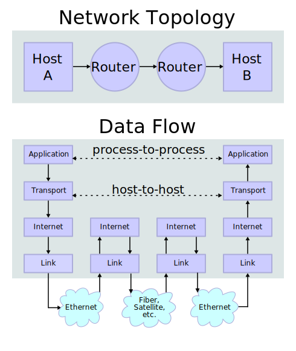
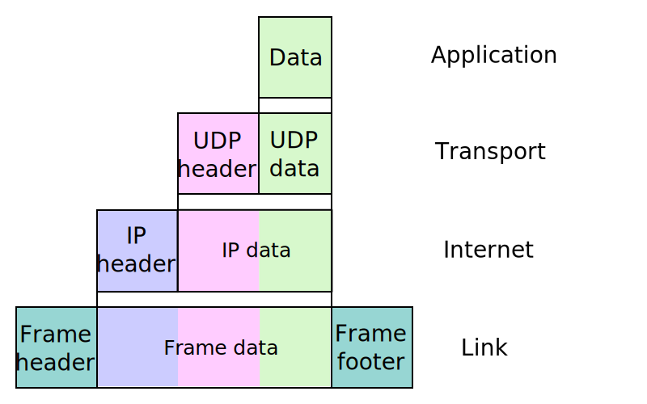

# Internet Protocol Suite

The **Internet protocol suite**, commonly known as **TCP/IP**, is the set of communication protocols used in the internet and similar computer networks. The current foundational protocols in the suite are the Transmission Control Protocol (TCP), the Internet Protocol (IP), aswell as the User Datagram Protocol (UDP). It is important to note that TCP/IP is simply the name to refer to the Internet protocol suite but is not limited to TCP, for example, UDP can be used. However, the ratio of TCP or UDP traffic is about one million to one so the name TCP/IP was instead adopted because TCP is the most common protocol used.

The Internet protocol suite provides end-to-end data communication specifying how data should be packetized, addressed, transmitted, routed and received. This functionality is organized into four abstraction layers, which classify all related protocols according to each protocol's scope of networking. From lowest to highest, the layers are the **link layer**, containing communication methods for data that remains within a single network segment(link). The **internet layer**, providing internetworking between independent networks. The **transport layer**. handling host-to-host communication. The **application layer**, providing process-to-process data exchange for applications.

The technical standards underlying the internet protocol suite and its constituent protocols are maintained by the Internet Engineering Task Force (IETF). The Internet protocol suite predates the OSI model, a more comprehensive reference framework for general networking systems.

# Network Topology

The below image demonstrates a conceptual data flow in a simple network topology of two hosts (A and B) connected by a link between their respective routers. The application on each host executes read and write operations as if the processes were directly connected to each other by some kind of data pipe. After establishment of this pipe, most details of the communication are hidden from each process, as the underlying principles of communication are implemented in the lower protocol layers. In analogy, at the transport layer the communication appears as host-to-host, without knowledge of the application data structures and the connecting routers, while at the internetworking layer, individiual network boundaries are traversed at each router.

## Network Encapculation

Encapsulation is a method of designing modular communication protocols in which logically seperate functions in the network are abstracted from their underlying structures by inclusion or information hiding within higher-level objects. In other words, encapsulation "takes information from a higher layer and adds a header to it, treating the higher layer information as data".

The physical layer is responsible for physical transmission of the data, link encapsulation allows local area networking, IP provides global addressing of individual computers, and TCP selects the process or application (i.e. the TCP or UDP port) that specifies the service such as a  Web or TFTP server.

The result of encapculation is that each lower-layer provides a service to the layer above it, while at the same time eah layer communicates with the corresponding layer on the receiving node. These are known as adjacent-layer interaction and same-layer interaction, respectively.

Encapsulation is a charasteristic feature of most networking models, including both the OSI model and TCP/IP suite of protocols.

## Encapsulation example

During encapsulation, each layer builds a protocol data unit (PDU) by **adding a header and optionally a trailer, both of which contain information of the PDU from the layer above**.

For example (UDP example illustrated below), in the IP suite, the contents of a web page are encapsulated with an HTTP header, then by a TCP header, an IP header and finally by a frame header and a trailer. The frame is forwarded to the destination node as a stream of bits, where it is decapsulated (or de-encapsulated) into the respective PDUs and interpreted at each layer by the receiving node.

# Application layer

The application layer includes the protocols used by most applications for providing user services or exchanging application data over the network connections established by the lower level protocols. This may include some basic network support such as routing protocols and host configuration. Examples of application layer protocols include the HyperText Transfer Protocol (HTTP), File Transfer Protocol (FTP) and Simple Mail Transfer Protocol (SMTP). Data coded according to application layer protocols are encapsulated into transport layer protocols (such  as TCP streams or UDP datagrams), which in turn use lower layer protocols to effect actual data transfer.

Application layer protocols are often associated with particular client-server applications and common services have *well-known* port numbers reserved by the Internet Assigned Numbers Authority (IANA). For example, HyperText Transfer Protocol uses the server port 80 and telnet uses server port 23.

# Transport layer

The transport layer establishes basic data channels that applications use for task-specific data exchange. The layer establishes host-to-host connectivity in the form of end-to-end message transfer services that are independent of the underlying network and independent of the structure of user data and the logistics of exchanging information. Connectivity at the transport layer can be categorized as either connection-oriented, implemented in TCP, or connectionless, implemented in UDP. The protocols in this layer may provide error control. segmentation, flow control, congestion control and application addressing (port numbers).

For the purpose of providing process-specific transmission channels for applications, the layer establishes the concept of the network port. This is a numbered logical construct allocated specifically for each of the communication channels an application needs. For many types of services, these port numbers have been standardized so that client computers may address specific services of a server computer without the involvement of service discovery or directory services.

The TCP/IP model's transport or host-to-host layer corresponds roughly to the fourth layer in the OSI model, also called the transport layer. Because IP provides only a *best-effort delivery*, some transport-layer protocols offer reliability.

## TCP

TCP is a connection-oriented protocol that addresses numerous reliability issues in providing a reliable byte stream.

1. Data arrives in-order
2. Data has minimal error (i.e, correctness)
3. Duplicate data is discarded
4. Lost or discarded packets are resent
5. Includes traffic congestion control

## UDP

The User Datagram Protocol (UDP) is a connectionless datagram protocol. Like IP, it is a best-effort, unreliable protocol. Realiability is addressed through error detection using a checksum algorithm. UDP is typically used for applications such as streaming media (audio, video, Voice over IP, etc) where on-time arrival is more important than reliability.

The applications at any given network addresses are distinguished by their TCP or UDP port. By convention, certain well known ports are associated with specific applications.

# Internet layer

Internetworking requires sending data from the source network to the destination network. This process is called routing and is supported by host addressing and identification using the hierarchical IP addressing system. The internet layer provides an unreliable datagram transmission facility between hosts located on potentially different IP networks by forwarding datagrams to an appropiate next-hop router for further relaying to its destination. The Internet layer has the responsibility of sending packets across potentially multiple networks. With this functionality, the Internet layer makes possible internetworking, the interworking of different IP networks and it essentially establishes the internet.

The Internet layer does not distinguish between the various transport layer protocols. IP carries data for a variety of different upper layer protocols. These protocols are identified by a unique protocol number; e.g. Transmission Control Protocol (TCP) and Internet Group Management Protocol (IGMP) are protocols 6 and 2, respectively.

The Internet Protocol is the principal component of the internet layer and it defines two addressing systems to identify network hosts and to locate them on the network. The original address sytem of the ARPANET and its successor, the internet, is Internet Protocol version 4 (IPv4). IPv4 uses  a 32-bit IP address and is therefore capcable of identifying approximately 4 billion hosts. This limitation was eliminated in 1998 by the standardization of the Internet Procol version 6 (IPv6) which uses 128-bit addresses. IPv6 production implementations emerged in approximately 2006.

# Link layer

The protocols of the link layer operate within the scope of the local network connection to which a host is attached. This regime is called the *link* in TCP/IP parlance and is the lowest component layer of the suite. The link includes all hosts accessible **without traversing a router**. The size of the link is therefore determined by the networking hardware design. In principle, TCP/IP is designed to be hardware independent and may be implemented on top of virtually any link-layer technology. This includes not only hardware implementations, but also virtual link layers such as virtual private networks and networking tunels. The link layer is the group of methods and communications protocols **confined to the link that a host is physically connected to**. The link is the physical and logical network component used to interconnect hosts or nodes in the network and a **link protocol** is a suite of methods and standards that operate only between adjacent network nodes of a network segment.

The link layer is used to move packets between the Internet layer interfaces of two different hosts on **the same link**. The processes of transmitting and receiving packets on the link can be controlled in the device driver for the network card, as well as in firmware or by specialized chipsets. These perform functions, such as framing, to prepare the Internet layer packets for transmission and finally transmit the frames to the physical layer and over a transmission medium. The TCP/IP model includes specifications for translating the network addressing methods used in the Internet Protocol to link-layer address, such as media access control (MAC) addresses. All other aspects below that level, however, are implicitly assumed to exist, and are not explicitly defined in the TCP/IP model.

The link layer in the TCP/IP model has corresponding functions in layer 2 of the OSI model.

