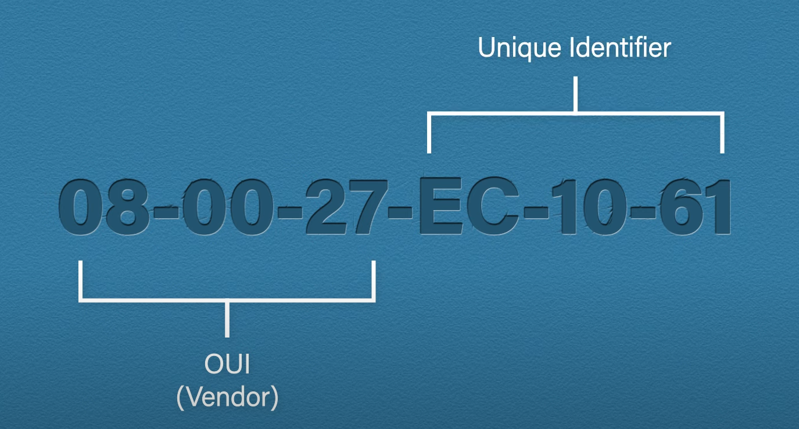
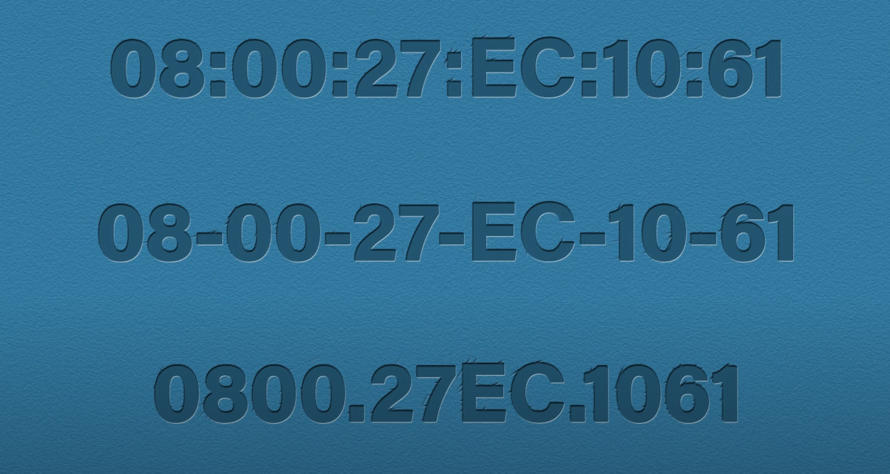
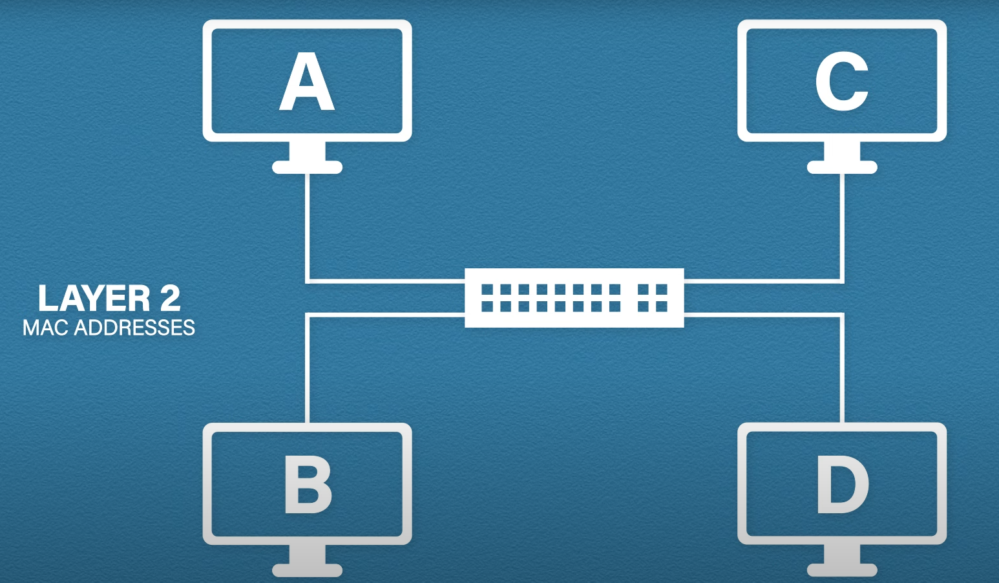
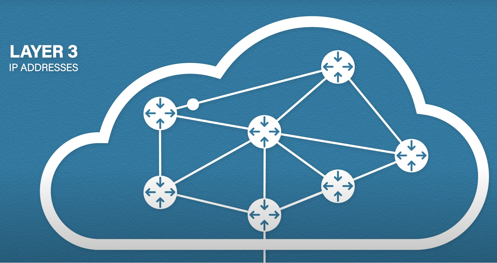

  <h1>  MAC Address </h1>

A media access control address (MAC address) is a unique identifier assigned to a network interface controller (NIC) for use as a network address in communications within a network segment. The usage of the MAC address is in layer 2 (Data Link).

The first thing to note is, unlike an IP address, the MAC address **cannot be changed**. They are described as being physical addresses, i.e. set in stone. However, it is possible to spoof a MAC address. The manufacturer is responsible for deciding the MAC address. 

The address itself is 48 bits (6 bytes) long. The first 24 bits (3 bytes) is called the organizationally unique identifier or OUI. The OUI identifies the vendor. The last 24 bits is a unique value that was assigned by the vendor that makes this address unique.

# Mac address types

There are 3 types of MAC addresses. 

**Unicast**, which means a particular unique MAC address like the one we have above.

**Multicast**, which is a MAC address used for an application or protocol. This will be sent to all devices but only those with that application or protocol will listen to it.

**Broadcast address** has the value **FF-FF-FF-FF-FF-FF**. The broadcast address means it is sent to all devices within a network.

# Representation

There are multiple ways of representing MAC address, but primarily 3 are used.

The above image shows 3 ways of showing the **same** MAC address.

1. The first type is 6 groups of 2 digits, seperated by a colon. This is typically how Linux ur Apple will display their MAC addresses.
2. The second type is 6 groups 2 digits, but this time it is seperated by dashes. This is how Microsoft display their MAC addresses.
3. Lastly, the bottom displays their MAC addresses as three groups of four digits. This is how Cisco displayed their MAC addresses.

# Why we need MAC addresses

Given that we already have IP addresses, we may question, why do we need MAC addresses? Let us look at an example where we have four computers and a switch. Switches are commonly layer 2 devices. When computers are talking to each other in the local area network (LAN), this is layer 2 communication. **Layer 2 communicates using MAC addresses**.

When we **leave our network**, this is where IP addresses are mainly used. Routers are layer 3 devices and they mainly focus on IP addresses to get the data to the destination.

So in summary, you can think about MAC addresses as **local communication** and IP addresses as **global communication**.

# Find your MAC address

To find your own MAC address, open the command window and use `ipconfig /all` to see you interface settings. From here, we need to find our interface. Remember, we may have more than one if we have a wireless interface too. We then need to look for something called the "Physical Address".

