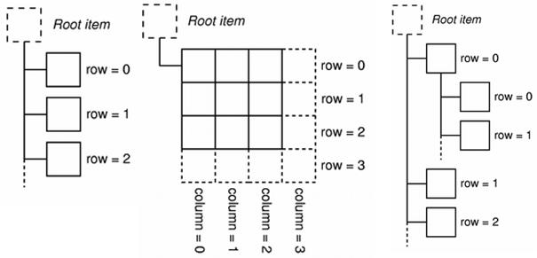
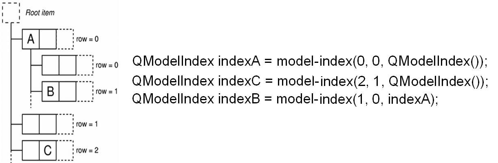
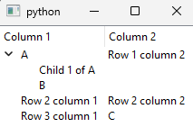

# Indexing

Models are responsible for pulling the data from data source. Arrange data following a hierarchical structure so that views/delegagte can get/set data (using an index called model index). Notify the View & Delegate while data has been modified. There are three types of views and so as models — List, Table & Tree.



To ensure that the representation of the data is kept separate from the way it is accessed, the concept of a model index is introduced.



When indexing in Qt, we need to know three important aspects of a QModelIndex,

1. Row
2. Column
3. Parent

When accessing the data from the model via, `model.index(row, column, parent)`,it is always the `(row, column)` combination, **from the passed parent**. When passing a `QModelIndex()`, it treats this as the Root.



In this code example, I create a practical example of the diagram above.

```python
from PyQt5.QtCore import QModelIndex
from PyQt5.QtWidgets import QApplication, QTreeView
from PyQt5.QtGui import QStandardItemModel, QStandardItem


def create_model():
    model = QStandardItemModel()
    model.setHorizontalHeaderLabels(['Column 1', 'Column 2'])

    for i in range(3):
        for j in range(2):
            model.setItem(i, j, QStandardItem(f'Row {i + 1} column {j + 1}'))

    model.setItem(0, 0, QStandardItem('A'))
    model.setItem(2, 1, QStandardItem('C'))

    # Adding child rows to the item at index (0,0)
    item_00 = model.item(0, 0)
    item_00.setChild(0, 0, QStandardItem(f'Child 1 of A'))
    item_00.setChild(1, 0, QStandardItem('B'))
    return model


def access_model(model):
    # Pass QModelIndex(), indicating (0, 0) from the root
    a = model.index(0, 0, QModelIndex())
    print(a.data())

    # The data for 'B' is located at (1, 0), from being a child of 'A'
    b = model.index(1, 0, a)
    print(b.data())

    # Pass QModelIndex(), indicating (2, 1) from the root
    c = model.index(2, 1, QModelIndex())
    print(c.data())


app = QApplication([])

view = QTreeView()
view.setModel(create_model())
view.show()

access_model(view.model())

app.exec_()
```