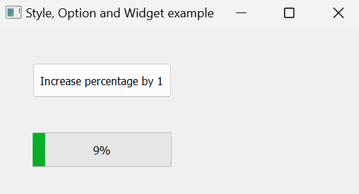
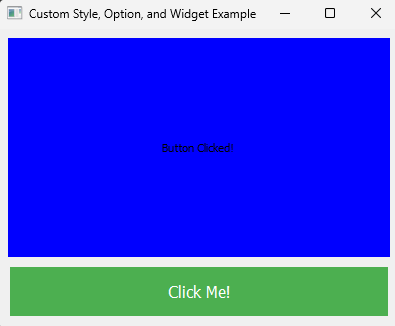

# Qt Styles, Options and Widgets

## Styles

**Style (QStyle)** - Defines the overall look and feel of widgets, including how they are drawn and interact with user input.

Qt Styles refers to the visual appearance and behaviour of the Widgets in a Qt application. It encompasses the overall look and feel, including colours, fonts and spacing. It also includes the way widgets are drawn and interact with user input. Qt provides several built-in styles, such as Windows and MacOS.

Qt Styles are implemented by subclassing `QStyle` and can be customized or extended to create unique appearances for applications.

## Option

**Option (QStyleOption)** - Provides detailed information about a widget's state and properties for use during rendering.

Qt Options refers to the parameters or settings used when rendering a widget or a part of a widget. These encapsulated in classes derived from `QStyleOption`, such as,

- **QStyleOptionButton**
- **QStyleOptionSlider**
- **QStyleOptionViewItem**

Each `QStyleOption` subclass contains information specific to the widget it represents, such as its state (e.g. enabled, pressed, highlighted), geometry and other properties necessary for rendering. **When a widget is drawn**, a `QStyleOption` object is created and populated with relevant data, which is passed to the style's drawing function.

## Widget

**Widget (QWidget)** - Represents interactive elements in the GUI, responsible for managing user interaction, layout, and rendering.

Qt Widget refers to the fundamental building blocks of GUI application in Qt. Widgets are instances of classes derived from `QWidget` and represent various user interface elements, such as buttons, labels, sliders and text inputs, examples include,

- **QPushButton** - A clickable button
- **QLabel** - A text or image display
- **QSlider** - A slider for selecting a value within a range

Widgets handle user interaction, manage layout and positioning, and are responsible for rendering themselves (typically by delegating the rendering to a style).

## Design Rationale

The use of `QStyleOption` in Qt instead of interfacing directly with `QWidget` when using he `QStyle` is a design choice that offers several significant advantages in terms of flexibility, modularity, and maintainability. An Important aspect is that widgets may use `QStyleOptions` to query the style about aspects that may not be reflected by the current widget state. A typical case is for `sizeFromContents()` which may result in a widget state/size change depending on a possible state (eg. a currently empty QComboBox). That wouldn't be easy without an intermediate abstraction object.

#### Seperation of Concerns

- **Modularity** - By separating the widget's data (held in `QWidget`) from its rendering information (held in `QStyleOption`), Qt maintains a clear separation of concerns. The `QWidget` handles the widget's behavior and state, while `QStyleOption` **encapsulates the rendering parameters**.

- **Simplified Styles** - QStyle implementations do not need to know about the internal workings of each widget. They only need the rendering information encapsulated in `QStyleOption`.

#### Performance 

- **Optimized Rendering** - `QStyleOption` allows for the pre-computation of rendering information. Instead of recalculating widget state and geometry repeatedly during painting, this information is prepared once and passed to the style.

- **Reduced Overhead** - Using `QStyleOption` reduces the need for repeated, potentially expensive queries to the QWidget during painting operations. This can lead to performance improvements, especially when rendering complex or numerous widgets.

#### Flexibility and Extensibility

- **Custom Options** - Developers can create custom `QStyleOption` subclasses for new widget types, providing additional flexibility in how widgets are rendered without changing the QWidget interface.

- **Ease of Customization** - Custom styles can be implemented more easily by working with `QStyleOption` objects. This approach allows for greater control and customization of widget appearance.

## Example 1

To recap the interaction,

- **Widgets** - These are the UI elements.
- **Styles** - Determine how the widgets are rendered.
- **Style Options** - Provide detailed information about how a widget should be drawn.

In this example, I will create the following application,



The following code was used the create the application,

```python
import sys
from PyQt5.QtWidgets import QApplication, QMainWindow, QPushButton, QStyleOptionButton, QStyleOptionProgressBar, QStyle, \
    QProgressBar
from PyQt5.QtCore import QRect, Qt
from PyQt5.QtGui import QPainter


class CustomButton(QPushButton):
    def __init__(self, text, parent=None):
        super().__init__(text, parent)
        self.clicked.connect(self.on_click)

    def on_click(self):
        progress_bar = self.parent().progress_bar
        new_value = progress_bar.value() + 1
        if new_value > progress_bar.maximum():
            new_value = progress_bar.minimum()
        progress_bar.setValue(new_value)

    def paintEvent(self, event):
        # Create a QStyleOptionButton
        option = QStyleOptionButton()
        option.initFrom(self)
        option.text = self.text()  # Without setting this, no text will appear.
        option.state = QStyle.State_Enabled | QStyle.State_Raised
        if self.isDown():
            option.state = QStyle.State_Enabled | QStyle.State_Sunken
        if self.isDefault():
            option.features = QStyleOptionButton.DefaultButton

        # Create a QPainter
        painter = QPainter(self)

        # Let the current style draw the button
        # The options contains the parameters that the Style will use
        # The painter does the actual painting
        self.style().drawControl(QStyle.CE_PushButton, option, painter, self)

        # Possiblem approach to draw text, but preferred to use the "text" variable on the Option
        # painter.drawText(self.rect(), Qt.AlignCenter, self.text())


class CustomProgressBar(QProgressBar):
    def __init__(self, parent=None):
        super().__init__(parent)
        self.setValue(0)  # Initialize progress bar value to 0

    def paintEvent(self, event):
        # Create a QStyleOptionProgressBar
        option = QStyleOptionProgressBar()
        option.initFrom(self)
        option.rect = self.rect()
        option.minimum = self.minimum()
        option.maximum = self.maximum()
        option.progress = self.value()
        option.text = f"{self.value()}%"
        option.textVisible = True
        option.textAlignment = Qt.AlignCenter

        # Create a QPainter
        painter = QPainter(self)

        # Let the current style draw the progress bar
        self.style().drawControl(QStyle.CE_ProgressBar, option, painter, self)


class MainWindow(QMainWindow):
    def __init__(self):
        super().__init__()
        self.setWindowTitle("Style, Option and Widget example")

        # Create a custom button
        self.button = CustomButton("Increase percentage by 1", self)
        self.button.setGeometry(QRect(50, 50, 200, 50))

        # Create a custom progress bar
        self.progress_bar = CustomProgressBar(self)
        self.progress_bar.setGeometry(QRect(50, 150, 200, 50))
        self.progress_bar.setMinimum(0)
        self.progress_bar.setMaximum(100)


if __name__ == "__main__":
    app = QApplication(sys.argv)

    window = MainWindow()
    window.setGeometry(100, 100, 525, 250)
    window.show()

    sys.exit(app.exec_())
```

In this example we create two new widgets, `CustomButton` and `CustomProgressBar` to demonstrate our understanding of Qt Style, Options and Widget interactions.


To get this working we first create a `QMainWindow` to hold all of our widgets. Here, the `QMainWindow` holds both the `CustomButton` and `CustomProgressBar` by creating instances and adding the `QMainWindow` as the parent. By setting the `QMainWindow` as the parent, when `show()` is called on the parent, this will implicitly call `show()` on all child elements, thus, `show()` is never called on our custom widgets.

## Example 2

In my second example, I apply a style sheet on the Style object in order to further enchance our understanding.



```python
import sys
from PyQt5.QtWidgets import QApplication, QMainWindow, QPushButton, QLabel, QWidget, QVBoxLayout, QStyleOptionButton, QStyleOption, QStyle
from PyQt5.QtCore import Qt
from PyQt5.QtGui import QPainter, QColor, QPalette


class CustomLabel(QLabel):
    def __init__(self, text, parent=None):
        super().__init__(text, parent)
        self.setAlignment(Qt.AlignCenter)
        self.setMinimumSize(200, 50)

    def paintEvent(self, event):
        option = QStyleOption()
        option.initFrom(self)

        painter = QPainter(self)
        painter.setRenderHint(QPainter.Antialiasing)

        # Draw custom background
        painter.setBrush(QColor(0, 0, 255))
        painter.setPen(Qt.NoPen)
        painter.drawRect(self.rect())  # Draws it filled, not just a border

        # Draw text with the current style
        self.style().drawItemText(
            painter,
            self.rect(),
            Qt.AlignCenter,
            option.palette,
            True,
            self.text(),
            QPalette.WindowText
        )


class CustomButton(QPushButton):
    def __init__(self, text, parent=None):
        super().__init__(text, parent)
        self.setText(text)
        self.setStyleSheet("""
            QPushButton {
                background-color: #4CAF50; /* Green */
                border: none;
                color: white;
                padding: 15px 32px;
                text-align: center;
                text-decoration: none;
                display: inline-block;
                font-size: 16px;
                margin: 4px 2px;
                transition-duration: 0.4s;
                cursor: pointer;
            }
            QPushButton:hover {
                background-color: white;
                color: black;
                border: 2px solid #4CAF50;
            }
        """)
        self.clicked.connect(self.on_click)

    def on_click(self):
        label = self.parent().findChild(QLabel)
        label.setText("Button Clicked!")

    def paintEvent(self, event):
        option = QStyleOptionButton()
        option.initFrom(self)
        option.text = "Click Me!"

        painter = QPainter(self)
        painter.setRenderHint(QPainter.Antialiasing)

        self.style().drawControl(QStyle.CE_PushButton, option, painter, self)


class CustomWidget(QWidget):
    def __init__(self, parent=None):
        super().__init__(parent)
        self.label = CustomLabel("Hello, PyQt5!", self)
        self.button = CustomButton("Change Text", self)

        layout = QVBoxLayout()
        layout.addWidget(self.label)
        layout.addWidget(self.button)
        self.setLayout(layout)


class MainWindow(QMainWindow):
    def __init__(self):
        super().__init__()
        self.setWindowTitle("Custom Style, Option, and Widget Example")
        self.setGeometry(100, 100, 400, 300)

        self.central_widget = CustomWidget(self)
        self.setCentralWidget(self.central_widget)


app = QApplication(sys.argv)
window = MainWindow()
window.show()
sys.exit(app.exec_())
```

This example is important and illustrates how the Style is used to determine the "look and feel" of the Widget. Notice here, that we set CSS onto the `QPushButton`. We can later retrieve it from `self.styleSheet()`. Although the stylesheet in stored on the `QPushButton`, it is still used by the Style. When you set a stylesheet on a widget, the QStyle object of that widget uses the stylesheet to determine how to render the widget.

Therefore, when writing our `CustomButton` we use the CSS to determine the "look and feel" that the Style will use and during the `paintEvent` we determine which component properties of the QPushButton to render using the Option, i.e. we set the text in this example. Without setting the text, the widget will still have the CSS applied but without the text being rendered.