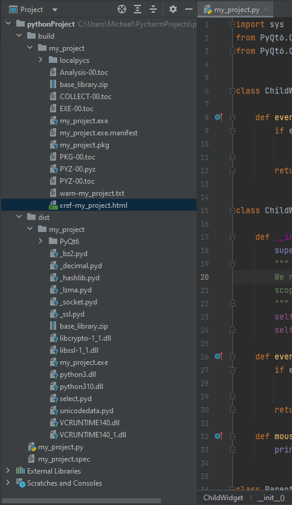
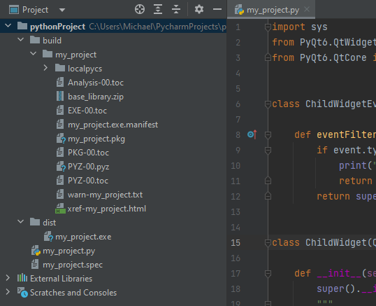

<div align="center">
  <h1> Creating an Executable from Python Code </h1>
</div>

When creating a project with having the intent to share it with others it is not feasible to hand all of your Python source code to the user and expect them to run it. The goal here is to create an executable file that we can give to a user, providing them the ability to execute your project by simply running the executable. Here, we will create an executable for the following Python code.

```Python
import sys
from PyQt6.QtWidgets import QApplication, QFrame, QVBoxLayout, QPushButton
from PyQt6.QtCore import QEvent, QObject


class ChildWidgetEventFilter(QObject):

    def eventFilter(self, obj: 'QObject', event: 'QEvent') -> bool:
        if event.type() == QEvent.Type.MouseButtonPress:
            print("ChildWidgetEventFilter: eventFilter")
            return False
        return super().eventFilter(obj, event)


class ChildWidget(QPushButton):

    def __init__(self, *args):
        super().__init__(*args)
        """
        We need to set our event filter to a variable or it will be garbage collected when we leave
        scope, i.e. self.installEventFilter(ChildWidgetEventFilter()) will not work.
        """
        self._event_filter = ChildWidgetEventFilter()
        self.installEventFilter(self._event_filter)

    def event(self, event: QEvent) -> bool:
        if event.type() == QEvent.Type.MouseButtonPress:
            print("ChildWidget: event")
            return False
        return super().event(event)

    def mousePressEvent(self, event):
        print("ChildWidget: mousePressEvent")


class ParentWidget(QFrame):

    def mousePressEvent(self, event) -> None:
        print("Inside ParentWidget mousePressEvent")


app = QApplication(sys.argv)
main_window = ParentWidget()

layout = QVBoxLayout()
layout.addWidget(ChildWidget("Click me! I'm the child widget"))

main_window.setLayout(layout)

main_window.show()
sys.exit(app.exec())
```

# PyInstaller

To accomplish creating an executable I will be using a tool called `pyinstaller`. The command to create an executable for the project is to provide the root python file, in our example we will simply run `pyinstaller my_project.py`. Running the command, `pyinstaller` will scan our project and gather all of our dependencies to order to create an executable and produce two folders, `dist` and `build`. The `build` folder is an intermediate folder that contains files uses the produce the end executable and can be deleted, but it is useful for debugging. The folder of interest of `dist`, which contains the end executable and all of the dependencies.

Here's how PyInstaller generally works:

1. **Analysis:** PyInstaller examines the provided Python script and its imported modules to create an abstract representation of the code's structure, identifying the dependencies.

2. **Bundling:** It then bundles the Python interpreter, your script, and its dependencies into a single executable file. Depending on the platform and options you specify, this might result in a single binary executable or a collection of files in a directory. Joining everything into a single executable will utilize static linking, whereas the other approach will contain all of the `.dll`, `.pyd` etc files.

3. **Compilation:** Your Python code is typically compiled into bytecode or a similar format. This is done to make it harder to reverse-engineer your code.

4. **Dependency Bundling:** PyInstaller includes any third-party libraries and resources your script relies on. These can include DLLs (on Windows), shared libraries (on Unix-like systems), and other assets like images or data files.

5. **Startup Code:** PyInstaller also includes startup code that initializes the environment and sets up the necessary runtime components to execute your script. Remember, Python code is not machine code and cannot be executed directly, instead we need to bootstrap it. This means to run machine code in order have an entry point, load the Python interpreter and then parse the Python bytecode into the Python virtual machine so that it can be ran on the CPU.



The size of `my_project.exe` is 1184KB. Creating an executable this way will utilize dyanmic linking and load the `..dll`/`.pyd` when executing the executable. An additional note here is that the result also contains `python3.dll` and `python310.dll` which is the Python interpreter. Remember that Python is an interpreted language and **not machine code**, therefore Python cannot be ran directly to start a program. `my_project.exe` is an executable, it is machine code that can be ran directly on the CPU with an entry point that will be used to load the `python` `.dlls`. Once the Python interpreter has been loaded, this will be used to interpret the Python bytecode.

We may notice here here that our original Python source code or Bytecode is not visible, this is because [PyInstaller embeds compiled python code (`.pyc` files) within the executable](https://pyinstaller.org/en/stable/advanced-topics.html#python-imports-in-a-bundled-app).  PyInstaller injects its code into the normal Python import mechanism.  The embedded `.pyc` files can be extracted from the executable using a tool like [PyInstaller Extractor](https://github.com/extremecoders-re/pyinstxtractor)

# PyInstaller Static Linking

In the previous example, we have the output `my_project.exe` and all of its dependencies. If we wish to create a single `my_project.exe` that can be passed around without all of the dependent files we need to utilize static linking. The command for this is `pyinstaller --onefile my_project.py`



Notice here that the `my_project.exe` is 31,071KB whereas the previous executable was 1184KB. This is because all of the dependencies and the interpreter is bundled into a single executable. The usefulness of this approach is that I can pass around the executable to anyone easily and also not need to also pass the dependencies, which is easy for non-technical people.

