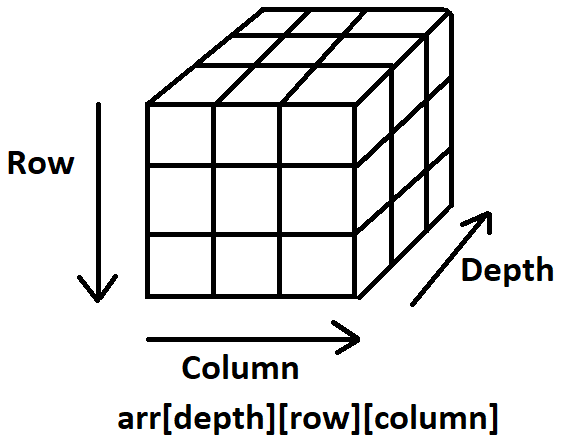

<div align="center">
  <h1> NumPy  </h1>
</div>

# Main Purpose

NumPy (Numerical Python) is a vital Python library designed for scientific computing. It offers support for large, multi-dimensional arrays and matrices, along with a comprehensive collection of mathematical functions. NumPy's main purpose is to enable efficient numerical computations in Python, particularly when dealing with large datasets or complex mathematical operations.

# When to Use NumPy

Consider using NumPy in the following scenarios,

- **Numerical Computations**: When performing mathematical operations on large arrays of data, NumPy provides optimized routines that significantly improve performance over standard Python lists.
- **Data Analysis**: NumPy is widely used for handling and manipulating large datasets, performing statistical operations, and numerical computations required for data preprocessing.
- **Scientific Simulations**: NumPy's array operations and mathematical functions are valuable for representing and manipulating data involved in scientific simulations or modeling.
- **Machine Learning**: NumPy is a fundamental library in machine learning, providing support for handling training data, performing matrix computations, implementing algorithms, and optimizing code execution.

## Problems NumPy Fixes

NumPy addresses several limitations and performance issues associated with standard Python lists. It fixes the following problems,

- **Speed**: NumPy's pre-compiled C code makes it significantly faster than standard Python lists for array operations.
- **Memory Efficiency**: NumPy arrays are more memory-efficient due to their homogeneous data types and fixed sizes.
- **Vectorized Operations**: NumPy allows performing operations on entire arrays, eliminating the need for explicit loops and resulting in cleaner and more concise code.
- **Mathematical Functions**: NumPy provides a wide range of efficient mathematical functions such as trigonometry, logarithms, exponentials, and more.

# Essential Understanding of NumPy

## ndarray Object

The ndarray is the core object of NumPy, representing a multi-dimensional array. It has the following essential attributes,

- **ndarray.shape**: Returns the dimensions of the array.
- **ndarray.dtype**: Specifies the data type of the elements in the array.
- **ndarray.ndim**: Gives the number of array dimensions.

Here is a following example,

```Python
import numpy as np

# Creating a 1D array
arr_1d = np.array([1, 2, 3, 4, 5])
print(arr_1d.shape)  # Output: (5,)
print(arr_1d.dtype)  # Output: int64 or int32 depending on the system architecture
print(arr_1d.ndim)   # Output: 1

# Creating a 2D array
arr_2d = np.array([[1, 2, 3],
                   [4, 5, 6]])
print(arr_2d.shape)  # Output: (2, 3)
print(arr_2d.dtype)  # Output: int64 or int32 depending on the system architecture
print(arr_2d.ndim)   # Output: 2

```

## Array creation

NumPy provides various functions to create arrays efficiently. Some commonly used functions include:

- **numpy.array()**: Creates an array from a Python list or tuple.
- **numpy.zeros()**: Creates an array filled with zeros.
- **numpy.ones()**: Creates an array filled with ones.
- **numpy.random.random()**: Creates an array of random values between 0 and 1.
- **numpy.arange()**: Creates an array with evenly spaced values.

Here is a following example,


#### np.array()

```
arr = np.array([1, 2, 3, 4, 5])              # 1D array
print(arr)

arr_2 = np.array([[1, 2, 3],  # 2D array
                  [4, 5, 6]])
print(arr_2)
```

```
[1 2 3 4 5]
```

```
[[1 2 3]
 [4 5 6]]
```

#### np.zeros()


```Python
zeros_arr = np.zeros((3, 4))                 # 2D array filled with zeros
```

```
[[0. 0. 0. 0.]
 [0. 0. 0. 0.]
 [0. 0. 0. 0.]]
```

#### np.ones()

```Python
ones_arr = np.ones((2, 2, 2))                # 3D array filled with ones
```

```
[[[1. 1.]
  [1. 1.]]

 [[1. 1.]
  [1. 1.]]]
```

#### np.random.random()

```Python
random_arr = np.random.random((2, 3))        # 2D array of random values
```

```
[[0.22241877 0.10325394 0.16304831]
 [0.40448334 0.4438561  0.80418444]]
```

#### np.arange()

```Python
range_arr = np.arange(0, 10, 2)              # 1D array with values from 0 to 10 (exclusive), step size 2
```

```
[0 2 4 6 8]
```

Although `arange()` does not directly support the immediate creation of a 2D array, it can be changed by reshaping it.

```Python
import numpy as np

# Create a 1D array with a range of values
arr_1d = np.arange(6)  # Output: [0, 1, 2, 3, 4, 5]

# Reshape the 1D array into a 2D array
arr_2d = arr_1d.reshape((2, 3))
print(arr_2d)
```

```
[[0 1 2]
 [3 4 5]]
```

## Broadcasting

Broadcasting is a feature in NumPy that enables performing operations between arrays of different shapes, automatically aligning their dimensions. It simplifies calculations and avoids unnecessary array copying.

```Python
import numpy as np

arr = np.array([1, 2, 3])
scalar = 5
print(arr * scalar)

arr_2d = np.array([[1, 2, 3], [4, 5, 6]])
row = np.array([10, 20, 30])
print(arr_2d + row)
```

```
[ 5 10 15]

[[11 22 33]
 [14 25 36]]
```

## NumPy Indexing Scheme

NumPy arrays implement `__getitem__` which adds customizable behaviour when indexing NumPy arrays. When indexing a NumPy array, each seperation from comma can be thought of as an extra dimension.



The typical syntax can be thought of as the following,

One dimensional array,

```python
array[col_start:col_end]
```

Two dimensional array,

```python
array[row_start:row_end, col_start:col_end]
```

Three dimensional array,

```python
array[depth_start: depth_end, row_start:row_end, col_start:col_end]
```

Hence, each `,` adds an extra dimension to be indexable.

Keep in mind `:` is not mandatory it is only for slicing. It's possible to index directly with numbers such as `array[0][:]` will retrieve all columns from the first row in a two dimensional array.


### One Dimensional Array

This means that when indexing and no comma is present, it is a one dimensional array and the `:` will mean it is indexing columns.

```python
one_dimensional_array = np.array([1, 2, 3, 4, 5])
print(one_dimensional_array[:])
```

In this example I index the array as `[:]`. This mean it is taking all columns in the one dimensional array as their is no `,`.

### Two Dimensional Array

Now, in the example below because an extra `,` is present that means the first indexing within the `[` and `]` is the row and the second is the column.

```python
two_dimensional_array = np.array(
  [[1, 2, 3], 
   [4, 5, 6]]
)
print(two_dimensional_array[1:, :])
```

Hence, in the above example we are retrieving the rows `1:` and the columns from `:`. Therefore, the output is,

```python
array([4, 5, 6])
```

### Three Dimensional Array

Now, in this example I will create a three dimensional array. This means we will need two `,` to access all dimensions. This will be indexed as `depth`, `row` and then `column`.

```python
three_dimensional_array = np.array([[[1, 2, 3],
                                     [4, 5, 6],
                                     [7, 8, 9]],
                                    
                                    [[10, 11, 12],
                                     [13, 14, 15],
                                     [16, 17, 18]],
                                    
                                    [[19, 20, 21],
                                     [22, 23, 24],
                                     [25, 26, 27]]])
```

The above example illustrates a hardcoded visual representation but can be condensed to,

```python
three_dimensional_array = np.arange(1, 27 + 1).reshape(3, 3, 3)
```

Therefore, indexing the three dimensional way as the following,

```python
three_dimensional_array[1, 1:3, :]
```

will give us the output of,

```python
array([[13, 14, 15],
       [16, 17, 18]])
```

This happens because we get the second depth from `[1]`,

```python
[[10, 11, 12],
 [13, 14, 15],
 [16, 17, 18]]
```

and from this array we index `[1:3]`. This is the second indexing scheme which means we are indexing the rows. This will grab the second and third row.

```python
[[13, 14, 15],
 [16, 17, 18]]
```

Finally, the `[:]` will index all columns. Meaning, the final output is

```python
[[13, 14, 15],
 [16, 17, 18]]
```

## Array Reshaping

Reshaping means changing the shape of an array. Reshaping arrays allows you to change their dimensions and reorganize the data. The `reshape()` function is used to modify the shape of an array while preserving the data. 

The shape of an array is the number of elements in each dimension. By reshaping we can add or remove dimensions or change the number of elements in each dimension.

```Python
import numpy as np

arr = np.array([1, 2, 3, 4, 5, 6])
reshaped_arr = arr.reshape((2, 3))
print(reshaped_arr)

flattened_arr = reshaped_arr.reshape((6,))
print(flattened_arr)
```

```
[[1 2 3]
 [4 5 6]]

[1 2 3 4 5 6]
```

Here is an example using reshape to change from 1D to 2D,

```Python
import numpy as np

arr = np.array([1, 2, 3, ..., 11, 12])
arr.reshape(4, 3) # Row = 4, Column = 3,

"""
Will reshape to,

array([[1, 2, 3]
       [4, 5, 6]
       [7, 8, 9]
       [10, 11, 12]])
"""
```

Reshape from 1D to 3D

```Python
>>> import numpy as np
>>>
>>> arr = np.array(range(27))
>>> arr.reshape(3, 3, 3) # Depth, Row, Column
array([[[ 0,  1,  2],
        [ 3,  4,  5],
        [ 6,  7,  8]],

       [[ 9, 10, 11],
        [12, 13, 14],
        [15, 16, 17]],

       [[18, 19, 20],
        [21, 22, 23],
        [24, 25, 26]]])
```

**Unknown Dimension**

You are allowed to have one "Unknown" dimension, meaning that you do not have to specify an exact number for one of the dimensions in the reshape method.

Pass "-1" as the value, NumPy will calculate this number for you.

```Python
arr = np.array([1, 2, ..., 7, 8])
arr.reshape(2, 2, -1)

"""
Gives,

array([[[1, 2],
        [3, 4]],

       [[5, 6],
        [7, 8]]])

  2 * 2 = 4, therefore 8/4 = 2, which is the calculated value.
"""
```

To **flatten an array** means converting a multidimensional array into a 1D array. We can use `reshape(-1)` to do this.


## Array Manipulation

 NumPy provides functions for manipulating arrays, including concatenation (`numpy.concatenate()`), splitting (`numpy.split()`), stacking (`numpy.stack()`), and more. These functions allow you to rearrange, combine, or divide arrays as needed.

 ```Python
 import numpy as np

arr1 = np.array([1, 2, 3])
arr2 = np.array([4, 5, 6])

concatenated_arr = np.concatenate((arr1, arr2))
print(concatenated_arr)

arr_1_2D = np.array([[1, 2, 3],
                     [4, 5, 6]])
arr_2_2D = np.array([[10, 11, 12],
                     [13, 14, 15]])
concatenated_arr_2D = np.concatenate((arr_1_2D, arr_2_2D))
print(concatenated_arr_2D)

split_arrs = np.split(concatenated_arr, 2)
print(split_arrs)

stacked_arr = np.stack((arr1, arr2))
print(stacked_arr)
 ```

 ```
 [1 2 3 4 5 6]

[[ 1  2  3]
 [ 4  5  6]
 [10 11 12]
 [13 14 15]]

[array([1, 2, 3]), array([4, 5, 6])]

[[1 2 3]
 [4 5 6]]
 ```

 ## Array Iteration

Iterating over arrays using loops or using NumPy's own iteration functions, such as `numpy.nditer()`, helps access and process array elements efficiently.
  
```Python
import numpy as np

arr = np.array([1, 2, 3])

for element in arr:
    print(element)

arr_2d = np.array([[1, 2], [3, 4]])

for row in arr_2d:
    for element in row:
        print(element)
```

```
1
2
3
1
2
3
4
```

## Vectorized Operations

Taking advantage of vectorized operations in NumPy, which operate on entire arrays rather than individual elements, greatly improves the performance and efficiency of numerical computations.

```Python
import numpy as np

arr = np.array([1, 2, 3])
another_arr = np.array([4, 5, 6])

result = arr + another_arr
print(result)
```

```
[5 7 9]
```

## Indexing, Slicing and Pandas

NumPy supports are same slicing techniques as a Pandas DataFrame, that is, such as the comma seperated slicing techniques such as

```Python
import numpy as np

a = np.array([[1, 2, 3], 
              [4, 5, 6]])
print(a[:, 1])
```

```
[2 5]
```

For a more detailed reiteration of the slicing techniques, they're detailed into my notes for the [Pandas library](https://github.com/Michael-Cowie/Notes/blob/main/Python/Notes/pandas.md). The page almost describes the key differences because Pandas and NumPy

## Views and Copying

A view in Numpy is simply another way of viewing the data of the array. This means that the data of both objects is *shared*. You can create views by selecting a **slice** of the original array, or also by changing the **dtype** (or a combination of both).

### Slice Views

Slicing is a way to create a view or a subarray from an existing array using a range of indicies. It uses the colon `:` syntax to specify the `start: stop: step` values. This will create a view of the original array, meaning changes to the sliced array will affect the original array. The resulting slice is a contiguous block of the original array, e.g.

```python
arr = np.array([0, 1, 2, 3, 4, 5])
slice_arr = arr[1:5:2]  # This gives array([1, 3])
```


This is probably the most common source of view creations in NumPy. The rule of thumb for creating a slice view is that the viewed elements can be addressed with offsets, strides and counts in the original array.


```python
>>> a = numpy.arange(10)
>>> a
array([0, 1, 2, 3, 4, 5, 6, 7, 8, 9])
>>> v1 = a[1:2]
>>> v1
array([1])
>>> a[1] = 2
>>> v1
array([2])
>>> v2 = a[1::3]
>>> v2
array([2, 4, 7])
>>> a[7] = 10
>>> v2
array([ 2,  4, 10])
```

In the above example, `v1` and `v2` are views of `a`. Of you update elements of `a`, then `v1` and `v2` will reflect the change.

### Dtype Views

Another way to create array views is by assigning another dtype to the same data area. For example,

```python
>>> b = numpy.arange(10, dtype='int16')
>>> b
array([0, 1, 2, 3, 4, 5, 6, 7, 8, 9], dtype=int16)
>>> v3 = b.view('int32')
>>> v3 += 1
>>> b
array([1, 1, 3, 3, 5, 5, 7, 7, 9, 9], dtype=int16)
>>> v4 = b.view('int8')
>>> v4
array([1, 0, 1, 0, 3, 0, 3, 0, 5, 0, 5, 0, 7, 0, 7, 0, 9, 0, 9, 0], dtype=int8)
```

In the above example, because the dtype changed from 16 bits to 8 bits, the number of elements doubled. This is because for each number that were 16bits, they now create two numbers, the first is created from the first 8bits and the second from the remaining 8bits.

### Fancy Indexing and Views

Fancy indexing involves passing an array of indicies or a list to access multiple elements at once, e.g.

```python
arr = np.array([0, 1, 2, 3, 4, 5])
fancy_arr = arr[[1, 3, 4]]  # This gives array([1, 3, 4])
```

This will create a copy of the original array, so changes to the result do not affect the original array. The resulting array can have a shape and structure that is different from a contiguous block of the original array.


## Masked Arrays

Masked arrays are arrays that may have missing or invalid entries. In many circumstances, datasets can be incomplete or tainted by the presence of invalid data. For example, a sensor may have failed to record a data or recorded an invalid value. The `numpy.ma` module provides a convenient way to address this issue, by introducing masked arrays.

A masked array is the combination of a standard `numpy.ndarray` and a mask. A mask is either `nomask`, by indicating that no value of the associated array is invalid, or an array of booleans that determines for each element of the associated array whether the value is valid or not. When an element of the mask is `False`, the corresponding elemt of the associated array is valid and is said to be unmasked. When an element  of the mask is `True`, the corresponding element of the associated array is said to be masked (invalid ).

The package ensures that masked entries are not used in computations.

As an illustration,

```python
import numpy as np
import numpy.ma as ma
x = np.array([1, 2, 3, -1, 5])
```

We wish to mark the fouth entry as invalid. The easiest is to create a masked array,

```python
mx = ma.masked_array(x, mask=[0, 0, 0, 1, 0])
```

We can now compute the mean of the dataset, without taking the invalid data into account,

```python
mx.mean()
```

will give us, `2.75`, not `2`. 

To easily mask all negative numbers, an alternative could be,

```python
ma.masked_array(x, x < 0)
```

### Constructing Masked Arrays

There are several ways to construct a masked array.

1. Directly invokve the `MaskedArray` class
2. Using either masked array constructions, `ma.array` and `ma.masked_array`. Within the `numpy.ma` module, other functionality exists such as `masked_equal`. 

Keep in mind that when you create a masked array using `np.ma.masked_array`, it shares the same underlying data buffer as the original array. **This means that changes to the masked array can affect the original array, and vice versa**. This behavior is due to the fact that NumPy tries to optimize memory usage by not copying data unnecessarily.

If you want to avoid this shared data behavior, you can create a copy of the data when creating the masked array. This way, the masked array will have its own separate data buffer.

```python
a = np.array([-1, 0, 1])

# Create a masked array with a copy of the original array
b = ma.masked_array(a.copy(), a < 0)
```

3. Take a view of an existing array. In that case, the mask of the view is set to `nomask` if the array has no named fields, or an array of boolean with the same structure as the array otherwise.

```python
x = np.array([1,2,3])
x.view(ma.MaskedArray)
```

will give us,

```python
masked_array(data=[1, 2, 3],
             mask=False,
       fill_value=999999)
```
### Accesing a Masked Array Data

The underlying data of a masked array can be accessed in several ways,

1. Through the `data` attribute. The output is a view of the array as a `numpy.ndarray` or one of its subclasses, depending on the type of the underlying data at the masked array creation.

Keep in mind, because the `data` attribute is returning a view, it means any modifications to the view will affect the original masked array.

```python
a = np.array([-2, -1, 0, 1, 2])
b = ma.masked_array(a, a < 0)
```

Here, `b` will be

```python
masked_array(data=[--, --, 0, 1, 2],
             mask=[ True,  True, False, False, False],
       fill_value=999999)
```

Therefore, if we assign a variable to the `data` attribute and modify it, we can observe changes being made.

```python
c = b.data
c[4] = 100
```

Hence, `a` is `array([ -2,  -1,   0,   1, 100])` and `b` is,

```python
masked_array(data=[--, --, 0, 1, 100],
             mask=[ True,  True, False, False, False],
       fill_value=999999)
```
Infact, obervse within this example that although `b` was created from `a`, modifications to `b` will also change `a`.

2. Through the `__array__` method. The output is then a `np.ndarray`. For the `__array__` method, it is automatically called when you use the `np.array` function from NumPy on an object that implements this method.

An example to illustrate this will be,

```python
import numpy as np

class MyArray:
    def __init__(self, data):
        self.data = data
    
    def __array__(self):
        return np.array(self.data)

my_array = MyArray([1, 2, 3, 4])

# Convert to a NumPy array using np.array
numpy_array = np.array(my_array)
```
3. By directly taking a view of the masked array as a `numpy.ndarray` or one of its subclass (which is actually what using the `data` attribute does).

4. By using `ma.getdata`

None of these methods is completely satisfacory if some entries have been marked as invalid. As a general rule, where a representation of the array is required without masked entries, it is recommended to fill the array with the `filled` method.

Hence,

```python
x = ma.masked_array([-1, 0, 1], [True, False, False], fill_value=1)
```

```python
ma.getdata(x)
```

Will give us,

```python
array([-1,  0,  1])
```

However,

```python
ma.filled(x)
```

Will give us the array back, using the filled value for all masked locations,

```python
array([1,      0,    1])
```

### Accessing the Mask

The mask of a masked array is accessible through its `mask` attribute. We must keep in mind that a `True` entry in the mask indicates an *invalid* data.

Another possibility is to use the `getmask` and `getmaskarray` functions. `ma.getmask(x)` outputs the mask of `x` if `x` is a masked array, and the special value `nomask` otherwise. `ma.getmaskarray(x)` outputs the mask of `x` if `x` is a masked array. If `x` has no invalid entry or is not a masked array, the function outputs a booealn array of `False` with as many elemnts as `x`.

### Accessing Only the Valid Entries

To retrieve only the valid entries, we can use the inverse of the mask as an index. The inverse of the mask can be calculated with the `numpy.logical_not` function or simply with the `~` operator.

```python
x = ma.array([[1, 2], [3, 4]], mask=[[0, 1], [1, 0]])
```

will give us,

```python
masked_array(
  data=[[1, --],
        [--, 4]],
  mask=[[False,  True],
        [ True, False]],
  fill_value=999999)
```

Thus,

```python
x[~x.mask]
```

will give us,

```python
masked_array(data=[1, 4],
             mask=[False, False],
       fill_value=999999)
```

This is because `~x.mask` has the value of,

```python
array([[ True, False],
       [False,  True]])
```

and we index using this. Using this indexing scheme will flatten the array into a 1D array.

To keep the dimensions, we could do the following,

```python
x = ma.array(
  [[1, 2], 
   [3, 4]], 
  mask=[[0, 1], 
        [1, 0]]
)

# Initialize the result array with the placeholder values
result = np.full(x.shape, np.nan)

# Copy the valid (unmasked) values from the original array to the result array
result[~x.mask] = x[~x.mask]
```

In this example, `result[~x.mask] = x[~x.mask]` preserves the shape despite `~x.mask` and indexing into result returning a 1D array. 
In this expression, the right hand side is evaluated first, meaning, `x[~x.mask]` is evaluated to,

```python
masked_array(data=[1, 4],
             mask=[False, False],
       fill_value=999999)
```

`result[~x.mask]` refers to the positions in `result` corresponding to the `True` values in `~x.mask`. Hence, each `True` value in `~x.mask` is being assigned to each element inside of the values in `x[~x.mask]`. 

Hence, the number of `True` values inside of `~x.mask` must be the same length of the data inside of the right hand of the assignment `x[~x.mask]`.

Hence, `~x.mask` is,

```python
array([[ True, False],
       [False,  True]])
```

Therefore, we change the `True` indexes to the elements in `[1,4]`. Therefore, the final value of `result` is,

```python
array([[ 1., nan],
       [nan,  4.]])
```

### Modiy the Masked Array Mask

#### Masking an Entry

The recommended way to mark one or several specific entries of a masked array as invalid is to assign the special value `masked` to them,

Hence,

```python
x = ma.array([1, 2, 3])
x[0] = ma.masked
```

will give us `x` as,

```python
masked_array(data=[--, 2, 3],
             mask=[ True, False, False],
       fill_value=999999)
```

A second possibility is to modify the `mask` directly, but this is discouraged. This is done as `x.mask = [0, 1, 0]`.

All the entries of an array can be masked at once by assigning `True` to the mask.

```python
x = ma.array([1, 2, 3], mask=[0, 0, 1])
x.mask = True
```

will give `x` as,

```python
masked_array(data=[--, --, --],
             mask=[ True,  True,  True],
       fill_value=999999,
            dtype=int32)
```

#### Unmasking an Entry

To unmask one or several specific entries, we can just assign one or several new valid values to them,

Hence,

```python
x = ma.array([1, 2, 3], mask=[0, 0, 1])
x[2] = 100
```

Now, `x` will have the value of,

```python
masked_array(data=[1, 2, 100],
             mask=[False, False, False],
       fill_value=999999)
```

Keep in mind, unmasking an entry by direct assignment will silently fail if the masked array has a *hard* mask, as shown by the `hardmask` attribute. This feature was introduiced to prevent overwriting the mask. To force unmasking of an entry where the array has a hard mask, the mask must first be softened using the `soften_mask` method before the allocation. It can be re-hardended with `harden_mask`.

Hence,

```python
x = ma.array([1, 2, 3], mask=[0, 0, 1], hard_mask=True)
x[2] = 100
```

will be,

```python
masked_array(data=[1, 2, --],
             mask=[False, False,  True],
       fill_value=999999)
```

To resolve this, call `x.soften_mask()`, change the value and then call `x.harden_mask()`.

To unmask all masked entries of a masked array (provided the mask isn't a hard mask), the simplest solution is to assign the constant `nomask` to the mask,

```python
x = ma.array([1, 2, 3], mask=[0, 0, 1])
x.mask = ma.nomask
```

Will set `x.mask` to an array of only `False` values.

## NumPy Datetime

The most basic way to create datetimes is from strings in ISO 8601 date or datetime format. It is also possible to create datetimes from an integer by offset relative to the Unix epoch (`00:00:00` UTC on 1st January 1970). The unit for internal storage is automatically selected from the form of the string and can be either a date unit or a time unit.

The date units are

- Years = 'Y'
- Months = 'M'
- Weeks = 'W'
- Days = 'D'
- Hours = 'H'
- Minutes = 'M'
- Seconds = 'S'
- Milliseconds = 'ms'

Some additional SI prefix seconds-based units. The datetime64 data type also accepts the string "NAT", in any combination of lower/upper case letters, for a "Not A Time" value.

A simple ISO date 

```Python
>>> np.datetime64('2005-02-25')
```

From an integer and a date unit, 1 year since the UNIX epoch,

```Python
>>> np.datetime64(1, 'Y')
```

From a date and time,

```Python
>>> np.datetime64('2005-02-25T03:30')
```

MAT (Not A Time)

```Python
>>> np.datetime64a('nat)
```

`yyyy-MM-ddTHH:mm:ss.SSSZ`

The format is defined by the sensible practical standard, ISO 8601.

The "T" separates the date portion from the time of the day portion. The "Z" on the end means UTC (That is, an offset-from-UTC of zero hours-minutes-seoconds). The "Z" is pronounced Zulu.

1970 datetime string,

```Python
>>> np.datetime64(0, 'D')
numpy.datetime64('1970-01-01')
```

to seconds,

```Python
>>> np.datetime64('1970-01-01T00:00:00').astype(int)
                              ^   ^  ^ = Hour, Minute, Seconds
```

Formatted T

```Python
>>> np.datetime64('1970-01-01T00:01:40').astype(int)
100
```

Year before 1970

```Python
>>> np.datetime64('1969-01-01T00:00:00').astype(int)
-31536000
    ^ Seconds in a year
```

Seconds to a string,

```Python
>>> np.datetime64(100, 's')
numpy.datetime64('1970-01-01T00:01:40')
```