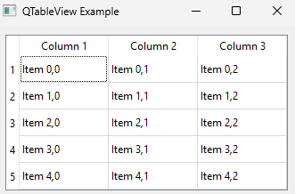

<div align="center">
  <h1>  Qt Terminology </h1>
</div>

## ItemView and ViewItem

#### ItemView

An ItemView is a widget that presents an item-based model's data. It refers to the view component that displays data from a model. It is responsible for rendering the data to the user and handling user interactions like selection, scrolling, and editing. 

Examples of item views in Qt include `QListView`, `QTableView`, and `QTreeView`. These views display collections of items.

#### ViewItem

Refers to the individual items within the item view. A ViewItem refers to a single item or element within a view. It's the individual data point that the ItemView displays.

These items are often represented by `QStandardItem` in `QStandardItemModel` or custom items in custom models. A ViewItem can be thought of as a cell in a table (`QTableView`), an entry in a list (`QListView`), or a node in a tree (`QTreeView`).

#### Example

The reason you often see both is because they work together in the model/view framework. The ItemView is responsible for the overall presentation of data, while the ViewItems are the individual data points within that presentation.




```python
import sys
from PyQt5.QtWidgets import QApplication, QTableView, QVBoxLayout, QWidget
from PyQt5.QtGui import QStandardItemModel, QStandardItem


class TableViewExample(QWidget):
    def __init__(self):
        super().__init__()
        layout = QVBoxLayout()
        self.setLayout(layout)

        # Create a QTableView
        self.tableView = QTableView()
        layout.addWidget(self.tableView)

        # Create a QStandardItemModel with 5 rows and 3 columns
        self.model = QStandardItemModel(5, 3)

        # Set headers
        self.model.setHorizontalHeaderLabels(["Column 1", "Column 2", "Column 3"])

        # Add items to the model
        for row in range(5):
            for column in range(3):
                item = QStandardItem(f"Item {row},{column}")
                self.model.setItem(row, column, item)

        # Set the model to the table view
        self.tableView.setModel(self.model)

        self.setWindowTitle("QTableView Example")


app = QApplication(sys.argv)
example = TableViewExample()
example.show()
sys.exit(app.exec_())
```

In this example,

- **ItemView** - The component that displays the data. In this example, `QTableView` is the itemView.

- **ViewItem** - The individual data items within the itemView. In this example, each `QStandardItem` is a ViewItem.